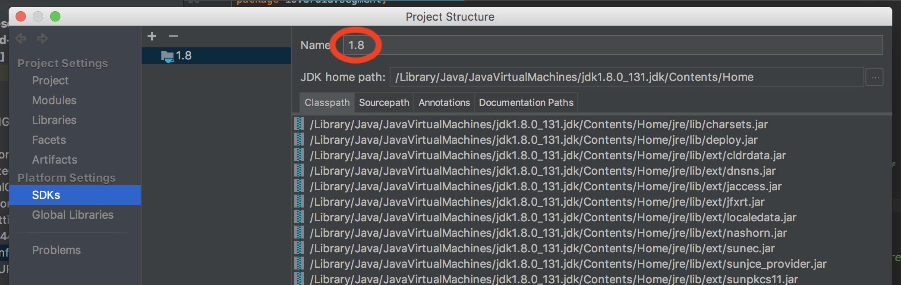
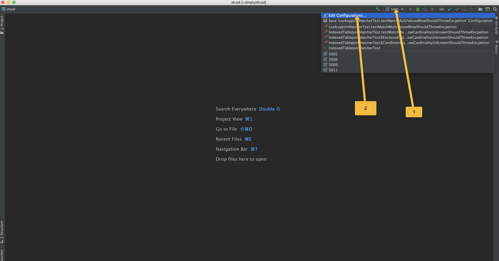
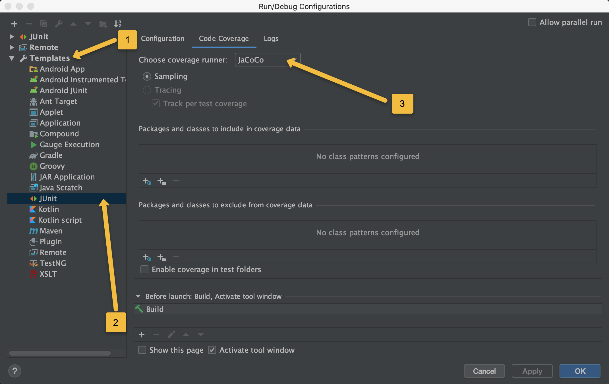

<!--
  ~ Licensed to the Apache Software Foundation (ASF) under one
  ~ or more contributor license agreements.  See the NOTICE file
  ~ distributed with this work for additional information
  ~ regarding copyright ownership.  The ASF licenses this file
  ~ to you under the Apache License, Version 2.0 (the
  ~ "License"); you may not use this file except in compliance
  ~ with the License.  You may obtain a copy of the License at
  ~
  ~   http://www.apache.org/licenses/LICENSE-2.0
  ~
  ~ Unless required by applicable law or agreed to in writing,
  ~ software distributed under the License is distributed on an
  ~ "AS IS" BASIS, WITHOUT WARRANTIES OR CONDITIONS OF ANY
  ~ KIND, either express or implied.  See the License for the
  ~ specific language governing permissions and limitations
  ~ under the License.
  -->

# IntelliJ Setup
This document contains some examples and instructions on how to get IntelliJ setup to run local debugging and test
setups of Druid.

## Project SDK

The "SDK", configured for the Druid project, *must* be called `1.8`, to avoid annoying changes of
[`.idea/misc.xml`](/.idea/misc.xml) file, that you shouldn't check into your commits. If you don't have an SDK on your
dev machine with this name, you should either rename one of the existing SDKs to `1.8`, or create another one with this
name, and it could point to the same files as some other existing SDK, even if it's actually JDK 9+. `1.8` is just
an alias name. You can do this in Using `File` -> `Project Structure...` -> `Platform Settings` -> `SDKs`
(see also [IntelliJ help page about this](https://www.jetbrains.com/help/idea/configuring-intellij-platform-plugin-sdk.html)):


## Code Style
The Code Style is available in XML format at [druid_intellij_formatting.xml](druid_intellij_formatting.xml) and can be [imported into IntelliJ](https://www.jetbrains.com/help/idea/2017.1/copying-code-style-settings.html).

## Set Code Coverage Runner
Druid CI checks are configured to enforce code coverage using JaCoCo. The checks will prevent PR from being merged 
if test coverage of new added code is below the set threshold. You should run the tests locally to make sure that
your code pass the coverage threshold. In IntelliJ, edit the template of JUnit tests in "Run Configurations..." 
to use Jacoco for code coverage (this provides branch coverage instead of the default which is only line coverage).
You can then right click src/test/java folder of the modules you are modifying and click run with coverage. This
will generate a report to show the current code coverage on the code (not just your change).



## Git Checkstyle Verification Hook (Optional)
Git Checkstyle pre-commit hook can be installed to automatically run checkstyle verification before committing, 
saving cycle from avoiding the checkstyle failing later in Travis/CI environment.
The hook can be setup easily by running the <DRUID_HOME>/hooks/install-hooks.sh script.

## Metadata
The installation of a MySQL metadata store is outside the scope of this document, but instructions on setting up MySQL can be found at [docs/development/extensions-core/mysql.md](/docs/development/extensions-core/mysql.md). This assumes you followed the example there and have a database named `druid` with proper permissions for a user named `druid` and a password of `diurd`.

Use of other databases such as Postgres or Derby are entirely reasonable, but doing so is left as an excercise to the reader.

## ZooKeeper
This also assumes you have [ZooKeeper](http://zookeeper.apache.org/releases.html) running locally, which usually just involves downloading the latst distribution of ZooKeeper, doing some minor configuration in ZooKeeper's `conf/` directory (most defaults are fine), then running `./bin/zkServer.sh start` in the ZooKeeper directory. 

On macOS, you can also achieve this through the following commands

1. `brew install zookeeper`
2. `brew services start zookeeper`

## Initial Build
Before running or debugging the apps, you should do a `mvn clean install -Pdist -DskipTests` in the Druid source in order to make sure directories are populated correctly.

`-Pdist` is required because it puts all core extensions under `distribution\target\extensions` directory, where `runConfigurations` below could load extensions from.

You may also add `-Dweb.console.skip=true` to the command if you're focusing on backend servers instead of frontend project. This option saves great building time.

## Debug a running Druid cluster using Intellij
Intellij IDEA debugger can attach to a local or remote Java process (Druid process). 
Follow these steps to debug a Druid process using the IntelliJ IDEA debugger.
1. Enable debugging in the Druid process
    1. For Druid services (such as Overlord, Coordinator, etc), include the following as JVM config `-agentlib:jdwp=transport=dt_socket,server=y,suspend=n,address=<PORT>` where `<PORT>` is any available port. Note that different port values should be chosen for each Druid service.
    2. For the peons (workers on Middlemanager), include the following `agentlib:jdwp=transport=dt_socket,server=y,suspend=n,address=0` in runtime properties `druid.indexer.runner.javaOpts` of the Middle Manager. Note that `address=0` will tell the debugger to assign ephemeral port.
2. Find the port assigned to the Druid process.
    1. For Druid services, the port value is what you chose in the JVM argument of step 1i above. The port value can also be found in the first line of each Druid service log.
    2. For the peons (workers on Middlemanager), you can find the assigned ephemeral port by checking the first line of the task log.
3. Attach Intellij IDEA debugger to the running process
    1. Create a Remote configuration in the Run/Debug Configurations dialog of Intellij (see: https://www.jetbrains.com/help/idea/tutorial-remote-debug.html#debugger_rc)
    2. Set the port value using the value from step 2 for the Druid service and/or peon (worker on Middlemanager) that you want to debug
    3. Start (debug) the above remote configuration
    4. Repeat step 3i to 3iii for each Druid service and/or peon (worker on Middlemanager) that you want to debug

## XML App Def
You can configure application definitions in XML for import into IntelliJ. Below are a few examples. These should be placed in an XML file in `.idea/runConfigurations` in the Druid source code.

### Historical.xml
```xml
<component name="ProjectRunConfigurationManager">
  <configuration default="false" name="Historical" type="Application" factoryName="Application">
    <extension name="coverage" enabled="false" merge="false" sample_coverage="true" runner="idea" />
    <option name="MAIN_CLASS_NAME" value="org.apache.druid.cli.Main" />
    <option name="VM_PARAMETERS" value="-server -Duser.timezone=UTC -Dfile.encoding=UTF-8 -Xmx2G -XX:MaxJavaStackTraceDepth=9999 -XX:+UseG1GC -XX:+PrintGCDetails -XX:+PrintGCTimeStamps -XX:+PrintAdaptiveSizePolicy -XX:+PrintReferenceGC -verbose:gc -XX:+PrintFlagsFinal -Djava.util.logging.manager=org.apache.logging.log4j.jul.LogManager -Dorg.jboss.logging.provider=slf4j -Dlog4j.configurationFile=$PROJECT_DIR$/core/src/main/resources/log4j2.debug.xml -Ddruid.host=localhost -Ddruid.service=historical -Ddruid.processing.buffer.sizeBytes=100000000 -Ddruid.extensions.hadoopDependenciesDir=$PROJECT_DIR$/distribution/target/hadoop-dependencies/ -Ddruid.extensions.directory=$PROJECT_DIR$/distribution/target/extensions/ -Ddruid.extensions.loadList=[\&quot;druid-s3-extensions\&quot;,\&quot;druid-histogram\&quot;,\&quot;mysql-metadata-storage\&quot;] -Ddruid.historical.cache.useCache=false -Ddruid.historical.cache.populateCache=false -Ddruid.segmentCache.locations=&quot;[{\&quot;path\&quot;:\&quot;/tmp/druid/indexCache\&quot;,\&quot;maxSize\&quot;:10000000000}]&quot; -Ddruid.zk.service.host=localhost -Ddruid.processing.numThreads=1 -Ddruid.server.http.numThreads=50 -Ddruid.serverview.type=http -Ddruid.emitter=logging" />
    <option name="PROGRAM_PARAMETERS" value="server historical" />
    <option name="WORKING_DIRECTORY" value="file://$PROJECT_DIR$" />
    <option name="ALTERNATIVE_JRE_PATH_ENABLED" value="false" />
    <option name="ALTERNATIVE_JRE_PATH" value="1.8" />
    <option name="ENABLE_SWING_INSPECTOR" value="false" />
    <option name="ENV_VARIABLES" />
    <option name="PASS_PARENT_ENVS" value="true" />
    <module name="druid-services" />
    <envs />
    <method />
  </configuration>
</component>
```

### Coordinator.xml
```xml
<component name="ProjectRunConfigurationManager">
  <configuration default="false" name="Coordinator" type="Application" factoryName="Application">
    <extension name="coverage" enabled="false" merge="false" sample_coverage="true" runner="idea" />
    <option name="MAIN_CLASS_NAME" value="org.apache.druid.cli.Main" />
    <option name="VM_PARAMETERS" value="-server -Duser.timezone=UTC -Dfile.encoding=UTF-8 -Xmx256M -Xmx256M -XX:+UseG1GC -XX:+PrintGCDetails -XX:+PrintGCTimeStamps -XX:+PrintAdaptiveSizePolicy -XX:+PrintReferenceGC -verbose:gc -XX:+PrintFlagsFinal -Djava.util.logging.manager=org.apache.logging.log4j.jul.LogManager -Dorg.jboss.logging.provider=slf4j -Ddruid.host=localhost -Ddruid.service=coordinator -Ddruid.extensions.directory=$PROJECT_DIR$/distribution/target/extensions/ -Ddruid.extensions.loadList=[\&quot;druid-s3-extensions\&quot;,\&quot;druid-histogram\&quot;,\&quot;mysql-metadata-storage\&quot;] -Ddruid.zk.service.host=localhost -Ddruid.metadata.storage.type=mysql -Ddruid.metadata.storage.connector.connectURI=&quot;jdbc:mysql://localhost:3306/druid&quot; -Ddruid.metadata.storage.connector.user=druid -Ddruid.metadata.storage.connector.password=diurd -Ddruid.serverview.type=http -Ddruid.emitter=logging -Ddruid.coordinator.period=PT10S -Ddruid.coordinator.startDelay=PT5S" />
    <option name="PROGRAM_PARAMETERS" value="server coordinator" />
    <option name="WORKING_DIRECTORY" value="file://$PROJECT_DIR$" />
    <option name="ALTERNATIVE_JRE_PATH_ENABLED" value="false" />
    <option name="ALTERNATIVE_JRE_PATH" value="1.8" />
    <option name="ENABLE_SWING_INSPECTOR" value="false" />
    <option name="ENV_VARIABLES" />
    <option name="PASS_PARENT_ENVS" value="true" />
    <module name="druid-services" />
    <envs />
    <method />
  </configuration>
</component>
```
## property files

You can also provide a property file for running or debugging the application through intellij. 

For example, put a file named as `common.properties` under `.idea/conf` directory, then add `-Ddruid.properties.file=$PROJECT_DIR$/.idea/conf/common.properties` to `VM_PARAMETERS` in the App Def file.
