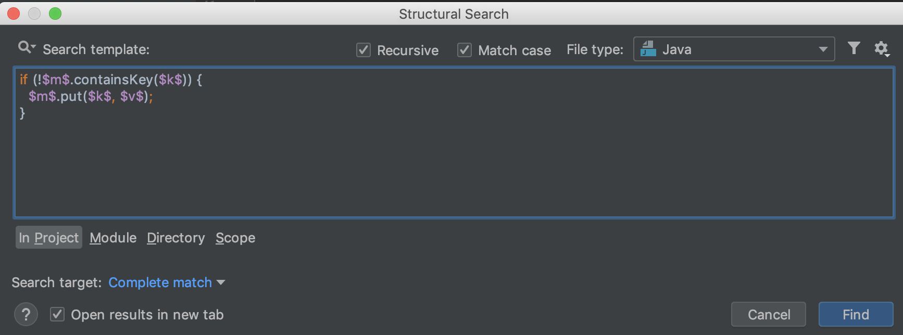
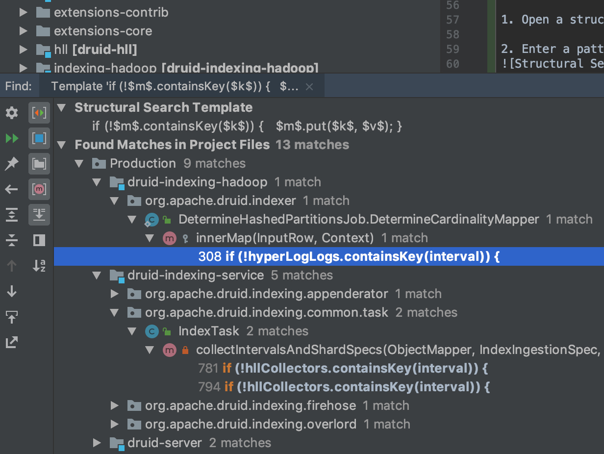
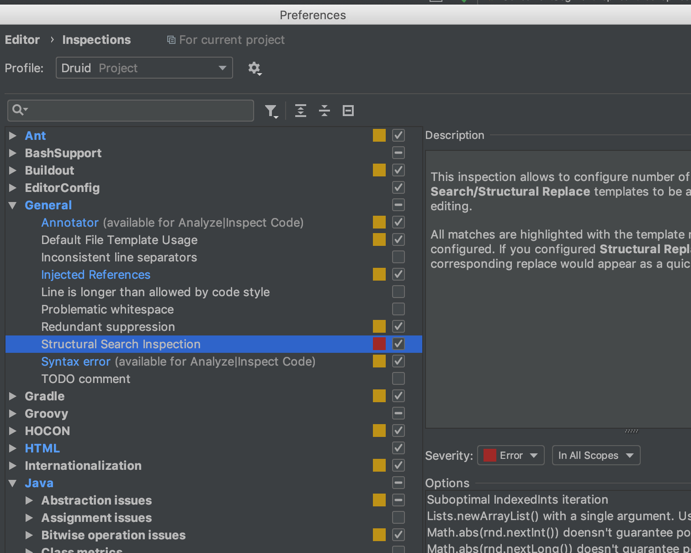
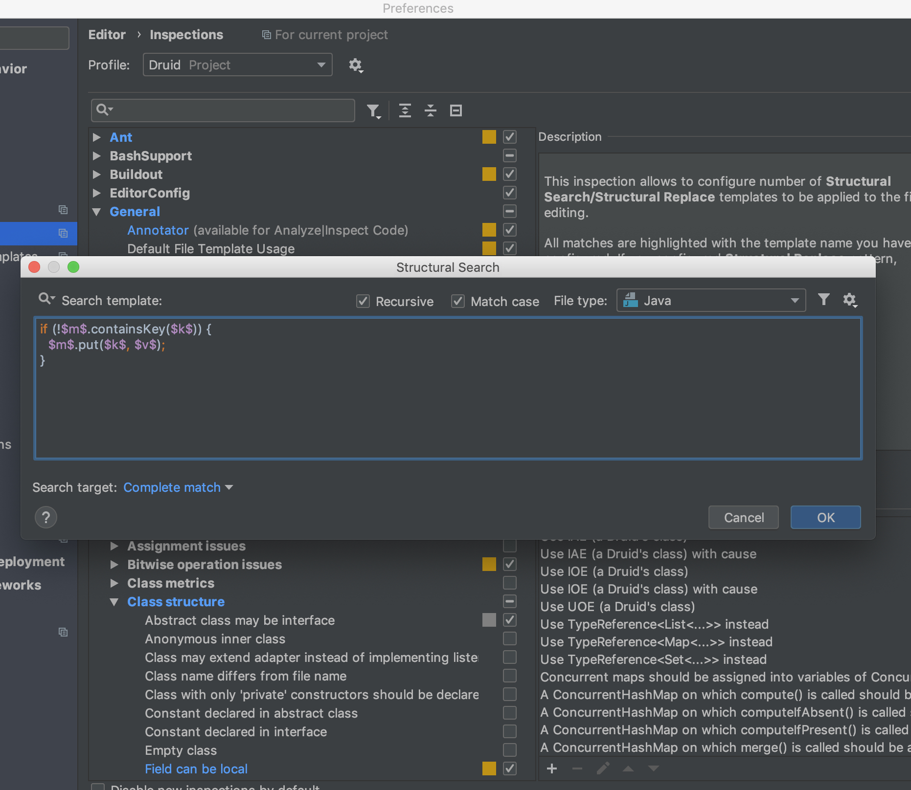
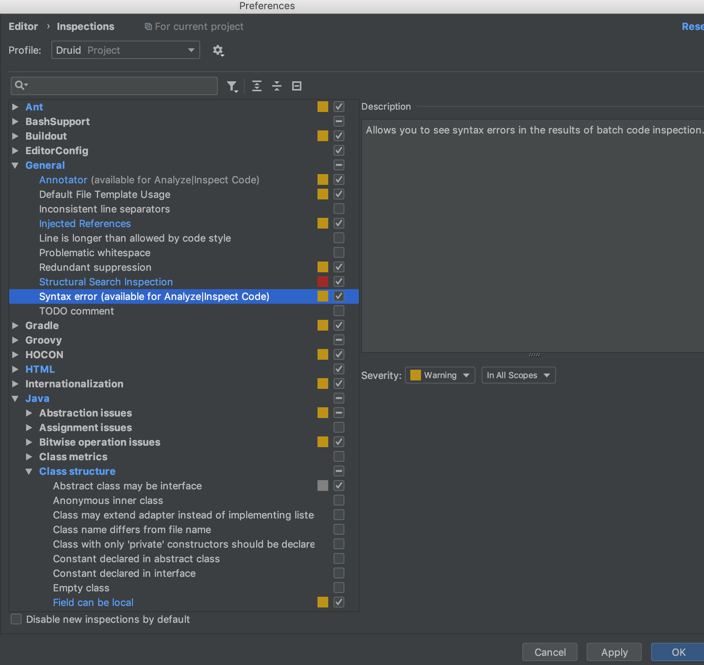

<!--
  ~ Licensed to the Apache Software Foundation (ASF) under one
  ~ or more contributor license agreements.  See the NOTICE file
  ~ distributed with this work for additional information
  ~ regarding copyright ownership.  The ASF licenses this file
  ~ to you under the Apache License, Version 2.0 (the
  ~ "License"); you may not use this file except in compliance
  ~ with the License.  You may obtain a copy of the License at
  ~
  ~   http://www.apache.org/licenses/LICENSE-2.0
  ~
  ~ Unless required by applicable law or agreed to in writing,
  ~ software distributed under the License is distributed on an
  ~ "AS IS" BASIS, WITHOUT WARRANTIES OR CONDITIONS OF ANY
  ~ KIND, either express or implied.  See the License for the
  ~ specific language governing permissions and limitations
  ~ under the License.
  -->
  
### Overview
TeamCity is a continuous integration and deployment server responsible for 
static analysis of Druid source code. Each Github PR request for 
[Druid](https://teamcity.jetbrains.com/project.html?projectId=OpenSourceProjects_Druid) 
is checked by TeamCity automatically.

### Login
One can log in to TeamCity either via credentials or as a guest to check static analysis result of any PR.

### Becoming a Project Administrator
Druid committers shall obtain a status of a [Druid project](
https://teamcity.jetbrains.com/project.html?projectId=OpenSourceProjects_Druid)
administrator. First, the Druid committer needs to log in teamcity.jetbrains.com using their Github account.
Then, somebody who is already a project administrator needs to do the following:

 1. Follow the "Administration" link in the top-right corner of the page
 2. Follow the "Users" link in the "User Management" section in the menu on the left
 3. Type the committer's Github handle in the "Find users" text input, press "Filter"
 4. Select the committer
 5. Press the "Assign roles" button in the bottom of the page
 6. Select "Role: Project administrator" and "Scope: Open-source project -> Druid" in the inputs, press "Assign"

### Restarting a Build
A project administrator could restart a build by pressing the "Run" button on the build page.

### Contacting TeamCity support regarding problems with builds

Regarding any build problems, feel free to contact TeamCity support by writing an e-mail at
teamcity-support@jetbrains.com. There is an automatic system behind this e-mail address that creates a ticket and sends
you an e-mail with a link to the ticket. Note that:

 - Contacting TeamCity support regarding problems with open-source Druid project builds is *free*. Don't hestitate doing
 that if you don't see how to resolve some problem with a build.
 - You don't need to be a Druid committer to do this. Any Druid contributor can contact TeamCity support.

### Creating a custom inspection from a Structural Search pattern

1. Open a structural search dialog: `Edit` -> `Find` -> `Search Structurally...`

2. Enter a pattern that you want to make an inspection, for example:


3. Press the `Find` button to test your pattern:


Note that even if currently the pattern finds nothing, it might still be a good idea to add it as an inspection to
prevent bugs creeping in the codebase in the future. However, test that your pattern doesn't contain mistakes by
deliberately adding code with a mistake that should be spotted by the pattern in any existing Druid class and testing
that your Structural Search pattern finds that newly added dummy mistake.

4. Open `Preferences...` -> `Inspections`, navigate to `General` -> `Structural Search inspection`:


5. Click a button with a plus sign (`+`) in the bottom of the Options window, `Add Search Template...`:


6. Click `OK`. Then you will see a dialong window with title `Save Template` and a field to enter a "template name".
Enter in this field something reasonably short that yet would serve as a good message for people who add code that
is caught by this pattern, e. g. "Use Map.putIfAbsent() instead of containsKey() + put()", in this example case. Press
`OK` again.

7. Move focus anywhere, e. g. by choosing any other inspection. Upon doing this, the `Apply` botton should become
active:


8. Press the `Apply` button, then `OK` to exit the inspection preferences.

9. If you did everything right, file `.idea/inspectionProfiles/Druid.xml` should be updated with a new
`searchConfiguration` entry, in this example case, the following:
```xml
      <searchConfiguration name="Use Map.putIfAbsent() instead of containsKey() + put()" text="if (!$m$.containsKey($k$)) {&#10;  $m$.put($k$, $v$);&#10;}" recursive="true" caseInsensitive="true" type="JAVA">
        <constraint name="__context__" target="true" within="" contains="" />
        <constraint name="m" within="" contains="" />
        <constraint name="k" within="" contains="" />
        <constraint name="v" within="" contains="" />
      </searchConfiguration>
```

Don't forget to include this change in your commit when making a pull-request.
