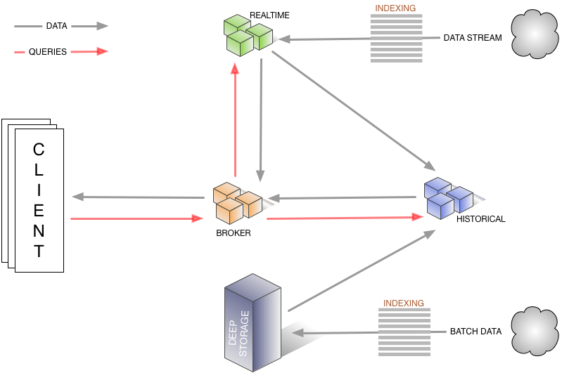
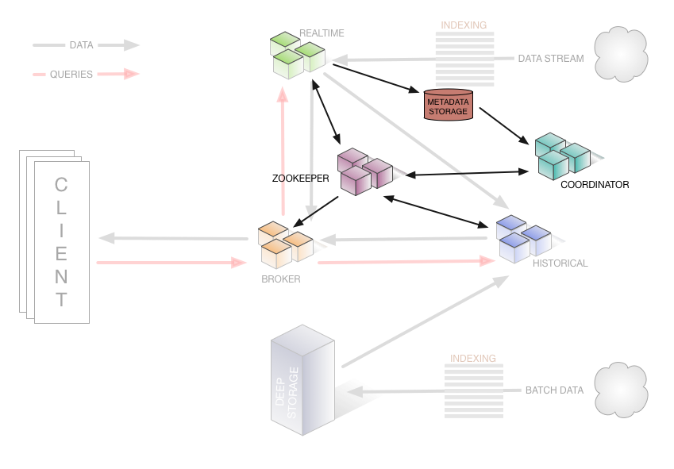

For a comprehensive look at the architecture of Druid, read the [White Paper](http://static.druid.io/docs/druid.pdf).

What is Druid?
==============

Druid is a system built to allow fast ("real-time") access to large sets of seldom-changing data. It was designed with the intent of being a service and maintaining 100% uptime in the face of code deployments, machine failures and other eventualities of a production system. It can be useful for back-office use cases as well, but design decisions were made explicitly targeting an always-up service.

Druid currently allows for single-table queries in a similar manner to [Dremel](http://research.google.com/pubs/pub36632.html) and [PowerDrill](http://www.vldb.org/pvldb/vol5/p1436_alexanderhall_vldb2012.pdf). It adds to the mix

1.  columnar storage format for partially nested data structures
2.  hierarchical query distribution with intermediate pruning
3.  indexing for quick filtering
4.  realtime ingestion (ingested data is immediately available for querying)
5.  fault-tolerant distributed architecture that doesn’t lose data

As far as a comparison of systems is concerned, Druid sits in between PowerDrill and Dremel on the spectrum of functionality. It implements almost everything Dremel offers (Dremel handles arbitrary nested data structures while Druid only allows for a single level of array-based nesting) and gets into some of the interesting data layout and compression methods from PowerDrill.

Druid is a good fit for products that require real-time data ingestion of a single, large data stream. Especially if you are targeting no-downtime operation and are building your product on top of a time-oriented summarization of the incoming data stream. Druid is probably not the right solution if you care more about query flexibility and raw data access than query speed and no-downtime operation. When talking about query speed it is important to clarify what "fast" means: with Druid it is entirely within the realm of possibility (we have done it) to achieve queries that run in less than a second across terabytes of data.

### Architecture

Druid is architected as a grouping of systems each with a distinct role and together they form a working system. The name comes from the Druid class in many role-playing games: it is a shape-shifter, capable of taking many different forms to fulfill various different roles in a group.

Each of the systems, or components, described below also has a dedicated page with more details. You can find the page in the menu on the right, or click the link in the component's description.

The node types that currently exist are:

* [**Historical**](../design/historical.html) nodes are the workhorses that handle storage and querying on "historical" data (non-realtime). Historical nodes download segments from deep storage, respond to the queries from broker nodes about these segments, and return results to the broker nodes. They announce themselves and the segments they are serving in Zookeeper, and also use Zookeeper to monitor for signals to load or drop new segments.
* [**Realtime**](../design/realtime.html) nodes ingest data in real time. They are in charge of listening to a stream of incoming data and making it available immediately inside the Druid system. Real-time nodes respond to query requests from Broker nodes, returning query results to those nodes. Aged data is pushed from Realtime nodes to deep storage. Realtime nodes monitor ZooKeeper to discover segments that they've pushed to deep storage have been loaded by Historicals&mdash;if so, they drop those segments.
* [**Coordinator**](../design/coordinator.html) nodes monitor the grouping of historical nodes to ensure that data is available, replicated and in a generally "optimal" configuration. They do this by reading segment metadata information from metadata storage to determine what segments should be loaded in the cluster, using Zookeeper to determine what Historical nodes exist, and creating Zookeeper entries to tell Historical nodes to load and drop new segments.
* [**Broker**](../design/broker.html) nodes receive queries from external clients and forward those queries to Realtime and Historical nodes. When Broker nodes receive results, they merge these results and return them to the caller. For knowing topology, Broker nodes use Zookeeper to determine what Realtime and Historical nodes exist.
* [**Indexer**](../design/indexing-service.html) nodes form a cluster of workers to load batch and real-time data into the system as well as allow for alterations to the data stored in the system (also known as the Indexing Service).

This separation allows each node to only care about what it is best at. By separating Historical and Realtime, we separate the memory concerns of listening on a real-time stream of data and processing it for entry into the system. By separating the Coordinator and Broker, we separate the needs for querying from the needs for maintaining "good" data distribution across the cluster.

The following diagram shows how queries and data flow through this architecture, and which nodes (and external dependencies, discussed below) are involved:

All nodes can be run in some highly available fashion, either as symmetric peers in a share-nothing cluster or as hot-swap failover nodes.

Aside from these nodes, there are 3 external dependencies to the system:

1.  A running [ZooKeeper](../dependencies/zookeeper.html) cluster for cluster service discovery and maintenance of current data topology
2.  A [metadata storage instance](../dependencies/metadata-storage.html) for maintenance of metadata about the data segments that should be served by the system
3.  A ["deep storage" LOB store/file system](../dependencies/deep-storage.html) to hold the stored segments

The following diagram illustrates the cluster's management layer, showing how certain nodes and dependencies help manage the cluster by tracking and exchanging metadata:

### Segments and Data Storage

Getting data into the Druid system requires an indexing process, as shown in the diagrams above. This gives the system a chance to analyze the data, add indexing structures, compress and adjust the layout in an attempt to optimize query speed. A quick list of what happens to the data follows.

-   Converted to columnar format
-   Indexed with bitmap indexes
-   Compressed using various algorithms
    -   LZF (switching to Snappy is on the roadmap, not yet implemented)
    -   Dictionary encoding w/ id storage minimization
    -   Bitmap compression
    -   RLE (on the roadmap, but not yet implemented)

The output of the indexing process is called a "segment". Segments are the fundamental structure to store data in Druid. Segments contain the various dimensions and metrics in a data set, stored in a column orientation, as well as the indexes for those columns.

Segments are stored in a "deep storage" LOB store/file system (see [Deep Storage](../dependencies/deep-storage.html) for information about potential options). Data is then loaded by Historical nodes by first downloading the data to their local disk and then memory-mapping it before serving queries.

If a Historical node dies, it will no longer serve its segments, but given that the segments are still available on the "deep storage", any other node can simply download the segment and start serving it. This means that it is possible to actually remove all historical nodes from the cluster and then re-provision them without any data loss. It also means that if the "deep storage" is not available, the nodes can continue to serve the segments they have already pulled down (i.e. the cluster goes stale, not down).

In order for a segment to exist inside of the cluster, an entry has to be added to a table in a metadata storage instance. This entry is a self-describing bit of metadata about the segment, including things like the schema of the segment, its size, and its location on deep storage. These entries are what the Coordinator uses to know what data **should** be available on the cluster.

### Fault Tolerance

-   **Historical** As discussed above, if a historical node dies, another historical node can take its place and there is no fear of data loss.
-   **Coordinator** Can be run in a hot fail-over configuration. If no coordinators are running, then changes to the data topology will stop happening (no new data and no data balancing decisions), but the system will continue to run.
-   **Broker** Can be run in parallel or in hot fail-over.
-   **Realtime** Depending on the semantics of the delivery stream, multiple of these can be run in parallel processing the exact same stream. They periodically checkpoint to disk and eventually push out to deep storage. Steps are taken to be able to recover from process death, but loss of access to the local disk can result in data loss if this is the only method of adding data to the system.
-   **"deep storage" file system** If this is not available, new data will not be able to enter the cluster, but the cluster will continue operating as is.
-   **metadata storage** If this is not available, the Coordinator will be unable to find out about new segments in the system, but it will continue with its current view of the segments that should exist in the cluster.
-   **ZooKeeper** If this is not available, data topology changes cannot be made, but the Brokers will maintain their most recent view of the data topology and continue serving requests accordingly.

### Query processing

A query first enters the Broker, where the Broker will match the query with the data segments that are known to exist. It will then pick a set of machines that are serving those segments and rewrite the query for each server to specify the segment(s) targetted. The Historical/Realtime nodes will take in the query, process them and return results. The Broker then takes the results and merges them together to get the final answer, which it returns. In this way, the broker can prune all of the data that doesn’t match a query before ever even looking at a single row of data.

For filters at a more granular level than what the Broker can prune based on, the indexing structures inside each segment allows the historical nodes to figure out which (if any) rows match the filter set before looking at any row of data. It can do all of the boolean algebra of the filter on the bitmap indices and never actually look directly at a row of data.

Once it knows the rows that match the current query, it can access the columns it cares about for those rows directly without having to load data that it is just going to throw away.

### In-memory?

Druid is not always and only in-memory. When we first built it, it is true that it was all in-memory all the time, but as time went on the price-performance tradeoff ended up swinging towards keeping all of our customers data in memory all the time a non-starter. We then added the ability to memory-map data and allow the OS to handle paging data in and out of memory on demand. Our production cluster is primarily configured to operate with this memory mapping behavior and we are definitely over-subscribed in terms of memory available vs. data a node is serving.

As you read some of the old blog posts or other literature about the project, you will see "in-memory" touted often, as that is the history of where Druid came from, but the technical reality is that there is a spectrum of price vs. performance. Being able to slide along that spectrum	 from all in-memory (high cost, great performance) to mostly on disk (low cost, low performance) is the important knob to be able to adjust.
