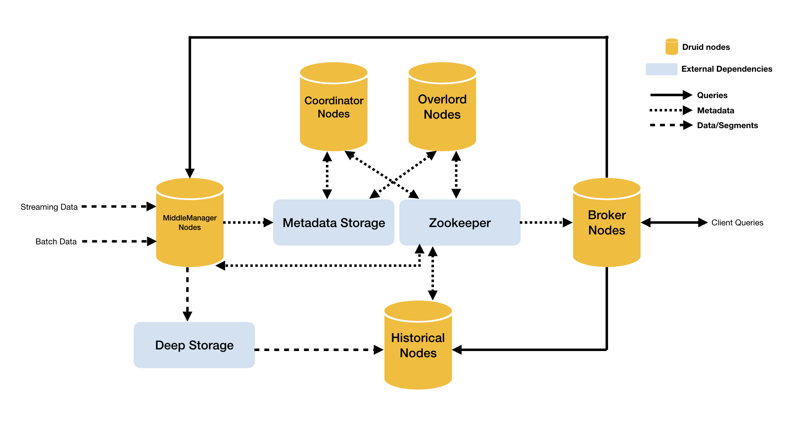
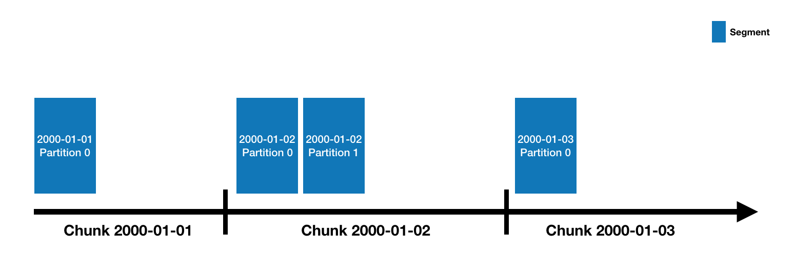

<!--
  ~ Licensed to the Apache Software Foundation (ASF) under one
  ~ or more contributor license agreements.  See the NOTICE file
  ~ distributed with this work for additional information
  ~ regarding copyright ownership.  The ASF licenses this file
  ~ to you under the Apache License, Version 2.0 (the
  ~ "License"); you may not use this file except in compliance
  ~ with the License.  You may obtain a copy of the License at
  ~
  ~   http://www.apache.org/licenses/LICENSE-2.0
  ~
  ~ Unless required by applicable law or agreed to in writing,
  ~ software distributed under the License is distributed on an
  ~ "AS IS" BASIS, WITHOUT WARRANTIES OR CONDITIONS OF ANY
  ~ KIND, either express or implied.  See the License for the
  ~ specific language governing permissions and limitations
  ~ under the License.
  -->

# What is Druid?

Druid is a data store designed for high-performance slice-and-dice analytics
("[OLAP](http://en.wikipedia.org/wiki/Online_analytical_processing)"-style) on large data sets. Druid is most often
used as a data store for powering GUI analytical applications, or as a backend for highly-concurrent APIs that need
fast aggregations. Common application areas for Druid include:

- Clickstream analytics
- Network flow analytics
- Server metrics storage
- Application performance metrics
- Digital marketing analytics
- Business intelligence / OLAP

Druid's key features are:

1. **Columnar storage format.** Druid uses column-oriented storage, meaning it only needs to load the exact columns
needed for a particular query.  This gives a huge speed boost to queries that only hit a few columns. In addition, each
column is stored optimized for its particular data type, which supports fast scans and aggregations.
2. **Scalable distributed system.** Druid is typically deployed in clusters of tens to hundreds of servers, and can
offer ingest rates of millions of records/sec, retention of trillions of records, and query latencies of sub-second to a
few seconds.
3. **Massively parallel processing.** Druid can process a query in parallel across the entire cluster.
4. **Realtime or batch ingestion.** Druid can ingest data either realtime (ingested data is immediately available for
querying) or in batches.
5. **Self-healing, self-balancing, easy to operate.** As an operator, to scale the cluster out or in, simply add or
remove servers and the cluster will rebalance itself automatically, in the background, without any downtime. If any
Druid servers fail, the system will automatically route around the damage until those servers can be replaced. Druid
is designed to run 24/7 with no need for planned downtimes for any reason, including configuration changes and software
updates.
6. **Cloud-native, fault-tolerant architecture that won't lose data.** Once Druid has ingested your data, a copy is
stored safely in [deep storage](#deep-storage) (typically cloud storage, HDFS, or a shared filesystem). Your data can be
recovered from deep storage even if every single Druid server fails. For more limited failures affecting just a few
Druid servers, replication ensures that queries are still possible while the system recovers.
7. **Indexes for quick filtering.** Druid uses [CONCISE](https://arxiv.org/pdf/1004.0403) or
[Roaring](https://roaringbitmap.org/) compressed bitmap indexes to create indexes that power fast filtering and
searching across multiple columns.
8. **Approximate algorithms.** Druid includes algorithms for approximate count-distinct, approximate ranking, and
computation of approximate histograms and quantiles. These algorithms offer bounded memory usage and are often
substantially faster than exact computations. For situations where accuracy is more important than speed, Druid also
offers exact count-distinct and exact ranking.
9. **Automatic summarization at ingest time.** Druid optionally supports data summarization at ingestion time. This
summarization partially pre-aggregates your data, and can lead to big costs savings and performance boosts.

# When should I use Druid?

Druid is likely a good choice if your use case fits a few of the following descriptors:

- Insert rates are very high, but updates are less common.
- Most of your queries are aggregation and reporting queries ("group by" queries). You may also have searching and
scanning queries.
- You are targeting query latencies of 100ms to a few seconds.
- Your data has a time component (Druid includes optimizations and design choices specifically related to time).
- You may have more than one table, but each query hits just one big distributed table. Queries may potentially hit more
than one smaller "lookup" table.
- You have high cardinality data columns (e.g. URLs, user IDs) and need fast counting and ranking over them.
- You want to load data from Kafka, HDFS, flat files, or object storage like Amazon S3.

Situations where you would likely _not_ want to use Druid include:

- You need low-latency updates of _existing_ records using a primary key. Druid supports streaming inserts, but not streaming updates (updates are done using
background batch jobs).
- You are building an offline reporting system where query latency is not very important.
- You want to do "big" joins (joining one big fact table to another big fact table).

# Architecture

Druid has a multi-process, distributed architecture that is designed to be cloud-friendly and easy to operate. Each
Druid process type can be configured and scaled independently, giving you maximum flexibility over your cluster. This
design also provides enhanced fault tolerance: an outage of one component will not immediately affect other components.

## Processes and Servers

Druid has several process types, briefly described below:

* [**Coordinator**](../design/coordinator.html) processes manage data availability on the cluster.
* [**Overlord**](../design/overlord.html) processes control the assignment of data ingestion workloads.
* [**Broker**](../design/broker.html) processes handle queries from external clients.
* [**Router**](../development/router.html) processes are optional processes that can route requests to Brokers, Coordinators, and Overlords.
* [**Historical**](../design/historical.html) processes store queryable data.
* [**MiddleManager**](../design/middlemanager.html) processes are responsible for ingesting data.

Druid processes can be deployed any way you like, but for ease of deployment we suggest organizing them into three server types: Master, Query, and Data.

* **Master**: Runs Coordinator and Overlord processes, manages data availability and ingestion.
* **Query**: Runs Broker and optional Router processes, handles queries from external clients.
* **Data**: Runs Historical and MiddleManager processes, executes ingestion workloads and stores all queryable data.

For more details on process and server organization, please see [Druid Processses and Servers](../design/processes.html).

### External dependencies

In addition to its built-in process types, Druid also has three external dependencies. These are intended to be able to
leverage existing infrastructure, where present.

#### Deep storage
Shared file storage accessible by every Druid server. This is typically going to
be a distributed object store like S3 or HDFS, or a network mounted filesystem. Druid uses this to store any data that
has been ingested into the system.

Druid uses deep storage only as a backup of your data and as a way to transfer data in the background between
Druid processes. To respond to queries, Historical processes do not read from deep storage, but instead read pre-fetched
segments from their local disks before any queries are served. This means that Druid never needs to access deep storage
during a query, helping it offer the best query latencies possible. It also means that you must have enough disk space
both in deep storage and across your Historical processes for the data you plan to load.

For more details, please see [Deep storage dependency](../dependencies/deep-storage.html).

#### Metadata storage
The metadata storage holds various shared system metadata such as segment availability information and task information. This is typically going to be a traditional RDBMS
like PostgreSQL or MySQL. 

For more details, please see [Metadata storage dependency](../dependencies/metadata-storage.html)

#### Zookeeper
Used for internal service discovery, coordination, and leader election.

For more details, please see [Zookeeper dependency](../dependencies/zookeeper.html).

The idea behind this architecture is to make a Druid cluster simple to operate in production at scale. For example, the
separation of deep storage and the metadata store from the rest of the cluster means that Druid processes are radically
fault tolerant: even if every single Druid server fails, you can still relaunch your cluster from data stored in deep
storage and the metadata store.

### Architecture diagram

The following diagram shows how queries and data flow through this architecture, using the suggested Master/Query/Data server organization:

# Datasources and segments

Druid data is stored in "datasources", which are similar to tables in a traditional RDBMS. Each datasource is
partitioned by time and, optionally, further partitioned by other attributes. Each time range is called a "chunk" (for
example, a single day, if your datasource is partitioned by day). Within a chunk, data is partitioned into one or more
"segments". Each segment is a single file, typically comprising up to a few million rows of data. Since segments are
organized into time chunks, it's sometimes helpful to think of segments as living on a timeline like the following:

A datasource may have anywhere from just a few segments, up to hundreds of thousands and even millions of segments. Each
segment starts life off being created on a MiddleManager, and at that point, is mutable and uncommitted. The segment
building process includes the following steps, designed to produce a data file that is compact and supports fast
queries:

- Conversion to columnar format
- Indexing with bitmap indexes
- Compression using various algorithms
    - Dictionary encoding with id storage minimization for String columns
    - Bitmap compression for bitmap indexes
    - Type-aware compression for all columns

Periodically, segments are committed and published. At this point, they are written to [deep storage](#deep-storage),
become immutable, and move from MiddleManagers to the Historical processes (see [Architecture](#architecture) above
for details). An entry about the segment is also written to the [metadata store](#metadata-storage). This entry is a
self-describing bit of metadata about the segment, including things like the schema of the segment, its size, and its
location on deep storage. These entries are what the Coordinator uses to know what data *should* be available on the
cluster.

# Query processing

Queries first enter the Broker, where the Broker will identify which segments have data that may pertain to that query.
The list of segments is always pruned by time, and may also be pruned by other attributes depending on how your
datasource is partitioned. The Broker will then identify which Historicals and MiddleManagers are serving those segments
and send a rewritten subquery to each of those processes. The Historical/MiddleManager processes will take in the
queries, process them and return results. The Broker receives results and merges them together to get the final answer,
which it returns to the original caller.

Broker pruning is an important way that Druid limits the amount of data that must be scanned for each query, but it is
not the only way. For filters at a more granular level than what the Broker can use for pruning, indexing structures
inside each segment allow Druid to figure out which (if any) rows match the filter set before looking at any row of
data. Once Druid knows which rows match a particular query, it only accesses the specific columns it needs for that
query. Within those columns, Druid can skip from row to row, avoiding reading data that doesn't match the query filter.

So Druid uses three different techniques to maximize query performance:

- Pruning which segments are accessed for each query.
- Within each segment, using indexes to identify which rows must be accessed.
- Within each segment, only reading the specific rows and columns that are relevant to a particular query.