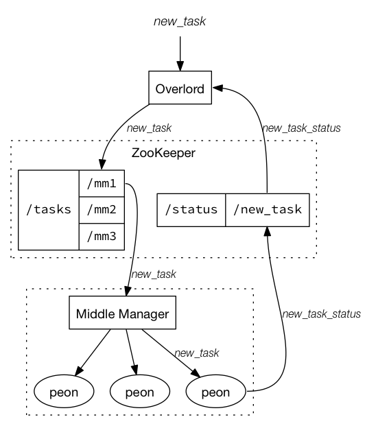

<!--
  ~ Licensed to the Apache Software Foundation (ASF) under one
  ~ or more contributor license agreements.  See the NOTICE file
  ~ distributed with this work for additional information
  ~ regarding copyright ownership.  The ASF licenses this file
  ~ to you under the Apache License, Version 2.0 (the
  ~ "License"); you may not use this file except in compliance
  ~ with the License.  You may obtain a copy of the License at
  ~
  ~   http://www.apache.org/licenses/LICENSE-2.0
  ~
  ~ Unless required by applicable law or agreed to in writing,
  ~ software distributed under the License is distributed on an
  ~ "AS IS" BASIS, WITHOUT WARRANTIES OR CONDITIONS OF ANY
  ~ KIND, either express or implied.  See the License for the
  ~ specific language governing permissions and limitations
  ~ under the License.
  -->

# Indexing Service

The Apache Druid (incubating) indexing service is a highly-available, distributed service that runs indexing related tasks. 

Indexing [tasks](../ingestion/tasks.html) create (and sometimes destroy) Druid [segments](../design/segments.html). The indexing service has a master/slave like architecture.

The indexing service is composed of three main components: a [Peon](../design/peons.html) component that can run a single task, a [Middle Manager](../design/middlemanager.html) component that manages Peons, and an [Overlord](../design/overlord.html) component that manages task distribution to MiddleManagers.
Overlords and MiddleManagers may run on the same process or across multiple processes while MiddleManagers and Peons always run on the same process.

Tasks are managed using API endpoints on the Overlord service. Please see [Overlord Task API](../operations/api-reference.html#overlord-tasks) for more information.

<!--
Preamble
--------

The truth is, the indexing service is an experience that is difficult to characterize with words. When they asked me to write this preamble, I was taken aback. I wasn’t quite sure what exactly to write or how to describe this… entity. I accepted the job, as much for the challenge and inner growth as the money, and took to the mountains for reflection. Six months later, I knew I had it, I was done and had achieved the next euphoric victory in the continuous struggle that plagues my life. But, enough about me. This is about the indexing service.

The indexing service is philosophical transcendence, an infallible truth that will shape your soul, mold your character, and define your reality. The indexing service is creating world peace, playing with puppies, unwrapping presents on Christmas morning, cradling a loved one, and beating Goro in Mortal Kombat for the first time. The indexing service is sustainable economic growth, global propensity, and a world of transparent financial transactions. The indexing service is a true belieber. The indexing service is panicking because you forgot you signed up for a course and the big exam is in a few minutes, only to wake up and realize it was all a dream. What is the indexing service? More like what isn’t the indexing service. The indexing service is here and it is ready, but are you?
-->

Overlord
--------------

See [Overlord](../design/overlord.html).

Middle Managers
---------------

See [Middle Manager](../design/middlemanager.html).

Peons
-----

See [Peon](../design/peons.html).

Tasks
-----

See [Tasks](../ingestion/tasks.html).
