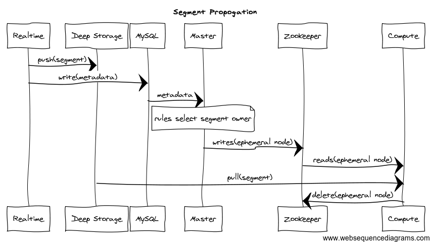

<!--
  ~ Licensed to the Apache Software Foundation (ASF) under one
  ~ or more contributor license agreements.  See the NOTICE file
  ~ distributed with this work for additional information
  ~ regarding copyright ownership.  The ASF licenses this file
  ~ to you under the Apache License, Version 2.0 (the
  ~ "License"); you may not use this file except in compliance
  ~ with the License.  You may obtain a copy of the License at
  ~
  ~   http://www.apache.org/licenses/LICENSE-2.0
  ~
  ~ Unless required by applicable law or agreed to in writing,
  ~ software distributed under the License is distributed on an
  ~ "AS IS" BASIS, WITHOUT WARRANTIES OR CONDITIONS OF ANY
  ~ KIND, either express or implied.  See the License for the
  ~ specific language governing permissions and limitations
  ~ under the License.
  -->

# Real-time Process

<div class="note info">
NOTE: Realtime processes are deprecated. Please use the <a href="../development/extensions-core/kafka-ingestion.html">Kafka Indexing Service</a> for stream pull use cases instead. 
</div>

For Apache Druid (incubating) Real-time Process Configuration, see [Realtime Configuration](../configuration/realtime.html).

For Real-time Ingestion, see [Realtime Ingestion](../ingestion/stream-ingestion.html).

Realtime processes provide a realtime index. Data indexed via these processes is immediately available for querying. Realtime processes will periodically build segments representing the data they’ve collected over some span of time and transfer these segments off to [Historical](../design/historical.html) processes. They use ZooKeeper to monitor the transfer and the metadata storage to store metadata about the transferred segment. Once transfered, segments are forgotten by the Realtime processes.

### Running

```
org.apache.druid.cli.Main server realtime
```
Segment Propagation
-------------------

The segment propagation diagram for real-time data ingestion can be seen below:



You can read about the various components shown in this diagram under the Architecture section (see the menu on the right). Note that some of the names are now outdated.

### Firehose

See [Firehose](../ingestion/firehose.html).

### Plumber

See [Plumber](../design/plumber.html)

Extending the code
------------------

Realtime integration is intended to be extended in two ways:

1.  Connect to data streams from varied systems ([Firehose](https://github.com/apache/incubator-druid/blob/master/core/src/main/org/apache/druid/data/input/FirehoseFactory.java))
2.  Adjust the publishing strategy to match your needs ([Plumber](https://github.com/apache/incubator-druid/blob/master/server/src/main/java/org/apache/druid/segment/realtime/plumber/PlumberSchool.java))

The expectations are that the former will be very common and something that users of Druid will do on a fairly regular basis. Most users will probably never have to deal with the latter form of customization. Indeed, we hope that all potential use cases can be packaged up as part of Druid proper without requiring proprietary customization.

Given those expectations, adding a firehose is straightforward and completely encapsulated inside of the interface. Adding a plumber is more involved and requires understanding of how the system works to get right, it’s not impossible, but it’s not intended that individuals new to Druid will be able to do it immediately.

HTTP Endpoints
--------------

The real-time process exposes several HTTP endpoints for interactions.

### GET

* `/status`

Returns the Druid version, loaded extensions, memory used, total memory and other useful information about the process.
