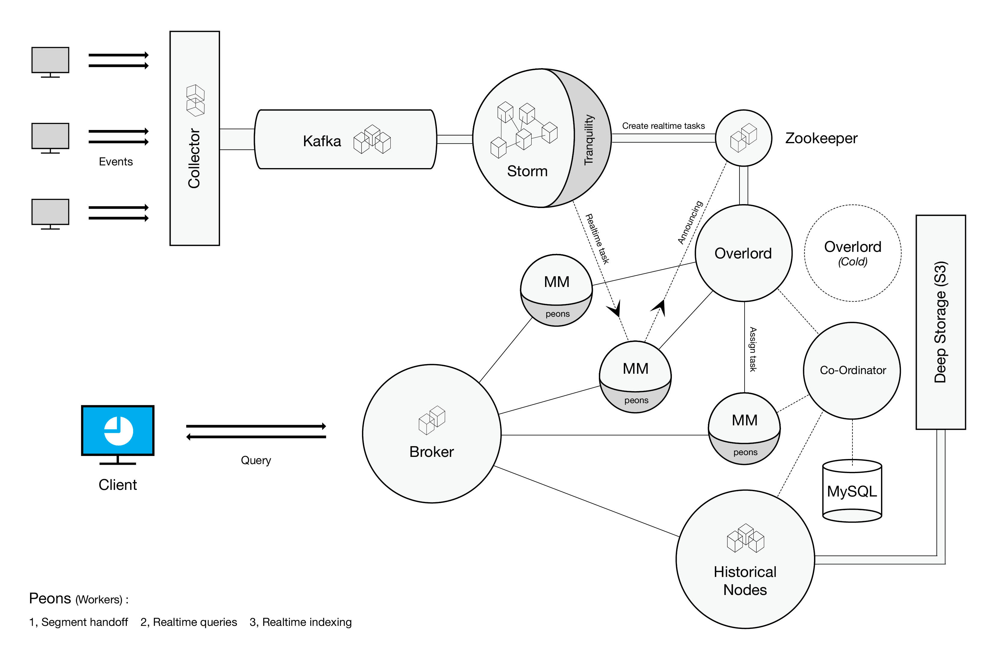

<!--
  ~ Licensed to the Apache Software Foundation (ASF) under one
  ~ or more contributor license agreements.  See the NOTICE file
  ~ distributed with this work for additional information
  ~ regarding copyright ownership.  The ASF licenses this file
  ~ to you under the Apache License, Version 2.0 (the
  ~ "License"); you may not use this file except in compliance
  ~ with the License.  You may obtain a copy of the License at
  ~
  ~   http://www.apache.org/licenses/LICENSE-2.0
  ~
  ~ Unless required by applicable law or agreed to in writing,
  ~ software distributed under the License is distributed on an
  ~ "AS IS" BASIS, WITHOUT WARRANTIES OR CONDITIONS OF ANY
  ~ KIND, either express or implied.  See the License for the
  ~ specific language governing permissions and limitations
  ~ under the License.
  -->

# Integrating Apache Druid (incubating) With Other Technologies

This page discusses how we can integrate Druid with other technologies. 

## Integrating with Open Source Streaming Technologies

Event streams can be stored in a distributed message bus such as Kafka and further processed via a distributed stream  
processor system such as Storm, Samza, or Spark Streaming. Data processed by the stream processor can feed into Druid using 
the [Tranquility](https://github.com/druid-io/tranquility) library.

## Integrating with SQL-on-Hadoop Technologies

Druid should theoretically integrate well with SQL-on-Hadoop technologies such as Apache Drill, Spark SQL, Presto, Impala, and Hive.
