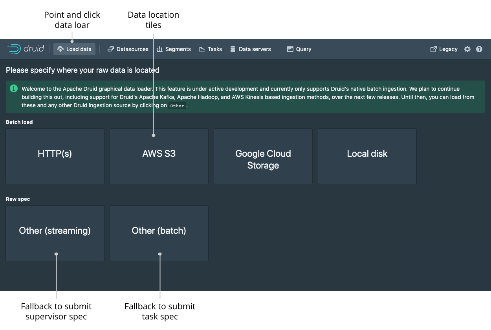
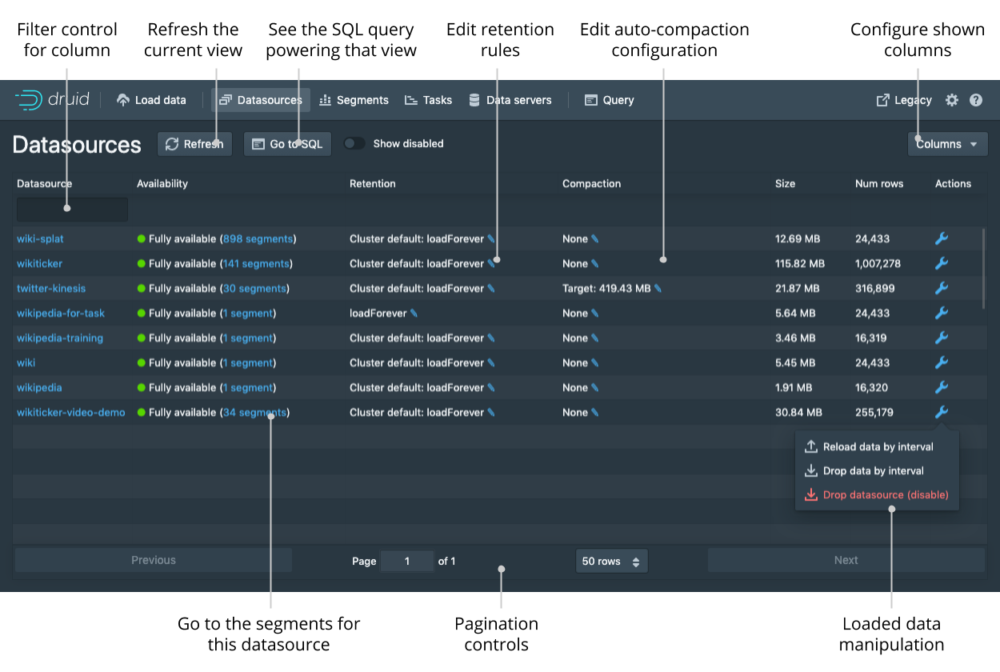
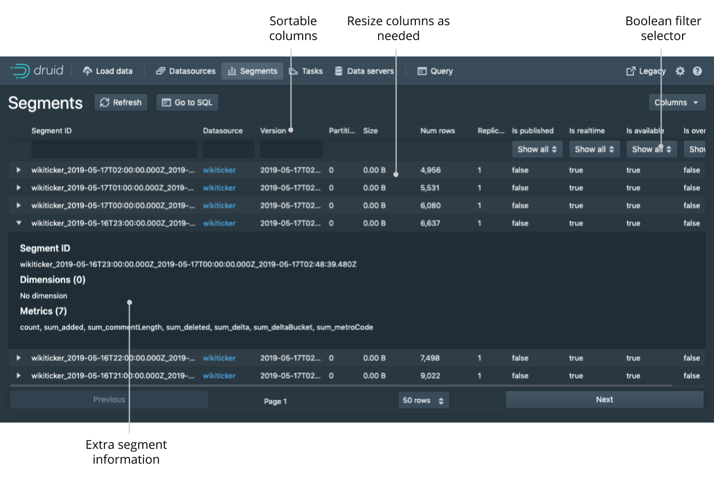
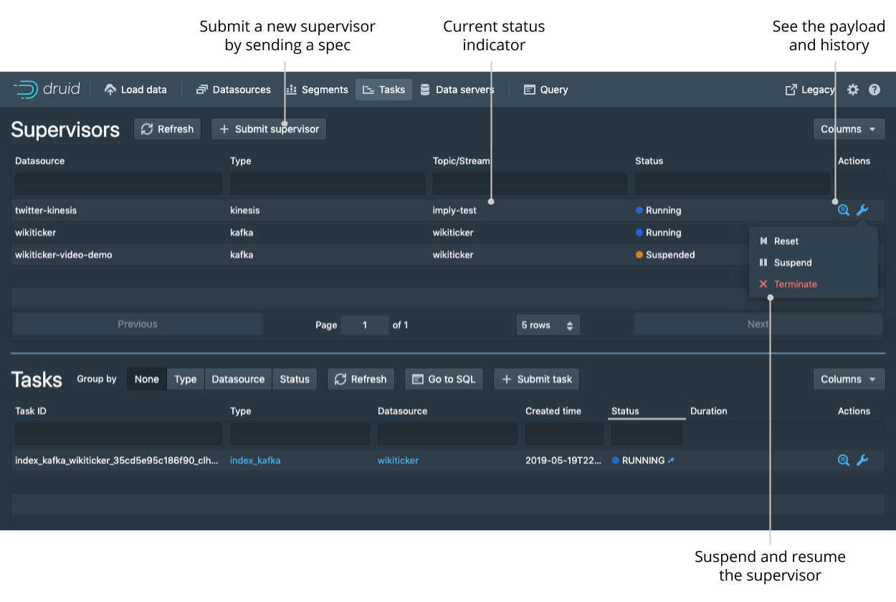
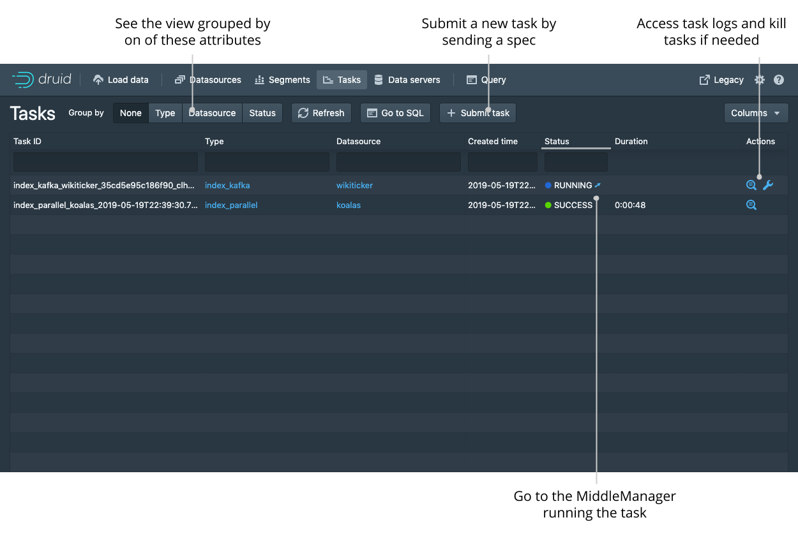
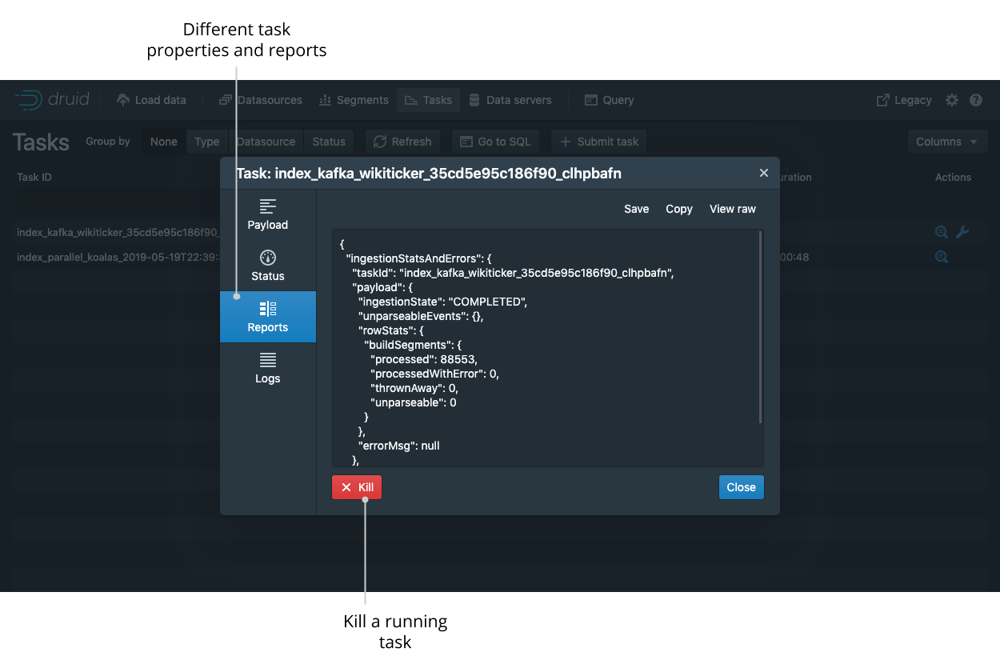
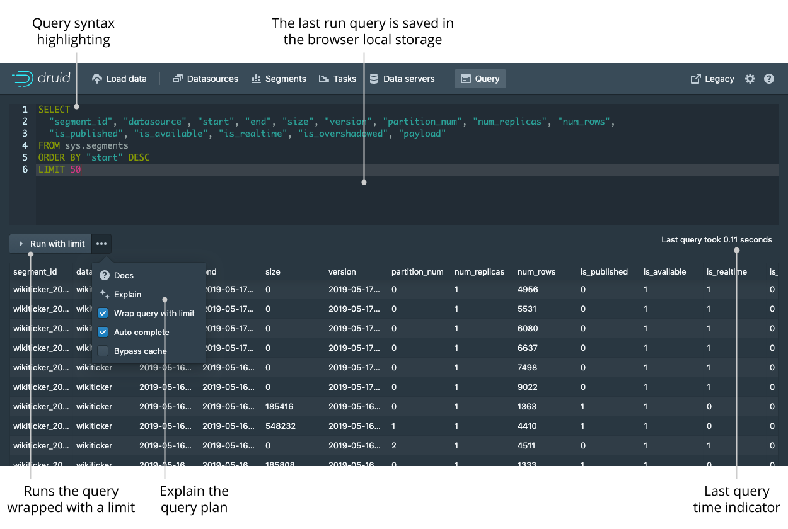
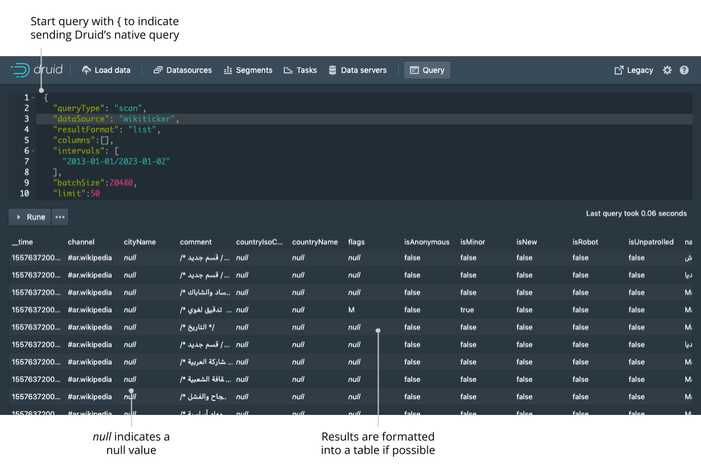
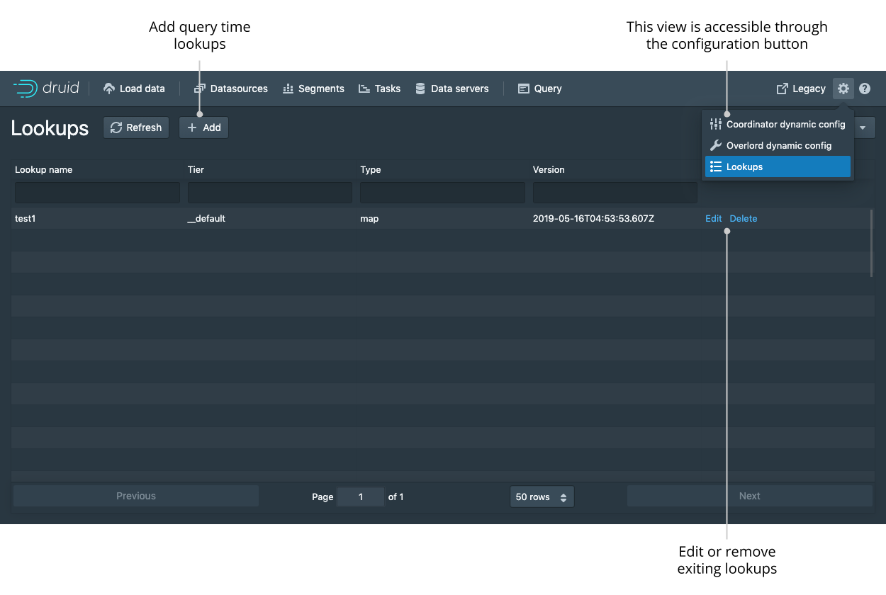

<!--
  ~ Licensed to the Apache Software Foundation (ASF) under one
  ~ or more contributor license agreements.  See the NOTICE file
  ~ distributed with this work for additional information
  ~ regarding copyright ownership.  The ASF licenses this file
  ~ to you under the Apache License, Version 2.0 (the
  ~ "License"); you may not use this file except in compliance
  ~ with the License.  You may obtain a copy of the License at
  ~
  ~   http://www.apache.org/licenses/LICENSE-2.0
  ~
  ~ Unless required by applicable law or agreed to in writing,
  ~ software distributed under the License is distributed on an
  ~ "AS IS" BASIS, WITHOUT WARRANTIES OR CONDITIONS OF ANY
  ~ KIND, either express or implied.  See the License for the
  ~ specific language governing permissions and limitations
  ~ under the License.
  -->

# Druid console

The Druid Console is hosted by the [Router](../development/router.html) process.

In addition, the following cluster settings must be enabled:

- the Router's [management proxy](../development/router.html#enabling-the-management-proxy) must be enabled.
- the Broker processes in the cluster must have [Druid SQL](../querying/sql.html) enabled.

After enabling Druid SQL on the Brokers and deploying a Router with the managment proxy enabled, the Druid console can be accessed at:

```
http://<ROUTER_IP>:<ROUTER_PORT>
```

Below is a description of the high-level features and functionality of the Druid Console

## Home

The home view provides a high level overview of the cluster. Each card is clickable and links to the appropriate view. The legacy menu allows you to go to the [legacy coordinator and overlord consoles](./management-uis.html#legacy-consoles) should you need them.


## Data loader

The data loader view allows you to load data by building an ingestion spec with a step-by-step wizard. 



After picking the source of your data just follow the series for steps that will show you incremental previews of the data as it will be ingested.
After filling in the required details on every step you can navigate to the next step by clicking the `Next` button.
You can also freely navigate between the steps from the top navigation.

Navigating with the top navigation will leave the underlying spec unmodified while clicking the `Next` button will attempt to fill in the subsequent steps with appropriate defaults.


## Datasources

The datasources view shows all the currently enabled datasources. From this view you can see the sizes and availability of the different datasources. You can edit the retention rules and drop data (as well as issue kill tasks).
Like any view that is powered by a DruidSQL query you can click “Go to SQL” to run the underlying SQL query directly.



You can view and edit retention rules to determine the general availability of a datasource.


## Segments

The segment view shows every single segment in the cluster. Each segment can be expanded to provide more information. The Segment ID is also conveniently broken down into Datasource, Start, End, Version, and Partition columns for ease of filtering and sorting.



## Tasks and supervisors

The task view is also the home of supervisors. From this view you can check the status of existing supervisors as well as suspend and resume them. You can also submit new supervisors by entering their JSON spec.



The tasks table allows you see the currently running and recently completed tasks. From this table you can monitor individual tasks and also submit new tasks by entering their JSON spec.
To make managing a lot of tasks more accessible, you can group the tasks by their type, datasource, or status to make navigation easier.



Click on the magnifying glass for any task to see more detail about it.



## Servers

The data servers tab lets you see the current status of the historical nodes and MiddleManager (indexer) processes. Note that currently only historical nodes that are actively serving segments will be shown in this view.


## Query

The query view lets you issue [DruidSQL](../querying/sql.html) queries and display the results as a simple table.



The query view can also issue queries in Druid's [native query format](../querying/querying.html), which is JSON over HTTP.
To send a native Druid query, you must start your query with `{` and format it as JSON.



## Lookups

You can create and edit query time lookups via the lookup view.


