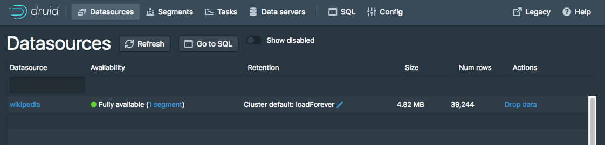

<!--
  ~ Licensed to the Apache Software Foundation (ASF) under one
  ~ or more contributor license agreements.  See the NOTICE file
  ~ distributed with this work for additional information
  ~ regarding copyright ownership.  The ASF licenses this file
  ~ to you under the Apache License, Version 2.0 (the
  ~ "License"); you may not use this file except in compliance
  ~ with the License.  You may obtain a copy of the License at
  ~
  ~   http://www.apache.org/licenses/LICENSE-2.0
  ~
  ~ Unless required by applicable law or agreed to in writing,
  ~ software distributed under the License is distributed on an
  ~ "AS IS" BASIS, WITHOUT WARRANTIES OR CONDITIONS OF ANY
  ~ KIND, either express or implied.  See the License for the
  ~ specific language governing permissions and limitations
  ~ under the License.
  -->

# Tutorial: Loading a file

## Getting started

This tutorial demonstrates how to perform a batch file load, using Apache Druid (incubating)'s native batch ingestion.

For this tutorial, we'll assume you've already downloaded Druid as described in 
the [single-machine quickstart](index.html) and have it running on your local machine. You 
don't need to have loaded any data yet.

## Preparing the data and the ingestion task spec

A data load is initiated by submitting an *ingestion task* spec to the Druid Overlord. For this tutorial, we'll be loading the sample Wikipedia page edits data.

The Druid package includes the following sample native batch ingestion task spec at `quickstart/tutorial/wikipedia-index.json`, shown here for convenience,
which has been configured to read the `quickstart/tutorial/wikiticker-2015-09-12-sampled.json.gz` input file:

```json
{
  "type" : "index",
  "spec" : {
    "dataSchema" : {
      "dataSource" : "wikipedia",
      "parser" : {
        "type" : "string",
        "parseSpec" : {
          "format" : "json",
          "dimensionsSpec" : {
            "dimensions" : [
              "channel",
              "cityName",
              "comment",
              "countryIsoCode",
              "countryName",
              "isAnonymous",
              "isMinor",
              "isNew",
              "isRobot",
              "isUnpatrolled",
              "metroCode",
              "namespace",
              "page",
              "regionIsoCode",
              "regionName",
              "user",
              { "name": "added", "type": "long" },
              { "name": "deleted", "type": "long" },
              { "name": "delta", "type": "long" }
            ]
          },
          "timestampSpec": {
            "column": "time",
            "format": "iso"
          }
        }
      },
      "metricsSpec" : [],
      "granularitySpec" : {
        "type" : "uniform",
        "segmentGranularity" : "day",
        "queryGranularity" : "none",
        "intervals" : ["2015-09-12/2015-09-13"],
        "rollup" : false
      }
    },
    "ioConfig" : {
      "type" : "index",
      "firehose" : {
        "type" : "local",
        "baseDir" : "quickstart/tutorial/",
        "filter" : "wikiticker-2015-09-12-sampled.json.gz"
      },
      "appendToExisting" : false
    },
    "tuningConfig" : {
      "type" : "index",
      "maxRowsPerSegment" : 5000000,
      "maxRowsInMemory" : 25000
    }
  }
}
```

This spec will create a datasource named "wikipedia", 

## Load batch data

We've included a sample of Wikipedia edits from September 12, 2015 to get you started.

To load this data into Druid, you can submit an *ingestion task* pointing to the file. We've included
a task that loads the `wikiticker-2015-09-12-sampled.json.gz` file included in the archive. 

For convenience, the Druid package includes a batch ingestion helper script at `bin/post-index-task`.

This script will POST an ingestion task to the Druid Overlord and poll Druid until the data is available for querying.

Run the following command from Druid package root:

```bash
bin/post-index-task --file quickstart/tutorial/wikipedia-index.json --url http://localhost:8081
```

You should see output like the following:

```bash
Beginning indexing data for wikipedia
Task started: index_wikipedia_2018-07-27T06:37:44.323Z
Task log:     http://localhost:8081/druid/indexer/v1/task/index_wikipedia_2018-07-27T06:37:44.323Z/log
Task status:  http://localhost:8081/druid/indexer/v1/task/index_wikipedia_2018-07-27T06:37:44.323Z/status
Task index_wikipedia_2018-07-27T06:37:44.323Z still running...
Task index_wikipedia_2018-07-27T06:37:44.323Z still running...
Task finished with status: SUCCESS
Completed indexing data for wikipedia. Now loading indexed data onto the cluster...
wikipedia loading complete! You may now query your data
```

## Querying your data

Once the data is loaded, please follow the [query tutorial](../tutorials/tutorial-query.html) to run some example queries on the newly loaded data.

## Cleanup

If you wish to go through any of the other ingestion tutorials, you will need to shut down the cluster and reset the cluster state by removing the contents of the `var` directory under the druid package, as the other tutorials will write to the same "wikipedia" datasource.

## Extra: Loading data without the script

Let's briefly discuss how we would've submitted the ingestion task without using the script. You do not need to run these commands.

To submit the task, POST it to Druid in a new terminal window from the apache-druid-#{DRUIDVERSION} directory:

```bash
curl -X 'POST' -H 'Content-Type:application/json' -d @quickstart/tutorial/wikipedia-index.json http://localhost:8081/druid/indexer/v1/task
```

Which will print the ID of the task if the submission was successful:

```bash
{"task":"index_wikipedia_2018-06-09T21:30:32.802Z"}
```

To view the status of the ingestion task, go to the Druid Console:
[http://localhost:8888/](http://localhost:8888). You can refresh the console periodically, and after
the task is successful, you should see a "SUCCESS" status for the task under the [Tasks view](http://localhost:8888/unified-console.html#tasks).

After the ingestion task finishes, the data will be loaded by Historical processes and available for
querying within a minute or two. You can monitor the progress of loading the data in the
Datasources view, by checking whether there is a datasource "wikipedia" with a green circle
indicating "fully available": [http://localhost:8888/unified-console.html#datasources](http://localhost:8888/unified-console.html#datasources).



## Further reading

For more information on loading batch data, please see [the batch ingestion documentation](../ingestion/batch-ingestion.html).
