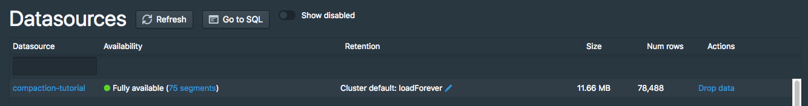
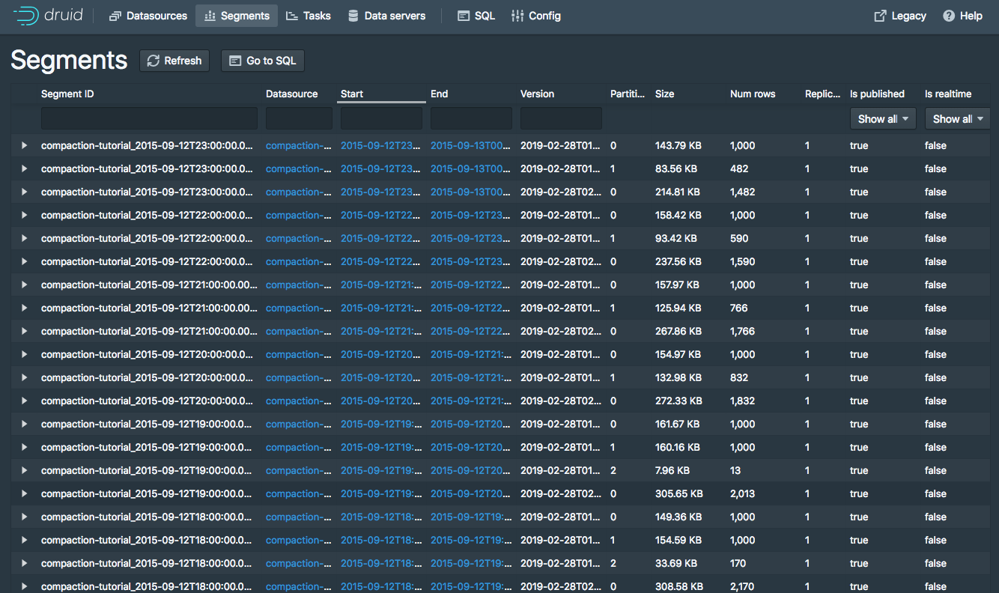
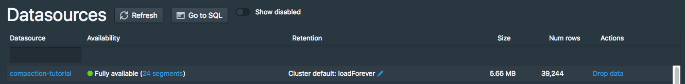
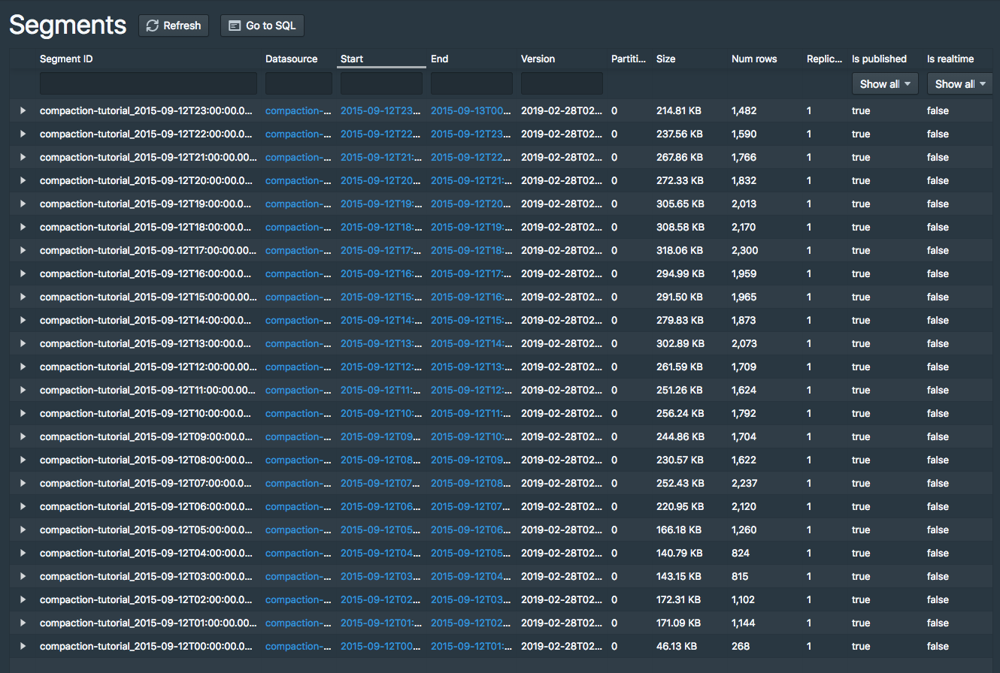
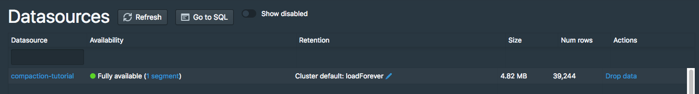
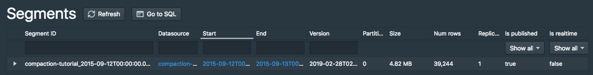

<!--
  ~ Licensed to the Apache Software Foundation (ASF) under one
  ~ or more contributor license agreements.  See the NOTICE file
  ~ distributed with this work for additional information
  ~ regarding copyright ownership.  The ASF licenses this file
  ~ to you under the Apache License, Version 2.0 (the
  ~ "License"); you may not use this file except in compliance
  ~ with the License.  You may obtain a copy of the License at
  ~
  ~   http://www.apache.org/licenses/LICENSE-2.0
  ~
  ~ Unless required by applicable law or agreed to in writing,
  ~ software distributed under the License is distributed on an
  ~ "AS IS" BASIS, WITHOUT WARRANTIES OR CONDITIONS OF ANY
  ~ KIND, either express or implied.  See the License for the
  ~ specific language governing permissions and limitations
  ~ under the License.
  -->

# Tutorial: Compacting segments

This tutorial demonstrates how to compact existing segments into fewer but larger segments.

Because there is some per-segment memory and processing overhead, it can sometimes be beneficial to reduce the total number of segments.
Please check [Segment size optimization](../operations/segment-optimization.html) for details.

For this tutorial, we'll assume you've already downloaded Druid as described in 
the [single-machine quickstart](index.html) and have it running on your local machine. 

It will also be helpful to have finished [Tutorial: Loading a file](../tutorials/tutorial-batch.html) and [Tutorial: Querying data](../tutorials/tutorial-query.html).

## Load the initial data

For this tutorial, we'll be using the Wikipedia edits sample data, with an ingestion task spec that will create 1-3 segments per hour in the input data.

The ingestion spec can be found at `quickstart/tutorial/compaction-init-index.json`. Let's submit that spec, which will create a datasource called `compaction-tutorial`:

```bash
bin/post-index-task --file quickstart/tutorial/compaction-init-index.json 
```

<div class="note caution">
Please note that `maxRowsPerSegment` in the ingestion spec is set to 1000. This is to generate multiple segments per hour and _NOT_ recommended in production.
It's 5000000 by default and may need to be adjusted to make your segments optimized.
</div>

After the ingestion completes, go to [http://localhost:8888/unified-console.html#datasources](http://localhost:8888/unified-console.html#datasources) in a browser to see the new datasource in the Druid Console.


Click the `51 segments` link next to "Fully Available" for the `compaction-tutorial` datasource to view information about the datasource's segments:
 
There will be 51 segments for this datasource, 1-3 segments per hour in the input data:


Running a COUNT(*) query on this datasource shows that there are 39,244 rows:

```bash
dsql> select count(*) from "compaction-tutorial";
┌────────┐
│ EXPR$0 │
├────────┤
│  39244 │
└────────┘
Retrieved 1 row in 1.38s.
```

## Compact the data

Let's now compact these 51 small segments.

We have included a compaction task spec for this tutorial datasource at `quickstart/tutorial/compaction-keep-granularity.json`:

```json
{
  "type": "compact",
  "dataSource": "compaction-tutorial",
  "interval": "2015-09-12/2015-09-13",
  "tuningConfig" : {
    "type" : "index",
    "maxRowsPerSegment" : 5000000,
    "maxRowsInMemory" : 25000,
    "forceExtendableShardSpecs" : true
  }
}
```

This will compact all segments for the interval `2015-09-12/2015-09-13` in the `compaction-tutorial` datasource. 

The parameters in the `tuningConfig` control how many segments will be present in the compacted set of segments. 

In this tutorial example, only one compacted segment will be created per hour, as each hour has less rows than the 5000000 `maxRowsPerSegment` (note that the total number of rows is 39244).

Let's submit this task now:

```bash
bin/post-index-task --file quickstart/tutorial/compaction-keep-granularity.json
```

After the task finishes, refresh the [segments view](http://localhost:8888/unified-console.html#segments).

The original 51 segments will eventually be marked as "unused" by the Coordinator and removed, with the new compacted segments remaining.

By default, the Druid Coordinator will not mark segments as unused until the Coordinator process has been up for at least 15 minutes, so you may see the old segment set and the new compacted set at the same time in the Druid Console, with 75 total segments:





The new compacted segments have a more recent version than the original segments, so even when both sets of segments are shown in the Druid Console, queries will only read from the new compacted segments.

Let's try running a COUNT(*) on `compaction-tutorial` again, where the row count should still be 39,244:

```bash
dsql> select count(*) from "compaction-tutorial";
┌────────┐
│ EXPR$0 │
├────────┤
│  39244 │
└────────┘
Retrieved 1 row in 1.30s.
```

After the Coordinator has been running for at least 15 minutes, the [segments view](http://localhost:8888/unified-console.html#segments) should show there are 24 segments, one per hour:





## Compact the data with new segment granularity

The compaction task can also produce compacted segments with a granularity different from the granularity of the input segments.

We have included a compaction task spec that will create DAY granularity segments at `quickstart/tutorial/compaction-day-granularity.json`:

```json
{
  "type": "compact",
  "dataSource": "compaction-tutorial",
  "interval": "2015-09-12/2015-09-13",
  "segmentGranularity": "DAY",
  "tuningConfig" : {
    "type" : "index",
    "maxRowsPerSegment" : 5000000,
    "maxRowsInMemory" : 25000,
    "forceExtendableShardSpecs" : true
  }
}
```

Note that `segmentGranularity` is set to `DAY` in this compaction task spec.

Let's submit this task now:

```bash
bin/post-index-task --file quickstart/tutorial/compaction-day-granularity.json
```

It will take a bit of time before the Coordinator marks the old input segments as unused, so you may see an intermediate state with 25 total segments. Eventually, there will only be one DAY granularity segment:






## Further reading

[Task documentation](../ingestion/tasks.html)

[Segment optimization](../operations/segment-optimization.html)