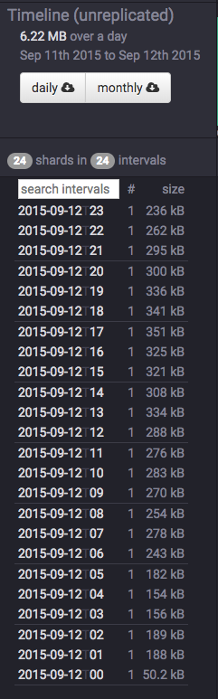
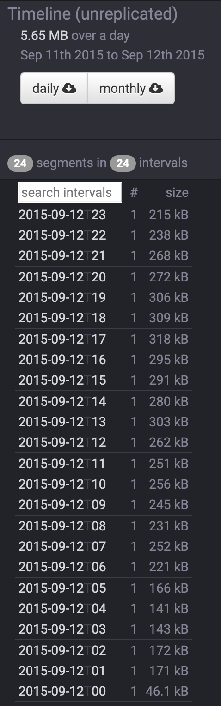

# Tutorial: Compacting segments

This tutorial demonstrates how to compact existing segments into fewer but larger segments.

Because there is some per-segment memory and processing overhead, it can sometimes be beneficial to reduce the total number of segments.

For this tutorial, we'll assume you've already downloaded Druid as described in 
the [single-machine quickstart](index.html) and have it running on your local machine. 

It will also be helpful to have finished [Tutorial: Loading a file](/docs/VERSION/tutorials/tutorial-batch.html) and [Tutorial: Querying data](/docs/VERSION/tutorials/tutorial-query.html).

## Load the initial data

For this tutorial, we'll be using the Wikipedia edits sample data, with an ingestion task spec that will create a separate segment for each hour in the input data.

The ingestion spec can be found at `quickstart/tutorial/compaction-init-index.json`. Let's submit that spec, which will create a datasource called `compaction-tutorial`:

```
bin/post-index-task --file quickstart/tutorial/compaction-init-index.json 
```

After the ingestion completes, go to http://localhost:8081/#/datasources/compaction-tutorial in a browser to view information about the new datasource in the Coordinator console.

There will be 24 segments for this datasource, one segment per hour in the input data:


Running a COUNT(*) query on this datasource shows that there are 39,244 rows:

```
dsql> select count(*) from "compaction-tutorial";
┌────────┐
│ EXPR$0 │
├────────┤
│  39244 │
└────────┘
Retrieved 1 row in 1.38s.
```

## Compact the data

Let's now combine these 24 segments into one segment.

We have included a compaction task spec for this tutorial datasource at `quickstart/tutorial/compaction-final-index.json`:

```
{
  "type": "compact",
  "dataSource": "compaction-tutorial",
  "interval": "2015-09-12/2015-09-13",
  "tuningConfig" : {
    "type" : "index",
    "targetPartitionSize" : 5000000,
    "maxRowsInMemory" : 25000,
    "forceExtendableShardSpecs" : true
  }
}
```

This will compact all segments for the interval `2015-09-12/2015-09-13` in the `compaction-tutorial` datasource. 

The parameters in the `tuningConfig` control how many segments will be present in the compacted set of segments. 

In this tutorial example, only one compacted segment will be created, as the 39244 rows in the input is less than the 5000000 `targetPartitionSize`.

Let's submit this task now:

```
bin/post-index-task --file quickstart/tutorial/compaction-final-index.json 
```

After the task finishes, refresh the http://localhost:8081/#/datasources/compaction-tutorial page.

The original 24 segments will eventually be marked as "unused" by the Coordinator and removed, with the new compacted segment remaining. 

By default, the Druid coordinator will not mark segments as unused until the coordinator process has been up for at least 15 minutes, so you may see the old segment set and the new compacted set at the same time in the coordinator, e.g.:



The new compacted segment has a more recent version than the original segments, so even when both sets of segments are shown by the coordinator, queries will only read from the new compacted segment.

Let's try running a COUNT(*) on `compaction-tutorial` again, where the row count should still be 39,244:

```
dsql> select count(*) from "compaction-tutorial";
┌────────┐
│ EXPR$0 │
├────────┤
│  39244 │
└────────┘
Retrieved 1 row in 1.30s.
```

After the coordinator has been running for at least 15 minutes, the http://localhost:8081/#/datasources/compaction-tutorial page should show there is only 1 segment:



## Further reading

[Task documentation](../ingestion/tasks.html)

[Segment optimization](../operations/segment-optimization.html)
