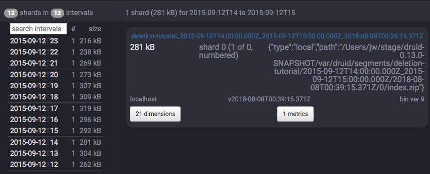
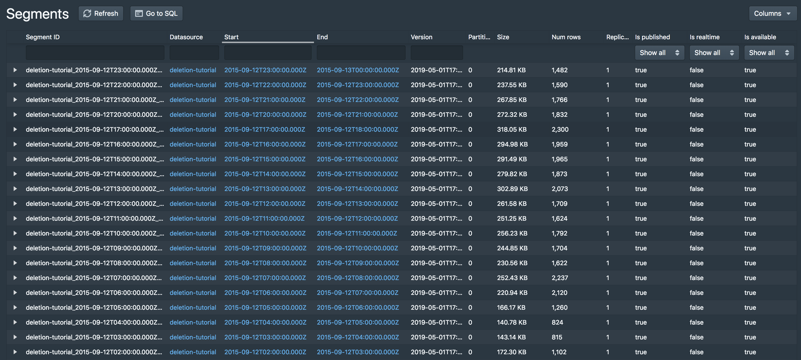

# Tutorial: Deleting data

This tutorial demonstrates how to delete existing data.

For this tutorial, we'll assume you've already downloaded Druid as described in 
the [single-machine quickstart](index.html) and have it running on your local machine. 

Completing [Tutorial: Configuring retention](../tutorials/tutorial-retention.html) first is highly recommended, as we will be using retention rules in this tutorial.

## Load initial data

In this tutorial, we will use the Wikipedia edits data, with an indexing spec that creates hourly segments. This spec is located at `examples/deletion-index.json`, and it creates a datasource called `deletion-tutorial`.

Let's load this initial data:

```bash
curl -X 'POST' -H 'Content-Type:application/json' -d @examples/deletion-index.json http://localhost:8090/druid/indexer/v1/task
```

When the load finishes, open http://localhost:8081/#/datasources/deletion-tutorial in a browser.

## How to permanently delete data

Permanent deletion of a Druid segment has two steps:

1. The segment must first be marked as "unused". This occurs when a segment is dropped by retention rules, and when a user manually disables a segment through the Coordinator API. This tutorial will cover both cases.
2. After segments have been marked as "unused", a Kill Task will delete any "unused" segments from Druid's metadata store as well as deep storage.

Let's drop some segments now, first with load rules, then manually.

## Drop some data with load rules

As with the previous retention tutorial, there are currently 24 segments in the `deletion-tutorial` datasource.

Click the `edit rules` button with a pencil icon at the upper left corner of the page.

A rule configuration window will appear. Enter `tutorial` for both the user and changelog comment field.

Now click the `+ Add a rule` button twice. 

In the `rule #1` box at the top, click `Load`, `Interval`, enter `2015-09-12T12:00:00.000Z/2015-09-13T00:00:00.000Z` in the interval box, and click `+ _default_tier replicant`.

In the `rule #2` box at the bottom, click `Drop` and `Forever`.

This will cause the first 12 segments of `deletion-tutorial` to be dropped. However, these dropped segments are not removed from deep storage.

You can see that all 24 segments are still present in deep storage by listing the contents of `var/druid/segments/deletion-tutorial`:

```bash
$ ls -l1 var/druid/segments/deletion-tutorial/
2015-09-12T00:00:00.000Z_2015-09-12T01:00:00.000Z
2015-09-12T01:00:00.000Z_2015-09-12T02:00:00.000Z
2015-09-12T02:00:00.000Z_2015-09-12T03:00:00.000Z
2015-09-12T03:00:00.000Z_2015-09-12T04:00:00.000Z
2015-09-12T04:00:00.000Z_2015-09-12T05:00:00.000Z
2015-09-12T05:00:00.000Z_2015-09-12T06:00:00.000Z
2015-09-12T06:00:00.000Z_2015-09-12T07:00:00.000Z
2015-09-12T07:00:00.000Z_2015-09-12T08:00:00.000Z
2015-09-12T08:00:00.000Z_2015-09-12T09:00:00.000Z
2015-09-12T09:00:00.000Z_2015-09-12T10:00:00.000Z
2015-09-12T10:00:00.000Z_2015-09-12T11:00:00.000Z
2015-09-12T11:00:00.000Z_2015-09-12T12:00:00.000Z
2015-09-12T12:00:00.000Z_2015-09-12T13:00:00.000Z
2015-09-12T13:00:00.000Z_2015-09-12T14:00:00.000Z
2015-09-12T14:00:00.000Z_2015-09-12T15:00:00.000Z
2015-09-12T15:00:00.000Z_2015-09-12T16:00:00.000Z
2015-09-12T16:00:00.000Z_2015-09-12T17:00:00.000Z
2015-09-12T17:00:00.000Z_2015-09-12T18:00:00.000Z
2015-09-12T18:00:00.000Z_2015-09-12T19:00:00.000Z
2015-09-12T19:00:00.000Z_2015-09-12T20:00:00.000Z
2015-09-12T20:00:00.000Z_2015-09-12T21:00:00.000Z
2015-09-12T21:00:00.000Z_2015-09-12T22:00:00.000Z
2015-09-12T22:00:00.000Z_2015-09-12T23:00:00.000Z
2015-09-12T23:00:00.000Z_2015-09-13T00:00:00.000Z
```

## Manually disable a segment

Let's manually disable a segment now. This will mark a segment as "unused", but not remove it from deep storage.

On http://localhost:8081/#/datasources/deletion-tutorial, click one of the remaining segments on the left for full details about the segment:



The top of the info box shows the full segment ID, e.g. `deletion-tutorial_2016-06-27T14:00:00.000Z_2016-06-27T15:00:00.000Z_2018-07-27T22:57:00.110Z` for the segment of hour 14.

Let's disable the hour 14 segment by sending the following DELETE request to the coordinator, where {SEGMENT-ID} is the full segment ID shown in the info box:

```bash
curl -XDELETE http://localhost:8081/druid/coordinator/v1/datasources/deletion-tutorial/segments/{SEGMENT-ID}
```

After that command completes, you should see that the segment for hour 14 has been disabled:



Note that the hour 14 segment is still in deep storage:

```bash
$ ls -l1 var/druid/segments/deletion-tutorial/
2015-09-12T00:00:00.000Z_2015-09-12T01:00:00.000Z
2015-09-12T01:00:00.000Z_2015-09-12T02:00:00.000Z
2015-09-12T02:00:00.000Z_2015-09-12T03:00:00.000Z
2015-09-12T03:00:00.000Z_2015-09-12T04:00:00.000Z
2015-09-12T04:00:00.000Z_2015-09-12T05:00:00.000Z
2015-09-12T05:00:00.000Z_2015-09-12T06:00:00.000Z
2015-09-12T06:00:00.000Z_2015-09-12T07:00:00.000Z
2015-09-12T07:00:00.000Z_2015-09-12T08:00:00.000Z
2015-09-12T08:00:00.000Z_2015-09-12T09:00:00.000Z
2015-09-12T09:00:00.000Z_2015-09-12T10:00:00.000Z
2015-09-12T10:00:00.000Z_2015-09-12T11:00:00.000Z
2015-09-12T11:00:00.000Z_2015-09-12T12:00:00.000Z
2015-09-12T12:00:00.000Z_2015-09-12T13:00:00.000Z
2015-09-12T13:00:00.000Z_2015-09-12T14:00:00.000Z
2015-09-12T14:00:00.000Z_2015-09-12T15:00:00.000Z
2015-09-12T15:00:00.000Z_2015-09-12T16:00:00.000Z
2015-09-12T16:00:00.000Z_2015-09-12T17:00:00.000Z
2015-09-12T17:00:00.000Z_2015-09-12T18:00:00.000Z
2015-09-12T18:00:00.000Z_2015-09-12T19:00:00.000Z
2015-09-12T19:00:00.000Z_2015-09-12T20:00:00.000Z
2015-09-12T20:00:00.000Z_2015-09-12T21:00:00.000Z
2015-09-12T21:00:00.000Z_2015-09-12T22:00:00.000Z
2015-09-12T22:00:00.000Z_2015-09-12T23:00:00.000Z
2015-09-12T23:00:00.000Z_2015-09-13T00:00:00.000Z
```

## Run a kill task

Now that we have disabled some segments, we can submit a Kill Task, which will delete the disabled segments from metadata and deep storage.

A Kill Task spec has been provided at `examples/deletion-kill.json`. Submit this task to the Overlord with the following command:

```bash
curl -X 'POST' -H 'Content-Type:application/json' -d @examples/deletion-kill.json http://localhost:8090/druid/indexer/v1/task
```

After this task completes, you can see that the disabled segments have now been removed from deep storage:

```bash
$ ls -l1 var/druid/segments/deletion-tutorial/
2015-09-12T12:00:00.000Z_2015-09-12T13:00:00.000Z
2015-09-12T13:00:00.000Z_2015-09-12T14:00:00.000Z
2015-09-12T15:00:00.000Z_2015-09-12T16:00:00.000Z
2015-09-12T16:00:00.000Z_2015-09-12T17:00:00.000Z
2015-09-12T17:00:00.000Z_2015-09-12T18:00:00.000Z
2015-09-12T18:00:00.000Z_2015-09-12T19:00:00.000Z
2015-09-12T19:00:00.000Z_2015-09-12T20:00:00.000Z
2015-09-12T20:00:00.000Z_2015-09-12T21:00:00.000Z
2015-09-12T21:00:00.000Z_2015-09-12T22:00:00.000Z
2015-09-12T22:00:00.000Z_2015-09-12T23:00:00.000Z
2015-09-12T23:00:00.000Z_2015-09-13T00:00:00.000Z
```