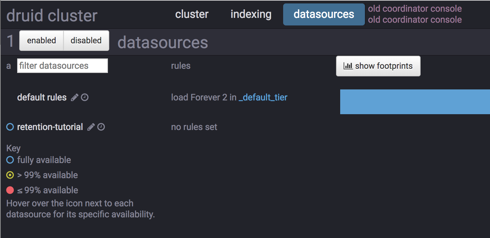

# Tutorial: Configuring data retention

This tutorial demonstrates how to configure retention rules on a datasource to set the time intervals of data that will be retained or dropped.

For this tutorial, we'll assume you've already downloaded Druid as described in 
the [single-machine quickstart](index.html) and have it running on your local machine. 

It will also be helpful to have finished [Tutorial: Loading a file](../tutorials/tutorial-batch.html) and [Tutorial: Querying data](../tutorials/tutorial-query.html).

## Load the example data

For this tutorial, we'll be using the Wikipedia edits sample data, with an ingestion task spec that will create a separate segment for each hour in the input data.

The ingestion spec can be found at `quickstart/retention-index.json`. Let's submit that spec, which will create a datasource called `retention-tutorial`:

```bash
bin/post-index-task --file quickstart/tutorial/retention-index.json 
```

After the ingestion completes, go to http://localhost:8081 in a browser to access the Coordinator console.
 
In the Coordinator console, go to the `datasources` tab at the top of the page.

This tab shows the available datasources and a summary of the retention rules for each datasource:



Currently there are no rules set for the `retention-tutorial` datasource. Note that there are default rules, currently set to `load Forever 2 in _default_tier`. 

This means that all data will be loaded regardless of timestamp, and each segment will be replicated to two nodes in the default tier. 

In this tutorial, we will ignore the tiering and redundancy concepts for now.

Let's click the `retention-tutorial` datasource on the left. 

The next page (http://localhost:8081/#/datasources/retention-tutorial) provides information about what segments a datasource contains. On the left, the page shows that there are 24 segments, each one containing data for a specific hour of 2015-09-12:


## Set retention rules

Suppose we want to drop data for the first 12 hours of 2015-09-12 and keep data for the later 12 hours of 2015-09-12.

Click the `edit rules` button with a pencil icon at the upper left corner of the page.

A rule configuration window will appear. Enter `tutorial` for both the user and changelog comment field.

Now click the `+ Add a rule` button twice. 

In the `rule #1` box at the top, click `Load`, `Interval`, enter `2015-09-12T12:00:00.000Z/2015-09-13T00:00:00.000Z` in the interval box, and click `+ _default_tier replicant`.

In the `rule #2` box at the bottom, click `Drop` and `Forever`.

The rules should look like this:


Now click `Save all rules`, wait for a few seconds, and refresh the page. 

The segments for the first 12 hours of 2015-09-12 are now gone:


The resulting retention rule chain is the following:

1. loadByInterval 2015-09-12T12/2015-09-13 (12 hours)

2. dropForever

3. loadForever (default rule)


The rule chain is evaluated from top to bottom, with the default rule chain always added at the bottom.

The tutorial rule chain we just created loads data if it is within the specified 12 hour interval. 

If data is not within the 12 hour interval, the rule chain evaluates `dropForever` next, which will drop any data.

The `dropForever` terminates the rule chain, effectively overriding the default `loadForever` rule, which will never be reached in this rule chain.

Note that in this tutorial we defined a load rule on a specific interval. 

If instead you want to retain data based on how old it is (e.g., retain data that ranges from 3 months in the past to the present time), you would define a Period load rule instead.

## Further reading

* [Load rules](../operations/rule-configuration.html)
