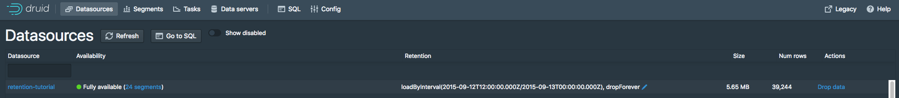

<!--
  ~ Licensed to the Apache Software Foundation (ASF) under one
  ~ or more contributor license agreements.  See the NOTICE file
  ~ distributed with this work for additional information
  ~ regarding copyright ownership.  The ASF licenses this file
  ~ to you under the Apache License, Version 2.0 (the
  ~ "License"); you may not use this file except in compliance
  ~ with the License.  You may obtain a copy of the License at
  ~
  ~   http://www.apache.org/licenses/LICENSE-2.0
  ~
  ~ Unless required by applicable law or agreed to in writing,
  ~ software distributed under the License is distributed on an
  ~ "AS IS" BASIS, WITHOUT WARRANTIES OR CONDITIONS OF ANY
  ~ KIND, either express or implied.  See the License for the
  ~ specific language governing permissions and limitations
  ~ under the License.
  -->

# Tutorial: Configuring data retention

This tutorial demonstrates how to configure retention rules on a datasource to set the time intervals of data that will be retained or dropped.

For this tutorial, we'll assume you've already downloaded Druid as described in 
the [single-machine quickstart](index.html) and have it running on your local machine. 

It will also be helpful to have finished [Tutorial: Loading a file](../tutorials/tutorial-batch.html) and [Tutorial: Querying data](../tutorials/tutorial-query.html).

## Load the example data

For this tutorial, we'll be using the Wikipedia edits sample data, with an ingestion task spec that will create a separate segment for each hour in the input data.

The ingestion spec can be found at `quickstart/tutorial/retention-index.json`. Let's submit that spec, which will create a datasource called `retention-tutorial`:

```bash
bin/post-index-task --file quickstart/tutorial/retention-index.json 
```

After the ingestion completes, go to [http://localhost:8888/unified-console.html#datasources](http://localhost:8888/unified-console.html#datasources) in a browser to access the Druid Console's datasource view.
 
This view shows the available datasources and a summary of the retention rules for each datasource:


Currently there are no rules set for the `retention-tutorial` datasource. Note that there are default rules for the cluster: load forever with 2 replicants in `_default_tier`. 

This means that all data will be loaded regardless of timestamp, and each segment will be replicated to two Historical processes in the default tier. 

In this tutorial, we will ignore the tiering and redundancy concepts for now.

Let's view the segments for the `retention-tutorial` datasource by clicking the "24 Segments" link next to "Fully Available".

The segments view ([http://localhost:8888/unified-console.html#segments](http://localhost:8888/unified-console.html#segments)) provides information about what segments a datasource contains. The page shows that there are 24 segments, each one containing data for a specific hour of 2015-09-12:


## Set retention rules

Suppose we want to drop data for the first 12 hours of 2015-09-12 and keep data for the later 12 hours of 2015-09-12.

Go to the [datasources view](http://localhost:8888/unified-console.html#datasources) and click the blue pencil icon next to `Cluster default: loadForever` for the `retention-tutorial` datasource.

A rule configuration window will appear:


Now click the `+ New rule` button twice. 

In the upper rule box, select `Load` and `by interval`, and then enter `2015-09-12T12:00:00.000Z/2015-09-13T00:00:00.000Z` in field next to `by interval`. Replicants can remain at 2 in the `_default_tier`.

In the lower rule box, select `Drop` and `forever`.

The rules should look like this:


Now click `Next`. The rule configuration process will ask for a user name and comment, for change logging purposes. You can enter `tutorial` for both.

Now click `Save`. You can see the new rules in the datasources view:



Give the cluster a few minutes to apply the rule change, and go to the [segments view](http://localhost:8888/unified-console.html#segments) in the Druid Console.
The segments for the first 12 hours of 2015-09-12 are now gone:


The resulting retention rule chain is the following:

1. loadByInterval 2015-09-12T12/2015-09-13 (12 hours)

2. dropForever

3. loadForever (default rule)

The rule chain is evaluated from top to bottom, with the default rule chain always added at the bottom.

The tutorial rule chain we just created loads data if it is within the specified 12 hour interval. 

If data is not within the 12 hour interval, the rule chain evaluates `dropForever` next, which will drop any data.

The `dropForever` terminates the rule chain, effectively overriding the default `loadForever` rule, which will never be reached in this rule chain.

Note that in this tutorial we defined a load rule on a specific interval. 

If instead you want to retain data based on how old it is (e.g., retain data that ranges from 3 months in the past to the present time), you would define a Period load rule instead.

## Further reading

* [Load rules](../operations/rule-configuration.html)
