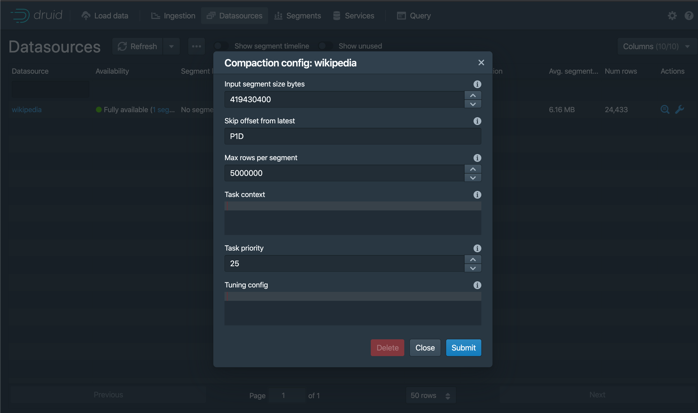

<!--
  ~ Licensed to the Apache Software Foundation (ASF) under one
  ~ or more contributor license agreements.  See the NOTICE file
  ~ distributed with this work for additional information
  ~ regarding copyright ownership.  The ASF licenses this file
  ~ to you under the Apache License, Version 2.0 (the
  ~ "License"); you may not use this file except in compliance
  ~ with the License.  You may obtain a copy of the License at
  ~
  ~   http://www.apache.org/licenses/LICENSE-2.0
  ~
  ~ Unless required by applicable law or agreed to in writing,
  ~ software distributed under the License is distributed on an
  ~ "AS IS" BASIS, WITHOUT WARRANTIES OR CONDITIONS OF ANY
  ~ KIND, either express or implied.  See the License for the
  ~ specific language governing permissions and limitations
  ~ under the License.
  -->

In Apache Druid, compaction is a special type of ingestion task that reads data from a Druid datasource and writes it back into the same datasource. A common use case for this is to [optimally size segments](../operations/segment-optimization.md) after ingestion to improve query performance. Automatic compaction, or auto-compaction, refers to the system for automatic execution of compaction tasks issued by Druid itself. In addition to auto-compaction, you can perform [manual compaction](./manual-compaction.md) using the Overlord APIs.

:::info
 Auto-compaction skips datasources that have a segment granularity of `ALL`.
:::

As a best practice, you should set up auto-compaction for all Druid datasources. You can run compaction tasks manually for cases where you want to allocate more system resources. For example, you may choose to run multiple compaction tasks in parallel to compact an existing datasource for the first time. See [Compaction](compaction.md) for additional details and use cases.

This topic guides you through setting up automatic compaction for your Druid cluster. See the [examples](#examples) for common use cases for automatic compaction.

## Auto-compaction syntax

You can configure automatic compaction dynamically without restarting Druid.
The automatic compaction system uses the following syntax:

```json
{
    "dataSource": <task_datasource>,
    "ioConfig": <IO config>,
    "dimensionsSpec": <custom dimensionsSpec>,
    "transformSpec": <custom transformSpec>,
    "metricsSpec": <custom metricsSpec>,
    "tuningConfig": <parallel indexing task tuningConfig>,
    "granularitySpec": <compaction task granularitySpec>,
    "skipOffsetFromLatest": <time period to avoid compaction>,
    "taskPriority": <compaction task priority>,
    "taskContext": <task context>
}
```

:::info Experimental

The MSQ task engine is available as a compaction engine when you run automatic compaction as a compaction supervisor. For more information, see [Auto-compaction using compaction supervisors](#auto-compaction-using-compaction-supervisors).

:::

For automatic compaction using Coordinator duties, you submit the spec to the [Compaction config UI](#manage-auto-compaction-using-the-web-console) or the [Compaction configuration API](#manage-auto-compaction-using-coordinator-apis).

Most fields in the auto-compaction configuration correlate to a typical [Druid ingestion spec](../ingestion/ingestion-spec.md).
The following properties only apply to auto-compaction:
* `skipOffsetFromLatest`
* `taskPriority`
* `taskContext`

Since the automatic compaction system provides a management layer on top of manual compaction tasks,
the auto-compaction configuration does not include task-specific properties found in a typical Druid ingestion spec.
The following properties are automatically set by the Coordinator:
* `type`: Set to `compact`.
* `id`: Generated using the task type, datasource name, interval, and timestamp. The task ID is prefixed with `coordinator-issued`.
* `context`: Set according to the user-provided `taskContext`.

Compaction tasks typically fetch all [relevant segments](manual-compaction.md#compaction-io-configuration) prior to launching any subtasks,
_unless_ the following properties are all set to non-null values. It is strongly recommended to set them to non-null values to
maximize performance and minimize disk usage of the `compact` tasks launched by auto-compaction:

- [`granularitySpec`](manual-compaction.md#compaction-granularity-spec), with non-null values for each of `segmentGranularity`, `queryGranularity`, and `rollup`
- [`dimensionsSpec`](manual-compaction.md#compaction-dimensions-spec)
- `metricsSpec`

For more details on each of the specs in an auto-compaction configuration, see [Automatic compaction dynamic configuration](../configuration/index.md#automatic-compaction-dynamic-configuration).

## Auto-compaction using Coordinator duties

You can control how often the Coordinator checks to see if auto-compaction is needed. The Coordinator [indexing period](../configuration/index.md#coordinator-operation), `druid.coordinator.period.indexingPeriod`, controls the frequency of compaction tasks.
The default indexing period is 30 minutes, meaning that the Coordinator first checks for segments to compact at most 30 minutes from when auto-compaction is enabled.
This time period also affects other Coordinator duties such as cleanup of unused segments and stale pending segments.
To configure the auto-compaction time period without interfering with `indexingPeriod`, see [Set frequency of compaction runs](#change-compaction-frequency).

At every invocation of auto-compaction, the Coordinator initiates a [segment search](../design/coordinator.md#segment-search-policy-in-automatic-compaction) to determine eligible segments to compact.
When there are eligible segments to compact, the Coordinator issues compaction tasks based on available worker capacity.
If a compaction task takes longer than the indexing period, the Coordinator waits for it to finish before resuming the period for segment search.

No additional configuration is needed to run automatic compaction tasks using the Coordinator and native engine. This is the default behavior for Druid.
You can configure it for a datasource through the web console or programmatically via an API.
This process differs for manual compaction tasks, which can be submitted from the [Tasks view of the web console](../operations/web-console.md) or the [Tasks API](../api-reference/tasks-api.md).

### Manage auto-compaction using the web console

Use the web console to enable automatic compaction for a datasource as follows:

1. Click **Datasources** in the top-level navigation.
2. In the **Compaction** column, click the edit icon for the datasource to compact.
3. In the **Compaction config** dialog, configure the auto-compaction settings. The dialog offers a form view as well as a JSON view. Editing the form updates the JSON specification, and editing the JSON updates the form field, if present. Form fields not present in the JSON indicate default values. You may add additional properties to the JSON for auto-compaction settings not displayed in the form. See [Configure automatic compaction](#auto-compaction-syntax) for supported settings for auto-compaction.
4. Click **Submit**.
5. Refresh the **Datasources** view. The **Compaction** column for the datasource changes from “Not enabled” to “Awaiting first run.”

The following screenshot shows the compaction config dialog for a datasource with auto-compaction enabled.


To disable auto-compaction for a datasource, click **Delete** from the **Compaction config** dialog. Druid does not retain your auto-compaction configuration.

### Manage auto-compaction using Coordinator APIs  

Use the [Automatic compaction API](../api-reference/automatic-compaction-api.md#manage-automatic-compaction) to configure automatic compaction.
To enable auto-compaction for a datasource, create a JSON object with the desired auto-compaction settings.
See [Configure automatic compaction](#auto-compaction-syntax) for the syntax of an auto-compaction spec.
Send the JSON object as a payload in a [`POST` request](../api-reference/automatic-compaction-api.md#create-or-update-automatic-compaction-configuration) to `/druid/coordinator/v1/config/compaction`.
The following example configures auto-compaction for the `wikipedia` datasource:

```sh
curl --location --request POST 'http://localhost:8081/druid/coordinator/v1/config/compaction' \
--header 'Content-Type: application/json' \
--data-raw '{
    "dataSource": "wikipedia",
    "granularitySpec": {
        "segmentGranularity": "DAY"
    }
}'
```

To disable auto-compaction for a datasource, send a [`DELETE` request](../api-reference/automatic-compaction-api.md#remove-automatic-compaction-configuration) to `/druid/coordinator/v1/config/compaction/{dataSource}`. Replace `{dataSource}` with the name of the datasource for which to disable auto-compaction. For example:

```sh
curl --location --request DELETE 'http://localhost:8081/druid/coordinator/v1/config/compaction/wikipedia'
```

### Change compaction frequency

If you want the Coordinator to check for compaction more frequently than its indexing period, create a separate group to handle compaction duties.
Set the time period of the duty group in the `coordinator/runtime.properties` file.
The following example shows how to create a duty group named `compaction` and set the auto-compaction period to 1 minute:
```
druid.coordinator.dutyGroups=["compaction"]
druid.coordinator.compaction.duties=["compactSegments"]
druid.coordinator.compaction.period=PT60S
```

### View Coordinator duty auto-compaction stats

After the Coordinator has initiated auto-compaction, you can view compaction statistics for the datasource, including the number of bytes, segments, and intervals already compacted and those awaiting compaction. The Coordinator also reports the total bytes, segments, and intervals not eligible for compaction in accordance with its [segment search policy](../design/coordinator.md#segment-search-policy-in-automatic-compaction).

In the web console, the Datasources view displays auto-compaction statistics. The Tasks view shows the task information for compaction tasks that were triggered by the automatic compaction system.

To get statistics by API, send a [`GET` request](../api-reference/automatic-compaction-api.md#view-automatic-compaction-status) to `/druid/coordinator/v1/compaction/status`. To filter the results to a particular datasource, pass the datasource name as a query parameter to the request—for example, `/druid/coordinator/v1/compaction/status?dataSource=wikipedia`.


## Avoid conflicts with ingestion

Compaction tasks may be interrupted when they interfere with ingestion. For example, this occurs when an ingestion task needs to write data to a segment for a time interval locked for compaction. If there are continuous failures that prevent compaction from making progress, consider one of the following strategies:

* Enable [concurrent append and replace tasks](#enable-concurrent-append-and-replace) on your datasource and on the ingestion tasks.
* Set `skipOffsetFromLatest` to reduce the chance of conflicts between ingestion and compaction. See more details in [Skip compaction for latest segments](#skip-compaction-for-latest-segments).
* Increase the priority value of compaction tasks relative to ingestion tasks. Only recommended for advanced users. This approach can cause ingestion jobs to fail or lag. To change the priority of compaction tasks, set `taskPriority` to the desired priority value in the auto-compaction configuration. For details on the priority values of different task types, see [Lock priority](../ingestion/tasks.md#lock-priority).

### Enable concurrent append and replace

You can use concurrent append and replace to safely replace the existing data in an interval of a datasource while new data is being appended to that interval even during compaction.

To do this, you need to update your datasource to allow concurrent append and replace tasks:

* If you're using the API, include the following `taskContext` property in your API call: `"useConcurrentLocks": true`
* If you're using the UI, enable **Use concurrent locks** in the **Compaction config** for your datasource.

You'll also need to update your ingestion jobs for the datasource to include the task context `"useConcurrentLocks": true`.

For information on how to do this, see [Concurrent append and replace](../ingestion/concurrent-append-replace.md).

### Skip compaction for latest segments

The Coordinator compacts segments from newest to oldest. In the auto-compaction configuration, you can set a time period, relative to the end time of the most recent segment, for segments that should not be compacted. Assign this value to `skipOffsetFromLatest`. Note that this offset is not relative to the current time but to the latest segment time. For example, if you want to skip over segments from five days prior to the end time of the most recent segment, assign `"skipOffsetFromLatest": "P5D"`.

To set `skipOffsetFromLatest`, consider how frequently you expect the stream to receive late arriving data. If your stream only occasionally receives late arriving data, the auto-compaction system robustly compacts your data even though data is ingested outside the `skipOffsetFromLatest` window. For most realtime streaming ingestion use cases, it is reasonable to set `skipOffsetFromLatest` to a few hours or a day.

## Examples

The following examples demonstrate potential use cases in which auto-compaction may improve your Druid performance. See more details in [Compaction strategies](../data-management/compaction.md#compaction-guidelines). The examples in this section do not change the underlying data.

### Change segment granularity

You have a stream set up to ingest data with `HOUR` segment granularity into the `wikistream` datasource. You notice that your Druid segments are smaller than the [recommended segment size](../operations/segment-optimization.md) of 5 million rows per segment. You wish to automatically compact segments to `DAY` granularity while leaving the latest week of data _not_ compacted because your stream consistently receives data within that time period.

The following auto-compaction configuration compacts existing `HOUR` segments into `DAY` segments while leaving the latest week of data not compacted:

```json
{
  "dataSource": "wikistream",
  "granularitySpec": {
    "segmentGranularity": "DAY"
  },
  "skipOffsetFromLatest": "P1W",
}
```

### Update partitioning scheme

For your `wikipedia` datasource, you want to optimize segment access when regularly ingesting data without compromising compute time when querying the data. Your ingestion spec for batch append uses [dynamic partitioning](../ingestion/native-batch.md#dynamic-partitioning) to optimize for write-time operations, while your stream ingestion partitioning is configured by the stream service. You want to implement auto-compaction to reorganize the data with a suitable read-time partitioning using [multi-dimension range partitioning](../ingestion/native-batch.md#multi-dimension-range-partitioning). Based on the dimensions frequently accessed in queries, you wish to partition on the following dimensions: `channel`, `countryName`, `namespace`.

The following auto-compaction configuration compacts updates the `wikipedia` segments to use multi-dimension range partitioning:

```json
{
  "dataSource": "wikipedia",
  "tuningConfig": {
    "partitionsSpec": {
      "type": "range",
      "partitionDimensions": [
        "channel",
        "countryName",
        "namespace"
      ],
      "targetRowsPerSegment": 5000000
    }
  }
}
```

## Auto-compaction using compaction supervisors  

:::info Experimental
Compaction supervisors are experimental. For production use, we recommend [auto-compaction using Coordinator duties](#auto-compaction-using-coordinator-duties).
:::

You can run automatic compaction using compaction supervisors on the Overlord rather than Coordinator duties. Compaction supervisors provide the following benefits over Coordinator duties:

* Can use the supervisor framework to get information about the auto-compaction, such as status or state
* More easily suspend or resume compaction for a datasource
* Can use either the native compaction engine or the [MSQ task engine](#use-msq-for-auto-compaction)
* More reactive and submits tasks as soon as a compaction slot is available
* Tracked compaction task status to avoid re-compacting an interval repeatedly


To use compaction supervisors, set the following properties in your Overlord runtime properties:
  *  `druid.supervisor.compaction.enabled` to `true` so that compaction tasks can be run as supervisor tasks
  *  `druid.supervisor.compaction.engine` to  `msq` to specify the MSQ task engine as the compaction engine or to `native` to use the native engine. This is the default engine if the `engine` field is omitted from your compaction config

Compaction supervisors use the same syntax as auto-compaction using  Coordinator duties with one key difference: you submit the auto-compaction as a a supervisor spec. In the spec, set the `type` to `autocompact` and include the auto-compaction config in the `spec`.

To submit an automatic compaction task, you can submit a supervisor spec through the [web console](#manage-compaction-supervisors-with-the-web-console) or the [supervisor API](#manage-compaction-supervisors-with-supervisor-apis).


### Manage compaction supervisors with the web console

To submit a supervisor spec for MSQ task engine automatic compaction, perform the following steps:

1. In the web console, go to the **Supervisors** tab.
1. Click **...** > **Submit JSON supervisor**.
1. In the dialog, include the following:
     - The type of supervisor spec by setting `"type": "autocompact"`
     - The compaction configuration by adding it to the `spec` field
    ```json
    {
     "type": "autocompact",
     "spec": {
       "dataSource": YOUR_DATASOURCE,
       "tuningConfig": {...},
       "granularitySpec": {...},
       "engine": <native|msq>,
       ...
    }
    ```
1. Submit the supervisor.

To stop the automatic compaction task, suspend or terminate the supervisor through the UI or API.

### Manage compaction supervisors with supervisor APIs

Submitting an automatic compaction as a supervisor task uses the same endpoint as supervisor tasks for streaming ingestion.

The following example configures auto-compaction for the `wikipedia` datasource:

```sh
curl --location --request POST 'http://localhost:8081/druid/indexer/v1/supervisor' \
--header 'Content-Type: application/json' \
--data-raw '{
   "type": "autocompact",                     // required
   "suspended": false,                        // optional 
   "spec": {                                  // required
       "dataSource": "wikipedia",             // required
       "tuningConfig": {...},                 // optional
       "granularitySpec": {...},              // optional
       "engine": <native|msq>,                // optional
       ...
   }
}'
```

Note that if you omit `spec.engine`, Druid uses the default compaction engine. You can control the default compaction engine with the `druid.supervisor.compaction.engine` Overlord runtime property. If `spec.engine` and `druid.supervisor.compaction.engine` are omitted, Druid defaults to the native engine.

To stop the automatic compaction task, suspend or terminate the supervisor through the UI or API.

### Use MSQ for auto-compaction

The MSQ task engine is available as a compaction engine if you configure auto-compaction to use compaction supervisors. To use the MSQ task engine for automatic compaction, make sure the following requirements are met:

* [Load the MSQ task engine extension](../multi-stage-query/index.md#load-the-extension).
* In your Overlord runtime properties, set the following properties:
  *  `druid.supervisor.compaction.enabled` to `true` so that compaction tasks can be run as a supervisor task.
  *  Optionally, set `druid.supervisor.compaction.engine` to `msq` to specify the MSQ task engine as the default compaction engine. If you don't do this, you'll need to set `spec.engine` to `msq` for each compaction supervisor spec where you want to use the MSQ task engine.
* Have at least two compaction task slots available or set `compactionConfig.taskContext.maxNumTasks` to two or more. The MSQ task engine requires at least two tasks to run, one controller task and one worker task.

You can use [MSQ task engine context parameters](../multi-stage-query/reference.md#context-parameters) in `spec.taskContext` when configuring your datasource for automatic compaction, such as setting the maximum number of tasks using the `spec.taskContext.maxNumTasks` parameter. Some of the MSQ task engine context parameters overlap with automatic compaction parameters. When these settings overlap, set one or the other.


#### MSQ task engine limitations

<!--This list also exists in multi-stage-query/known-issues-->

When using the MSQ task engine for auto-compaction, keep the following limitations in mind:

- The `metricSpec` field is only supported for certain aggregators. For more information, see [Supported aggregators](#supported-aggregators).
- Only dynamic and range-based partitioning are supported.
- Set `rollup`  to `true` if and only if `metricSpec` is not empty or null.
- You can only partition on string dimensions. However, multi-valued string dimensions are not supported.
- The `maxTotalRows` config is not supported in `DynamicPartitionsSpec`. Use `maxRowsPerSegment` instead.
- Segments can only be sorted on `__time` as the first column.

#### Supported aggregators

Auto-compaction using the MSQ task engine supports only aggregators that satisfy the following properties: 
* __Mergeability__: can combine partial aggregates
* __Idempotency__: produces the same results on repeated runs of the aggregator on previously aggregated values in a column

This is exemplified by the following `longSum` aggregator:

```
{"name": "added", "type": "longSum", "fieldName": "added"}
```

where `longSum` being capable of combining partial results satisfies mergeability, while input and output column being the same (`added`) ensures idempotency.

The following are some examples of aggregators that aren't supported since at least one of the required conditions aren't satisfied:

*  `longSum` aggregator where the `added` column rolls up into `sum_added` column discarding the input `added` column, violating idempotency, as subsequent runs would no longer find the `added` column:
    ```
    {"name": "sum_added", "type": "longSum", "fieldName": "added"}
    ```
* Partial sketches which cannot themselves be used to combine partial aggregates and need merging aggregators -- such as `HLLSketchMerge` required for `HLLSketchBuild` aggregator below -- violating mergeability:
    ```
    {"name": "added", "type": "HLLSketchBuild", "fieldName": "added"}
    ```
* Count aggregator since it cannot be used to combine partial aggregates and it rolls up into a different `count` column discarding the input column(s), violating both mergeability and idempotency.
    ```
    {"type": "count", "name": "count"}
    ```


## Learn more

See the following topics for more information:
* [Compaction](compaction.md) for an overview of compaction in Druid.
* [Manual compaction](manual-compaction.md) for how to manually perform compaction tasks.
* [Segment optimization](../operations/segment-optimization.md) for guidance on evaluating and optimizing Druid segment size.
* [Coordinator process](../design/coordinator.md#automatic-compaction) for details on how the Coordinator plans compaction tasks.

