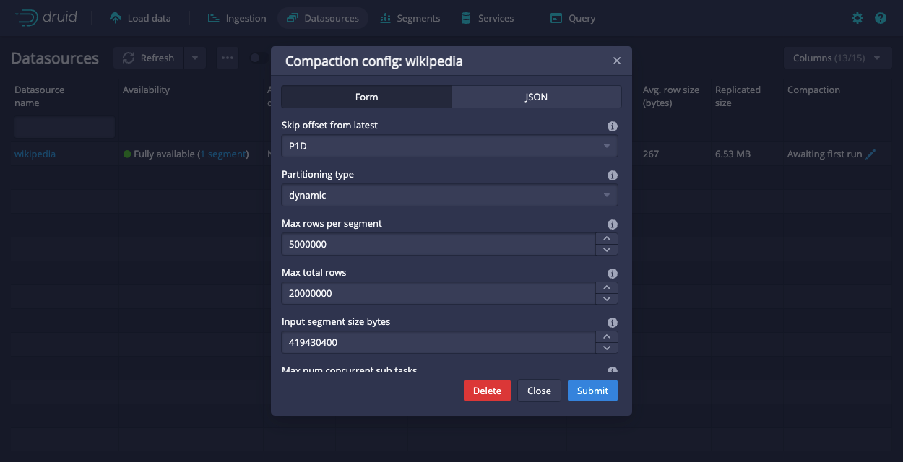

<!--
  ~ Licensed to the Apache Software Foundation (ASF) under one
  ~ or more contributor license agreements.  See the NOTICE file
  ~ distributed with this work for additional information
  ~ regarding copyright ownership.  The ASF licenses this file
  ~ to you under the Apache License, Version 2.0 (the
  ~ "License"); you may not use this file except in compliance
  ~ with the License.  You may obtain a copy of the License at
  ~
  ~   http://www.apache.org/licenses/LICENSE-2.0
  ~
  ~ Unless required by applicable law or agreed to in writing,
  ~ software distributed under the License is distributed on an
  ~ "AS IS" BASIS, WITHOUT WARRANTIES OR CONDITIONS OF ANY
  ~ KIND, either express or implied.  See the License for the
  ~ specific language governing permissions and limitations
  ~ under the License.
  -->

In Apache Druid, compaction is a special type of ingestion task that reads data from a Druid datasource and writes it back into the same datasource. A common use case for this is to [optimally size segments](../operations/segment-optimization.md) after ingestion to improve query performance. Automatic compaction, or auto-compaction, refers to the system for automatic execution of compaction tasks managed by the [Druid Coordinator](../design/coordinator.md).
This topic guides you through setting up automatic compaction for your Druid cluster. See the [examples](#examples) for common use cases for automatic compaction.

## How Druid manages automatic compaction

The Coordinator [indexing period](../configuration/index.md#coordinator-operation), `druid.coordinator.period.indexingPeriod`, controls the frequency of compaction tasks.
The default indexing period is 30 minutes, meaning that the Coordinator first checks for segments to compact at most 30 minutes from when auto-compaction is enabled.
This time period affects other Coordinator duties including merge and conversion tasks.
To configure the auto-compaction time period without interfering with `indexingPeriod`, see [Set frequency of compaction runs](#set-frequency-of-compaction-runs).

At every invocation of auto-compaction, the Coordinator initiates a [segment search](../design/coordinator.md#segment-search-policy-in-automatic-compaction) to determine eligible segments to compact.
When there are eligible segments to compact, the Coordinator issues compaction tasks based on available worker capacity.
If a compaction task takes longer than the indexing period, the Coordinator waits for it to finish before resuming the period for segment search.

:::info
 Auto-compaction skips datasources that have a segment granularity of `ALL`.
:::

As a best practice, you should set up auto-compaction for all Druid datasources. You can run compaction tasks manually for cases where you want to allocate more system resources. For example, you may choose to run multiple compaction tasks in parallel to compact an existing datasource for the first time. See [Compaction](compaction.md) for additional details and use cases.


## Enable automatic compaction

You can enable automatic compaction for a datasource using the web console or programmatically via an API.
This process differs for manual compaction tasks, which can be submitted from the [Tasks view of the web console](../operations/web-console.md) or the [Tasks API](../api-reference/tasks-api.md).

### Web console

Use the web console to enable automatic compaction for a datasource as follows.

1. Click **Datasources** in the top-level navigation.
2. In the **Compaction** column, click the edit icon for the datasource to compact.
3. In the **Compaction config** dialog, configure the auto-compaction settings. The dialog offers a form view as well as a JSON view. Editing the form updates the JSON specification, and editing the JSON updates the form field, if present. Form fields not present in the JSON indicate default values. You may add additional properties to the JSON for auto-compaction settings not displayed in the form. See [Configure automatic compaction](#configure-automatic-compaction) for supported settings for auto-compaction.
4. Click **Submit**.
5. Refresh the **Datasources** view. The **Compaction** column for the datasource changes from “Not enabled” to “Awaiting first run.”

The following screenshot shows the compaction config dialog for a datasource with auto-compaction enabled.


To disable auto-compaction for a datasource, click **Delete** from the **Compaction config** dialog. Druid does not retain your auto-compaction configuration.

### Compaction configuration API

Use the [Automatic compaction API](../api-reference/automatic-compaction-api.md#manage-automatic-compaction) to configure automatic compaction.
To enable auto-compaction for a datasource, create a JSON object with the desired auto-compaction settings.
See [Configure automatic compaction](#configure-automatic-compaction) for the syntax of an auto-compaction spec.
Send the JSON object as a payload in a [`POST` request](../api-reference/automatic-compaction-api.md#create-or-update-automatic-compaction-configuration) to `/druid/coordinator/v1/config/compaction`.
The following example configures auto-compaction for the `wikipedia` datasource:

```sh
curl --location --request POST 'http://localhost:8081/druid/coordinator/v1/config/compaction' \
--header 'Content-Type: application/json' \
--data-raw '{
    "dataSource": "wikipedia",
    "granularitySpec": {
        "segmentGranularity": "DAY"
    }
}'
```

To disable auto-compaction for a datasource, send a [`DELETE` request](../api-reference/automatic-compaction-api.md#remove-automatic-compaction-configuration) to `/druid/coordinator/v1/config/compaction/{dataSource}`. Replace `{dataSource}` with the name of the datasource for which to disable auto-compaction. For example:

```sh
curl --location --request DELETE 'http://localhost:8081/druid/coordinator/v1/config/compaction/wikipedia'
```

## Configure automatic compaction

You can configure automatic compaction dynamically without restarting Druid.
The automatic compaction system uses the following syntax:

```json
{
    "dataSource": <task_datasource>,
    "ioConfig": <IO config>,
    "dimensionsSpec": <custom dimensionsSpec>,
    "transformSpec": <custom transformSpec>,
    "metricsSpec": <custom metricsSpec>,
    "tuningConfig": <parallel indexing task tuningConfig>,
    "granularitySpec": <compaction task granularitySpec>,
    "skipOffsetFromLatest": <time period to avoid compaction>,
    "taskPriority": <compaction task priority>,
    "taskContext": <task context>
}
```

Most fields in the auto-compaction configuration correlate to a typical [Druid ingestion spec](../ingestion/ingestion-spec.md).
The following properties only apply to auto-compaction:
* `skipOffsetFromLatest`
* `taskPriority`
* `taskContext`

Since the automatic compaction system provides a management layer on top of manual compaction tasks,
the auto-compaction configuration does not include task-specific properties found in a typical Druid ingestion spec.
The following properties are automatically set by the Coordinator:
* `type`: Set to `compact`.
* `id`: Generated using the task type, datasource name, interval, and timestamp. The task ID is prefixed with `coordinator-issued`.
* `context`: Set according to the user-provided `taskContext`.

Compaction tasks typically fetch all [relevant segments](manual-compaction.md#compaction-io-configuration) prior to launching any subtasks,
_unless_ the following properties are all set to non-null values. It is strongly recommended to set them to non-null values to
maximize performance and minimize disk usage of the `compact` tasks launched by auto-compaction:

- [`granularitySpec`](manual-compaction.md#compaction-granularity-spec), with non-null values for each of `segmentGranularity`, `queryGranularity`, and `rollup`
- [`dimensionsSpec`](manual-compaction.md#compaction-dimensions-spec)
- `metricsSpec`

For more details on each of the specs in an auto-compaction configuration, see [Automatic compaction dynamic configuration](../configuration/index.md#automatic-compaction-dynamic-configuration).

### Set frequency of compaction runs

If you want the Coordinator to check for compaction more frequently than its indexing period, create a separate group to handle compaction duties.
Set the time period of the duty group in the `coordinator/runtime.properties` file.
The following example shows how to create a duty group named `compaction` and set the auto-compaction period to 1 minute:
```
druid.coordinator.dutyGroups=["compaction"]
druid.coordinator.compaction.duties=["compactSegments"]
druid.coordinator.compaction.period=PT60S
```

## Avoid conflicts with ingestion

Compaction tasks may be interrupted when they interfere with ingestion. For example, this occurs when an ingestion task needs to write data to a segment for a time interval locked for compaction. If there are continuous failures that prevent compaction from making progress, consider one of the following strategies:

* Enable [concurrent append and replace tasks](#enable-concurrent-append-and-replace) on your datasource and on the ingestion tasks.
* Set `skipOffsetFromLatest` to reduce the chance of conflicts between ingestion and compaction. See more details in [Skip compaction for latest segments](#skip-compaction-for-latest-segments).
* Increase the priority value of compaction tasks relative to ingestion tasks. Only recommended for advanced users. This approach can cause ingestion jobs to fail or lag. To change the priority of compaction tasks, set `taskPriority` to the desired priority value in the auto-compaction configuration. For details on the priority values of different task types, see [Lock priority](../ingestion/tasks.md#lock-priority).

### Enable concurrent append and replace

You can use concurrent append and replace to safely replace the existing data in an interval of a datasource while new data is being appended to that interval even during compaction.

To do this, you need to update your datasource to allow concurrent append and replace tasks:

* If you're using the API, include the following `taskContext` property in your API call: `"useConcurrentLocks": true`
* If you're using the UI, enable **Use concurrent locks (experimental)** in the **Compaction config** for your datasource.

You'll also need to update your ingestion jobs for the datasource to include the task context `"useConcurrentLocks": true`.

For information on how to do this, see [Concurrent append and replace](../ingestion/concurrent-append-replace.md).

### Skip compaction for latest segments

The Coordinator compacts segments from newest to oldest. In the auto-compaction configuration, you can set a time period, relative to the end time of the most recent segment, for segments that should not be compacted. Assign this value to `skipOffsetFromLatest`. Note that this offset is not relative to the current time but to the latest segment time. For example, if you want to skip over segments from five days prior to the end time of the most recent segment, assign `"skipOffsetFromLatest": "P5D"`.

To set `skipOffsetFromLatest`, consider how frequently you expect the stream to receive late arriving data. If your stream only occasionally receives late arriving data, the auto-compaction system robustly compacts your data even though data is ingested outside the `skipOffsetFromLatest` window. For most realtime streaming ingestion use cases, it is reasonable to set `skipOffsetFromLatest` to a few hours or a day.


## View automatic compaction statistics

After the Coordinator has initiated auto-compaction, you can view compaction statistics for the datasource, including the number of bytes, segments, and intervals already compacted and those awaiting compaction. The Coordinator also reports the total bytes, segments, and intervals not eligible for compaction in accordance with its [segment search policy](../design/coordinator.md#segment-search-policy-in-automatic-compaction).

In the web console, the Datasources view displays auto-compaction statistics. The Tasks view shows the task information for compaction tasks that were triggered by the automatic compaction system.

To get statistics by API, send a [`GET` request](../api-reference/automatic-compaction-api.md#view-automatic-compaction-status) to `/druid/coordinator/v1/compaction/status`. To filter the results to a particular datasource, pass the datasource name as a query parameter to the request—for example, `/druid/coordinator/v1/compaction/status?dataSource=wikipedia`.

## Examples

The following examples demonstrate potential use cases in which auto-compaction may improve your Druid performance. See more details in [Compaction strategies](../data-management/compaction.md#compaction-guidelines). The examples in this section do not change the underlying data.

### Change segment granularity

You have a stream set up to ingest data with `HOUR` segment granularity into the `wikistream` datasource. You notice that your Druid segments are smaller than the [recommended segment size](../operations/segment-optimization.md) of 5 million rows per segment. You wish to automatically compact segments to `DAY` granularity while leaving the latest week of data _not_ compacted because your stream consistently receives data within that time period.

The following auto-compaction configuration compacts existing `HOUR` segments into `DAY` segments while leaving the latest week of data not compacted:

```json
{
  "dataSource": "wikistream",
  "granularitySpec": {
    "segmentGranularity": "DAY"
  },
  "skipOffsetFromLatest": "P1W",
}
```

### Update partitioning scheme

For your `wikipedia` datasource, you want to optimize segment access when regularly ingesting data without compromising compute time when querying the data. Your ingestion spec for batch append uses [dynamic partitioning](../ingestion/native-batch.md#dynamic-partitioning) to optimize for write-time operations, while your stream ingestion partitioning is configured by the stream service. You want to implement auto-compaction to reorganize the data with a suitable read-time partitioning using [multi-dimension range partitioning](../ingestion/native-batch.md#multi-dimension-range-partitioning). Based on the dimensions frequently accessed in queries, you wish to partition on the following dimensions: `channel`, `countryName`, `namespace`.

The following auto-compaction configuration compacts updates the `wikipedia` segments to use multi-dimension range partitioning:

```json
{
  "dataSource": "wikipedia",
  "tuningConfig": {
    "partitionsSpec": {
      "type": "range",
      "partitionDimensions": [
        "channel",
        "countryName",
        "namespace"
      ],
      "targetRowsPerSegment": 5000000
    }
  }
}
```

## Learn more

See the following topics for more information:
* [Compaction](compaction.md) for an overview of compaction in Druid.
* [Manual compaction](manual-compaction.md) for how to manually perform compaction tasks.
* [Segment optimization](../operations/segment-optimization.md) for guidance on evaluating and optimizing Druid segment size.
* [Coordinator process](../design/coordinator.md#automatic-compaction) for details on how the Coordinator plans compaction tasks.

