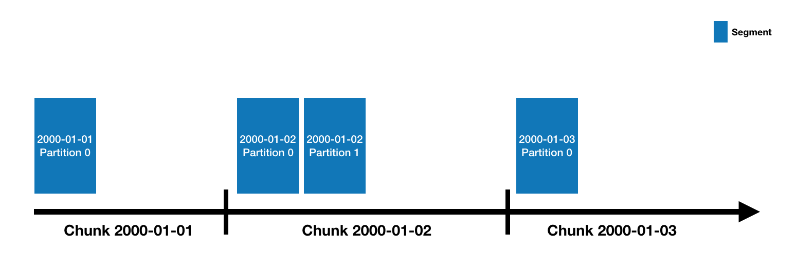

<!--
  ~ Licensed to the Apache Software Foundation (ASF) under one
  ~ or more contributor license agreements.  See the NOTICE file
  ~ distributed with this work for additional information
  ~ regarding copyright ownership.  The ASF licenses this file
  ~ to you under the Apache License, Version 2.0 (the
  ~ "License"); you may not use this file except in compliance
  ~ with the License.  You may obtain a copy of the License at
  ~
  ~   http://www.apache.org/licenses/LICENSE-2.0
  ~
  ~ Unless required by applicable law or agreed to in writing,
  ~ software distributed under the License is distributed on an
  ~ "AS IS" BASIS, WITHOUT WARRANTIES OR CONDITIONS OF ANY
  ~ KIND, either express or implied.  See the License for the
  ~ specific language governing permissions and limitations
  ~ under the License.
  -->


Druid has a multi-process, distributed architecture that is designed to be cloud-friendly and easy to operate. Each
Druid process type can be configured and scaled independently, giving you maximum flexibility over your cluster. This
design also provides enhanced fault tolerance: an outage of one component will not immediately affect other components.

## Processes and Servers

Druid has several process types, briefly described below:

* [**Coordinator**](../design/coordinator.md) processes manage data availability on the cluster.
* [**Overlord**](../design/overlord.md) processes control the assignment of data ingestion workloads.
* [**Broker**](../design/broker.md) processes handle queries from external clients.
* [**Router**](../design/router.md) processes are optional processes that can route requests to Brokers, Coordinators, and Overlords.
* [**Historical**](../design/historical.md) processes store queryable data.
* [**MiddleManager**](../design/middlemanager.md) processes are responsible for ingesting data.

Druid processes can be deployed any way you like, but for ease of deployment we suggest organizing them into three server types: Master, Query, and Data.

* **Master**: Runs Coordinator and Overlord processes, manages data availability and ingestion.
* **Query**: Runs Broker and optional Router processes, handles queries from external clients.
* **Data**: Runs Historical and MiddleManager processes, executes ingestion workloads and stores all queryable data.

For more details on process and server organization, please see [Druid Processes and Servers](../design/processes.md).

## External dependencies

In addition to its built-in process types, Druid also has three external dependencies. These are intended to be able to
leverage existing infrastructure, where present.

### Deep storage
Shared file storage accessible by every Druid server. In a clustered deployment, this is typically going to
be a distributed object store like S3 or HDFS, or a network mounted filesystem. In a single-server deployment,
this is typically going to be local disk. Druid uses deep storage to store any data that has been ingested into the
system.

Druid uses deep storage only as a backup of your data and as a way to transfer data in the background between
Druid processes. To respond to queries, Historical processes do not read from deep storage, but instead read prefetched
segments from their local disks before any queries are served. This means that Druid never needs to access deep storage
during a query, helping it offer the best query latencies possible. It also means that you must have enough disk space
both in deep storage and across your Historical processes for the data you plan to load.

Deep storage is an important part of Druid's elastic, fault-tolerant design. Druid can bootstrap from deep storage even
if every single data server is lost and re-provisioned.

For more details, please see the [Deep storage](../dependencies/deep-storage.md) page.

### Metadata storage
The metadata storage holds various shared system metadata such as segment availability information and task information.
In a clustered deployment, this is typically going to be a traditional RDBMS like PostgreSQL or MySQL. In a single-server
deployment, it is typically going to be a locally-stored Apache Derby database.

For more details, please see the [Metadata storage](../dependencies/metadata-storage.md) page.

### ZooKeeper
Used for internal service discovery, coordination, and leader election.

For more details, please see the [ZooKeeper](../dependencies/zookeeper.md) page.

## Architecture diagram

The following diagram shows how queries and data flow through this architecture, using the suggested Master/Query/Data server organization:


## Storage design

### Datasources and segments

Druid data is stored in "datasources", which are similar to tables in a traditional RDBMS. Each datasource is
partitioned by time and, optionally, further partitioned by other attributes. Each time range is called a "chunk" (for
example, a single day, if your datasource is partitioned by day). Within a chunk, data is partitioned into one or more
["segments"](../design/segments.md). Each segment is a single file, typically comprising up to a few million rows of data. Since segments are
organized into time chunks, it's sometimes helpful to think of segments as living on a timeline like the following:



A datasource may have anywhere from just a few segments, up to hundreds of thousands and even millions of segments. Each
segment starts life off being created on a MiddleManager, and at that point, is mutable and uncommitted. The segment
building process includes the following steps, designed to produce a data file that is compact and supports fast
queries:

- Conversion to columnar format
- Indexing with bitmap indexes
- Compression using various algorithms
    - Dictionary encoding with id storage minimization for String columns
    - Bitmap compression for bitmap indexes
    - Type-aware compression for all columns

Periodically, segments are committed and published. At this point, they are written to [deep storage](#deep-storage),
become immutable, and move from MiddleManagers to the Historical processes. An entry about the segment is also written
to the [metadata store](#metadata-storage). This entry is a self-describing bit of metadata about the segment, including
things like the schema of the segment, its size, and its location on deep storage. These entries are what the
Coordinator uses to know what data *should* be available on the cluster.

For details on the segment file format, please see [segment files](segments.html).

For details on modeling your data in Druid, see [schema design](../ingestion/schema-design.md).

### Indexing and handoff

_Indexing_ is the mechanism by which new segments are created, and _handoff_ is the mechanism by which they are published
and begin being served by Historical processes. The mechanism works like this on the indexing side:

1. An _indexing task_ starts running and building a new segment. It must determine the identifier of the segment before
it starts building it. For a task that is appending (like a Kafka task, or an index task in append mode) this will be
done by calling an "allocate" API on the Overlord to potentially add a new partition to an existing set of segments. For
a task that is overwriting (like a Hadoop task, or an index task _not_ in append mode) this is done by locking an
interval and creating a new version number and new set of segments.
2. If the indexing task is a realtime task (like a Kafka task) then the segment is immediately queryable at this point.
It's available, but unpublished.
3. When the indexing task has finished reading data for the segment, it pushes it to deep storage and then publishes it
by writing a record into the metadata store.
4. If the indexing task is a realtime task, at this point it waits for a Historical process to load the segment. If the
indexing task is not a realtime task, it exits immediately.

And like this on the Coordinator / Historical side:

1. The Coordinator polls the metadata store periodically (by default, every 1 minute) for newly published segments.
2. When the Coordinator finds a segment that is published and used, but unavailable, it chooses a Historical process
to load that segment and instructs that Historical to do so.
3. The Historical loads the segment and begins serving it.
4. At this point, if the indexing task was waiting for handoff, it will exit.

### Segment identifiers

Segments all have a four-part identifier with the following components:

- Datasource name.
- Time interval (for the time chunk containing the segment; this corresponds to the `segmentGranularity` specified
at ingestion time).
- Version number (generally an ISO8601 timestamp corresponding to when the segment set was first started).
- Partition number (an integer, unique within a datasource+interval+version; may not necessarily be contiguous).

For example, this is the identifier for a segment in datasource `clarity-cloud0`, time chunk
`2018-05-21T16:00:00.000Z/2018-05-21T17:00:00.000Z`, version `2018-05-21T15:56:09.909Z`, and partition number 1:

```
clarity-cloud0_2018-05-21T16:00:00.000Z_2018-05-21T17:00:00.000Z_2018-05-21T15:56:09.909Z_1
```

Segments with partition number 0 (the first partition in a chunk) omit the partition number, like the following
example, which is a segment in the same time chunk as the previous one, but with partition number 0 instead of 1:

```
clarity-cloud0_2018-05-21T16:00:00.000Z_2018-05-21T17:00:00.000Z_2018-05-21T15:56:09.909Z
```

### Segment versioning

You may be wondering what the "version number" described in the previous section is for. Or, you might not be, in which
case good for you and you can skip this section!

It's there to support batch-mode overwriting. In Druid, if all you ever do is append data, then there will be just a
single version for each time chunk. But when you overwrite data, what happens behind the scenes is that a new set of
segments is created with the same datasource, same time interval, but a higher version number. This is a signal to the
rest of the Druid system that the older version should be removed from the cluster, and the new version should replace
it.

The switch appears to happen instantaneously to a user, because Druid handles this by first loading the new data (but
not allowing it to be queried), and then, as soon as the new data is all loaded, switching all new queries to use those
new segments. Then it drops the old segments a few minutes later.

### Segment lifecycle

Each segment has a lifecycle that involves the following three major areas:

1. **Metadata store:** Segment metadata (a small JSON payload generally no more than a few KB) is stored in the
[metadata store](../dependencies/metadata-storage.md) once a segment is done being constructed. The act of inserting
a record for a segment into the metadata store is called _publishing_. These metadata records have a boolean flag
named `used`, which controls whether the segment is intended to be queryable or not. Segments created by realtime tasks will be
available before they are published, since they are only published when the segment is complete and will not accept
any additional rows of data.
2. **Deep storage:** Segment data files are pushed to deep storage once a segment is done being constructed. This
happens immediately before publishing metadata to the metadata store.
3. **Availability for querying:** Segments are available for querying on some Druid data server, like a realtime task
or a Historical process.

You can inspect the state of currently active segments using the Druid SQL
[`sys.segments` table](../querying/sql.md#segments-table). It includes the following flags:

- `is_published`: True if segment metadata has been published to the metadata stored and `used` is true.
- `is_available`: True if the segment is currently available for querying, either on a realtime task or Historical
process.
- `is_realtime`: True if the segment is _only_ available on realtime tasks. For datasources that use realtime ingestion,
this will generally start off `true` and then become `false` as the segment is published and handed off.
- `is_overshadowed`: True if the segment is published (with `used` set to true) and is fully overshadowed by some other
published segments. Generally this is a transient state, and segments in this state will soon have their `used` flag
automatically set to false.

## Query processing

Queries first enter the [Broker](../design/broker.md), where the Broker will identify which segments have data that may pertain to that query.
The list of segments is always pruned by time, and may also be pruned by other attributes depending on how your
datasource is partitioned. The Broker will then identify which [Historicals](../design/historical.md) and
[MiddleManagers](../design/middlemanager.md) are serving those segments and send a rewritten subquery to each of those processes. The Historical/MiddleManager processes will take in the
queries, process them and return results. The Broker receives results and merges them together to get the final answer,
which it returns to the original caller.

Broker pruning is an important way that Druid limits the amount of data that must be scanned for each query, but it is
not the only way. For filters at a more granular level than what the Broker can use for pruning, indexing structures
inside each segment allow Druid to figure out which (if any) rows match the filter set before looking at any row of
data. Once Druid knows which rows match a particular query, it only accesses the specific columns it needs for that
query. Within those columns, Druid can skip from row to row, avoiding reading data that doesn't match the query filter.

So Druid uses three different techniques to maximize query performance:

- Pruning which segments are accessed for each query.
- Within each segment, using indexes to identify which rows must be accessed.
- Within each segment, only reading the specific rows and columns that are relevant to a particular query.
