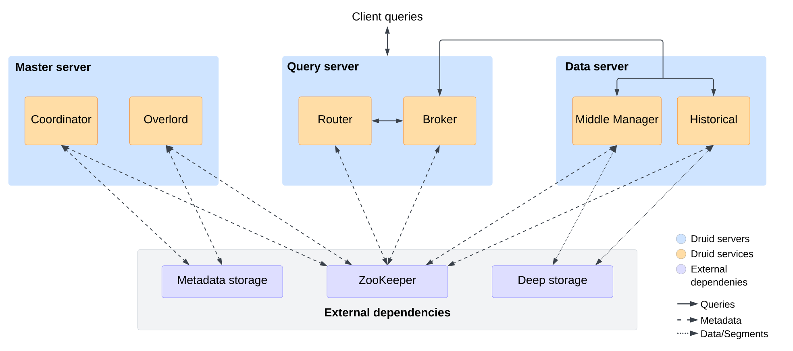

<!--
  ~ Licensed to the Apache Software Foundation (ASF) under one
  ~ or more contributor license agreements.  See the NOTICE file
  ~ distributed with this work for additional information
  ~ regarding copyright ownership.  The ASF licenses this file
  ~ to you under the Apache License, Version 2.0 (the
  ~ "License"); you may not use this file except in compliance
  ~ with the License.  You may obtain a copy of the License at
  ~
  ~   http://www.apache.org/licenses/LICENSE-2.0
  ~
  ~ Unless required by applicable law or agreed to in writing,
  ~ software distributed under the License is distributed on an
  ~ "AS IS" BASIS, WITHOUT WARRANTIES OR CONDITIONS OF ANY
  ~ KIND, either express or implied.  See the License for the
  ~ specific language governing permissions and limitations
  ~ under the License.
  -->

Druid has a distributed architecture that is designed to be cloud-friendly and easy to operate. You can configure and scale services independently for maximum flexibility over cluster operations. This design includes enhanced fault tolerance: an outage of one component does not immediately affect other components.

The following diagram shows the services that make up the Druid architecture, their typical arrangement across servers, and how queries and data flow through this architecture.

The following sections describe the components of this architecture.

## Druid services

Druid has several types of services:

* [Coordinator](../design/coordinator.md) manages data availability on the cluster.
* [Overlord](../design/overlord.md) controls the assignment of data ingestion workloads.
* [Broker](../design/broker.md) handles queries from external clients.
* [Router](../design/router.md) routes requests to Brokers, Coordinators, and Overlords.
* [Historical](../design/historical.md) stores queryable data.
* [MiddleManager](../design/middlemanager.md) and [Peon](../design/peons.md) ingest data.
* [Indexer](../design/indexer.md) serves an alternative to the MiddleManager + Peon task execution system.

You can view services in the **Services** tab in the web console: 

## Druid servers

You can deploy Druid services according to your preferences. For ease of deployment, we recommend organizing them into three server types: [Master](#master-server), [Query](#query-server), and [Data](#data-server).

### Master server

A Master server manages data ingestion and availability. It is responsible for starting new ingestion jobs and coordinating availability of data on the [Data server](#data-server).

Master servers divide operations between Coordinator and Overlord services.

#### Coordinator service

[Coordinator](../design/coordinator.md) services watch over the Historical services on the Data servers. They are responsible for assigning segments to specific servers, and for ensuring segments are well-balanced across Historicals.

#### Overlord service

[Overlord](../design/overlord.md) services watch over the MiddleManager services on the Data servers and are the controllers of data ingestion into Druid. They are responsible for assigning ingestion tasks to MiddleManagers and for coordinating segment publishing.

### Query server

A Query server provides the endpoints that users and client applications interact with, routing queries to Data servers or other Query servers (and optionally proxied Master server requests).

Query servers divide operations between Broker and Router services.

#### Broker service

[Broker](../design/broker.md) services receive queries from external clients and forward those queries to Data servers. When Brokers receive results from those subqueries, they merge those results and return them to the caller. Typically, you query Brokers rather than querying Historical or MiddleManager services on Data servers directly.

#### Router service

[**Router**](../design/router.md) services provide a unified API gateway in front of Brokers, Overlords, and Coordinators.

The Router service also runs the [web console](../operations/web-console.md), a UI for loading data, managing datasources and tasks, and viewing server status and segment information.

### Data server

A Data server executes ingestion jobs and stores queryable data.

Data servers divide operations between Historical and MiddleManager services.

#### Historical service

[**Historical**](../design/historical.md) services handle storage and querying on historical data, including any streaming data that has been in the system long enough to be committed. Historical services download segments from deep storage and respond to queries about these segments. They don't accept writes.

#### MiddleManager service

[**MiddleManager**](../design/middlemanager.md) services handle ingestion of new data into the cluster. They are responsible
for reading from external data sources and publishing new Druid segments.

##### Peon service

[**Peon**](../design/peons.md) services are task execution engines spawned by MiddleManagers. Each Peon runs a separate JVM and is responsible for executing a single task. Peons always run on the same host as the MiddleManager that spawned them.

#### Indexer service (optional)

[**Indexer**](../design/indexer.md) services are an alternative to MiddleManagers and Peons. Instead of
forking separate JVM processes per-task, the Indexer runs tasks as individual threads within a single JVM process.

The Indexer is designed to be easier to configure and deploy compared to the MiddleManager + Peon system and to better enable resource sharing across tasks. The Indexer is a newer feature and is currently designated [experimental](../development/experimental.md) due to the fact that its memory management system is still under
development. It will continue to mature in future versions of Druid.

Typically, you would deploy either MiddleManagers or Indexers, but not both.

## Colocation of services

Colocating Druid services by server type generally results in better utilization of hardware resources for most clusters.
For very large scale clusters, it can be desirable to split the Druid services such that they run on individual servers to avoid resource contention.

This section describes guidelines and configuration parameters related to service colocation.

### Coordinators and Overlords

The workload on the Coordinator service tends to increase with the number of segments in the cluster. The Overlord's workload also increases based on the number of segments in the cluster, but to a lesser degree than the Coordinator.

In clusters with very high segment counts, it can make sense to separate the Coordinator and Overlord services to provide more resources for the Coordinator's segment balancing workload.

You can run the Coordinator and Overlord services as a single combined service by setting the `druid.coordinator.asOverlord.enabled` property.
For more information, see [Coordinator Operation](../configuration/index.md#coordinator-operation).

### Historicals and MiddleManagers

With higher levels of ingestion or query load, it can make sense to deploy the Historical and MiddleManager services on separate hosts to to avoid CPU and memory contention.

The Historical service also benefits from having free memory for memory mapped segments, which can be another reason to deploy the Historical and MiddleManager services separately.

## External dependencies

In addition to its built-in service types, Druid also has three external dependencies. These are intended to be able to
leverage existing infrastructure, where present.

### Deep storage

Druid uses deep storage to store any data that has been ingested into the system. Deep storage is shared file
storage accessible by every Druid server. In a clustered deployment, this is typically a distributed object store like S3 or
HDFS, or a network mounted filesystem. In a single-server deployment, this is typically local disk.

Druid uses deep storage for the following purposes:

- To store all the data you ingest. Segments that get loaded onto Historical services for low latency queries are also kept in deep storage for backup purposes. Additionally, segments that are only in deep storage can be used for [queries from deep storage](../querying/query-from-deep-storage.md).
- As a way to transfer data in the background between Druid services. Druid stores data in files called _segments_.

Historical services cache data segments on local disk and serve queries from that cache as well as from an in-memory cache.
Segments on disk for Historical services provide the low latency querying performance Druid is known for.

You can also query directly from deep storage. When you query segments that exist only in deep storage, you trade some performance  for the ability to query more of your data without necessarily having to scale your Historical services.

When determining sizing for your storage, keep the following in mind:

- Deep storage needs to be able to hold all the data that you ingest into Druid.
- On disk storage for Historical services need to be able to accommodate the data you want to load onto them to run queries. The data on Historical services should be data you access frequently and need to run low latency queries for. 

Deep storage is an important part of Druid's elastic, fault-tolerant design. Druid bootstraps from deep storage even
if every single data server is lost and re-provisioned.

For more details, please see the [Deep storage](../design/deep-storage.md) page.

### Metadata storage

The metadata storage holds various shared system metadata such as segment usage information and task information. In a
clustered deployment, this is typically a traditional RDBMS like PostgreSQL or MySQL. In a single-server
deployment, it is typically a locally-stored Apache Derby database.

For more details, please see the [Metadata storage](../design/metadata-storage.md) page.

### ZooKeeper

Used for internal service discovery, coordination, and leader election.

For more details, please see the [ZooKeeper](zookeeper.md) page.

## Learn more

See the following topics for more information:

* [Storage components](storage.md) to learn about data storage in Druid.
* [Segments](segments.md) to learn about segment files.
* [Query processing](../querying/query-processing.md) for a high-level overview of how Druid processes queries.