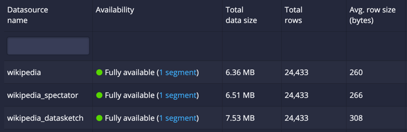

<!--
  ~ Licensed to the Apache Software Foundation (ASF) under one
  ~ or more contributor license agreements.  See the NOTICE file
  ~ distributed with this work for additional information
  ~ regarding copyright ownership.  The ASF licenses this file
  ~ to you under the Apache License, Version 2.0 (the
  ~ "License"); you may not use this file except in compliance
  ~ with the License.  You may obtain a copy of the License at
  ~
  ~   http://www.apache.org/licenses/LICENSE-2.0
  ~
  ~ Unless required by applicable law or agreed to in writing,
  ~ software distributed under the License is distributed on an
  ~ "AS IS" BASIS, WITHOUT WARRANTIES OR CONDITIONS OF ANY
  ~ KIND, either express or implied.  See the License for the
  ~ specific language governing permissions and limitations
  ~ under the License.
  -->

## Summary
This module provides Apache Druid approximate histogram aggregators and percentile
post-aggregators based on Spectator fixed-bucket histograms.

Consider SpectatorHistogram to compute percentile approximations. This extension has a reduced storage footprint compared to the [DataSketches extension](../extensions-core/datasketches-extension.md), which results in smaller segment sizes, faster loading from deep storage, and lower memory usage. This extension provides fast and accurate queries on large datasets at low storage cost.

This aggregator only applies when your raw data contains positive long integer values. Do not use this aggregator if you have negative values in your data.

In the Druid instance shown below, the example Wikipedia dataset is loaded 3 times.
* `wikipedia` contains the dataset ingested as is, without rollup
* `wikipedia_spectator` contains the dataset with a single extra metric column of type `spectatorHistogram` for the `added` column
* `wikipedia_datasketch` contains the dataset with a single extra metric column of type `quantilesDoublesSketch` for the `added` column

Spectator histograms average just 6 extra bytes per row, while the `quantilesDoublesSketch`
adds 48 bytes per row. This represents an eightfold reduction in additional storage size for spectator histograms.



As rollup improves, so does the size savings. For example, when you ingest the Wikipedia dataset
with day-grain query granularity and remove all dimensions except `countryName`,
this results in a segment that has just 106 rows. The base segment has 87 bytes per row.
Compare the following bytes per row for SpectatorHistogram versus DataSketches:
* An additional `spectatorHistogram` column adds 27 bytes per row on average.
* An additional `quantilesDoublesSketch` column adds 255 bytes per row.

SpectatorHistogram reduces the additional storage size by 9.4 times in this example.
Storage gains will differ per dataset depending on the variance and rollup of the data.

## Background
[Spectator](https://netflix.github.io/atlas-docs/spectator/) is a simple library
for instrumenting code to record dimensional time series data.
It was built, primarily, to work with [Atlas](https://netflix.github.io/atlas-docs/).
Atlas was developed by Netflix to manage dimensional time series data for near
real-time operational insight.

With the [Atlas-Druid](https://github.com/Netflix-Skunkworks/iep-apps/tree/main/atlas-druid)
service, it's possible to use the power of Atlas queries, backed by Druid as a
data store to benefit from high-dimensionality and high-cardinality data.

SpectatorHistogram is designed for efficient parallel aggregations while still
allowing for filtering and grouping by dimensions. 
It provides similar functionality to the built-in DataSketches `quantilesDoublesSketch` aggregator, but is
opinionated to maintain higher absolute accuracy at smaller values.
Larger values have lower absolute accuracy; however, relative accuracy is maintained across the range.
See [Bucket boundaries](#histogram-bucket-boundaries) for more information.
The SpectatorHistogram is optimized for typical measurements from cloud services and web apps,
such as page load time, transferred bytes, response time, and request latency.

Through some trade-offs SpectatorHistogram provides a significantly more compact
representation with the same aggregation performance and accuracy as
DataSketches Quantiles Sketch. Note that results depend on the dataset.
Also see the [limitations](#limitations] of this extension.

## Limitations
* Supports positive long integer values within the range of [0, 2^53). Negatives are
coerced to 0.
* Does not support decimals.
* Does not support Druid SQL queries, only native queries.
* Does not support vectorized queries.
* Generates 276 fixed buckets with increasing bucket widths. In practice, the observed error of computed percentiles ranges from 0.1% to 3%, exclusive. See [Bucket boundaries](#histogram-bucket-boundaries) for the full list of bucket boundaries.

:::tip
If these limitations don't work for your use case, then use [DataSketches](../extensions-core/datasketches-extension.md) instead.
:::

## Functionality
The SpectatorHistogram aggregator can generate histograms from raw numeric
values as well as aggregating or combining pre-aggregated histograms generated using
the SpectatorHistogram aggregator itself.
While you can generate histograms on the fly at query time, it is generally more
performant to generate histograms during ingestion and then combine them at
query time. This is especially true where rollup is enabled. It may be misleading or 
incorrect to generate histograms from already rolled-up summed data.

The module provides postAggregators, `percentileSpectatorHistogram` (singular) and
`percentilesSpectatorHistogram` (plural), to compute approximate 
percentiles from histograms generated by the SpectatorHistogram aggregator.
Again, these postAggregators can be used to compute percentiles from raw numeric
values via the SpectatorHistogram aggregator or from pre-aggregated histograms.

> If you're only using the aggregator to compute percentiles from raw numeric values,
then you can use the built-in quantilesDoublesSketch aggregator instead. The performance
and accuracy are comparable. However, the DataSketches aggregator supports negative values,
and you don't need to download an additional extension.
 
An aggregated SpectatorHistogram can also be queried using a `longSum` or `doubleSum`
aggregator to retrieve the population of the histogram. This is effectively the count
of the number of values that were aggregated into the histogram. This flexibility can
avoid the need to maintain a separate metric for the count of values.

For high-frequency measurements, you may need to pre-aggregate data at the client prior
to sending into Druid. For example, if you're measuring individual image render times
on an image-heavy website, you may want to aggregate the render times for a page-view
into a single histogram prior to sending to Druid in real-time. This can reduce the
amount of data that's needed to send from the client across the wire.

SpectatorHistogram supports ingesting pre-aggregated histograms in real-time and batch.
They can be sent as a JSON map, keyed by the spectator bucket ID and the value is the
count of values. This is the same format as the serialized JSON representation of the
histogram. The keys need not be ordered or contiguous. For example:

```json
{ "4":  8, "5": 15, "6": 37, "7": 9, "8": 3, "10": 1, "13": 1 }
```

## Loading the extension
To use SpectatorHistogram, make sure you [include](../../configuration/extensions.md#loading-extensions) the extension in your config file:

```
druid.extensions.loadList=["druid-spectator-histogram"]
```

## Aggregators

The result of the aggregation is a histogram that is built by ingesting numeric values from
the raw data, or from combining pre-aggregated histograms. The result is represented in 
JSON format where the keys are the bucket index and the values are the count of entries
in that bucket.

The buckets are defined as per the Spectator [PercentileBuckets](https://github.com/Netflix/spectator/blob/main/spectator-api/src/main/java/com/netflix/spectator/api/histogram/PercentileBuckets.java) specification.
See [Histogram bucket boundaries](#histogram-bucket-boundaries) for the full list of bucket boundaries.
```js
  // The set of buckets is generated by using powers of 4 and incrementing by one-third of the
  // previous power of 4 in between as long as the value is less than the next power of 4 minus
  // the delta.
  //
  // Base: 1, 2, 3
  //
  // 4 (4^1), delta = 1 (~1/3 of 4)
  //     5, 6, 7, ..., 14,
  //
  // 16 (4^2), delta = 5 (~1/3 of 16)
  //    21, 26, 31, ..., 56,
  //
  // 64 (4^3), delta = 21 (~1/3 of 64)
  // ...
```

There are multiple aggregator types included, all of which are based on the same
underlying implementation. If you use the Atlas-Druid service, the different types
signal the service on how to handle the resulting data from a query.

* spectatorHistogramTimer signals that the histogram is representing
a collection of timer values. It is recommended to normalize timer values to nanoseconds
at, or prior to, ingestion. If queried via the Atlas-Druid service, it will
normalize timers to second resolution at query time as a more natural unit of time
for human consumption.
* spectatorHistogram and spectatorHistogramDistribution are generic histograms that
can be used to represent any measured value without units. No normalization is
required or performed.

### `spectatorHistogram` aggregator
Alias: `spectatorHistogramDistribution`, `spectatorHistogramTimer`

To aggregate at query time:
```
{
  "type" : "spectatorHistogram",
  "name" : <output_name>,
  "fieldName" : <column_name>
 }
```

| Property  | Description                                                                                                  | Required? |
|-----------|--------------------------------------------------------------------------------------------------------------|-----------|
| type      | This String must be one of "spectatorHistogram", "spectatorHistogramTimer", "spectatorHistogramDistribution" | yes       |
| name      | A String for the output (result) name of the aggregation.                                                    | yes       |
| fieldName | A String for the name of the input field containing raw numeric values or pre-aggregated histograms.         | yes       |

### `longSum`, `doubleSum` and `floatSum` aggregators
To get the population size (count of events contributing to the histogram):
```
{
  "type" : "longSum",
  "name" : <output_name>,
  "fieldName" : <column_name_of_aggregated_histogram>
 }
```

| Property  | Description                                                                    | Required? |
|-----------|--------------------------------------------------------------------------------|-----------|
| type      | Must be "longSum", "doubleSum", or "floatSum".                                 | yes       |
| name      | A String for the output (result) name of the aggregation.                      | yes       |
| fieldName | A String for the name of the input field containing pre-aggregated histograms. | yes       |

## Post Aggregators

### Percentile (singular)
This returns a single percentile calculation based on the distribution of the values in the aggregated histogram.

```
{
  "type": "percentileSpectatorHistogram",
  "name": <output name>,
  "field": {
    "type": "fieldAccess",
    "fieldName": <name of aggregated SpectatorHistogram>
  },
  "percentile": <decimal percentile, e.g. 50.0 for median>
}
```

| Property   | Description                                                 | Required? |
|------------|-------------------------------------------------------------|-----------|
| type       | This String should always be "percentileSpectatorHistogram" | yes       |
| name       | A String for the output (result) name of the calculation.   | yes       |
| field      | A field reference pointing to the aggregated histogram.     | yes       |
| percentile | A single decimal percentile between 0.0 and 100.0           | yes       |

### Percentiles (multiple)
This returns an array of percentiles corresponding to those requested.

```
{
  "type": "percentilesSpectatorHistogram",
  "name": <output name>,
  "field": {
    "type": "fieldAccess",
    "fieldName": <name of aggregated SpectatorHistogram>
  },
  "percentiles": [25, 50, 75, 99.5]
}
```

> It's more efficient to request multiple percentiles in a single query
than to request individual percentiles in separate queries. This array-based
helper is provided for convenience and has a marginal performance benefit over
using the singular percentile post-aggregator multiple times within a query.
The more expensive part of the query is the aggregation of the histogram.
The post-aggregation calculations all happen on the same aggregated histogram.

The results contain arrays matching the length and order of the requested
array of percentiles.

```
"percentilesAdded": [
    0.5504911679884643, // 25th percentile
    4.013975155279504,  // 50th percentile 
    78.89518317503394,  // 75th percentile
    8580.024999999994   // 99.5th percentile
]
```

| Property    | Description                                                  | Required? |
|-------------|--------------------------------------------------------------|-----------|
| type        | This String should always be "percentilesSpectatorHistogram" | yes       |
| name        | A String for the output (result) name of the calculation.    | yes       |
| field       | A field reference pointing to the aggregated histogram.      | yes       |
| percentiles | Non-empty array of decimal percentiles between 0.0 and 100.0 | yes       |

## Examples

### Example Ingestion Spec
Example of ingesting the sample Wikipedia dataset with a histogram metric column:
```json
{
  "type": "index_parallel",
  "spec": {
    "ioConfig": {
      "type": "index_parallel",
      "inputSource": {
        "type": "http",
        "uris": ["https://druid.apache.org/data/wikipedia.json.gz"]
      },
      "inputFormat": { "type": "json" }
    },
    "dataSchema": {
      "granularitySpec": {
        "segmentGranularity": "day",
        "queryGranularity": "minute",
        "rollup": true
      },
      "dataSource": "wikipedia",
      "timestampSpec": { "column": "timestamp", "format": "iso" },
      "dimensionsSpec": {
        "dimensions": [
          "isRobot",
          "channel",
          "flags",
          "isUnpatrolled",
          "page",
          "diffUrl",
          "comment",
          "isNew",
          "isMinor",
          "isAnonymous",
          "user",
          "namespace",
          "cityName",
          "countryName",
          "regionIsoCode",
          "metroCode",
          "countryIsoCode",
          "regionName"
        ]
      },
      "metricsSpec": [
        { "name": "count", "type": "count" },
        { "name": "sum_added", "type": "longSum", "fieldName": "added" },
        {
          "name": "hist_added",
          "type": "spectatorHistogram",
          "fieldName": "added"
        }
      ]
    },
    "tuningConfig": {
      "type": "index_parallel",
      "partitionsSpec": { "type": "hashed" },
      "forceGuaranteedRollup": true
    }
  }
}
```

### Example Query
Example query using the sample Wikipedia dataset:
```json
{
  "queryType": "timeseries",
  "dataSource": {
    "type": "table",
    "name": "wikipedia"
  },
  "intervals": {
    "type": "intervals",
    "intervals": [
      "0000-01-01/9999-12-31"
    ]
  },
  "granularity": {
    "type": "all"
  },
  "aggregations": [
    {
      "type": "spectatorHistogram",
      "name": "histogram_added",
      "fieldName": "added"
    }
  ],
  "postAggregations": [
    {
      "type": "percentileSpectatorHistogram",
      "name": "medianAdded",
      "field": {
        "type": "fieldAccess",
        "fieldName": "histogram_added"
      },
      "percentile": "50.0"
    }
  ]
}
```
Results in
```json
[
  {
    "result": {
      "histogram_added": {
        "0": 11096, "1": 632, "2": 297, "3": 187, "4": 322, "5": 161,
        "6": 174, "7": 127, "8": 125, "9": 162, "10": 123, "11": 106,
        "12": 95, "13": 104, "14": 95, "15": 588, "16": 540, "17": 690,
        "18": 719, "19": 478, "20": 288, "21": 250, "22": 219, "23": 224,
        "24": 737, "25": 424, "26": 343, "27": 266, "28": 232, "29": 217,
        "30": 171, "31": 164, "32": 161, "33": 530, "34": 339, "35": 236,
        "36": 181, "37": 152, "38": 113, "39": 128, "40": 80, "41": 75,
        "42": 289, "43": 145, "44": 138, "45": 83, "46": 45, "47": 46,
        "48": 64, "49": 65, "50": 71, "51": 421, "52": 525, "53": 59,
        "54": 31, "55": 35, "56": 8, "57": 10, "58": 5, "59": 4, "60": 11,
        "61": 10, "62": 5, "63": 2, "64": 2, "65": 1, "67": 1, "68": 1,
        "69": 1, "70": 1, "71": 1, "78": 2
      },
      "medianAdded": 4.013975155279504
    },
    "timestamp": "2016-06-27T00:00:00.000Z"
  }
]
```

## Histogram bucket boundaries
The following array lists the upper bounds of each bucket index. There are 276 buckets in total.
The first bucket index is 0 and the last bucket index is 275.
The bucket widths increase as the bucket index increases. This leads to a greater absolute error for larger values, but maintains a relative error of rough percentage across the number range.
For example, the maximum error at value 10 is zero since the bucket width is 1 (the difference of `11-10`). For a value of 16,000,000,000, the bucket width is 1,431,655,768 (from `17179869184-15748213416`). This gives an error of up to ~8.9%, from `1,431,655,768/16,000,000,000*100`. In practice, the observed error of computed percentiles is in the range of (0.1%, 3%).
```json
[
  1, 2, 3, 4, 5, 6, 7, 8, 9, 10, 11, 12, 13, 14, 16, 21, 26, 31, 36, 41, 46,
  51, 56, 64, 85, 106, 127, 148, 169, 190, 211, 232, 256, 341, 426, 511, 596,
  681, 766, 851, 936, 1024, 1365, 1706, 2047, 2388, 2729, 3070, 3411, 3752,
  4096, 5461, 6826, 8191, 9556, 10921, 12286, 13651, 15016, 16384, 21845,
  27306, 32767, 38228, 43689, 49150, 54611, 60072, 65536, 87381, 109226,
  131071, 152916, 174761, 196606, 218451, 240296, 262144, 349525, 436906,
  524287, 611668, 699049, 786430, 873811, 961192, 1048576, 1398101, 1747626,
  2097151, 2446676, 2796201, 3145726, 3495251, 3844776, 4194304, 5592405,
  6990506, 8388607, 9786708, 11184809, 12582910, 13981011, 15379112, 16777216,
  22369621, 27962026, 33554431, 39146836, 44739241, 50331646, 55924051,
  61516456, 67108864, 89478485, 111848106, 134217727, 156587348, 178956969,
  201326590, 223696211, 246065832, 268435456, 357913941, 447392426, 536870911,
  626349396, 715827881, 805306366, 894784851, 984263336, 1073741824, 1431655765,
  1789569706, 2147483647, 2505397588, 2863311529, 3221225470, 3579139411,
  3937053352, 4294967296, 5726623061, 7158278826, 8589934591, 10021590356,
  11453246121, 12884901886, 14316557651, 15748213416, 17179869184, 22906492245,
  28633115306, 34359738367, 40086361428, 45812984489, 51539607550, 57266230611,
  62992853672, 68719476736, 91625968981, 114532461226, 137438953471,
  160345445716, 183251937961, 206158430206, 229064922451, 251971414696,
  274877906944, 366503875925, 458129844906, 549755813887, 641381782868,
  733007751849, 824633720830, 916259689811, 1007885658792, 1099511627776,
  1466015503701, 1832519379626, 2199023255551, 2565527131476, 2932031007401,
  3298534883326, 3665038759251, 4031542635176, 4398046511104, 5864062014805,
  7330077518506, 8796093022207, 10262108525908, 11728124029609, 13194139533310,
  14660155037011, 16126170540712, 17592186044416, 23456248059221,
  29320310074026, 35184372088831, 41048434103636, 46912496118441,
  52776558133246, 58640620148051, 64504682162856, 70368744177664,
  93824992236885, 117281240296106, 140737488355327, 164193736414548,
  187649984473769, 211106232532990, 234562480592211, 258018728651432,
  281474976710656, 375299968947541, 469124961184426, 562949953421311,
  656774945658196, 750599937895081, 844424930131966, 938249922368851,
  1032074914605736, 1125899906842624, 1501199875790165, 1876499844737706,
  2251799813685247, 2627099782632788, 3002399751580329, 3377699720527870,
  3752999689475411, 4128299658422952, 4503599627370496, 6004799503160661,
  7505999378950826, 9007199254740991, 10508399130531156, 12009599006321321,
  13510798882111486, 15011998757901651, 16513198633691816, 18014398509481984,
  24019198012642645, 30023997515803306, 36028797018963967, 42033596522124628,
  48038396025285289, 54043195528445950, 60047995031606611, 66052794534767272,
  72057594037927936, 96076792050570581, 120095990063213226, 144115188075855871,
  168134386088498516, 192153584101141161, 216172782113783806, 240191980126426451,
  264211178139069096, 288230376151711744, 384307168202282325, 480383960252852906,
  576460752303423487, 672537544353994068, 768614336404564649, 864691128455135230,
  960767920505705811, 1056844712556276392, 1152921504606846976, 1537228672809129301,
  1921535841011411626, 2305843009213693951, 2690150177415976276, 3074457345618258601,
  3458764513820540926, 3843071682022823251, 4227378850225105576, 9223372036854775807
]
```
