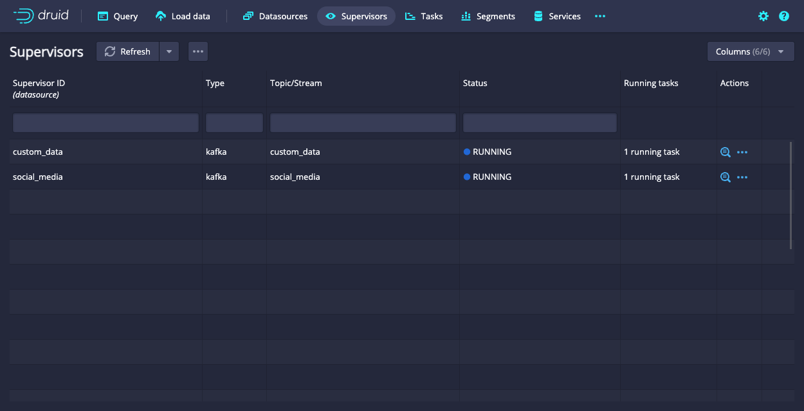
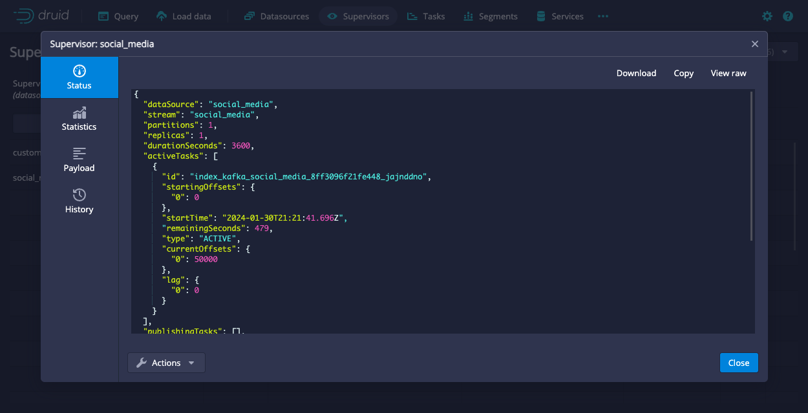

<!--
  ~ Licensed to the Apache Software Foundation (ASF) under one
  ~ or more contributor license agreements.  See the NOTICE file
  ~ distributed with this work for additional information
  ~ regarding copyright ownership.  The ASF licenses this file
  ~ to you under the Apache License, Version 2.0 (the
  ~ "License"); you may not use this file except in compliance
  ~ with the License.  You may obtain a copy of the License at
  ~
  ~   http://www.apache.org/licenses/LICENSE-2.0
  ~
  ~ Unless required by applicable law or agreed to in writing,
  ~ software distributed under the License is distributed on an
  ~ "AS IS" BASIS, WITHOUT WARRANTIES OR CONDITIONS OF ANY
  ~ KIND, either express or implied.  See the License for the
  ~ specific language governing permissions and limitations
  ~ under the License.
  -->

A supervisor manages streaming ingestion from external streaming sources into Apache Druid.
Supervisors oversee the state of indexing tasks to coordinate handoffs, manage failures, and ensure that the scalability and replication requirements are maintained.

## Supervisor spec

Druid uses a JSON specification, often referred to as the supervisor spec, to define streaming ingestion tasks.
The supervisor spec specifies how Druid should consume, process, and index streaming data.

The following table outlines the high-level configuration options for a supervisor spec:

|Property|Type|Description|Required|
|--------|----|-----------|--------|
|`type`|String|The supervisor type. One of `kafka`or `kinesis`.|Yes|
|`spec`|Object|The container object for the supervisor configuration.|Yes|
|`spec.dataSchema`|Object|The schema for the indexing task to use during ingestion. See [`dataSchema`](../ingestion/ingestion-spec.md#dataschema) for more information.|Yes|
|`spec.ioConfig`|Object|The I/O configuration object to define the connection and I/O-related settings for the supervisor and indexing tasks.|Yes|
|`spec.tuningConfig`|Object|The tuning configuration object to define performance-related settings for the supervisor and indexing tasks.|No|

### I/O configuration

The following table outlines the `ioConfig` configuration properties that apply to both Apache Kafka and Amazon Kinesis ingestion methods.
For configuration properties specific to Apache Kafka and Amazon Kinesis, see [Kafka I/O configuration](kafka-ingestion.md#io-configuration) and [Kinesis I/O configuration](kinesis-ingestion.md#io-configuration) respectively.

|Property|Type|Description|Required|Default|
|--------|----|-----------|--------|-------|
|`inputFormat`|Object|The [input format](../ingestion/data-formats.md#input-format) to define input data parsing.|Yes||
|`autoScalerConfig`|Object|Defines auto scaling behavior for ingestion tasks. See [Task autoscaler](#task-autoscaler) for more information.|No|null|
|`taskCount`|Integer|The maximum number of reading tasks in a replica set. Multiply `taskCount` and replicas to measure the maximum number of reading tasks. The total number of tasks, reading and publishing, is higher than the maximum number of reading tasks. See [Capacity planning](../ingestion/supervisor.md#capacity-planning) for more details. When `taskCount` is greater than the number of Kafka partitions or Kinesis shards, the actual number of reading tasks is less than the `taskCount` value.|No|1|
|`replicas`|Integer|The number of replica sets, where 1 is a single set of tasks (no replication). Druid always assigns replicate tasks to different workers to provide resiliency against process failure.|No|1|
|`taskDuration`|ISO 8601 period|The length of time before tasks stop reading and begin publishing segments.|No|`PT1H`|
|`startDelay`|ISO 8601 period|The period to wait before the supervisor starts managing tasks.|No|`PT5S`|
|`period`|ISO 8601 period|Determines how often the supervisor executes its management logic. Note that the supervisor also runs in response to certain events, such as tasks succeeding, failing, and reaching their task duration. The `period` value specifies the maximum time between iterations.|No|`PT30S`|
|`completionTimeout`|ISO 8601 period|The length of time to wait before declaring a publishing task as failed and terminating it. If the value is too low, tasks may never publish. The publishing clock for a task begins roughly after `taskDuration` elapses.|No|`PT30M`|
|`lateMessageRejectionStartDateTime`|ISO 8601 date time|Configures tasks to reject messages with timestamps earlier than this date time. For example, if this property is set to `2016-01-01T11:00Z` and the supervisor creates a task at `2016-01-01T12:00Z`, Druid drops messages with timestamps earlier than `2016-01-01T11:00Z`. This can prevent concurrency issues if your data stream has late messages and you have multiple pipelines that need to operate on the same segments, such as a realtime and a nightly batch ingestion pipeline.|No||
|`lateMessageRejectionPeriod`|ISO 8601 period|Configures tasks to reject messages with timestamps earlier than this period before the task was created. For example, if this property is set to `PT1H` and the supervisor creates a task at `2016-01-01T12:00Z`, Druid drops messages with timestamps earlier than `2016-01-01T11:00Z`. This may help prevent concurrency issues if your data stream has late messages and you have multiple pipelines that need to operate on the same segments, such as a streaming and a nightly batch ingestion pipeline. You can specify only one of the late message rejection properties.|No||
|`earlyMessageRejectionPeriod`|ISO 8601 period|Configures tasks to reject messages with timestamps later than this period after the task reached its task duration. For example, if this property is set to `PT1H`, the task duration is set to `PT1H` and the supervisor creates a task at `2016-01-01T12:00Z`, Druid drops messages with timestamps later than `2016-01-01T14:00Z`. Tasks sometimes run past their task duration, such as in cases of supervisor failover. Setting `earlyMessageRejectionPeriod` too low may cause Druid to drop messages unexpectedly whenever a task runs past its originally configured task duration.|No||

#### Task autoscaler

You can optionally configure autoscaling behavior for ingestion tasks using the `autoScalerConfig` property of the `ioConfig` object.

The following table outlines the configuration properties for `autoScalerConfig`:

|Property|Description|Required|Default|
|--------|-----------|--------|-------|
|`enableTaskAutoScaler`|Enables the autoscaler. If not specified, Druid disables the autoscaler even when `autoScalerConfig` is not null.|No|`false`|
|`taskCountMax`|The maximum number of ingestion tasks. Must be greater than or equal to `taskCountMin`. If `taskCountMax` is greater than the number of Kafka partitions or Kinesis shards, Druid set the maximum number of reading tasks to the number of Kafka partitions or Kinesis shards and ignores `taskCountMax`.|Yes||
|`taskCountMin`|The minimum number of ingestion tasks. When you enable the autoscaler, Druid ignores the value of `taskCount` in `ioConfig` and starts with the `taskCountMin` number of tasks to launch.|Yes||
|`minTriggerScaleActionFrequencyMillis`|The minimum time interval between two scale actions.| No|600000|
|`autoScalerStrategy`|The algorithm of autoscaler. Druid only supports the `lagBased` strategy. See [Autoscaler strategy](#autoscaler-strategy) for more information.|No|`lagBased`|

##### Autoscaler strategy

:::info
Unlike the Kafka indexing service, Kinesis reports lag metrics measured in time difference in milliseconds between the current sequence number and latest sequence number, rather than message count.
:::

The following table outlines the configuration properties related to the `lagBased` autoscaler strategy:

|Property|Description|Required|Default|
|--------|-----------|--------|-------|
|`lagCollectionIntervalMillis`|The time period during which Druid collects lag metric points.|No|30000|
|`lagCollectionRangeMillis`|The total time window of lag collection. Use with `lagCollectionIntervalMillis` to specify the intervals at which to collect lag metric points.|No|600000|
|`scaleOutThreshold`|The threshold of scale out action. |No|6000000|
|`triggerScaleOutFractionThreshold`|Enables scale out action if `triggerScaleOutFractionThreshold` percent of lag points is higher than `scaleOutThreshold`.|No|0.3|
|`scaleInThreshold`|The threshold of scale in action.|No|1000000|
|`triggerScaleInFractionThreshold`|Enables scale in action if `triggerScaleInFractionThreshold` percent of lag points is lower than `scaleOutThreshold`.|No|0.9|
|`scaleActionStartDelayMillis`|The number of milliseconds to delay after the supervisor starts before the first scale logic check.|No|300000|
|`scaleActionPeriodMillis`|The frequency in milliseconds to check if a scale action is triggered.|No|60000|
|`scaleInStep`|The number of tasks to reduce at once when scaling down.|No|1|
|`scaleOutStep`|The number of tasks to add at once when scaling out.|No|2|

The following example shows a supervisor spec with `lagBased` autoscaler:

<details>
  <summary>Click to view the example</summary>

```json
{
  "type": "kinesis",
  "dataSchema": {
    "dataSource": "metrics-kinesis",
    "timestampSpec": {
      "column": "timestamp",
      "format": "auto"
    },
    "dimensionsSpec": {
      "dimensions": [],
      "dimensionExclusions": [
        "timestamp",
        "value"
      ]
    },
    "metricsSpec": [
      {
        "name": "count",
        "type": "count"
      },
      {
        "name": "value_sum",
        "fieldName": "value",
        "type": "doubleSum"
      },
      {
        "name": "value_min",
        "fieldName": "value",
        "type": "doubleMin"
      },
      {
        "name": "value_max",
        "fieldName": "value",
        "type": "doubleMax"
      }
    ],
    "granularitySpec": {
      "type": "uniform",
      "segmentGranularity": "HOUR",
      "queryGranularity": "NONE"
    }
  },
  "ioConfig": {
    "stream": "metrics",
    "autoScalerConfig": {
      "enableTaskAutoScaler": true,
      "taskCountMax": 6,
      "taskCountMin": 2,
      "minTriggerScaleActionFrequencyMillis": 600000,
      "autoScalerStrategy": "lagBased",
      "lagCollectionIntervalMillis": 30000,
      "lagCollectionRangeMillis": 600000,
      "scaleOutThreshold": 600000,
      "triggerScaleOutFractionThreshold": 0.3,
      "scaleInThreshold": 100000,
      "triggerScaleInFractionThreshold": 0.9,
      "scaleActionStartDelayMillis": 300000,
      "scaleActionPeriodMillis": 60000,
      "scaleInStep": 1,
      "scaleOutStep": 2
    },
    "inputFormat": {
      "type": "json"
    },
    "endpoint": "kinesis.us-east-1.amazonaws.com",
    "taskCount": 1,
    "replicas": 1,
    "taskDuration": "PT1H"
  },
  "tuningConfig": {
    "type": "kinesis",
    "maxRowsPerSegment": 5000000
  }
}
```
</details>

### Tuning configuration

The `tuningConfig` object is optional. If you don't specify the `tuningConfig` object, Druid uses the default configuration settings.

The following table outlines the `tuningConfig` configuration properties that apply to both Apache Kafka and Amazon Kinesis ingestion methods.
For configuration properties specific to Apache Kafka and Amazon Kinesis, see [Kafka tuning configuration](kafka-ingestion.md#tuning-configuration) and [Kinesis tuning configuration](kinesis-ingestion.md#tuning-configuration) respectively.

|Property|Type|Description|Required|Default|
|--------|----|-----------|--------|-------|
|`type`|String|The tuning type code for the ingestion method. One of `kafka` or `kinesis`.|Yes||
|`maxRowsInMemory`|Integer|The number of rows to aggregate before persisting. This number represents the post-aggregation rows. It is not equivalent to the number of input events, but the resulting number of aggregated rows. Druid uses `maxRowsInMemory` to manage the required JVM heap size. The maximum heap memory usage for indexing scales is `maxRowsInMemory * (2 + maxPendingPersists)`. Normally, you do not need to set this, but depending on the nature of data, if rows are short in terms of bytes, you may not want to store a million rows in memory and this value should be set.|No|150000|
|`maxBytesInMemory`|Long|The number of bytes to aggregate in heap memory before persisting. This is based on a rough estimate of memory usage and not actual usage. Normally, this is computed internally. The maximum heap memory usage for indexing is `maxBytesInMemory * (2 + maxPendingPersists)`.|No|One-sixth of max JVM memory|
|`skipBytesInMemoryOverheadCheck`|Boolean|The calculation of `maxBytesInMemory` takes into account overhead objects created during ingestion and each intermediate persist. To exclude the bytes of these overhead objects from the `maxBytesInMemory` check, set `skipBytesInMemoryOverheadCheck` to `true`.|No|`false`|
|`maxRowsPerSegment`|Integer|The number of rows to store in a segment. This number is post-aggregation rows. Handoff occurs when `maxRowsPerSegment` or `maxTotalRows` is reached or every `intermediateHandoffPeriod`, whichever happens first.|No|5000000|
|`maxTotalRows`|Long|The number of rows to aggregate across all segments; this number is post-aggregation rows. Handoff happens either if `maxRowsPerSegment` or `maxTotalRows` is reached or every `intermediateHandoffPeriod`, whichever happens earlier.|No|20000000|
|`intermediateHandoffPeriod`|ISO 8601 period|The period that determines how often tasks hand off segments. Handoff occurs if `maxRowsPerSegment` or `maxTotalRows` is reached or every `intermediateHandoffPeriod`, whichever happens first.|No|`P2147483647D`|
|`intermediatePersistPeriod`|ISO 8601 period|The period that determines the rate at which intermediate persists occur.|No|`PT10M`|
|`maxPendingPersists`|Integer|Maximum number of persists that can be pending but not started. If a new intermediate persist exceeds this limit, Druid blocks ingestion until the currently running persist finishes. One persist can be running concurrently with ingestion, and none can be queued up. The maximum heap memory usage for indexing scales is `maxRowsInMemory * (2 + maxPendingPersists)`.|No|0|
|`indexSpec`|Object|Defines segment storage format options to use at indexing time. See [IndexSpec](../ingestion/ingestion-spec.md#indexspec) for more information.|No||
|`indexSpecForIntermediatePersists`|Object|Defines segment storage format options to use at indexing time for intermediate persisted temporary segments. You can use `indexSpecForIntermediatePersists` to disable dimension/metric compression on intermediate segments to reduce memory required for final merging. However, disabling compression on intermediate segments might increase page cache use while they are used before getting merged into final segment published.|No||
|`reportParseExceptions`|Boolean|DEPRECATED. If `true`, Druid throws exceptions encountered during parsing causing ingestion to halt. If `false`, Druid skips unparseable rows and fields. Setting `reportParseExceptions` to `true` overrides existing configurations for `maxParseExceptions` and `maxSavedParseExceptions`, setting `maxParseExceptions` to 0 and limiting `maxSavedParseExceptions` to not more than 1.|No|`false`|
|`handoffConditionTimeout`|Long|Number of milliseconds to wait for segment handoff. Set to a value >= 0, where 0 means to wait indefinitely.|No|900000 (15 minutes) for Kafka. 0 for Kinesis.|
|`resetOffsetAutomatically`|Boolean|Resets partitions when the sequence number is unavailable. If set to `true`, Druid resets partitions to the earliest or latest Kafka sequence number or Kinesis offset, based on the value of `useEarliestSequenceNumber` or `useEarliestOffset` (earliest if `true`, latest if `false`). If set to `false`, the exception bubbles up causing tasks to fail and ingestion to halt. If this occurs, manual intervention is required to correct the situation, potentially through [resetting the supervisor](../api-reference/supervisor-api.md#reset-a-supervisor).|No|`false`|
|`workerThreads`|Integer|The number of threads that the supervisor uses to handle requests/responses for worker tasks, along with any other internal asynchronous operation.|No|`min(10, taskCount)`|
|`chatRetries`|Integer|The number of times Druid retries HTTP requests to indexing tasks before considering tasks unresponsive.|No|8|
|`httpTimeout`|ISO 8601 period|The period of time to wait for a HTTP response from an indexing task.|No|`PT10S`|
|`shutdownTimeout`|ISO 8601 period|The period of time to wait for the supervisor to attempt a graceful shutdown of tasks before exiting.|No|`PT80S`|
|`offsetFetchPeriod`|ISO 8601 period|Determines how often the supervisor queries the streaming source and the indexing tasks to fetch current offsets and calculate lag. If the user-specified value is below the minimum value of `PT5S`, the supervisor ignores the value and uses the minimum value instead.|No|`PT30S`|
|`segmentWriteOutMediumFactory`|Object|The segment write-out medium to use when creating segments. See [Additional Peon configuration: SegmentWriteOutMediumFactory](../configuration/index.md#segmentwriteoutmediumfactory) for explanation and available options.|No|If not specified, Druid uses the value from `druid.peon.defaultSegmentWriteOutMediumFactory.type`.|
|`logParseExceptions`|Boolean|If `true`, Druid logs an error message when a parsing exception occurs, containing information about the row where the error occurred.|No|`false`|
|`maxParseExceptions`|Integer|The maximum number of parse exceptions that can occur before the task halts ingestion and fails. Overridden if `reportParseExceptions` is set.|No|unlimited|
|`maxSavedParseExceptions`|Integer|When a parse exception occurs, Druid keeps track of the most recent parse exceptions. `maxSavedParseExceptions` limits the number of saved exception instances. These saved exceptions are available after the task finishes in the [task completion report](../ingestion/tasks.md#task-reports). Overridden if `reportParseExceptions` is set.|No|0|

## Start a supervisor

Druid starts a new supervisor when you submit a supervisor spec.
You can submit the supervisor spec using the Druid console [data loader](../operations/web-console.md#data-loader) or by calling the [Supervisor API](../api-reference/supervisor-api.md).

The following screenshot shows the [Supervisors](../operations/web-console.md#supervisors) view of the Druid web console for a cluster with two supervisors:



Once started, the supervisor persists in the configured metadata database. There can only be one supervisor per datasource. Submitting a second supervisor spec for the same datasource overwrites the previous one.

When an Overlord gains leadership, either by being started or as a result of another Overlord failing, it spawns a supervisor for each supervisor spec in the metadata database. The supervisor then discovers running indexing tasks and attempts to adopt them if they are compatible with the supervisor's configuration. If they are not compatible, the tasks are terminated and the supervisor creates a new set of tasks. This way, the supervisor ingestion tasks persist across Overlord restarts and failovers.

### Schema and configuration changes

Schema and configuration changes are handled by submitting the new supervisor spec. The Overlord initiates a graceful shutdown of the existing supervisor. The running supervisor signals its tasks to stop reading and begin publishing, exiting itself. Druid then uses the provided configuration to create a new supervisor. Druid submits a new schema while retaining existing publishing tasks and starts new tasks at the previous task offsets.
This way, configuration changes can be applied without requiring any pause in ingestion.

## Status report

The supervisor status report contains the state of the supervisor tasks and an array of recently thrown exceptions reported as `recentErrors`.
You can control the maximum size of the exceptions using the `druid.supervisor.maxStoredExceptionEvents` configuration.

To view the supervisor status in the web console, navigate to the **Supervisors** view and click the supervisor ID to open the **Supervisor** dialog.
Click **Status** in the left navigation pane to display the status:



The following example shows the status of a supervisor with the name `social_media`:

<details>
  <summary>Click to view the example</summary>

```json
{
  "dataSource": "social_media",
  "stream": "social_media",
  "partitions": 1,
  "replicas": 1,
  "durationSeconds": 3600,
  "activeTasks": [
    {
      "id": "index_kafka_social_media_8ff3096f21fe448_jajnddno",
      "startingOffsets": {
        "0": 0
      },
      "startTime": "2024-01-30T21:21:41.696Z",
      "remainingSeconds": 479,
      "type": "ACTIVE",
      "currentOffsets": {
        "0": 50000
      },
      "lag": {
        "0": 0
      }
    }
  ],
  "publishingTasks": [],
  "latestOffsets": {
    "0": 50000
  },
  "minimumLag": {
    "0": 0
  },
  "aggregateLag": 0,
  "offsetsLastUpdated": "2024-01-30T22:13:19.335Z",
  "suspended": false,
  "healthy": true,
  "state": "RUNNING",
  "detailedState": "RUNNING",
  "recentErrors": []
}
```
</details>

The status report contains two properties that correspond to the state of the supervisor: `state` and `detailedState`. The `state` property contains a small number of generic states that apply to any type of supervisor. The `detailedState` property contains a more descriptive, implementation-specific state that may provide more insight into the supervisor's activities.

Possible `state` values are `PENDING`, `RUNNING`, `SUSPENDED`, `STOPPING`, `UNHEALTHY_SUPERVISOR`, and `UNHEALTHY_TASKS`.

The following table lists `detailedState` values and their corresponding `state` mapping:

|`detailedState`|`state`|Description|
|--------------|-------------------|-----------|
|`UNHEALTHY_SUPERVISOR`|`UNHEALTHY_SUPERVISOR`|The supervisor encountered errors on previous `druid.supervisor.unhealthinessThreshold` iterations.|
|`UNHEALTHY_TASKS`|`UNHEALTHY_TASKS`|The last `druid.supervisor.taskUnhealthinessThreshold` tasks all failed.|
|`UNABLE_TO_CONNECT_TO_STREAM`|`UNHEALTHY_SUPERVISOR`|The supervisor is encountering connectivity issues with the stream and hasn't successfully connected in the past.|
|`LOST_CONTACT_WITH_STREAM`|`UNHEALTHY_SUPERVISOR`|The supervisor is encountering connectivity issues with the stream but has successfully connected in the past.|
|`PENDING` (first iteration only)|`PENDING`|The supervisor has been initialized but hasn't started connecting to the stream.|
|`CONNECTING_TO_STREAM` (first iteration only)|`RUNNING`|The supervisor is trying to connect to the stream and update partition data.|
|`DISCOVERING_INITIAL_TASKS` (first iteration only)|`RUNNING`|The supervisor is discovering already-running tasks.|
|`CREATING_TASKS` (first iteration only)|`RUNNING`|The supervisor is creating tasks and discovering state.|
|`RUNNING`|`RUNNING`|The supervisor has started tasks and is waiting for `taskDuration` to elapse.|
|`IDLE`|`IDLE`|The supervisor is not creating tasks since the input stream has not received any new data and all the existing data is read.|
|`SUSPENDED`|`SUSPENDED`|The supervisor is suspended.|
|`STOPPING`|`STOPPING`|The supervisor is stopping.|

On each iteration of the supervisor's run loop, the supervisor completes the following tasks in sequence:

1. Fetch the list of units of parallelism, such as Kinesis shards or Kafka partitions, and determine the starting sequence number or offset for each unit (either based on the last processed sequence number or offset if continuing, or starting from the beginning or ending of the stream if this is a new stream).
2. Discover any running indexing tasks that are writing to the supervisor's datasource and adopt them if they match the supervisor's configuration, else signal them to stop.
3. Send a status request to each supervised task to update the view of the state of the tasks under supervision.
4. Handle tasks that have exceeded `taskDuration` and should transition from the reading to publishing state.
5. Handle tasks that have finished publishing and signal redundant replica tasks to stop.
6. Handle tasks that have failed and clean up the supervisor's internal state.
7. Compare the list of healthy tasks to the requested `taskCount` and `replicas` configurations and create additional tasks if required.

The `detailedState` property shows additional values (marked with "first iteration only" in the preceding table) the first time the
supervisor executes this run loop after startup or after resuming from a suspension. This is intended to surface
initialization-type issues, where the supervisor is unable to reach a stable state. For example, if the supervisor cannot connect to
the stream, if it's unable to read from the stream, or cannot communicate with existing tasks. Once the supervisor is stable;
that is, once it has completed a full execution without encountering any issues, `detailedState` will show a `RUNNING`
state until it is stopped, suspended, or hits a failure threshold and transitions to an unhealthy state.

:::info
For the Kafka indexing service, the consumer lag per partition may be reported as negative values if the supervisor hasn't received the latest offset response from Kafka. The aggregate lag value will always be >= 0.
:::

## SUPERVISORS system table

Druid exposes system information through special system schemas. You can query the `sys.supervisors` table to retrieve information about the supervisor internals.
The following example shows how to retrieve supervisor tasks information filtered by health status:

```sql
SELECT * FROM sys.supervisors WHERE healthy=0;
```

For more information on the supervisors system table, see [SUPERVISORS table](../querying/sql-metadata-tables.md#supervisors-table).

## Capacity planning

Indexing tasks run on MiddleManagers and are limited by the resources available in the MiddleManager cluster. In particular, you should make sure that you have sufficient worker capacity, configured using the
`druid.worker.capacity` property, to handle the configuration in the supervisor spec. Note that worker capacity is
shared across all types of indexing tasks, so you should plan your worker capacity to handle your total indexing load, such as batch processing, streaming tasks, and merging tasks. If your workers run out of capacity, indexing tasks queue and wait for the next available worker. This may cause queries to return partial results but will not result in data loss, assuming the tasks run before the stream purges those sequence numbers.

A running task can be in one of two states: reading or publishing. A task remains in reading state for the period defined in `taskDuration`, at which point it transitions to publishing state. A task remains in publishing state for as long as it takes to generate segments, push segments to deep storage, and have them loaded and served by a Historical service or until `completionTimeout` elapses.

The number of reading tasks is controlled by `replicas` and `taskCount`. In general, there are `replicas * taskCount` reading tasks. An exception occurs if `taskCount` is over the number of shards in Kinesis or partitions in Kafka, in which case Druid uses the number of shards or partitions. When `taskDuration` elapses, these tasks transition to publishing state and `replicas * taskCount` new reading tasks are created. To allow for reading tasks and publishing tasks to run concurrently, there should be a minimum capacity of:

```text
workerCapacity = 2 * replicas * taskCount
```

This value is for the ideal situation in which there is at most one set of tasks publishing while another set is reading.
In some circumstances, it is possible to have multiple sets of tasks publishing simultaneously. This would happen if the
time-to-publish (generate segment, push to deep storage, load on Historical) is greater than `taskDuration`. This is a valid and correct scenario but requires additional worker capacity to support. In general, it is a good idea to have `taskDuration` be large enough that the previous set of tasks finishes publishing before the current set begins.

## Learn more

See the following topics for more information:

* [Supervisor API](../api-reference/supervisor-api.md) for how to manage and monitor supervisors using the API.
* [Apache Kafka ingestion](../ingestion/kafka-ingestion.md) to learn about ingesting data from an Apache Kafka stream.
* [Amazon Kinesis ingestion](../ingestion/kinesis-ingestion.md) to learn about ingesting data from an Amazon Kinesis stream.