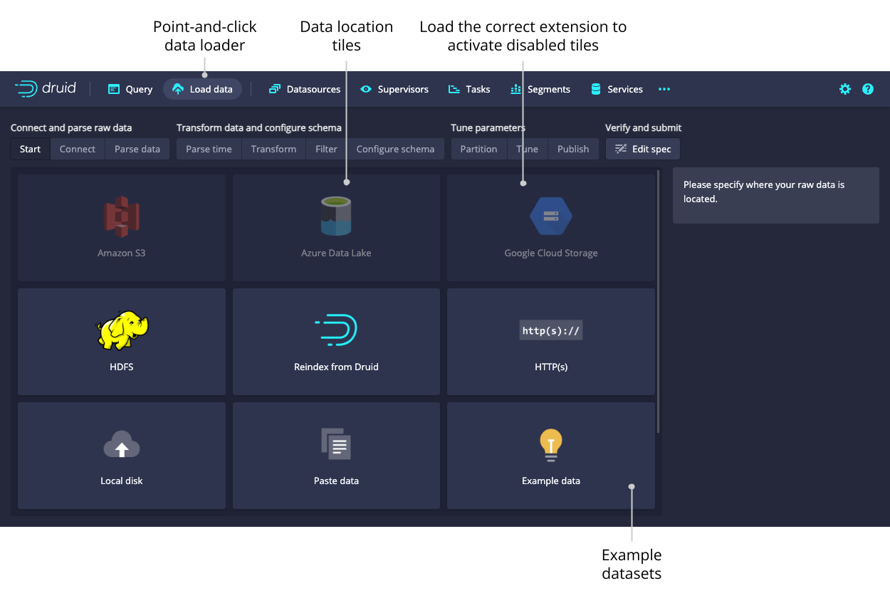
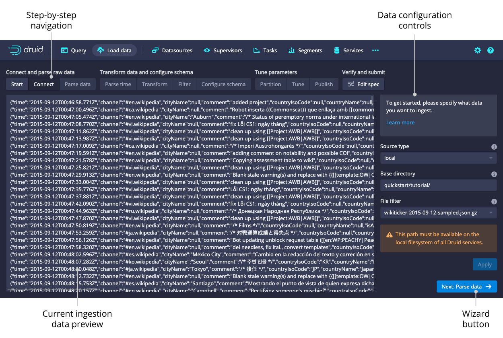
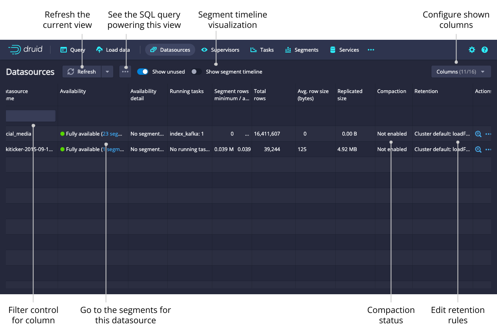
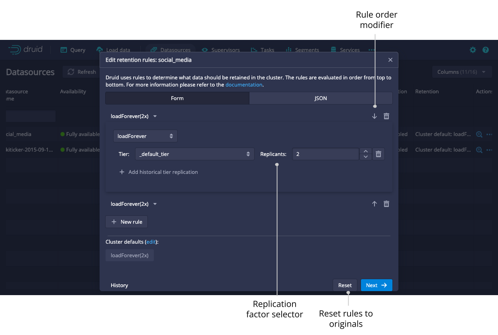
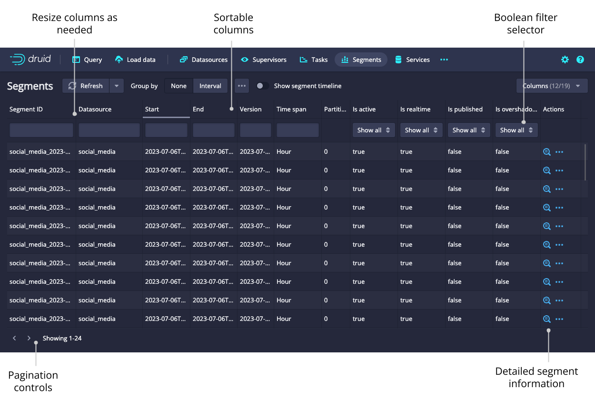
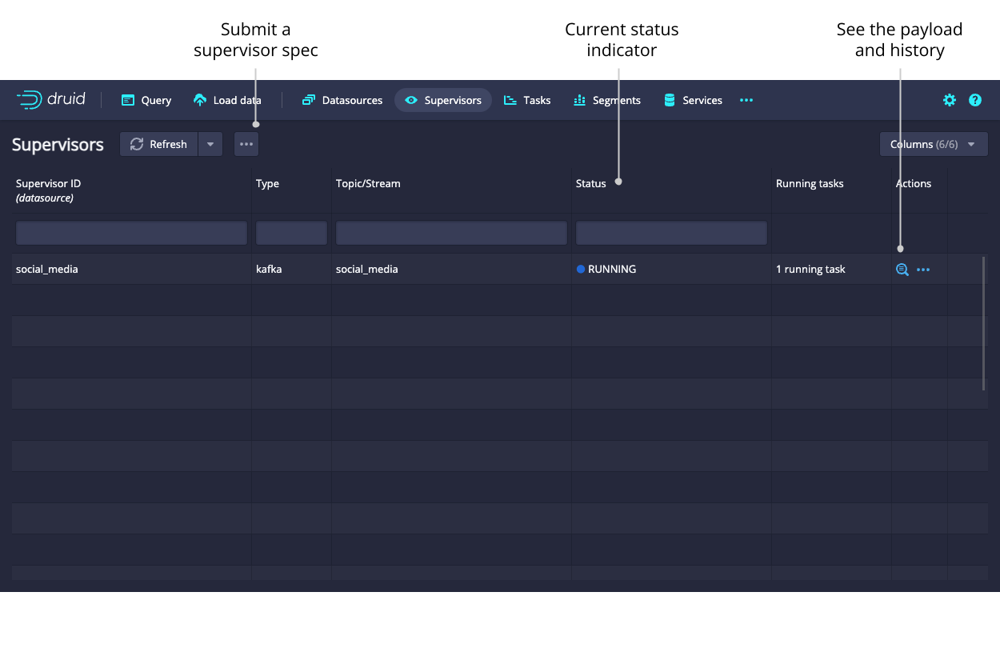
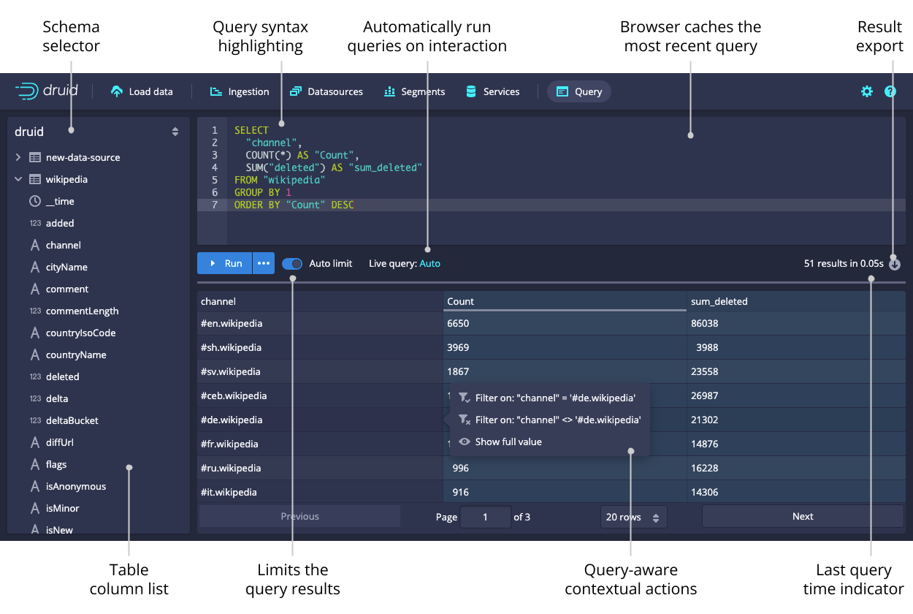
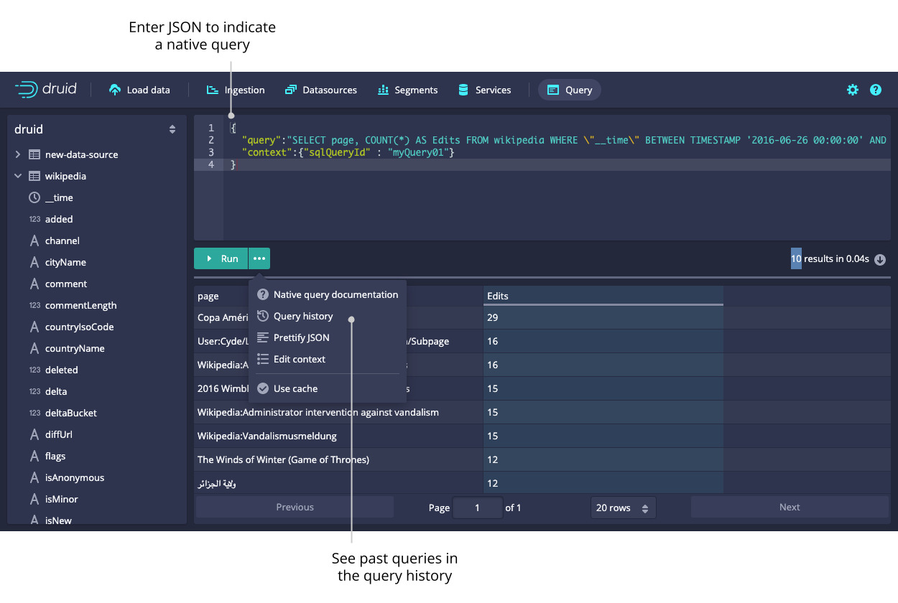

<!--
  ~ Licensed to the Apache Software Foundation (ASF) under one
  ~ or more contributor license agreements.  See the NOTICE file
  ~ distributed with this work for additional information
  ~ regarding copyright ownership.  The ASF licenses this file
  ~ to you under the Apache License, Version 2.0 (the
  ~ "License"); you may not use this file except in compliance
  ~ with the License.  You may obtain a copy of the License at
  ~
  ~   http://www.apache.org/licenses/LICENSE-2.0
  ~
  ~ Unless required by applicable law or agreed to in writing,
  ~ software distributed under the License is distributed on an
  ~ "AS IS" BASIS, WITHOUT WARRANTIES OR CONDITIONS OF ANY
  ~ KIND, either express or implied.  See the License for the
  ~ specific language governing permissions and limitations
  ~ under the License.
  -->

Druid includes a web console for loading data, managing datasources and tasks, and viewing server status and segment information.
You can also run SQL and native Druid queries in the console.

Enable the following cluster settings to use the Druid console. Note that these settings are enabled by default.
- Enable the Router's [management proxy](../design/router.md#enabling-the-management-proxy).
- Enable [Druid SQL](../configuration/index.md#sql) for the Broker processes in the cluster.

The [Router](../design/router.md) service hosts the Druid console.
Access the Druid console at the following address:
```
http://<ROUTER_IP>:<ROUTER_PORT>
```

> It is important to note that any Druid console user will have, effectively, the same file permissions as the user under which Druid runs. One way these permissions are surfaced is in the file browser dialog. The dialog
will show console users the files that the underlying user has permissions to. In general, avoid running Druid as 
root user. Consider creating a dedicated user account for running Druid.

This topic presents the high-level features and functionality of the Druid console.

## Home

The **Home** view provides a high-level overview of the cluster.
Each card is clickable and links to the appropriate view.

The **Home** view displays the following cards:

* __Status__. Click this card for information on the Druid version and any extensions loaded on the cluster.
* [Datasources](#datasources)
* [Segments](#segments)
* [Supervisors](#supervisors-and-tasks)
* [Tasks](#supervisors-and-tasks)
* [Services](#services)
* [Lookups](#lookups)

You can access the [data loader](#data-loader) and [lookups view](#lookups) from the top-level navigation of the **Home** view.


## Data loader

You can use the data loader to build an ingestion spec with a step-by-step wizard.



After selecting the location of your data, follow the series of steps displaying incremental previews of the data as it is ingested.
After filling in the required details on every step you can navigate to the next step by clicking **Next**.
You can also freely navigate between the steps from the top navigation.

Navigating with the top navigation leaves the underlying spec unmodified while clicking **Next** attempts to fill in the subsequent steps with appropriate defaults.



## Datasources

The **Datasources** view shows all the datasources currently loaded on the cluster, as well as their sizes and availability.
From the **Datasources** view, you can edit the retention rules, configure automatic compaction, and drop data in a datasource.

A datasource is partitioned into one or more segments organized by time chunks.
To display a timeline of segments, toggle the option for **Show segment timeline**.

Like any view that is powered by a Druid SQL query, you can click **View SQL query for table** from the ellipsis menu to run the underlying SQL query directly.



You can view and edit retention rules to determine the general availability of a datasource.



## Segments

The **Segments** view shows all the [segments](../design/segments.md) in the cluster.
Each segment has a detail view that provides more information.
The Segment ID is also conveniently broken down into Datasource, Start, End, Version, and Partition columns for ease of filtering and sorting.



## Supervisors and tasks

From this view, you can check the status of existing supervisors as well as suspend, resume, and reset them.
The supervisor oversees the state of the indexing tasks to coordinate handoffs, manage failures, and ensure that the scalability and replication requirements are maintained.

The tasks table allows you to see the currently running and recently completed tasks.
To navigate your tasks more easily, you can group them by their **Type**, **Datasource**, or **Status**.
Submit a task manually by clicking the ellipsis icon and selecting **Submit JSON task**.



Click on the magnifying glass for any supervisor to see detailed reports of its progress.


Click on the magnifying glass for any task to see more detail about it.


## Services

The **Services** view lets you see the current status of the nodes making up your cluster.
You can group the nodes by type or by tier to get meaningful summary statistics. 


## Query

The **Query** view lets you issue [Druid SQL](../querying/sql.md) queries and display the results as a table.
The view will attempt to infer your query and let you modify the query via contextual actions such as adding filters and changing the sort order when possible.

From the ellipsis menu beside **Run**, you can view your query history, see the native query translation for a given Druid SQL query, and set the [query context](../querying/query-context.md).



You can also use the query editor to issue queries in Druid's [native query format](../querying/querying.md), which is JSON over HTTP.



## Lookups

Access the **Lookups** view from the **Lookups** card in the home view or by clicking on the gear icon in the upper right corner.
Here you can create and edit query time [lookups](../querying/lookups.md).


