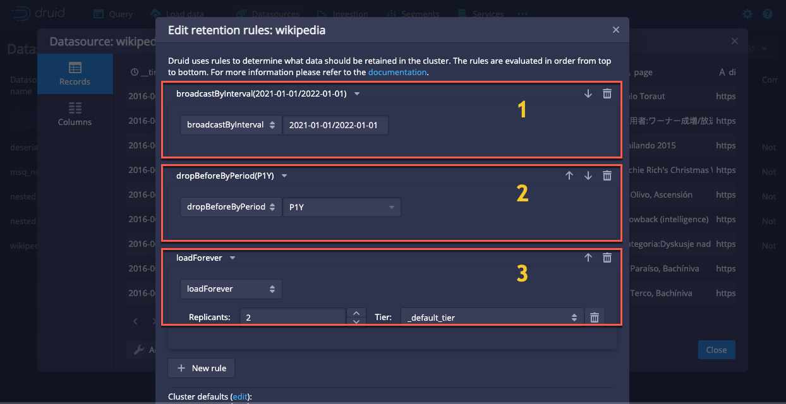

<!--
  ~ Licensed to the Apache Software Foundation (ASF) under one
  ~ or more contributor license agreements.  See the NOTICE file
  ~ distributed with this work for additional information
  ~ regarding copyright ownership.  The ASF licenses this file
  ~ to you under the Apache License, Version 2.0 (the
  ~ "License"); you may not use this file except in compliance
  ~ with the License.  You may obtain a copy of the License at
  ~
  ~   http://www.apache.org/licenses/LICENSE-2.0
  ~
  ~ Unless required by applicable law or agreed to in writing,
  ~ software distributed under the License is distributed on an
  ~ "AS IS" BASIS, WITHOUT WARRANTIES OR CONDITIONS OF ANY
  ~ KIND, either express or implied.  See the License for the
  ~ specific language governing permissions and limitations
  ~ under the License.
  -->

Data retention rules allow you to configure Apache Druid to conform to your data retention policies. Your data retention policies specify which data to retain and which data to drop from the cluster.

Druid supports [load](#load-rules), [drop](#drop-rules), and [broadcast](#broadcast-rules) rules. Each rule is a JSON object. See the [rule definitions below](#load-rules) for details.

You can configure a default set of rules to apply to all datasources, and/or you can set specific rules for specific datasources. See [rule structure](#rule-structure) to see how rule order impacts the way the Coordinator applies retention rules.

You can specify the data to retain or drop in the following ways:

- Forever: all data in the segment.
- Period: segment data specified as an offset from the present time.
- Interval: a fixed time range.

Retention rules are persistent: they remain in effect until you change them. Druid stores retention rules in its [metadata store](../design/metadata-storage.md).

## Set retention rules

You can use the Druid [web console](./web-console.md) or the [Service status API reference](../api-reference/service-status-api.md#coordinator) to create and manage retention rules.

### Use the web console

To set retention rules in the Druid web console:

1. On the console home page, click **Datasources**.
2. Click the name of your datasource to open the data window.
3. Select **Actions > Edit retention rules**.
4. Click **+New rule**.
5. Select a rule type and set properties for the rule.
6. Click **Next** and enter a description for the rule.
7. Click **Save** to save and apply the rule to the datasource.

### Use the Coordinator API

To set one or more default retention rules for all datasources, send a POST request containing a JSON object for each rule to `/druid/coordinator/v1/rules/_default`.

The following example request sets a default forever broadcast rule for all datasources:

```bash
curl --location --request POST 'http://localhost:8888/druid/coordinator/v1/rules/_default' \
--header 'Content-Type: application/json' \
--data-raw '[{
  "type": "broadcastForever"
  }]'
```

To set one or more retention rules for a specific datasource, send a POST request containing a JSON object for each rule to `/druid/coordinator/v1/rules/{datasourceName}`.

The following example request sets a period drop rule and a period broadcast rule for the `wikipedia` datasource:

```bash
curl --location --request POST 'http://localhost:8888/druid/coordinator/v1/rules/wikipedia' \
--header 'Content-Type: application/json' \
--data-raw '[{
   "type": "dropByPeriod",
   "period": "P1M",
   "includeFuture": true
   },
   {
    "type": "broadcastByPeriod",
    "period": "P1M",
    "includeFuture": true
   }]'
```

To retrieve all rules for all datasources, send a GET request to `/druid/coordinator/v1/rules`&mdash;for example:

```bash
curl --location --request GET 'http://localhost:8888/druid/coordinator/v1/rules'
```

### Rule structure

The rules API accepts an array of rules as JSON objects. The JSON object you send in the API request for each rule is specific to the rules types outlined below.

:::info
 You must pass the entire array of rules, in your desired order, with each API request. Each POST request to the rules API overwrites the existing rules for the specified datasource.
:::

The order of rules is very important. The Coordinator reads rules in the order in which they appear in the rules list. For example, in the following screenshot the Coordinator evaluates data against rule 1, then rule 2, then rule 3:



The Coordinator cycles through all used segments and matches each segment with the first rule that applies. Each segment can only match a single rule.

In the web console you can use the up and down arrows on the right side of the interface to change the order of the rules.

## Load rules

Load rules define how Druid assigns segments to [Historical process tiers](./mixed-workloads.md#historical-tiering), and how many replicas of a segment exist in each tier.

If you have a single tier, Druid automatically names the tier `_default`. If you define an additional tier, you must define a load rule to specify which segments to load on that tier. Until you define a load rule, your new tier remains empty.

All load rules can have these properties:

|Property|Description|Required|Default value|
|---------|-----------|---------|-------------|
| `tieredReplicants`| Map from tier names to the respective number of segment replicas to be loaded on those tiers. The number of replicas for each tier must be either 0 or a positive integer.| No | When `useDefaultTierForNull` is `true`, the default value is `{"_default_tier": 2}` i.e. 2 replicas to be loaded on the `_default_tier`.<br/><br/>When `useDefaultTierForNull` is `false`, the default value is `{}` i.e. no replicas to be loaded on any tier. |
|`useDefaultTierForNull`|Determines the default value of `tieredReplicants` if it is not specified or set to `null`.| No | `true`|

Specific types of load rules discussed below may have other properties too.

Load rules are also how you take advantage of the resource savings that [query the data from deep storage](../querying/query-from-deep-storage.md) provides. One way to configure data so that certain segments are not loaded onto Historical tiers but are available to query from deep storage is to set `tieredReplicants` to an empty array and `useDefaultTierForNull` to `false` for those segments, either by interval or by period.

### Forever load rule

The forever load rule assigns all datasource segments to specified tiers. It is the default rule Druid applies to datasources. Forever load rules have type `loadForever`.

The following example places one replica of each segment on a custom tier named `hot`, and another single replica on the default tier.

```json
{
  "type": "loadForever",
  "tieredReplicants": {
    "hot": 1,
    "_default_tier": 1
  }
}
```

Set the following property:

- `tieredReplicants`: a map of tier names to the number of segment replicas for that tier.
- `useDefaultTierForNull`: This parameter determines the default value of `tieredReplicants` and only has an effect if the field is not present. The default value of `useDefaultTierForNull` is true.

### Period load rule

You can use a period load rule to assign segment data in a specific period to a tier. Druid compares a segment's interval to the period you specify in the rule and loads the matching data.

Period load rules have type `loadByPeriod`. The following example places one replica of data in a one-month period on a custom tier named `hot`, and another single replica on the default tier.

```json
{
  "type": "loadByPeriod",
  "period": "P1M",
  "includeFuture": true,
  "tieredReplicants": {
      "hot": 1,
      "_default_tier": 1
  }
}
```

Set the following properties:

- `period`: a JSON object representing [ISO 8601](https://en.wikipedia.org/wiki/ISO_8601) periods. The period is from some time in the past to the present, or into the future if `includeFuture` is set to `true`.
- `includeFuture`: a boolean flag to instruct Druid to match a segment if:
  - the segment interval overlaps the rule interval, or
  - the segment interval starts any time after the rule interval starts.

  You can use this property to load segments with future start and end dates, where "future" is relative to the time when the Coordinator evaluates data against the rule. Defaults to `true`.
- `tieredReplicants`: a map of tier names to the number of segment replicas for that tier. 
- `useDefaultTierForNull`: This parameter determines the default value of `tieredReplicants` and only has an effect if the field is not present. The default value of `useDefaultTierForNull` is true.

### Interval load rule

You can use an interval rule to assign a specific range of data to a tier. For example, analysts may typically work with the complete data set for all of last week and not so much with the data for the current week.

Interval load rules have type `loadByInterval`. The following example places one replica of data matching the specified interval on a custom tier named `hot`, and another single replica on the default tier.

```json
{
  "type": "loadByInterval",
  "interval": "2012-01-01/2013-01-01",
  "tieredReplicants": {
    "hot": 1,
    "_default_tier": 1
  }
}
```

Set the following properties:

- `interval`: the load interval specified as an [ISO 8601](https://en.wikipedia.org/wiki/ISO_8601) range encoded as a string.
- `tieredReplicants`: a map of tier names to the number of segment replicas for that tier. 
- `useDefaultTierForNull`: This parameter determines the default value of `tieredReplicants` and only has an effect if the field is not present. The default value of `useDefaultTierForNull` is true.

## Drop rules

Drop rules define when Druid drops segments from the cluster. Druid keeps dropped data in deep storage. Note that if you enable automatic cleanup of unused segments, or you run a kill task, Druid deletes the data from deep storage. See [Data deletion](../data-management/delete.md) for more information on deleting data.

If you want to use a [load rule](#load-rules) to retain only data from a defined period of time, you must also define a drop rule. If you don't define a drop rule, Druid retains data that doesn't lie within your defined period according to the default rule, `loadForever`.

### Forever drop rule

The forever drop rule drops all segment data from the cluster. If you configure a set of rules with a forever drop rule as the last rule, Druid drops any segment data that remains after it evaluates the higher priority rules.

Forever drop rules have type `dropForever`:

```json
{
  "type": "dropForever"
}
```

### Period drop rule

Druid compares a segment's interval to the period you specify in the rule and drops the matching data. The rule matches if the period contains the segment interval. This rule always drops recent data.

Period drop rules have type `dropByPeriod` and the following JSON structure:

```json
{
  "type": "dropByPeriod",
  "period": "P1M",
  "includeFuture": true
}
```

Set the following properties:

- `period`: a JSON object representing [ISO 8601](https://en.wikipedia.org/wiki/ISO_8601) periods. The period is from some time in the past to the future or to the current time, depending on the `includeFuture` flag.
- `includeFuture`: a boolean flag to instruct Druid to match a segment if one of the following conditions apply:

  - the segment interval overlaps the rule interval
  - the segment interval starts any time after the rule interval starts
  
  You can use this property to drop segments with future start and end dates, where "future" is relative to the time when the Coordinator evaluates data against the rule. Defaults to `true`.

### Period drop before rule

Druid compares a segment's interval to the period you specify in the rule and drops the matching data. The rule matches if the segment interval is before the specified period.

If you only want to retain recent data, you can use this rule to drop old data before a specified period, and add a `loadForever` rule to retain the data that follows it. Note that the rule combination `dropBeforeByPeriod` + `loadForever` is equivalent to `loadByPeriod(includeFuture = true)` + `dropForever`.

Period drop rules have type `dropBeforeByPeriod` and the following JSON structure:

```json
{
  "type": "dropBeforeByPeriod",
  "period": "P1M"
}
```

Set the following property:

- `period`: a JSON object representing [ISO 8601](https://en.wikipedia.org/wiki/ISO_8601) periods.

### Interval drop rule

You can use a drop interval rule to prevent Druid from loading a specified range of data onto any tier. The range is typically your oldest data. The dropped data resides in deep storage and can still be [queried from deep storage](../querying/query-from-deep-storage.md). 

Interval drop rules have type `dropByInterval` and the following JSON structure:

```json
{
  "type": "dropByInterval",
  "interval": "2012-01-01/2013-01-01"
}
```

Set the following property:

- `interval`: the drop interval specified as an [ISO 8601](https://en.wikipedia.org/wiki/ISO_8601) range encoded as a string.

## Broadcast rules

Druid extensions use broadcast rules to load segment data onto all brokers in the cluster. Apply broadcast rules in a test environment, not in production.

### Forever broadcast rule

The forever broadcast rule loads all segment data in your datasources onto all brokers in the cluster.

Forever broadcast rules have type `broadcastForever`:

```json
{
  "type": "broadcastForever"
}
```

### Period broadcast rule

Druid compares a segment's interval to the period you specify in the rule and loads the matching data onto the brokers in the cluster.

Period broadcast rules have type `broadcastByPeriod` and the following JSON structure:

```json
{
  "type": "broadcastByPeriod",
  "period": "P1M",
  "includeFuture": true
}
```

Set the following properties:

- `period`: a JSON object representing [ISO 8601](https://en.wikipedia.org/wiki/ISO_8601) periods. The period is from some time in the past to the future or to the current time, depending on the `includeFuture` flag.
- `includeFuture`: a boolean flag to instruct Druid to match a segment if one of the following conditions apply:
  - the segment interval overlaps the rule interval
  - the segment interval starts any time after the rule interval starts.

  You can use this property to broadcast segments with future start and end dates, where "future" is relative to the time when the Coordinator evaluates data against the rule. Defaults to `true`.

### Interval broadcast rule

An interval broadcast rule loads a specific range of data onto the brokers in the cluster.

Interval broadcast rules have type `broadcastByInterval` and the following JSON structure:

```json
{
  "type": "broadcastByInterval",
  "interval": "2012-01-01/2013-01-01"
}
```

Set the following property:

- `interval`: the broadcast interval specified as an [ISO 8601](https://en.wikipedia.org/wiki/ISO_8601) range encoded as a string.

## Permanently delete data

Druid can fully drop data from the cluster, wipe the metadata store entry, and remove the data from deep storage for any segments marked `unused`. Note that Druid always marks segments dropped from the cluster by rules as `unused`. You can submit a [kill task](../ingestion/tasks.md) to the [Overlord](../design/overlord.md) to do this.

## Reload dropped data

You can't use a single rule to reload data Druid has dropped from a cluster.

To reload dropped data:

1. Set your retention period&mdash;for example, change the retention period from one month to two months.
2. Use the web console or the API to mark all segments belonging to the datasource as `used`.

This prompts Druid to rerun the Coordinator rules and load all missing segments. The Coordinator identifies the latest version of the segments and drops older versions.

## Learn more

For more information about using retention rules in Druid, see the following topics:

- [Tutorial: Configuring data retention](../tutorials/tutorial-retention.md)
- [Configure Druid for mixed workloads](../operations/mixed-workloads.md)
- [Router process](../design/router.md)
