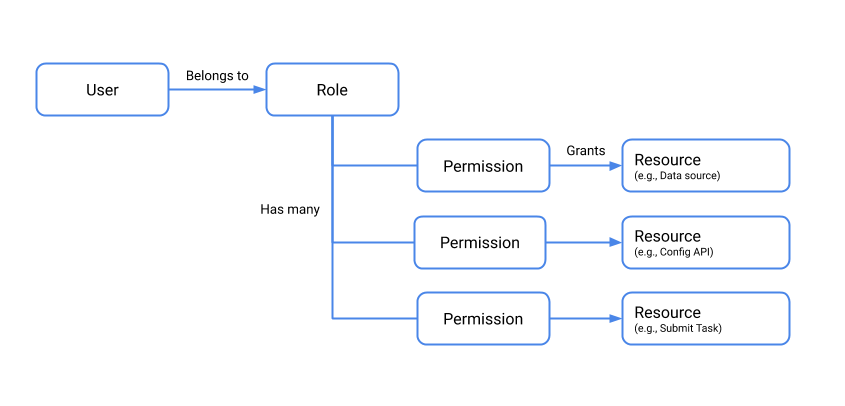

<!--
  ~ Licensed to the Apache Software Foundation (ASF) under one
  ~ or more contributor license agreements.  See the NOTICE file
  ~ distributed with this work for additional information
  ~ regarding copyright ownership.  The ASF licenses this file
  ~ to you under the Apache License, Version 2.0 (the
  ~ "License"); you may not use this file except in compliance
  ~ with the License.  You may obtain a copy of the License at
  ~
  ~   http://www.apache.org/licenses/LICENSE-2.0
  ~
  ~ Unless required by applicable law or agreed to in writing,
  ~ software distributed under the License is distributed on an
  ~ "AS IS" BASIS, WITHOUT WARRANTIES OR CONDITIONS OF ANY
  ~ KIND, either express or implied.  See the License for the
  ~ specific language governing permissions and limitations
  ~ under the License.
  -->


## Overview

By default, security features in Druid are disabled, which simplifies the initial deployment experience. However, security features must be configured in a production deployment. These features include TLS, authentication, and authorization.

To implement Druid security, you configure authenticators and authorizers. Authenticators control the way user identities are verified, while authorizers map the authenticated users (via user roles) to the datasources they are permitted to access. Consequently, implementing Druid security also involves considering your datasource scheme, since that scheme represents the granularity at which data access permissions are allocated. 

The following graphic depicts the course of request through the authentication process: 


 


This document gives you an overview of security features in Druid and how to configure them, and some best practices for securing Druid.


## Best practices

* Do not expose the Druid Console without authentication on untrusted networks. Access to the console effectively confers access the file system on the installation machine, via file browsers in the UI. You should use an API gateway that restricts who can connect from untrusted networks, allow list the specific APIs that your users need to access, and implements account lockout and throttling features.
* Grant users the minimum permissions necessary to perform their functions. For instance, do not allow users who only need to query data to write to data sources or view state.  
* Disable JavaScript, as noted in the [Security section](https://druid.apache.org/docs/latest/development/javascript.html#security) of the JavaScript guide.
* Run Druid as an unprivileged Unix user on the installation machine (not root).
   > This is an important point! Administrator users on Druid have the same permission as the Unix user account it is running under. If the Druid process is running under the root user account in the OS, then Administrator users on Druid can read/write all files that the root account has access to, including sensitive files such as `/etc/passwd`.

You can configure authentication and authorization to control access to the the Druid APIs. The first step is enabling TLS for the cluster nodes. Then configure users, roles, and permissions, as described in the following sections. 

The configuration settings mentioned below are primarily located in the `common.runtime.properties` file. Note that you need to make the configuration changes on each Druid server in the cluster. 


## Enable TLS

The first step in securing Druid is enabling TLS. You can enable TLS to secure external client connections to Druid as well as connections between cluster nodes. 

The configuration steps are: 

1. Enable TLS by adding `druid.enableTlsPort=true` to `common.runtime.properties` on each node in the Druid cluster.
2. Disable the non-TLS port by setting `druid.enablePlaintextPort` to `false`. 
2. Follow the steps in [Understanding Certificates and Keys](https://www.eclipse.org/jetty/documentation/current/configuring-ssl.html#understanding-certificates-and-keys) to generate or import a key and certificate. 
3. Configure the keystore and truststore settings in `common.runtime.properties`. The file should look something like this: 
  ```
  druid.enablePlaintextPort=false
  druid.enableTlsPort=true
  
  druid.server.https.keyStoreType=jks
  druid.server.https.keyStorePath=sample-keystore.jks
  druid.server.https.keyStorePassword=secret123 # replace with your own password
  druid.server.https.certAlias=druid 
  
  druid.client.https.protocol=TLSv1.2
  druid.client.https.trustStoreType=jks
  druid.client.https.trustStorePath=sample-truststore.jks
  druid.client.https.trustStorePassword=secret123  # replace with your own password

  ``` 
4. Add the `simple-client-sslcontext` extension to `druid.extensions.loadList` in `common.runtime.properties`. This enables TLS for Druid nodes acting as clients.
5. Restart the cluster.

For more information, see [TLS support](tls-support.md) and [Simple SSLContext Provider Module](../development/extensions-core/simple-client-sslcontext.md). 

Druid uses Jetty as its embedded web server. Therefore you refer to [Understanding Certificates and Keys](https://www.eclipse.org/jetty/documentation/current/configuring-ssl.html) for complete instructions. 


## Enable an authenticator

To authenticate requests in Druid, you configure an Authenticator. Authenticator extensions exist for HTTP basic authentication, LDAP, and Kerberos.  

The following takes you through sample configuration steps for enabling basic auth:  

1. Add the `druid-basic-security` extension to `druid.extensions.loadList` in `common.runtime.properties`. For the quickstart installation, for example, the properties file is at `conf/druid/cluster/_common`:
   ```
   druid.extensions.loadList=["druid-basic-security", "druid-histogram", "druid-datasketches", "druid-kafka-indexing-service"]
   ```
2. Configure the basic Authenticator, Authorizer, and Escalator settings in the same common.runtime.properties file. For example:
   ```
   # Druid basic security
   druid.auth.authenticatorChain=["MyBasicMetadataAuthenticator"]

   druid.auth.authenticator.MyBasicMetadataAuthenticator.type=basic
   druid.auth.authenticator.MyBasicMetadataAuthenticator.initialAdminPassword=password1
   druid.auth.authenticator.MyBasicMetadataAuthenticator.initialInternalClientPassword=password2
   druid.auth.authenticator.MyBasicMetadataAuthenticator.credentialsValidator.type=metadata
   druid.auth.authenticator.MyBasicMetadataAuthenticator.skipOnFailure=false
   druid.auth.authenticator.MyBasicMetadataAuthenticator.authorizerName=MyBasicMetadataAuthorizer

   # Escalator
   druid.escalator.type=basic
   druid.escalator.internalClientUsername=druid_system
   druid.escalator.internalClientPassword=password2
   druid.escalator.authorizerName=MyBasicMetadataAuthorizer

   druid.auth.authorizers=["MyBasicMetadataAuthorizer"]

   druid.auth.authorizer.MyBasicMetadataAuthorizer.type=basic
   ```

3. Restart the cluster. 

See [Authentication and Authorization](../design/auth.md) for more information about the Authenticator, Escalator, and Authorizer concepts. See [Basic Security](../development/extensions-core/druid-basic-security.md) for more information about the extension used in the examples above, and [Kerberos](../development/extensions-core/druid-kerberos.md) for Kerberos authentication.


## Enable authorizers

After enabling the basic auth extension, you can add users, roles, and permissions via the Druid Coordinator `user` endpoint. Note that you cannot assign permissions directly to individual users. They must be assigned through roles. 

The following diagram depicts the authorization model, and the relationship between users, roles, permissions, and resources.
 
 


The following steps walk through a sample setup procedure:  

> The default Coordinator API port is 8081 for non-TLS connections and 8281 for secured connections.

1. Create a user by issuing a POST request to `druid-ext/basic-security/authentication/db/MyBasicMetadataAuthenticator/users/<USERNAME>`, replacing USERNAME with the new username. For example: 
  ```
   curl -u admin:password -XPOST https://my-coordinator-ip:8281/druid-ext/basic-security/authentication/db/basic/users/myname
  ```
  >  If you have TLS enabled, be sure to adjust the curl command accordingly. For example, if your Druid servers use self-signed certificates, you may choose to include the `insecure` curl option to forgo certificate checking for the curl command. 
2. Add a credential for the user by issuing a POST to `druid-ext/basic-security/authentication/db/MyBasicMetadataAuthenticator/users/<USERNAME>/credentials`. For example:
    ```
    curl -u admin:password -H'Content-Type: application/json' -XPOST --data-binary @pass.json https://my-coordinator-ip:8281/druid-ext/basic-security/authentication/db/basic/users/myname/credentials
    ```
    The password is conveyed in the `pass.json` file in the following form:
   	```
   	{
      "password": "password"
    }
    ```
2. For each authenticator user you create, create a corresponding authorizer user by issuing a POST request to `druid-ext/basic-security/authorization/db/MyBasicMetadataAuthorizer/users/<USERNAME>`. For example: 
	```
	curl -u admin:password -XPOST https://my-coordinator-ip:8281/druid-ext/basic-security/authorization/db/basic/users/myname
	```
3. Create authorizer roles to control permissions by issuing a POST request to `druid-ext/basic-security/authorization/db/MyBasicMetadataAuthorizer/roles/<ROLENAME>`. For example: 
	```
   curl -u admin:password -XPOST https://my-coordinator-ip:8281/druid-ext/basic-security/authorization/db/basic/roles/myrole
   ```
4. Assign roles to users by issuing a POST request to `druid-ext/basic-security/authorization/db/MyBasicMetadataAuthorizer/users/<USERNAME>/roles/<ROLENAME>`. For example: 
	```
	curl -u admin:password -XPOST https://my-coordinator-ip:8281/druid-ext/basic-security/authorization/db/basic/users/myname/roles/myrole | jq
	```
5. Finally, attach permissions to the roles to control how they can interact with Druid at `druid-ext/basic-security/authorization/db/MyBasicMetadataAuthorizer/roles/<ROLENAME>/permissions`. 
	For example: 
	```
	curl -u admin:password -H'Content-Type: application/json' -XPOST --data-binary @perms.json https://my-coordinator-ip:8281/druid-ext/basic-security/authorization/db/basic/roles/myrole/permissions
	```
	The payload of `perms.json` should be in the form:
   	```
    [
    {
      "resource": {
        "name": "<PATTERN>",
        "type": "DATASOURCE"
      },
      "action": "READ"
    },
    {
      "resource": {
      "name": "STATE",
      "type": "STATE"
    },
    "action": "READ"
    }
    ]
    ```


## Configuring an LDAP authenticator

As an alternative to using the basic metadata authenticator, as shown in the previous section, you can use LDAP to authenticate users. The following steps provide an overview of the setup steps. For more information on these settings, see [Properties for LDAP user authentication](../development/extensions-core/druid-basic-security.md#properties-for-ldap-user-authentication).

1. In `common.runtime.properties`, add LDAP to the authenticator chain in the order in which you want requests to be evaluated. For example:
   ```
   # Druid basic security
   druid.auth.authenticatorChain=["ldap", "MyBasicMetadataAuthenticator"]
   ```

2. Configure LDAP settings in `common.runtime.properties` as appropriate for your LDAP scheme and system. For example:
   ```
   druid.auth.authenticator.ldap.type=basic
   druid.auth.authenticator.ldap.enableCacheNotifications=true
   druid.auth.authenticator.ldap.credentialsValidator.type=ldap
   druid.auth.authenticator.ldap.credentialsValidator.url=ldap://ad_host:389
   druid.auth.authenticator.ldap.credentialsValidator.bindUser=ad_admin_user
   druid.auth.authenticator.ldap.credentialsValidator.bindPassword=ad_admin_password
   druid.auth.authenticator.ldap.credentialsValidator.baseDn=dc=example,dc=com 
   druid.auth.authenticator.ldap.credentialsValidator.userSearch=(&(sAMAccountName=%s)(objectClass=user))
   druid.auth.authenticator.ldap.credentialsValidator.userAttribute=sAMAccountName
   druid.auth.authenticator.ldap.authorizerName=ldapauth
   druid.escalator.type=basic
   druid.escalator.internalClientUsername=ad_interal_user
   druid.escalator.internalClientPassword=Welcome123
   druid.escalator.authorizerName=ldapauth
   druid.auth.authorizers=["ldapauth"]
   druid.auth.authorizer.ldapauth.type=basic
   druid.auth.authorizer.ldapauth.initialAdminUser=<ad_initial_admin_user>
   druid.auth.authorizer.ldapauth.initialAdminRole=admin
   druid.auth.authorizer.ldapauth.roleProvider.type=ldap
   ```

3. Use the Druid API to create the group mapping and allocate initial roles. For example, using curl and given a group named `group1` in the directory, run: 
   ```
   curl -i -v  -H "Content-Type: application/json" -u internal -X POST -d @groupmap.json http://localhost:8081/druid-ext/basic-security/authorization/db/ldapauth/groupMappings/group1map
   ```
   The `groupmap.json` file contents would be something like:
   ```
   {
     "name": "group1map",
     "groupPattern": "CN=group1,CN=Users,DC=example,DC=com",
     "roles": [
         "readRole"
     ]
   }
   ```
4. Check if the group mapping is created successfully by executing the following API. This lists all group mappings.
   ```
   curl -i -v  -H "Content-Type: application/json" -u internal -X GET http://localhost:8081/druid-ext/basic-security/authorization/db/ldapauth/groupMappings
   ```
   
   Alternatively, to check the details of a specific group mapping, use the following API:
   ```
   curl -i -v  -H "Content-Type: application/json" -u internal -X GET http://localhost:8081/druid-ext/basic-security/authorization/db/ldapauth/groupMappings/group1map
   ```
   
5. To add additional roles to the group mapping, use the following API: 
   ``` 
   curl -i -v  -H "Content-Type: application/json" -u internal -X POST http://localhost:8081/druid-ext/basic-security/authorization/db/ldapauth/groupMappings/group1/roles/<newrole> 
   ```

6. Add the LDAP user to Druid. To add a user, use the following authentication API:
   ```
   curl -i -v  -H "Content-Type: application/json" -u internal -X POST http://localhost:8081/druid-ext/basic-security/authentication/db/ldap/users/<ad_user> 
   ```

7. Use the following command to assign the role to a user:
   ```
   curl -i -v  -H "Content-Type: application/json" -u internal -X POST http://localhost:8081/druid-ext/basic-security/authorization/db/ldapauth/users/<ad_user>/roles/<rolename>
   ```   


Congratulations, you have configured permissions for user-assigned roles in Druid!
