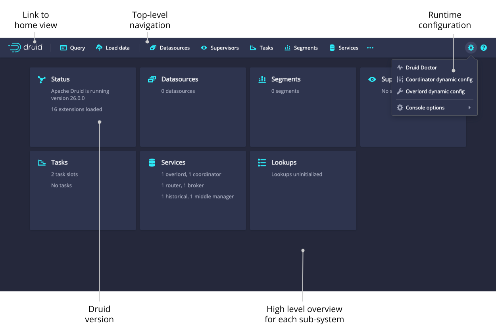
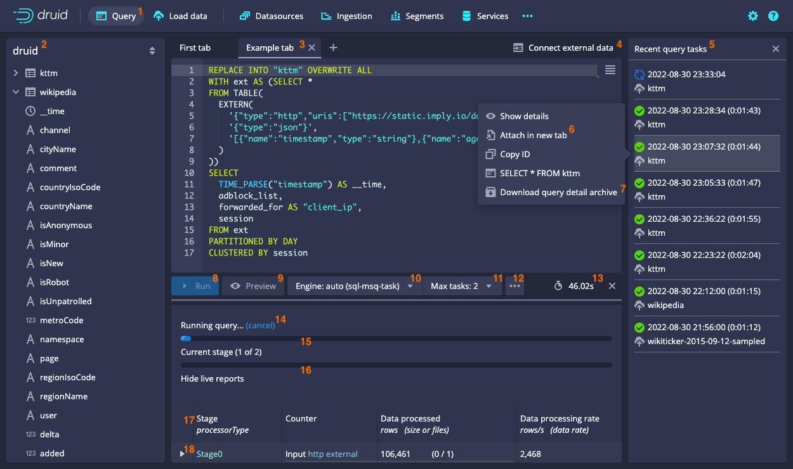
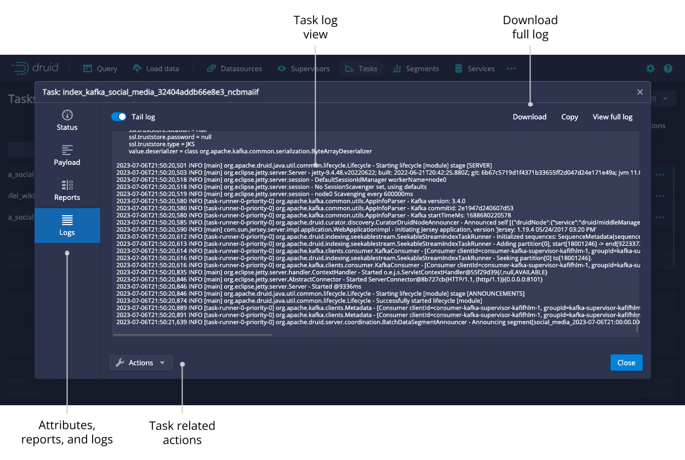
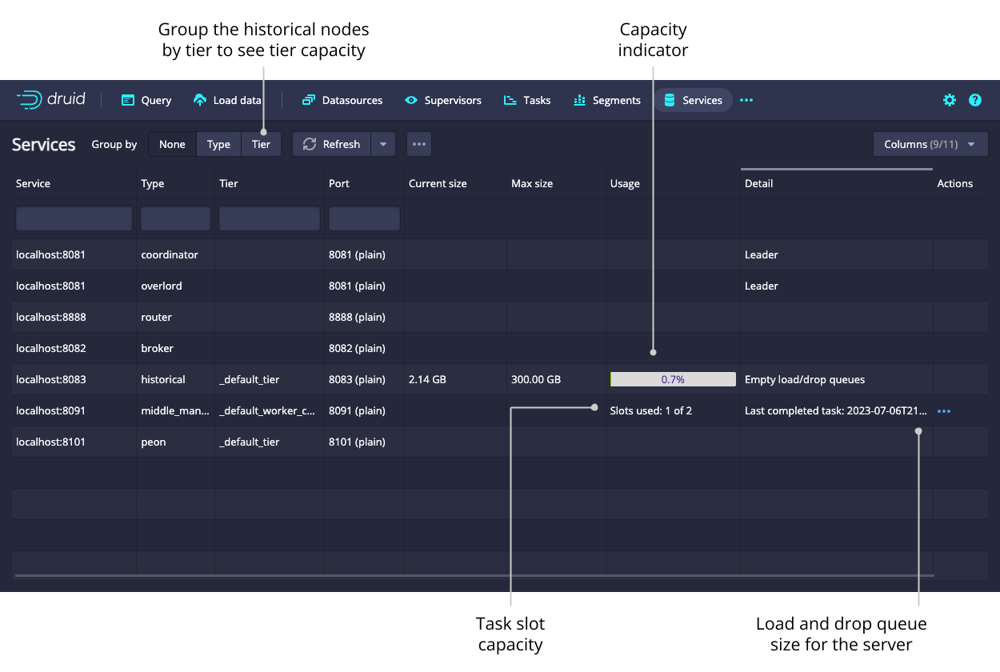

<!--
  ~ Licensed to the Apache Software Foundation (ASF) under one
  ~ or more contributor license agreements.  See the NOTICE file
  ~ distributed with this work for additional information
  ~ regarding copyright ownership.  The ASF licenses this file
  ~ to you under the Apache License, Version 2.0 (the
  ~ "License"); you may not use this file except in compliance
  ~ with the License.  You may obtain a copy of the License at
  ~
  ~   http://www.apache.org/licenses/LICENSE-2.0
  ~
  ~ Unless required by applicable law or agreed to in writing,
  ~ software distributed under the License is distributed on an
  ~ "AS IS" BASIS, WITHOUT WARRANTIES OR CONDITIONS OF ANY
  ~ KIND, either express or implied.  See the License for the
  ~ specific language governing permissions and limitations
  ~ under the License.
  -->

Druid includes a web console for loading data, managing datasources and tasks, and viewing server status and segment information.
You can also run SQL and native Druid queries in the console.

Enable the following cluster settings to use the web console. Note that these settings are enabled by default.
- Enable the Router's [management proxy](../design/router.md#enable-the-management-proxy).
- Enable [Druid SQL](../configuration/index.md#sql) for the Broker processes in the cluster.

The [Router](../design/router.md) service hosts the web console.
Access the web console at the following address:
```
http://<ROUTER_IP>:<ROUTER_PORT>
```

:::info
 **Security note:** Without [Druid user permissions](../operations/security-overview.md) configured, any user of the
API or web console has effectively the same level of access to local files and network services as the user under which
Druid runs. It is a best practice to avoid running Druid as the root user, and to use Druid permissions or network
firewalls to restrict which users have access to potentially sensitive resources.
:::

This topic presents the high-level features and functionality of the web console.

## Home

The **Home** view provides a high-level overview of the cluster.
Each card is clickable and links to the appropriate view.

The **Home** view displays the following cards:

* __Status__. Click this card for information on the Druid version and any extensions loaded on the cluster.
* [Datasources](#datasources)
* [Segments](#segments)
* [Supervisors](#supervisors)
* [Tasks](#tasks)
* [Services](#services)
* [Lookups](#lookups)

You can access the [data loader](#data-loader) and [lookups view](#lookups) from the top-level navigation of the **Home** view.



## Query

SQL-based ingestion and the multi-stage query task engine use the **Query** view, which provides you with a UI to edit and use SQL queries. You should see this UI automatically in Druid 24.0 and later since the multi-stage query extension is loaded by default. 

The following screenshot shows a populated enhanced **Query** view along with a description of its parts:



1. The multi-stage, tab-enabled, **Query** view is where you can issue queries and see results.
All other views are unchanged from the non-enhanced version. You can still access the original **Query** view by navigating to `#query` in the URL.
You can tell that you're looking at the updated **Query** view by the presence of the tabs (3).
2. The **druid** panel shows the available schemas, datasources, and columns.
3. Query tabs allow you to manage and run several queries at once.
Click the plus icon to open a new tab.
To manipulate existing tabs, click the tab name.
4. The tab bar contains some helpful tools including the **Connect external data** button that samples external data and creates an initial query with the appropriate `EXTERN` definition that you can then edit as needed.
5. The **Recent query tasks** panel lets you see currently running and previous queries from all users in the cluster.
It is equivalent to the **Task** view in the **Ingestion** view with the filter of `type='query_controller'`.
6. You can click on each query entry to attach to that query in a new tab.
7. You can download an archive of all the pertinent details about the query that you can share.
8. The **Run** button runs the query.
9. The **Preview** button appears when you enter an INSERT/REPLACE query. It runs the query inline without the INSERT/REPLACE clause and with an added LIMIT to give you a preview of the data that would be ingested if you click **Run**.
The added LIMIT makes the query run faster but provides incomplete results.
10. The engine selector lets you choose which engine (API endpoint) to send a query to. By default, it automatically picks which endpoint to use based on an analysis of the query, but you can select a specific engine explicitly. You can also configure the engine specific context parameters from this menu.
11. The **Max tasks** picker appears when you have the **sql-msq-task** engine selected. It lets you configure the degree of parallelism.
12. The More menu (**...**) contains the following helpful tools:
- **Explain SQL query** shows you the logical plan returned by `EXPLAIN PLAN FOR` for a SQL query.
- **Query history** shows you previously executed queries.
- **Convert ingestion spec to SQL** lets you convert a native batch ingestion spec to an equivalent SQL query.
- **Attach tab from task ID** lets you create a new tab from the task ID of a query executed on this cluster.
- **Open query detail archive** lets you open a detail archive generated on any cluster by (7).
13. The query timer indicates how long the query has been running for.
14. The **(cancel)** link cancels the currently running query.
15. The main progress bar shows the overall progress of the query.
The progress is computed from the various counters in the live reports (16).
16. The **Current stage** progress bar shows the progress for the currently running query stage.
If several stages are executing concurrently, it conservatively shows the information for the earliest executing stage.
17. The live query reports show detailed information of all the stages (past, present, and future). The live reports are shown while the query is running. You can hide the report if you want.
After queries finish, you can access them by clicking on the query time indicator or from the **Recent query tasks** panel (6).
18. You can expand each stage of the live query report by clicking on the triangle to show per worker and per partition statistics.


## Data loader

You can use the data loader to build an ingestion spec with a step-by-step wizard.


After selecting the location of your data, follow the series of steps displaying incremental previews of the data as it is ingested.
After filling in the required details on every step you can navigate to the next step by clicking **Next**.
You can also freely navigate between the steps from the top navigation.

Navigating with the top navigation leaves the underlying spec unmodified while clicking **Next** attempts to fill in the subsequent steps with appropriate defaults.


## Datasources

The **Datasources** view shows all the datasources currently loaded on the cluster, as well as their sizes and availability.
From the **Datasources** view, you can edit the retention rules, configure automatic compaction, and drop data in a datasource.

A datasource is partitioned into one or more segments organized by time chunks.
To display a timeline of segments, toggle the option for **Show segment timeline**.

Like any view that is powered by a Druid SQL query, you can click **View SQL query for table** from the ellipsis menu to run the underlying SQL query directly.


You can view and edit retention rules to determine the general availability of a datasource.


## Segments

The **Segments** view shows all the [segments](../design/segments.md) in the cluster.
Each segment has a detail view that provides more information.
The Segment ID is also conveniently broken down into Datasource, Start, End, Version, and Partition columns for ease of filtering and sorting.


## Supervisors

From this view, you can check the status of existing supervisors as well as suspend, resume, and reset them.
The supervisor oversees the state of the indexing tasks to coordinate handoffs, manage failures, and ensure that the scalability and replication requirements are maintained. Submit a supervisor spec manually by clicking the ellipsis icon and selecting **Submit JSON supervisor**.


Click the magnifying glass icon for any supervisor to see detailed reports of its progress.


## Tasks

The tasks table allows you to see the currently running and recently completed tasks.
To navigate your tasks more easily, you can group them by their **Type**, **Datasource**, or **Status**.
Submit a task manually by clicking the ellipsis icon and selecting **Submit JSON task**.


Click the magnifying glass icon for any task to see more detail about it.



## Services

The **Services** view lets you see the current status of the nodes making up your cluster.
You can group the nodes by **Type** or by **Tier** to get meaningful summary statistics. 




## Lookups

Access the **Lookups** view from the **Lookups** card in the home view or by clicking the ellipsis icon in the top-level navigation.
Here you can create and edit query time [lookups](../querying/lookups.md).


