import Tabs from '@theme/Tabs';
import TabItem from '@theme/TabItem';


<!--
  ~ Licensed to the Apache Software Foundation (ASF) under one
  ~ or more contributor license agreements.  See the NOTICE file
  ~ distributed with this work for additional information
  ~ regarding copyright ownership.  The ASF licenses this file
  ~ to you under the Apache License, Version 2.0 (the
  ~ "License"); you may not use this file except in compliance
  ~ with the License.  You may obtain a copy of the License at
  ~
  ~   http://www.apache.org/licenses/LICENSE-2.0
  ~
  ~ Unless required by applicable law or agreed to in writing,
  ~ software distributed under the License is distributed on an
  ~ "AS IS" BASIS, WITHOUT WARRANTIES OR CONDITIONS OF ANY
  ~ KIND, either express or implied.  See the License for the
  ~ specific language governing permissions and limitations
  ~ under the License.
  -->

Apache Druid supports directly storing nested data structures in `COMPLEX<json>` columns. `COMPLEX<json>` columns store a copy of the structured data in JSON format and specialized internal columns and indexes for nested literal values&mdash;STRING, LONG, and DOUBLE types, as well as ARRAY of STRING, LONG, and DOUBLE values. An optimized [virtual column](./virtual-columns.md#nested-field-virtual-column) allows Druid to read and filter these values at speeds consistent with standard Druid LONG, DOUBLE, and STRING columns.

Druid [SQL JSON functions](./sql-json-functions.md) allow you to extract, transform, and create `COMPLEX<json>` values in SQL queries, using the specialized virtual columns where appropriate. You can use the [JSON nested columns functions](math-expr.md#json-functions) in [native queries](./querying.md) using [expression virtual columns](./virtual-columns.md#expression-virtual-column), and in native ingestion with a [`transformSpec`](../ingestion/ingestion-spec.md#transformspec).

You can use the JSON functions in INSERT and REPLACE statements in SQL-based ingestion, or in a `transformSpec` in native ingestion as an alternative to using a [`flattenSpec`](../ingestion/data-formats.md#flattenspec) object to "flatten" nested data for ingestion.

Columns ingested as `COMPLEX<json>` are automatically optimized to store the most appropriate physical column based on the data processed. For example, if only LONG values are processed, Druid stores a LONG column, ARRAY columns if the data consists of arrays, or `COMPLEX<json>` in the general case if the data is actually nested. This is the same functionality that powers ['type aware' schema discovery](../ingestion/schema-design.md#type-aware-schema-discovery).

Druid supports directly ingesting nested data with the following formats: JSON, Parquet, Avro, ORC, Protobuf.

## Example nested data

The examples in this topic use the JSON data in [`nested_example_data.json`](https://static.imply.io/data/nested_example_data.json). The file contains a simple facsimile of an order tracking and shipping table.

When pretty-printed, a sample row in `nested_example_data` looks like this:

```json
{
    "time":"2022-6-14T10:32:08Z",
    "product":"Keyboard",
    "department":"Computers",
    "shipTo":{
        "firstName": "Sandra",
        "lastName": "Beatty",
        "address": {
            "street": "293 Grant Well",
            "city": "Loischester",
            "state": "FL",
            "country": "TV",
            "postalCode": "88845-0066"
        },
        "phoneNumbers": [
            {"type":"primary","number":"1-788-771-7028 x8627" },
            {"type":"secondary","number":"1-460-496-4884 x887"}
        ]
    },
    "details"{"color":"plum","price":"40.00"}
}
```

## Native batch ingestion

For native batch ingestion, you can use the [SQL JSON functions](./sql-json-functions.md) to extract nested data as an alternative to using the [`flattenSpec`](../ingestion/data-formats.md#flattenspec) input format.

To configure a dimension as a nested data type, specify the `json` type for the dimension in the `dimensions` list in the `dimensionsSpec` property of your ingestion spec.

For example, the following ingestion spec instructs Druid to ingest `shipTo` and `details` as JSON-type nested dimensions:

```json
{
  "type": "index_parallel",
  "spec": {
    "ioConfig": {
      "type": "index_parallel",
      "inputSource": {
        "type": "http",
        "uris": [
          "https://static.imply.io/data/nested_example_data.json"
        ]
      },
      "inputFormat": {
        "type": "json"
      }
    },
    "dataSchema": {
      "granularitySpec": {
        "segmentGranularity": "day",
        "queryGranularity": "none",
        "rollup": false
      },
      "dataSource": "nested_data_example",
      "timestampSpec": {
        "column": "time",
        "format": "auto"
      },
      "dimensionsSpec": {
        "dimensions": [
          "product",
          "department",
          {
            "type": "json",
            "name": "shipTo"
          },
          {
            "type": "json",
            "name": "details"
          }
        ]
      },
      "transformSpec": {}
    },
    "tuningConfig": {
      "type": "index_parallel",
      "partitionsSpec": {
        "type": "dynamic"
      }
    }
  }
}
```

### Transform data during batch ingestion

You can use the [SQL JSON functions](./sql-json-functions.md) to transform nested data and reference the transformed data in your ingestion spec.

To do this, define the output name and expression in the `transforms` list in the `transformSpec` object of your ingestion spec.

For example, the following ingestion spec extracts `firstName`, `lastName` and `address` from `shipTo` and creates a composite JSON object containing `product`, `details` and `department`.

```json
{
  "type": "index_parallel",
  "spec": {
    "ioConfig": {
      "type": "index_parallel",
      "inputSource": {
        "type": "http",
        "uris": [
          "https://static.imply.io/data/nested_example_data.json"
        ]
      },
      "inputFormat": {
        "type": "json"
      }
    },
    "dataSchema": {
      "granularitySpec": {
        "segmentGranularity": "day",
        "queryGranularity": "none",
        "rollup": false
      },
      "dataSource": "nested_data_transform_example",
      "timestampSpec": {
        "column": "time",
        "format": "auto"
      },
      "dimensionsSpec": {
        "dimensions": [
          "firstName",
          "lastName",
          {
            "type": "json",
            "name": "address"
          },
          {
            "type": "json",
            "name": "productDetails"
          }
        ]
      },
      "transformSpec": {
        "transforms":[
            { "type":"expression", "name":"firstName", "expression":"json_value(shipTo, '$.firstName')"},
            { "type":"expression", "name":"lastName", "expression":"json_value(shipTo, '$.lastName')"},
            { "type":"expression", "name":"address", "expression":"json_query(shipTo, '$.address')"},
            { "type":"expression", "name":"productDetails", "expression":"json_object('product', product, 'details', details, 'department', department)"}
        ]
      }
    },
    "tuningConfig": {
      "type": "index_parallel",
      "partitionsSpec": {
        "type": "dynamic"
      }
    }
  }
}
```

## SQL-based ingestion

To ingest nested data using SQL-based ingestion, specify `COMPLEX<json>` as the value for `type` when you define the row signature&mdash;`shipTo` and `details` in the following example ingestion spec:

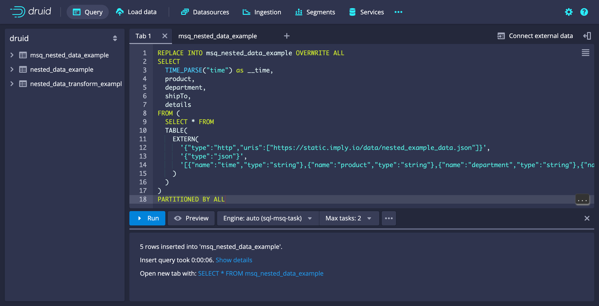

```sql
REPLACE INTO msq_nested_data_example OVERWRITE ALL
SELECT
  TIME_PARSE("time") as __time,
  product,
  department,
  shipTo,
  details
FROM (
  SELECT * FROM
  TABLE(
    EXTERN(
      '{"type":"http","uris":["https://static.imply.io/data/nested_example_data.json"]}',
      '{"type":"json"}',
      '[{"name":"time","type":"string"},{"name":"product","type":"string"},{"name":"department","type":"string"},{"name":"shipTo","type":"COMPLEX<json>"},{"name":"details","type":"COMPLEX<json>"}]'
    )
  )
)
PARTITIONED BY ALL
```

## Streaming ingestion

You can ingest nested data into Druid using the [streaming method](../ingestion/index.md#streaming)&mdash;for example, from a Kafka topic.

When you [define your supervisor spec](../ingestion/supervisor.md#start-a-supervisor), include a dimension with type `json` for each nested column. For example, the following supervisor spec from the [Kafka ingestion tutorial](../tutorials/tutorial-kafka.md) contains dimensions for the nested columns `event`, `agent`, and `geo_ip` in datasource `kttm-kafka`.

```json
{
   "type": "kafka",
   "spec": {
      "ioConfig": {
         "type": "kafka",
         "consumerProperties": {
           "bootstrap.servers": "localhost:9092"
      },
      "topic": "kttm",
      "inputFormat": {
         "type": "json"
      },
      "useEarliestOffset": true
   },
   "tuningConfig": {
     "type": "kafka"
   },
   "dataSchema": {
      "dataSource": "kttm-kafka",
      "timestampSpec": {
         "column": "timestamp",
         "format": "iso"
      },
      "dimensionsSpec": {
         "dimensions": [
            "session",
             "number",
             "client_ip",
             "language",
             "adblock_list",
             "app_version",
             "path",
             "loaded_image",
             "referrer",
             "referrer_host",
             "server_ip",
             "screen",
             "window",
             {
               "type": "long",
               "name": "session_length"
             },
             "timezone",
             "timezone_offset",
             {
               "type": "json",
               "name": "event"
             },
             {
               "type": "json",
               "name": "agent"
             },
             {
               "type": "json",
               "name": "geo_ip"
             }
           ]
         },
      "granularitySpec": {
         "queryGranularity": "none",
         "rollup": false,
         "segmentGranularity": "day"
      }
    }
  }
}
```


The [Kafka tutorial](../tutorials/tutorial-kafka.md) guides you through the steps to load sample nested data into a Kafka topic, then ingest the data into Druid.

### Transform data during SQL-based ingestion

You can use the [SQL JSON functions](./sql-json-functions.md) to transform nested data in your ingestion query.

For example, the following ingestion query is the SQL-based version of the [previous batch example](#transform-data-during-batch-ingestion)&mdash;it extracts `firstName`, `lastName`, and `address` from `shipTo` and creates a composite JSON object containing `product`, `details`, and `department`.

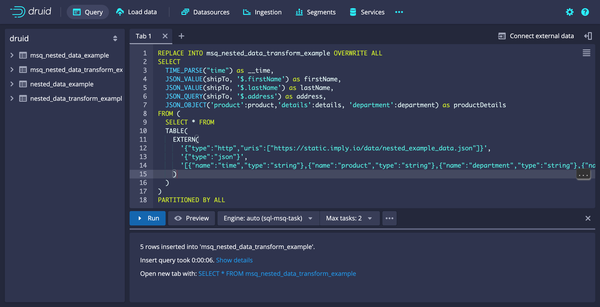

```sql
REPLACE INTO msq_nested_data_transform_example OVERWRITE ALL
SELECT
  TIME_PARSE("time") as __time,
  JSON_VALUE(shipTo, '$.firstName') as firstName,
  JSON_VALUE(shipTo, '$.lastName') as lastName,
  JSON_QUERY(shipTo, '$.address') as address,
  JSON_OBJECT('product':product,'details':details, 'department':department) as productDetails
FROM (
  SELECT * FROM
  TABLE(
    EXTERN(
      '{"type":"http","uris":["https://static.imply.io/data/nested_example_data.json"]}',
      '{"type":"json"}',
      '[{"name":"time","type":"string"},{"name":"product","type":"string"},{"name":"department","type":"string"},{"name":"shipTo","type":"COMPLEX<json>"},{"name":"details","type":"COMPLEX<json>"}]'
    )
  )
)
PARTITIONED BY ALL
```

## Ingest a JSON string as COMPLEX<json\>

If your source data contains serialized JSON strings, you can ingest the data as `COMPLEX<JSON>` as follows:
- During native batch ingestion, call the `parse_json` function in a `transform` object in the `transformSpec`.
- During SQL-based ingestion, use the PARSE_JSON keyword within your SELECT statement to transform the string values to JSON.
- If you are concerned that your data may not contain valid JSON, you can use `try_parse_json` for native batch or `TRY_PARSE_JSON` for SQL-based ingestion. For cases where the column does not contain valid JSON, Druid inserts a null value.

If you are using a text input format like `tsv`, you need to use this method to ingest data into a `COMPLEX<json>` column.

For example, consider the following deserialized row of the sample data set:

```
{"time": "2022-06-13T10:10:35Z", "product": "Bike", "department":"Sports", "shipTo":"{\"firstName\": \"Henry\",\"lastName\": \"Wuckert\",\"address\": {\"street\": \"5643 Jan Walk\",\"city\": \"Lake Bridget\",\"state\": \"HI\",\"country\":\"ME\",\"postalCode\": \"70204-2939\"},\"phoneNumbers\": [{\"type\":\"primary\",\"number\":\"593.475.0449 x86733\" },{\"type\":\"secondary\",\"number\":\"638-372-1210\"}]}", "details":"{\"color\":\"ivory\", \"price\":955.00}"}
```

The following examples demonstrate how to ingest the `shipTo` and `details` columns both as string type and as `COMPLEX<json>` in the `shipTo_parsed` and `details_parsed` columns.

<Tabs>
<TabItem value="1" label="SQL">

```
REPLACE INTO deserialized_example OVERWRITE ALL
WITH source AS (SELECT * FROM TABLE(
  EXTERN(
    '{"type":"inline","data":"{\"time\": \"2022-06-13T10:10:35Z\", \"product\": \"Bike\", \"department\":\"Sports\", \"shipTo\":\"{\\\"firstName\\\": \\\"Henry\\\",\\\"lastName\\\": \\\"Wuckert\\\",\\\"address\\\": {\\\"street\\\": \\\"5643 Jan Walk\\\",\\\"city\\\": \\\"Lake Bridget\\\",\\\"state\\\": \\\"HI\\\",\\\"country\\\":\\\"ME\\\",\\\"postalCode\\\": \\\"70204-2939\\\"},\\\"phoneNumbers\\\": [{\\\"type\\\":\\\"primary\\\",\\\"number\\\":\\\"593.475.0449 x86733\\\" },{\\\"type\\\":\\\"secondary\\\",\\\"number\\\":\\\"638-372-1210\\\"}]}\", \"details\":\"{\\\"color\\\":\\\"ivory\\\", \\\"price\\\":955.00}\"}\n"}',
    '{"type":"json"}',
    '[{"name":"time","type":"string"},{"name":"product","type":"string"},{"name":"department","type":"string"},{"name":"shipTo","type":"string"},{"name":"details","type":"string"}]'
  )
))
SELECT
  TIME_PARSE("time") AS __time,
  "product",
  "department",
  "shipTo",
  "details",
  PARSE_JSON("shipTo") as "shipTo_parsed",
  PARSE_JSON("details") as "details_parsed"
FROM source
PARTITIONED BY DAY
```
</TabItem>
<TabItem value="2" label="Native batch">

```
{
  "type": "index_parallel",
  "spec": {
    "ioConfig": {
      "type": "index_parallel",
      "inputSource": {
        "type": "inline",
        "data": "{\"time\": \"2022-06-13T10:10:35Z\", \"product\": \"Bike\", \"department\":\"Sports\", \"shipTo\":\"{\\\"firstName\\\": \\\"Henry\\\",\\\"lastName\\\": \\\"Wuckert\\\",\\\"address\\\": {\\\"street\\\": \\\"5643 Jan Walk\\\",\\\"city\\\": \\\"Lake Bridget\\\",\\\"state\\\": \\\"HI\\\",\\\"country\\\":\\\"ME\\\",\\\"postalCode\\\": \\\"70204-2939\\\"},\\\"phoneNumbers\\\": [{\\\"type\\\":\\\"primary\\\",\\\"number\\\":\\\"593.475.0449 x86733\\\" },{\\\"type\\\":\\\"secondary\\\",\\\"number\\\":\\\"638-372-1210\\\"}]}\", \"details\":\"{\\\"color\\\":\\\"ivory\\\", \\\"price\\\":955.00}\"}\n"
      },
      "inputFormat": {
        "type": "json"
      }
    },
    "tuningConfig": {
      "type": "index_parallel",
      "partitionsSpec": {
        "type": "dynamic"
      }
    },
    "dataSchema": {
      "dataSource": "deserialized_example",
      "timestampSpec": {
        "column": "time",
        "format": "iso"
      },
      "transformSpec": {
        "transforms": [
          {
            "type": "expression",
            "name": "shipTo_parsed",
            "expression": "parse_json(shipTo)"
          },
          {
            "type": "expression",
            "name": "details_parsed",
            "expression": "parse_json(details)"
          }
        ]
      },
      "dimensionsSpec": {
        "dimensions": [
          "product",
          "department",
          "shipTo",
          "details",
          "shipTo_parsed",
          "details_parsed"
        ]
      },
      "granularitySpec": {
        "queryGranularity": "none",
        "rollup": false,
        "segmentGranularity": "day"
      }
    }
  }
}
```
</TabItem>
</Tabs>

## Querying nested columns

Once ingested, Druid stores the JSON-typed columns as native JSON objects and presents them as `COMPLEX<json>`.

See the [Nested columns functions reference](./sql-json-functions.md) for information on the functions in the examples below.

Druid supports a small, simplified subset of the [JSONPath syntax](https://github.com/json-path/JsonPath/blob/master/README.md) operators, primarily limited to extracting individual values from nested data structures. See the [SQL JSON functions](./sql-json-functions.md#jsonpath-syntax) page for details.

### Displaying data types

The following example illustrates how you can display the data types for your columns. Note that `details` and `shipTo` display as `COMPLEX<json>`.

#### Example query: Display data types

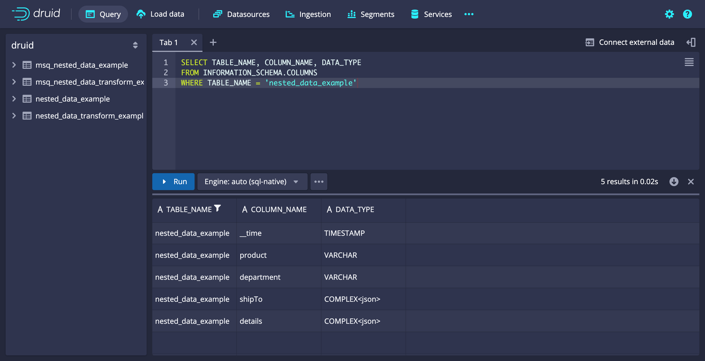

```sql
SELECT TABLE_NAME, COLUMN_NAME, DATA_TYPE
FROM INFORMATION_SCHEMA.COLUMNS
WHERE TABLE_NAME = 'nested_data_example'
```

Example query results:

```json
[["TABLE_NAME","COLUMN_NAME","DATA_TYPE"],["STRING","STRING","STRING"],["VARCHAR","VARCHAR","VARCHAR"],["nested_data_example","__time","TIMESTAMP"],["nested_data_example","department","VARCHAR"],["nested_data_example","details","COMPLEX<json>"],["nested_data_example","product","VARCHAR"],["nested_data_example","shipTo","COMPLEX<json>"]]
```

### Retrieving JSON data

You can retrieve JSON data directly from a table. Druid returns the results as a JSON object, so you can't use grouping, aggregation, or filtering operators.

#### Example query: Retrieve JSON data

The following example query extracts all data from `nested_data_example`:

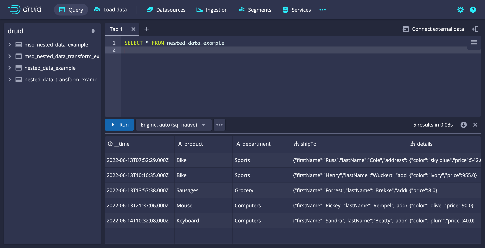

```sql
SELECT * FROM nested_data_example
```

Example query results:

```json
[["__time","department","details","product","shipTo"],["LONG","STRING","COMPLEX<json>","STRING","COMPLEX<json>"],["TIMESTAMP","VARCHAR","OTHER","VARCHAR","OTHER"],["2022-06-13T07:52:29.000Z","Sports","{\"color\":\"sky blue\",\"price\":542.0}","Bike","{\"firstName\":\"Russ\",\"lastName\":\"Cole\",\"address\":{\"street\":\"77173 Rusty Station\",\"city\":\"South Yeseniabury\",\"state\":\"WA\",\"country\":\"BL\",\"postalCode\":\"01893\"},\"phoneNumbers\":[{\"type\":\"primary\",\"number\":\"891-374-6188 x74568\"},{\"type\":\"secondary\",\"number\":\"1-248-998-4426 x33037\"}]}"],["2022-06-13T10:10:35.000Z","Sports","{\"color\":\"ivory\",\"price\":955.0}","Bike","{\"firstName\":\"Henry\",\"lastName\":\"Wuckert\",\"address\":{\"street\":\"5643 Jan Walk\",\"city\":\"Lake Bridget\",\"state\":\"HI\",\"country\":\"ME\",\"postalCode\":\"70204-2939\"},\"phoneNumbers\":[{\"type\":\"primary\",\"number\":\"593.475.0449 x86733\"},{\"type\":\"secondary\",\"number\":\"638-372-1210\"}]}"],["2022-06-13T13:57:38.000Z","Grocery","{\"price\":8.0}","Sausages","{\"firstName\":\"Forrest\",\"lastName\":\"Brekke\",\"address\":{\"street\":\"41548 Collier Divide\",\"city\":\"Wintheiserborough\",\"state\":\"WA\",\"country\":\"AD\",\"postalCode\":\"27577-6784\"},\"phoneNumbers\":[{\"type\":\"primary\",\"number\":\"(904) 890-0696 x581\"},{\"type\":\"secondary\",\"number\":\"676.895.6759\"}]}"],["2022-06-13T21:37:06.000Z","Computers","{\"color\":\"olive\",\"price\":90.0}","Mouse","{\"firstName\":\"Rickey\",\"lastName\":\"Rempel\",\"address\":{\"street\":\"6232 Green Glens\",\"city\":\"New Fermin\",\"state\":\"HI\",\"country\":\"CW\",\"postalCode\":\"98912-1195\"},\"phoneNumbers\":[{\"type\":\"primary\",\"number\":\"(689) 766-4272 x60778\"},{\"type\":\"secondary\",\"number\":\"375.662.4737 x24707\"}]}"],["2022-06-14T10:32:08.000Z","Computers","{\"color\":\"plum\",\"price\":40.0}","Keyboard","{\"firstName\":\"Sandra\",\"lastName\":\"Beatty\",\"address\":{\"street\":\"293 Grant Well\",\"city\":\"Loischester\",\"state\":\"FL\",\"country\":\"TV\",\"postalCode\":\"88845-0066\"},\"phoneNumbers\":[{\"type\":\"primary\",\"number\":\"1-788-771-7028 x8627\"},{\"type\":\"secondary\",\"number\":\"1-460-496-4884 x887\"}]}"]]
```

### Extracting nested data elements

The `JSON_VALUE` function is specially optimized to provide native Druid level performance when processing nested literal values, as if they were flattened, traditional, Druid column types. It does this by reading from the specialized nested columns and indexes that are built and stored in JSON objects when Druid creates segments.

Some operations using `JSON_VALUE` run faster than those using native Druid columns. For example, filtering numeric types uses the indexes built for nested numeric columns, which are not available for Druid DOUBLE, FLOAT, or LONG columns.

`JSON_VALUE` only returns literal types. Any paths that reference JSON objects or array types return null.

:::info
 To achieve the best possible performance, use the `JSON_VALUE` function whenever you query JSON objects.
:::

#### Example query: Extract nested data elements

The following example query illustrates how to use `JSON_VALUE` to extract specified elements from a `COMPLEX<json>` object. Note that the returned values default to type VARCHAR.

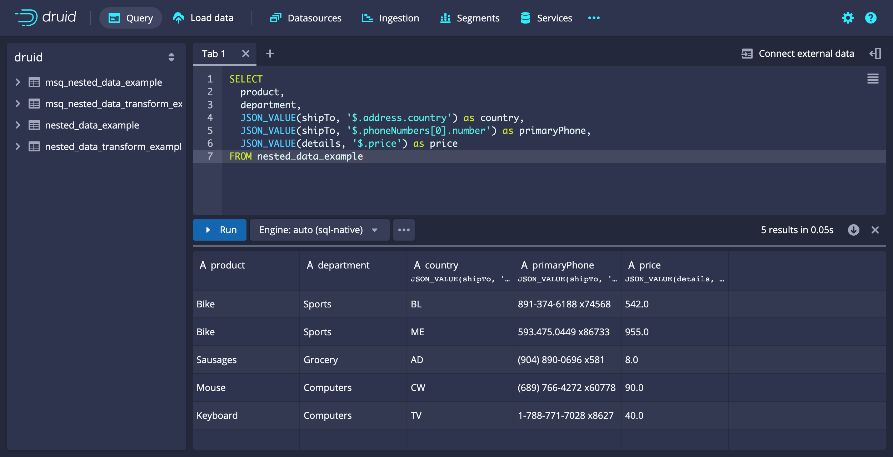

```sql
SELECT
  product,
  department,
  JSON_VALUE(shipTo, '$.address.country') as country,
  JSON_VALUE(shipTo, '$.phoneNumbers[0].number') as primaryPhone,
  JSON_VALUE(details, '$.price') as price
FROM nested_data_example
```

Example query results:

```json
[["product","department","country","primaryPhone","price"],["STRING","STRING","STRING","STRING","STRING"],["VARCHAR","VARCHAR","VARCHAR","VARCHAR","VARCHAR"],["Bike","Sports","BL","891-374-6188 x74568","542.0"],["Bike","Sports","ME","593.475.0449 x86733","955.0"],["Sausages","Grocery","AD","(904) 890-0696 x581","8.0"],["Mouse","Computers","CW","(689) 766-4272 x60778","90.0"],["Keyboard","Computers","TV","1-788-771-7028 x8627","40.0"]]
```

### Extracting nested data elements as a suggested type

You can use the `RETURNING` keyword to provide type hints to the `JSON_VALUE` function. This way the SQL planner produces the correct native Druid query, leading to expected results. This keyword allows you to specify a SQL type for the `path` value.

#### Example query: Extract nested data elements as suggested types

The following example query illustrates how to use `JSON_VALUE` and the `RETURNING` keyword to extract an element of nested data and return it as specified types.

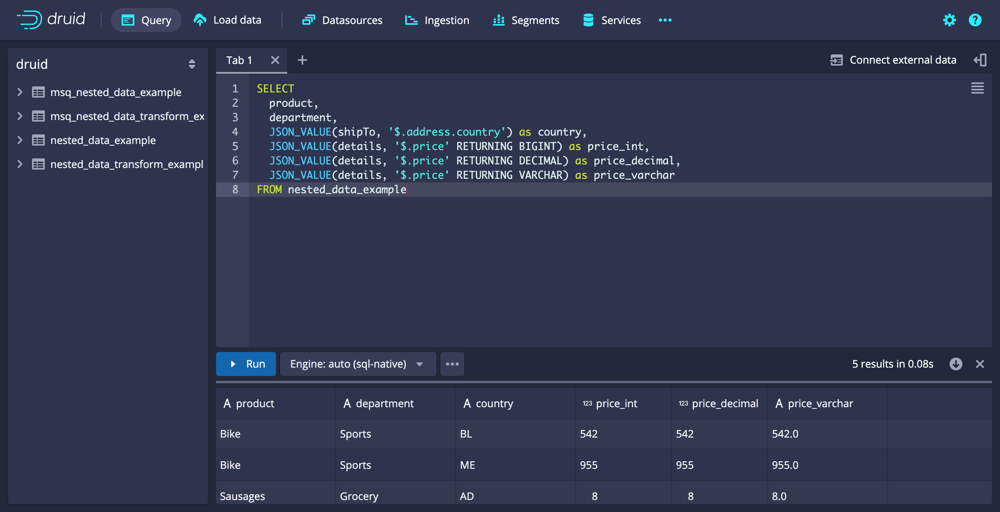

```sql
SELECT
  product,
  department,
  JSON_VALUE(shipTo, '$.address.country') as country,
  JSON_VALUE(details, '$.price' RETURNING BIGINT) as price_int,
  JSON_VALUE(details, '$.price' RETURNING DECIMAL) as price_decimal,
  JSON_VALUE(details, '$.price' RETURNING VARCHAR) as price_varchar
FROM nested_data_example
```

Query results:

```json
[["product","department","country","price_int","price_decimal","price_varchar"],["STRING","STRING","STRING","LONG","DOUBLE","STRING"],["VARCHAR","VARCHAR","VARCHAR","BIGINT","DECIMAL","VARCHAR"],["Bike","Sports","BL",542,542.0,"542.0"],["Bike","Sports","ME",955,955.0,"955.0"],["Sausages","Grocery","AD",8,8.0,"8.0"],["Mouse","Computers","CW",90,90.0,"90.0"],["Keyboard","Computers","TV",40,40.0,"40.0"]]
```

### Grouping, aggregating, and filtering

You can use `JSON_VALUE` expressions in any context where you can use traditional Druid columns, such as grouping, aggregation, and filtering.

#### Example query: Grouping and filtering

The following example query illustrates how to use SUM, WHERE, GROUP BY, and ORDER BY operators with `JSON_VALUE`.

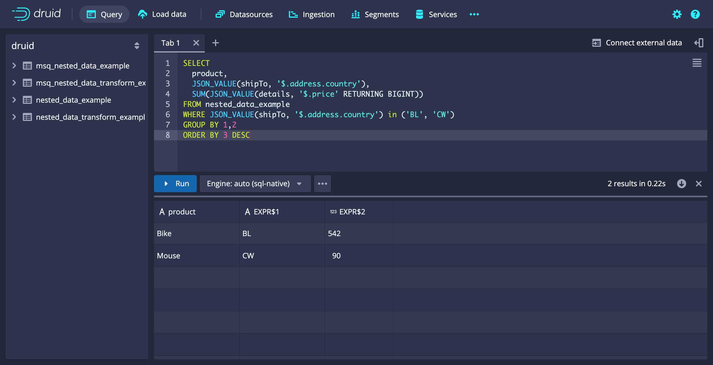

```sql
SELECT
  product,
  JSON_VALUE(shipTo, '$.address.country'),
  SUM(JSON_VALUE(details, '$.price' RETURNING BIGINT))
FROM nested_data_example
WHERE JSON_VALUE(shipTo, '$.address.country') in ('BL', 'CW')
GROUP BY 1,2
ORDER BY 3 DESC
```

Example query results:

```json
[["product","EXPR$1","EXPR$2"],["STRING","STRING","LONG"],["VARCHAR","VARCHAR","BIGINT"],["Bike","BL",542],["Mouse","CW",90]]
```

### Transforming JSON object data

In addition to `JSON_VALUE`, Druid offers a number of operators that focus on transforming JSON object data:

- `JSON_QUERY`
- `JSON_OBJECT`
- `PARSE_JSON`
- `TO_JSON_STRING`

These functions are primarily intended for use with SQL-based ingestion to transform data during insert operations, but they also work in traditional Druid SQL queries. Because most of these functions output JSON objects, they have the same limitations when used in traditional Druid queries as interacting with the JSON objects directly.

#### Example query: Return results in a JSON object

You can use the `JSON_QUERY` function to extract a partial structure from any JSON input and return results in a JSON object. Unlike `JSON_VALUE` it can extract objects and arrays.

The following example query illustrates the differences in output between `JSON_VALUE` and `JSON_QUERY`. The two output columns for `JSON_VALUE` contain null values only because `JSON_VALUE` only returns literal types.

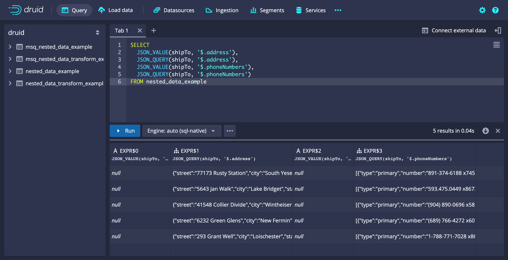

```sql
SELECT
  JSON_VALUE(shipTo, '$.address'),
  JSON_QUERY(shipTo, '$.address'),
  JSON_VALUE(shipTo, '$.phoneNumbers'),
  JSON_QUERY(shipTo, '$.phoneNumbers')
FROM nested_data_example
```

Example query results:

```json
[["EXPR$0","EXPR$1","EXPR$2","EXPR$3"],["STRING","COMPLEX<json>","STRING","COMPLEX<json>"],["VARCHAR","OTHER","VARCHAR","OTHER"],["","{\"street\":\"77173 Rusty Station\",\"city\":\"South Yeseniabury\",\"state\":\"WA\",\"country\":\"BL\",\"postalCode\":\"01893\"}","","[{\"type\":\"primary\",\"number\":\"891-374-6188 x74568\"},{\"type\":\"secondary\",\"number\":\"1-248-998-4426 x33037\"}]"],["","{\"street\":\"5643 Jan Walk\",\"city\":\"Lake Bridget\",\"state\":\"HI\",\"country\":\"ME\",\"postalCode\":\"70204-2939\"}","","[{\"type\":\"primary\",\"number\":\"593.475.0449 x86733\"},{\"type\":\"secondary\",\"number\":\"638-372-1210\"}]"],["","{\"street\":\"41548 Collier Divide\",\"city\":\"Wintheiserborough\",\"state\":\"WA\",\"country\":\"AD\",\"postalCode\":\"27577-6784\"}","","[{\"type\":\"primary\",\"number\":\"(904) 890-0696 x581\"},{\"type\":\"secondary\",\"number\":\"676.895.6759\"}]"],["","{\"street\":\"6232 Green Glens\",\"city\":\"New Fermin\",\"state\":\"HI\",\"country\":\"CW\",\"postalCode\":\"98912-1195\"}","","[{\"type\":\"primary\",\"number\":\"(689) 766-4272 x60778\"},{\"type\":\"secondary\",\"number\":\"375.662.4737 x24707\"}]"],["","{\"street\":\"293 Grant Well\",\"city\":\"Loischester\",\"state\":\"FL\",\"country\":\"TV\",\"postalCode\":\"88845-0066\"}","","[{\"type\":\"primary\",\"number\":\"1-788-771-7028 x8627\"},{\"type\":\"secondary\",\"number\":\"1-460-496-4884 x887\"}]"]]
```

#### Example query: Combine multiple JSON inputs into a single JSON object value

 The following query illustrates how to use `JSON_OBJECT` to combine nested data elements into a new object.

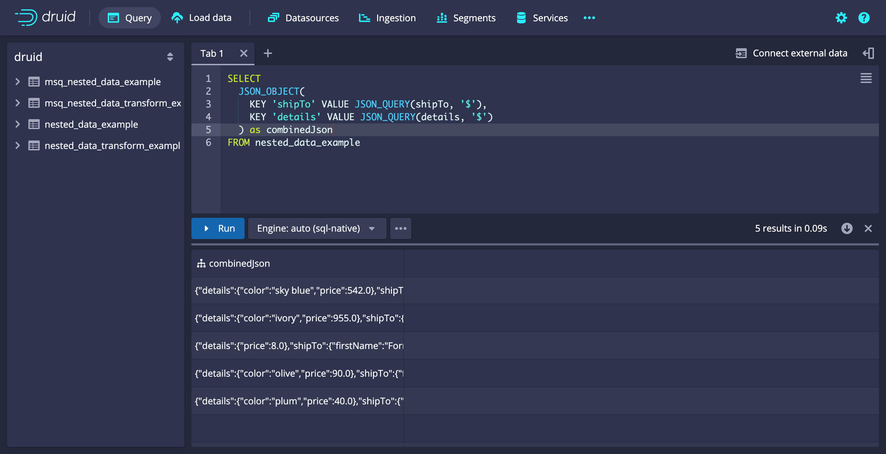

```sql
SELECT
  JSON_OBJECT(KEY 'shipTo' VALUE JSON_QUERY(shipTo, '$'), KEY 'details' VALUE JSON_QUERY(details, '$')) as combinedJson
FROM nested_data_example
```

Example query results:

```json
[["combinedJson"],["COMPLEX<json>"],["OTHER"],["{\"details\":{\"color\":\"sky blue\",\"price\":542.0},\"shipTo\":{\"firstName\":\"Russ\",\"lastName\":\"Cole\",\"address\":{\"street\":\"77173 Rusty Station\",\"city\":\"South Yeseniabury\",\"state\":\"WA\",\"country\":\"BL\",\"postalCode\":\"01893\"},\"phoneNumbers\":[{\"type\":\"primary\",\"number\":\"891-374-6188 x74568\"},{\"type\":\"secondary\",\"number\":\"1-248-998-4426 x33037\"}]}}"],["{\"details\":{\"color\":\"ivory\",\"price\":955.0},\"shipTo\":{\"firstName\":\"Henry\",\"lastName\":\"Wuckert\",\"address\":{\"street\":\"5643 Jan Walk\",\"city\":\"Lake Bridget\",\"state\":\"HI\",\"country\":\"ME\",\"postalCode\":\"70204-2939\"},\"phoneNumbers\":[{\"type\":\"primary\",\"number\":\"593.475.0449 x86733\"},{\"type\":\"secondary\",\"number\":\"638-372-1210\"}]}}"],["{\"details\":{\"price\":8.0},\"shipTo\":{\"firstName\":\"Forrest\",\"lastName\":\"Brekke\",\"address\":{\"street\":\"41548 Collier Divide\",\"city\":\"Wintheiserborough\",\"state\":\"WA\",\"country\":\"AD\",\"postalCode\":\"27577-6784\"},\"phoneNumbers\":[{\"type\":\"primary\",\"number\":\"(904) 890-0696 x581\"},{\"type\":\"secondary\",\"number\":\"676.895.6759\"}]}}"],["{\"details\":{\"color\":\"olive\",\"price\":90.0},\"shipTo\":{\"firstName\":\"Rickey\",\"lastName\":\"Rempel\",\"address\":{\"street\":\"6232 Green Glens\",\"city\":\"New Fermin\",\"state\":\"HI\",\"country\":\"CW\",\"postalCode\":\"98912-1195\"},\"phoneNumbers\":[{\"type\":\"primary\",\"number\":\"(689) 766-4272 x60778\"},{\"type\":\"secondary\",\"number\":\"375.662.4737 x24707\"}]}}"],["{\"details\":{\"color\":\"plum\",\"price\":40.0},\"shipTo\":{\"firstName\":\"Sandra\",\"lastName\":\"Beatty\",\"address\":{\"street\":\"293 Grant Well\",\"city\":\"Loischester\",\"state\":\"FL\",\"country\":\"TV\",\"postalCode\":\"88845-0066\"},\"phoneNumbers\":[{\"type\":\"primary\",\"number\":\"1-788-771-7028 x8627\"},{\"type\":\"secondary\",\"number\":\"1-460-496-4884 x887\"}]}}"]]
```

### Using other transform functions

Druid provides the following additional transform functions:

- `PARSE_JSON`: Deserializes a string value into a JSON object.
- `TO_JSON_STRING`: Performs the operation of `TO_JSON` and then serializes the value into a string.

#### Example query: Parse and deserialize data

 The following query illustrates how to use the transform functions to parse and deserialize data.

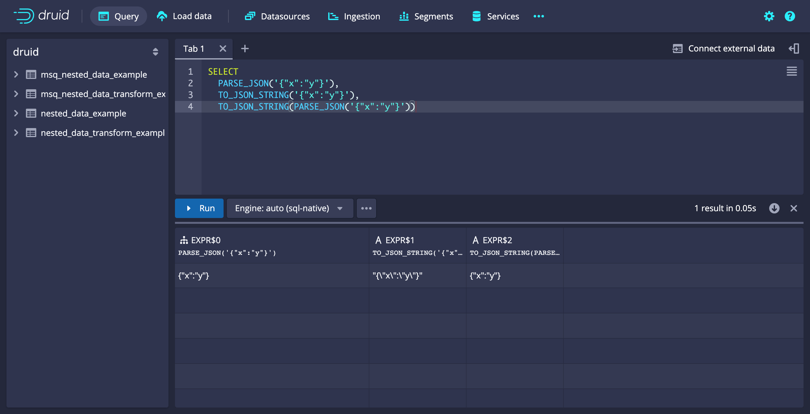

```sql
SELECT
  PARSE_JSON('{"x":"y"}'),
  TO_JSON_STRING('{"x":"y"}'),
  TO_JSON_STRING(PARSE_JSON('{"x":"y"}'))
```

Example query results:

```json
[["EXPR$0","EXPR$2","EXPR$3"],["COMPLEX<json>","STRING","STRING"],["OTHER","VARCHAR","VARCHAR"],["{\"x\":\"y\"}","\"{\\\"x\\\":\\\"y\\\"}\"","{\"x\":\"y\"}"]]
```

### Using helper operators

The `JSON_KEYS` and `JSON_PATHS` functions are helper operators that you can use to examine JSON object schema. Use them to plan your queries, for example to work out which paths to use in `JSON_VALUE`.

#### Example query: Examine JSON object schema

 The following query illustrates how to use the helper operators to examine a nested data object.

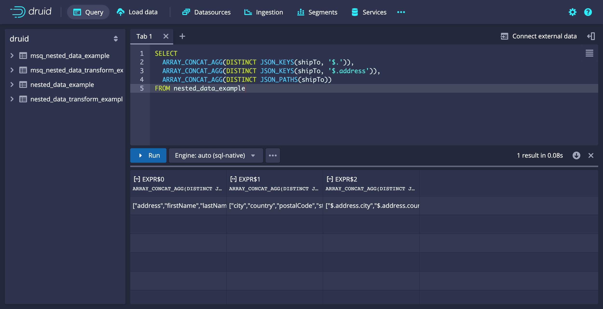

```sql
SELECT
  ARRAY_CONCAT_AGG(DISTINCT JSON_KEYS(shipTo, '$.')),
  ARRAY_CONCAT_AGG(DISTINCT JSON_KEYS(shipTo, '$.address')),
  ARRAY_CONCAT_AGG(DISTINCT JSON_PATHS(shipTo))
FROM nested_data_example
```

Example query results:

```json
[["EXPR$0","EXPR$1","EXPR$2","EXPR$3"],["COMPLEX<json>","COMPLEX<json>","STRING","STRING"],["OTHER","OTHER","VARCHAR","VARCHAR"],["{\"x\":\"y\"}","\"{\\\"x\\\":\\\"y\\\"}\"","\"{\\\"x\\\":\\\"y\\\"}\"","{\"x\":\"y\"}"]]
```

## Known issues

Before you start using the nested columns feature, consider the following known issues:

- Directly using `COMPLEX<json>` columns and expressions is not well integrated into the Druid query engine. It can result in errors or undefined behavior when grouping and filtering, and when you use `COMPLEX<json>` objects as inputs to aggregators. As a workaround, consider using `TO_JSON_STRING` to coerce the values to strings before you perform these operations.
- Directly using array-typed outputs from `JSON_KEYS` and `JSON_PATHS` is moderately supported by the Druid query engine. You can group on these outputs, and there are a number of array expressions that can operate on these values, such as `ARRAY_CONCAT_AGG`. However, some operations are not well defined for use outside array-specific functions, such as filtering using `=` or `IS NULL`.
- Input validation for JSON SQL operators is currently incomplete, which sometimes results in undefined behavior or unhelpful error messages.
- Ingesting data with a very complex nested structure is potentially an expensive operation and may require you to tune ingestion tasks and/or cluster parameters to account for increased memory usage or overall task run time. When you tune your ingestion configuration, treat each nested literal field inside an object as a flattened top-level Druid column.

## Further reading

For more information, see the following pages:

- [Nested columns functions reference](./sql-json-functions.md) for details of the functions used in the examples on this page.
- [Multi-stage query architecture overview](../multi-stage-query/index.md) for information on how to set up and use this feature.
- [Ingestion spec reference](../ingestion/ingestion-spec.md) for information on native ingestion and [`transformSpec`](../ingestion/ingestion-spec.md#transformspec).
- [Data formats](../ingestion/data-formats.md) for information on [`flattenSpec`](../ingestion/data-formats.md#flattenspec).
