<!--
  ~ Licensed to the Apache Software Foundation (ASF) under one
  ~ or more contributor license agreements.  See the NOTICE file
  ~ distributed with this work for additional information
  ~ regarding copyright ownership.  The ASF licenses this file
  ~ to you under the Apache License, Version 2.0 (the
  ~ "License"); you may not use this file except in compliance
  ~ with the License.  You may obtain a copy of the License at
  ~
  ~   http://www.apache.org/licenses/LICENSE-2.0
  ~
  ~ Unless required by applicable law or agreed to in writing,
  ~ software distributed under the License is distributed on an
  ~ "AS IS" BASIS, WITHOUT WARRANTIES OR CONDITIONS OF ANY
  ~ KIND, either express or implied.  See the License for the
  ~ specific language governing permissions and limitations
  ~ under the License.
    ~
  ~ Nested columns is an experimental feature that is subject to 
  ~ change or removal at any time.
  -->

> Nested columns is an experimental feature available starting in Apache Druid 24.0. As an experimental feature, functionality documented on this page is subject to change or removal in future releases. Review the release notes and this page to stay up to date with changes.

The nested columns feature allows you to store nested data directly in Apache Druid segments. Druid indexes and optimizes the nested data to enable the extraction of 'literal' values at query time. 

Druid currently supports ingesting JSON-format nested columns with this feature. If you want to ingest nested data in another format, consider using the [flattenSpec object](../ingestion/data-formats.md#flattenspec).

### Example nested data

The examples in this topic use the data in [nested-example-data.json](../../examples/quickstart/tutorial/nested-example-data.json). The file contains a simple fascimile of an order tracking and shipping table. 

When pretty-printed a sample row in `nested_example_data` looks like this:

```json
{
    "time":"2022-6-14T10:32:08Z",
    "product":"Keyboard",
    "department":"Computers",
    "shipTo":{
        "firstName": "Sandra",
        "lastName": "Beatty",
        "address": {
            "street": "293 Grant Well",
            "city": "Loischester",
            "state": "FL",
            "country": "TV",
            "postalCode": "88845-0066"
        },
        "phoneNumbers": [
            {"type":"primary","number":"1-788-771-7028 x8627" },
            {"type":"secondary","number":"1-460-496-4884 x887"}
        ]
    },
    "details"{"color":"plum","price":"40.00"}
}
```

## Setup and ingestion

Support for nested columns is enabled by default. 

To configure a dimension as a nested data type, include a `dimensions` object in the `dimensionsSpec` property of your ingestion spec.

For example, the following snippet of the ingestion spec instructs Druid to ingest the following:

- `product` and `department` as string-typed dimensions.
- `shipTo` as a JSON-type nested dimension.
- `details` as a JSON-type nested dimension.

```json
"dimensionsSpec": {
  "dimensions": [
      "product",
      "department",
    {
      "type": "json",
      "name": "shipTo"
    },
    {
      "type": "json",
      "name": "details"
    }
  ]
},
```

### Transform data during ingestion

You can transform nested data during ingestion, using the [JSON SQL functions](#json-sql-functions) described below. To do this, include a `transforms` object in the `transformSpec` property of your ingestion spec.

For example, the following snippet of the ingestion spec applies the JSON_VALUE function to the `shipTo` nested column:

```json
"transformSpec": {
  "transforms":
    {
      "type": "expression",
      "name": "transformedJson",
      "expression": "json_value(shipTo, '$.x.y')"
    }
},
```

### Multi-Stage Query Architecture (MSQA) configuration

To ingest nested data using MSQA, specify `COMPLEX<json>` as the column `type` when you define the row signature. For example:

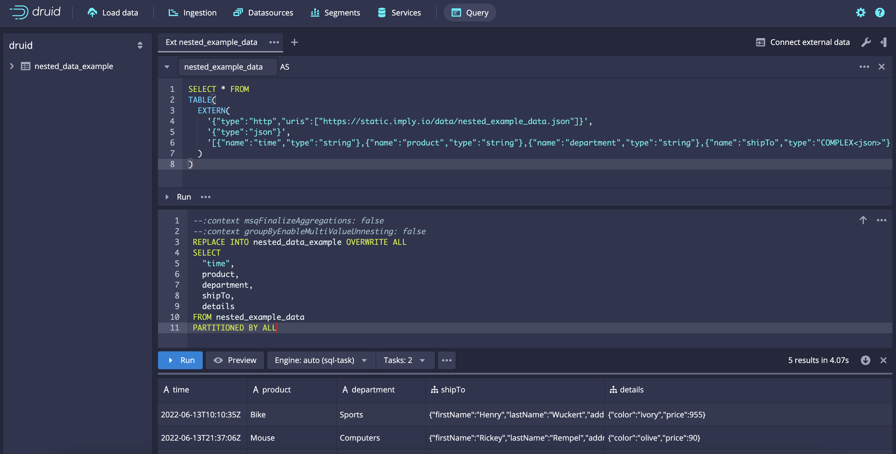

```sql
--:context msqFinalizeAggregations: false
--:context groupByEnableMultiValueUnnesting: false

REPLACE INTO nested_data_example OVERWRITE ALL
SELECT
  "time",
  product,
  department,
  shipTo,
  details
FROM (
  SELECT * FROM
  TABLE(
    EXTERN(
      '{"type":"http","uris":["https://github.com/apache/druid/tree/master/examples/quickstart/tutorial/nested-example-data.json"]}',
      '{"type":"json"}',
      '[{"name":"time","type":"string"},{"name":"product","type":"string"},{"name":"department","type":"string"},{"name":"shipTo","type":"COMPLEX<json>"},{"name":"details","type":"COMPLEX<json>"}]'
    )
  )
)
PARTITIONED BY ALL
```

## Querying nested columns

Once ingested, Druid stores the JSON-typed columns as native JSON objects, presented as `COMPLEX<json>`. For example, see the `details` and `shipTo` columns in the following query.

Example query 1:

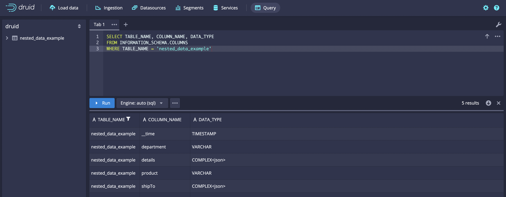

```sql
SELECT TABLE_NAME, COLUMN_NAME, DATA_TYPE
FROM INFORMATION_SCHEMA.COLUMNS
WHERE TABLE_NAME = 'nested_data_example'
```

Example query 1 results:

```json
[["TABLE_NAME","COLUMN_NAME","DATA_TYPE"],["STRING","STRING","STRING"],["VARCHAR","VARCHAR","VARCHAR"],["nested_data_example","__time","TIMESTAMP"],["nested_data_example","department","VARCHAR"],["nested_data_example","details","COMPLEX<json>"],["nested_data_example","product","VARCHAR"],["nested_data_example","shipTo","COMPLEX<json>"]]
```

You can retrieve the JSON data directly from the table, as shown in example query 2.

Example query 2:

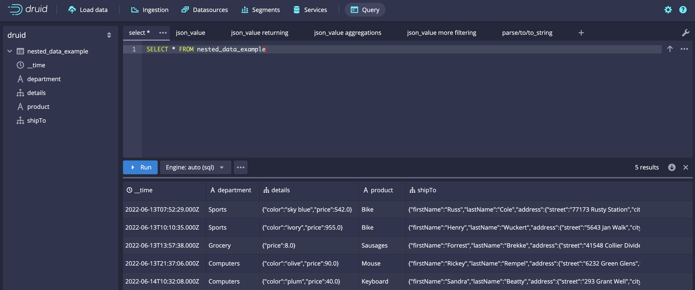

```sql
SELECT * FROM nested_data_example
```

Example query 2 results:

```json
[["__time","department","details","product","shipTo"],["LONG","STRING","COMPLEX<json>","STRING","COMPLEX<json>"],["TIMESTAMP","VARCHAR","OTHER","VARCHAR","OTHER"],["2022-06-13T07:52:29.000Z","Sports","{\"color\":\"sky blue\",\"price\":542.0}","Bike","{\"firstName\":\"Russ\",\"lastName\":\"Cole\",\"address\":{\"street\":\"77173 Rusty Station\",\"city\":\"South Yeseniabury\",\"state\":\"WA\",\"country\":\"BL\",\"postalCode\":\"01893\"},\"phoneNumbers\":[{\"type\":\"primary\",\"number\":\"891-374-6188 x74568\"},{\"type\":\"secondary\",\"number\":\"1-248-998-4426 x33037\"}]}"],["2022-06-13T10:10:35.000Z","Sports","{\"color\":\"ivory\",\"price\":955.0}","Bike","{\"firstName\":\"Henry\",\"lastName\":\"Wuckert\",\"address\":{\"street\":\"5643 Jan Walk\",\"city\":\"Lake Bridget\",\"state\":\"HI\",\"country\":\"ME\",\"postalCode\":\"70204-2939\"},\"phoneNumbers\":[{\"type\":\"primary\",\"number\":\"593.475.0449 x86733\"},{\"type\":\"secondary\",\"number\":\"638-372-1210\"}]}"],["2022-06-13T13:57:38.000Z","Grocery","{\"price\":8.0}","Sausages","{\"firstName\":\"Forrest\",\"lastName\":\"Brekke\",\"address\":{\"street\":\"41548 Collier Divide\",\"city\":\"Wintheiserborough\",\"state\":\"WA\",\"country\":\"AD\",\"postalCode\":\"27577-6784\"},\"phoneNumbers\":[{\"type\":\"primary\",\"number\":\"(904) 890-0696 x581\"},{\"type\":\"secondary\",\"number\":\"676.895.6759\"}]}"],["2022-06-13T21:37:06.000Z","Computers","{\"color\":\"olive\",\"price\":90.0}","Mouse","{\"firstName\":\"Rickey\",\"lastName\":\"Rempel\",\"address\":{\"street\":\"6232 Green Glens\",\"city\":\"New Fermin\",\"state\":\"HI\",\"country\":\"CW\",\"postalCode\":\"98912-1195\"},\"phoneNumbers\":[{\"type\":\"primary\",\"number\":\"(689) 766-4272 x60778\"},{\"type\":\"secondary\",\"number\":\"375.662.4737 x24707\"}]}"],["2022-06-14T10:32:08.000Z","Computers","{\"color\":\"plum\",\"price\":40.0}","Keyboard","{\"firstName\":\"Sandra\",\"lastName\":\"Beatty\",\"address\":{\"street\":\"293 Grant Well\",\"city\":\"Loischester\",\"state\":\"FL\",\"country\":\"TV\",\"postalCode\":\"88845-0066\"},\"phoneNumbers\":[{\"type\":\"primary\",\"number\":\"1-788-771-7028 x8627\"},{\"type\":\"secondary\",\"number\":\"1-460-496-4884 x887\"}]}"]]
```

Druid returns the results as a JSON object, so you can't use grouping, aggregation, or filtering operators.

### JSON SQL functions

Since direct operation on JSON objects is quite limited, Druid provides a number of JSON SQL functions you can use to interact with them. 

These functions use [JSONPath syntax](#jsonpath-syntax) to interact with nested data. You must provide all `path` parameters as JSONPath string type literal values. 

Apply these functions in [Druid SQL](./sql.md) or [native queries](./querying.md).

| Function | Description |
| --- | --- |
|`JSON_KEYS(expr, path)`| Returns an array of field names in a `COMPLEX<json>` typed `expr`, at the specified `path`.|
|`JSON_OBJECT(KEY expr1 VALUE expr2[, KEY expr3 VALUE expr4, ...])` | Constructs a new `COMPLEX<json>` object. The `KEY` expressions must evaluate to string types, but the `VALUE` expressions can be composed of any input type, including other `COMPLEX<json>` values.|
|`JSON_PATHS(expr)`| Returns an array of all paths which refer to literal values in a `COMPLEX<json>` typed `expr`, in JSONPath format. |
|`JSON_QUERY(expr, path)`| Extracts a `COMPLEX<json>` value from a `COMPLEX<json>` typed  `expr`, at the specified `path`. |
|`JSON_VALUE(expr, path [RETURNING sqlType])`| Extracts a literal value from a `COMPLEX<json>` typed  `expr`, at the specified `path`. If you specify `RETURNING` and an SQL type name (such as varchar, bigint, decimal, or double) the function plans the query using the suggested type. Otherwise it attempts to infer the type based on the context. If it can't infer the type, it defaults to varchar.|
|`PARSE_JSON(expr)`|Parses a string type `expr` into a `COMPLEX<json>` object. This operator deserializes JSON values when processing them, translating stringified JSON into a nested structure.|
|`TO_JSON(expr)`|Casts any type of `expr` into a `COMPLEX<json>` object. This operator does not deserialize JSON strings during conversion.|
|`TO_JSON_STRING(expr)`|Casts an `expr` of any type into a `COMPLEX<json>` object, then serializes the value into a JSON string.|

### JSONPath syntax

Druid supports a small, simplified subset of the [JSONPath syntax](https://github.com/json-path/JsonPath/blob/master/README.md) operators, primarily limited to extracting individual values from nested data structures.

|operator|description|
| --- | --- |
|`$`| Root element. All JSONPath expressions start with this operator. |
|`.<name>`| Child element in dot notation. |
|`['<name>']`| Child element in bracket notation. |
|`[<number>]`| Array index. |

**Examples**

Input JSON

```json
{"x":1, "y":[1, 2, 3]}
```

* `$`      -> `{"x":1, "y":[1, 2, 3]}`
* `$.x`    -> `1`
* `$['y']` -> `[1, 2, 3]`
* `$.y[1]` -> `2`

### Using JSON_VALUE

The `JSON_VALUE` function is specially optimized to provide 'native' Druid level performance when processing nested literal values, as if they were flattened, traditional, Druid column types. It does this by reading from the specialized nested columns and indexes that are built and stored in JSON objects when Druid creates segments. 

Some operations using `JSON_VALUE` run faster than those using native Druid columns. For example, filtering numeric types uses the indexes built for nested numeric columns, which are not available for Druid double, float, or long columns.

`JSON_VALUE` only returns literal types. Any paths that reference JSON objects or array types return null.

> To achieve the best possible performance, use the `JSON_VALUE` function whenever you query JSON objects.

Example query 3:

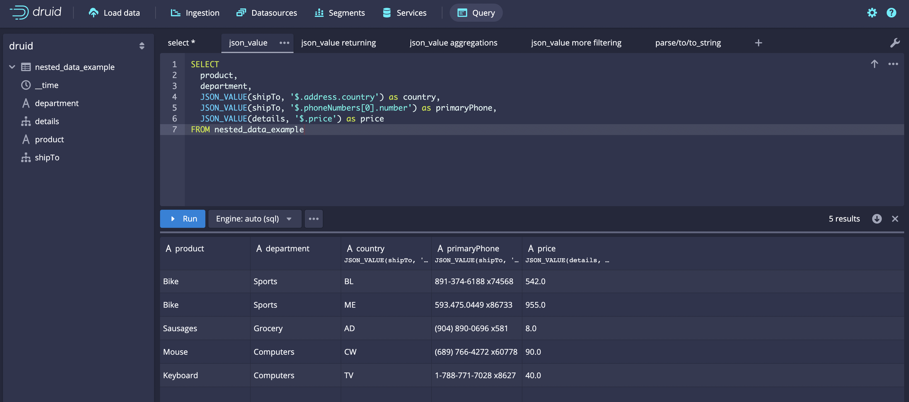

```sql
SELECT
  product,
  department,
  JSON_VALUE(shipTo, '$.address.country') as country,
  JSON_VALUE(shipTo, '$.phoneNumbers[0].number') as primaryPhone,
  JSON_VALUE(details, '$.price') as price
FROM nested_data_example
```

Example query 3 results:

```json
[["product","department","country","primaryPhone","price"],["STRING","STRING","STRING","STRING","STRING"],["VARCHAR","VARCHAR","VARCHAR","VARCHAR","VARCHAR"],["Bike","Sports","BL","891-374-6188 x74568","542.0"],["Bike","Sports","ME","593.475.0449 x86733","955.0"],["Sausages","Grocery","AD","(904) 890-0696 x581","8.0"],["Mouse","Computers","CW","(689) 766-4272 x60778","90.0"],["Keyboard","Computers","TV","1-788-771-7028 x8627","40.0"]]
```

#### RETURNING keyword

You can use the `RETURNING` keyword to provide type hints to the `JSON_VALUE` function. This way the SQL planner produces the correct native Druid query, leading to expected results. This keyword allows you to specify a SQL type for the `path` value.

Example query 4:

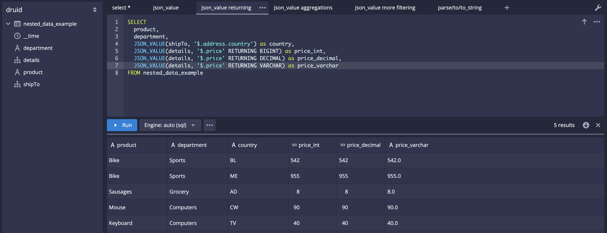

```sql
SELECT
  product,
  department,
  JSON_VALUE(shipTo, '$.address.country') as country,
  JSON_VALUE(details, '$.price' RETURNING BIGINT) as price_int,
  JSON_VALUE(details, '$.price' RETURNING DECIMAL) as price_decimal,
  JSON_VALUE(details, '$.price' RETURNING VARCHAR) as price_varchar
FROM nested_data_example
```

Example query 4 results:

```json
[["product","department","country","price_int","price_decimal","price_varchar"],["STRING","STRING","STRING","LONG","DOUBLE","STRING"],["VARCHAR","VARCHAR","VARCHAR","BIGINT","DECIMAL","VARCHAR"],["Bike","Sports","BL",542,542.0,"542.0"],["Bike","Sports","ME",955,955.0,"955.0"],["Sausages","Grocery","AD",8,8.0,"8.0"],["Mouse","Computers","CW",90,90.0,"90.0"],["Keyboard","Computers","TV",40,40.0,"40.0"]]
```

#### Grouping, aggregation, and filtering

You can use `JSON_VALUE` expressions in any context where traditional Druid columns can be used, such as grouping, aggregation, and filtering.

Example query 5:

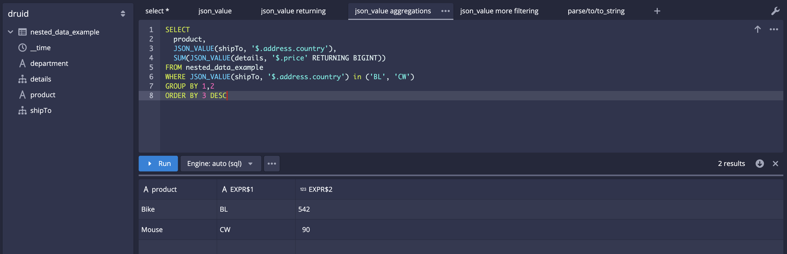

```sql
SELECT
  product,
  JSON_VALUE(shipTo, '$.address.country'),
  SUM(JSON_VALUE(details, '$.price' RETURNING BIGINT))
FROM nested_data_example
WHERE JSON_VALUE(shipTo, '$.address.country') in ('BL', 'CW')
GROUP BY 1,2
ORDER BY 3 DESC
```

Example query 5 results:

```json
[["product","EXPR$1","EXPR$2"],["STRING","STRING","LONG"],["VARCHAR","VARCHAR","BIGINT"],["Bike","BL",542],["Mouse","CW",90]]
```

Example query 6:

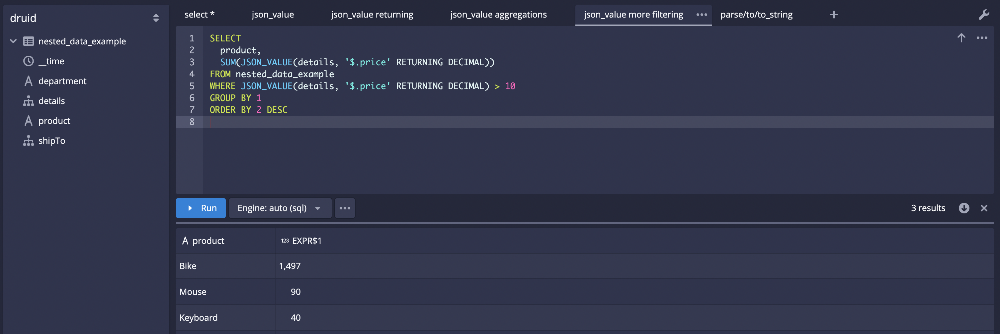

```sql
SELECT
  product,
  SUM(JSON_VALUE(details, '$.price' RETURNING DECIMAL))
FROM nested_data_example
WHERE JSON_VALUE(details, '$.price' RETURNING DECIMAL) > 10
GROUP BY 1
ORDER BY 2 DESC
```

Example query 6 results:

```json
[["product","EXPR$1"],["STRING","DOUBLE"],["VARCHAR","DOUBLE"],["Bike",1497.0],["Mouse",90.0],["Keyboard",40.0]]
```

### JSON transformation operators

In addition to `JSON_VALUE`, Druid offers a number of operators that focus on transforming JSON object data: 

- [JSON_QUERY](#using-json_query)
- [JSON_OBJECT](#using-json_object)
- [PARSE_JSON](#using-parse_json-to_json-and-to_json_string)
- [TO_JSON](#using-parse_json-to_json-and-to_json_string)
- [TO_JSON_STRING](#using-parse_json-to_json-and-to_json_string)

These functions are primarily intended for use with the Multi-Stage Query Engine extension for transforming data during insert operations, but they also work in traditional Druid SQL queries. Because most of these functions output JSON objects, they have the same limitations when used in traditional Druid queries as interacting with the JSON objects directly.

#### Using JSON_QUERY

`JSON_QUERY` is similar to `JSON_VALUE`, except it always returns results in a JSON object, and can extract objects and arrays.

Example query 7:

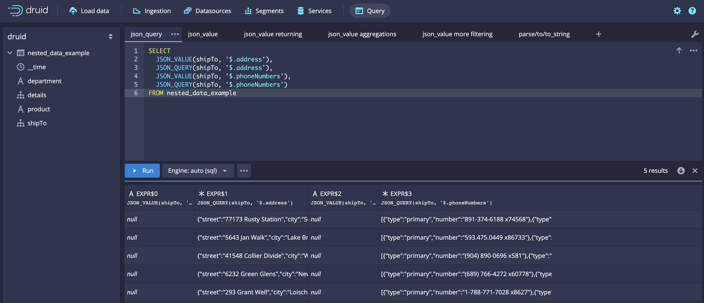

```sql
SELECT
  JSON_VALUE(shipTo, '$.address'),
  JSON_QUERY(shipTo, '$.address'),
  JSON_VALUE(shipTo, '$.phoneNumbers'),
  JSON_QUERY(shipTo, '$.phoneNumbers')
FROM nested_data_example
```

Example query 7 results:

```json
[["EXPR$0","EXPR$1","EXPR$2","EXPR$3"],["STRING","COMPLEX","STRING","COMPLEX"],["VARCHAR","OTHER","VARCHAR","OTHER"],["","{\"street\":\"77173 Rusty Station\",\"city\":\"South Yeseniabury\",\"state\":\"WA\",\"country\":\"BL\",\"postalCode\":\"01893\"}","","[{\"type\":\"primary\",\"number\":\"891-374-6188 x74568\"},{\"type\":\"secondary\",\"number\":\"1-248-998-4426 x33037\"}]"],["","{\"street\":\"5643 Jan Walk\",\"city\":\"Lake Bridget\",\"state\":\"HI\",\"country\":\"ME\",\"postalCode\":\"70204-2939\"}","","[{\"type\":\"primary\",\"number\":\"593.475.0449 x86733\"},{\"type\":\"secondary\",\"number\":\"638-372-1210\"}]"],["","{\"street\":\"41548 Collier Divide\",\"city\":\"Wintheiserborough\",\"state\":\"WA\",\"country\":\"AD\",\"postalCode\":\"27577-6784\"}","","[{\"type\":\"primary\",\"number\":\"(904) 890-0696 x581\"},{\"type\":\"secondary\",\"number\":\"676.895.6759\"}]"],["","{\"street\":\"6232 Green Glens\",\"city\":\"New Fermin\",\"state\":\"HI\",\"country\":\"CW\",\"postalCode\":\"98912-1195\"}","","[{\"type\":\"primary\",\"number\":\"(689) 766-4272 x60778\"},{\"type\":\"secondary\",\"number\":\"375.662.4737 x24707\"}]"],["","{\"street\":\"293 Grant Well\",\"city\":\"Loischester\",\"state\":\"FL\",\"country\":\"TV\",\"postalCode\":\"88845-0066\"}","","[{\"type\":\"primary\",\"number\":\"1-788-771-7028 x8627\"},{\"type\":\"secondary\",\"number\":\"1-460-496-4884 x887\"}]"]]
```

You can use `JSON_QUERY` to extract a partial structure from any JSON input.

#### Using JSON_OBJECT

`JSON_OBJECT` allows you to construct an arbitrary JSON object structure. It is particularly useful for combining multiple JSON inputs into a single JSON object value.

Example query 8:

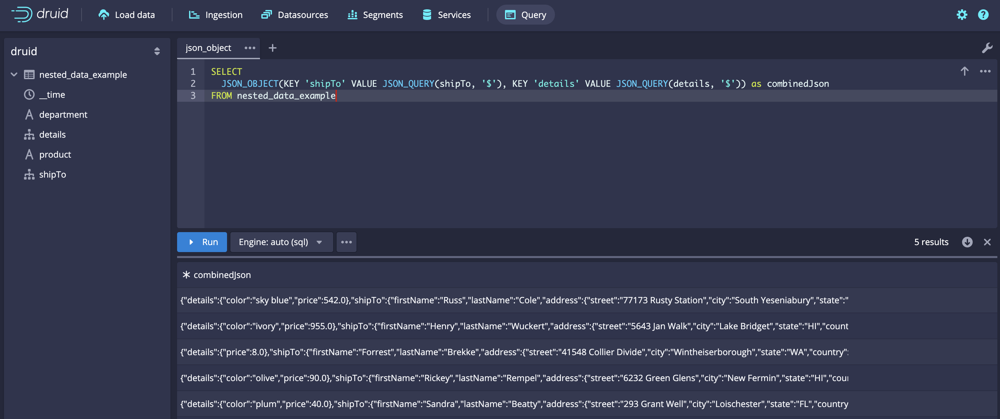

```sql
SELECT
  JSON_OBJECT(KEY 'shipTo' VALUE JSON_QUERY(shipTo, '$'), KEY 'details' VALUE JSON_QUERY(details, '$')) as combinedJson
FROM nested_data_example
```

Example query 8 results:

```json
[["combinedJson"],["COMPLEX"],["OTHER"],["{\"details\":{\"color\":\"sky blue\",\"price\":542.0},\"shipTo\":{\"firstName\":\"Russ\",\"lastName\":\"Cole\",\"address\":{\"street\":\"77173 Rusty Station\",\"city\":\"South Yeseniabury\",\"state\":\"WA\",\"country\":\"BL\",\"postalCode\":\"01893\"},\"phoneNumbers\":[{\"type\":\"primary\",\"number\":\"891-374-6188 x74568\"},{\"type\":\"secondary\",\"number\":\"1-248-998-4426 x33037\"}]}}"],["{\"details\":{\"color\":\"ivory\",\"price\":955.0},\"shipTo\":{\"firstName\":\"Henry\",\"lastName\":\"Wuckert\",\"address\":{\"street\":\"5643 Jan Walk\",\"city\":\"Lake Bridget\",\"state\":\"HI\",\"country\":\"ME\",\"postalCode\":\"70204-2939\"},\"phoneNumbers\":[{\"type\":\"primary\",\"number\":\"593.475.0449 x86733\"},{\"type\":\"secondary\",\"number\":\"638-372-1210\"}]}}"],["{\"details\":{\"price\":8.0},\"shipTo\":{\"firstName\":\"Forrest\",\"lastName\":\"Brekke\",\"address\":{\"street\":\"41548 Collier Divide\",\"city\":\"Wintheiserborough\",\"state\":\"WA\",\"country\":\"AD\",\"postalCode\":\"27577-6784\"},\"phoneNumbers\":[{\"type\":\"primary\",\"number\":\"(904) 890-0696 x581\"},{\"type\":\"secondary\",\"number\":\"676.895.6759\"}]}}"],["{\"details\":{\"color\":\"olive\",\"price\":90.0},\"shipTo\":{\"firstName\":\"Rickey\",\"lastName\":\"Rempel\",\"address\":{\"street\":\"6232 Green Glens\",\"city\":\"New Fermin\",\"state\":\"HI\",\"country\":\"CW\",\"postalCode\":\"98912-1195\"},\"phoneNumbers\":[{\"type\":\"primary\",\"number\":\"(689) 766-4272 x60778\"},{\"type\":\"secondary\",\"number\":\"375.662.4737 x24707\"}]}}"],["{\"details\":{\"color\":\"plum\",\"price\":40.0},\"shipTo\":{\"firstName\":\"Sandra\",\"lastName\":\"Beatty\",\"address\":{\"street\":\"293 Grant Well\",\"city\":\"Loischester\",\"state\":\"FL\",\"country\":\"TV\",\"postalCode\":\"88845-0066\"},\"phoneNumbers\":[{\"type\":\"primary\",\"number\":\"1-788-771-7028 x8627\"},{\"type\":\"secondary\",\"number\":\"1-460-496-4884 x887\"}]}}"]]
```

#### Using PARSE_JSON, TO_JSON, and TO_JSON_STRING

`PARSE_JSON` deserializes a string value into a JSON object. In contrast, `TO_JSON` is similar to casting a value to a JSON object, but otherwise leaves it as is, to homogenize inputs of a variety of types. `TO_JSON_STRING` performs the operation of `TO_JSON` and then serializes the value into a string.

Example query 9:

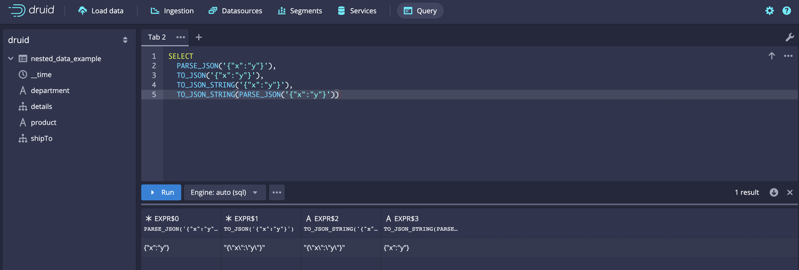

```sql
SELECT
  PARSE_JSON('{"x":"y"}'),
  TO_JSON('{"x":"y"}'),
  TO_JSON_STRING('{"x":"y"}'),
  TO_JSON_STRING(PARSE_JSON('{"x":"y"}'))
```

Example query 9 results:

```json
[["EXPR$0","EXPR$1","EXPR$2","EXPR$3"],["COMPLEX","COMPLEX","STRING","STRING"],["OTHER","OTHER","VARCHAR","VARCHAR"],["{\"x\":\"y\"}","\"{\\\"x\\\":\\\"y\\\"}\"","\"{\\\"x\\\":\\\"y\\\"}\"","{\"x\":\"y\"}"]]
```

### Using JSON_KEYS and JSON_PATHS

`JSON_KEYS` and `JSON_PATHS` are helper operators to assist in examining JSON object schema. Use them to plan your queries, for example to work out which paths to use in `JSON_VALUE`.

Example query 10:

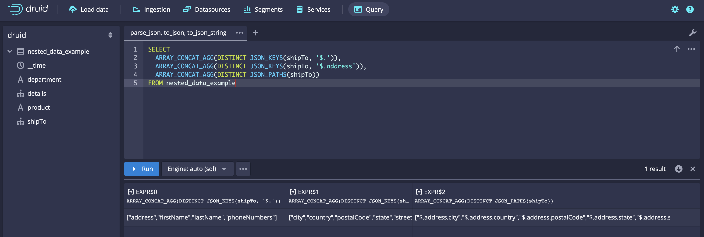

```sql
SELECT
  ARRAY_CONCAT_AGG(DISTINCT JSON_KEYS(shipTo, '$.')),
  ARRAY_CONCAT_AGG(DISTINCT JSON_KEYS(shipTo, '$.address')),
  ARRAY_CONCAT_AGG(DISTINCT JSON_PATHS(shipTo))
FROM nested_data_example
```

Example query 10 results:

```json
[["EXPR$0","EXPR$1","EXPR$2","EXPR$3"],["COMPLEX","COMPLEX","STRING","STRING"],["OTHER","OTHER","VARCHAR","VARCHAR"],["{\"x\":\"y\"}","\"{\\\"x\\\":\\\"y\\\"}\"","\"{\\\"x\\\":\\\"y\\\"}\"","{\"x\":\"y\"}"]]
```

## Known issues

Before you start using the nested columns feature, consider the following known issues:

- Directly using `COMPLEX<json>` typed columns and expressions is not well integrated into the Druid query engine. It can result in errors or undefined behavior when grouping and filtering, and when you use using `COMPLEX<json>` objects as inputs to aggregators. As a workaround, consider using `TO_JSON_STRING` to coerce the values to strings before you perform these operations.
- JSON SQL operators lose their "type" data in the "result type" information in SQL-over-HTTP responses, presenting as "unknown" `COMPLEX` instead of `COMPLEX<json>`. This means that the web console doesn't display the JSON-specific interface elements.
- Directly using array-typed outputs from `JSON_KEYS` and `JSON_PATHS` is moderately supported by the Druid query engine. You can group on these outputs, and there are a number of array expressions that can operate on these values, such as `ARRAY_CONCAT_AGG`. However, some operations are not well defined for use outside array-specific functions, such as filtering using `=` or `IS NULL`.
- `JSON_OBJECT` is incorrectly treated as a string type when you use it with MSQA.
- Input validation for JSON SQL operators is currently incomplete, which sometimes results in undefined behavior or unhelpful error messages.
- Ingesting JSON columns with a very complex nested structure is potentially an expensive operation, and may require you to tune ingestion tasks and/or cluster parameters to account for increased memory usage or overall task run time. When you tune your ingestion configuration, treat each nested literal field inside a JSON object as a flattened top-level Druid column.