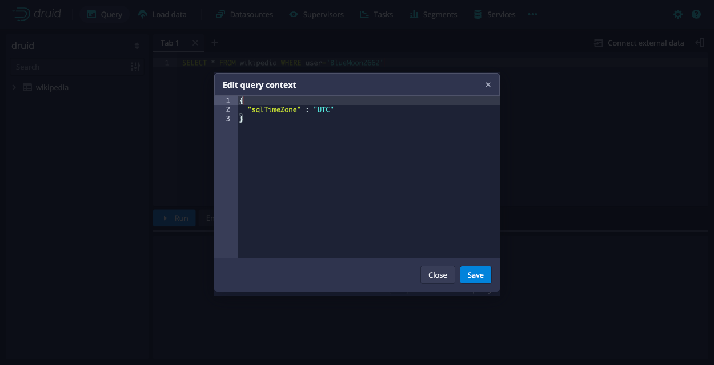
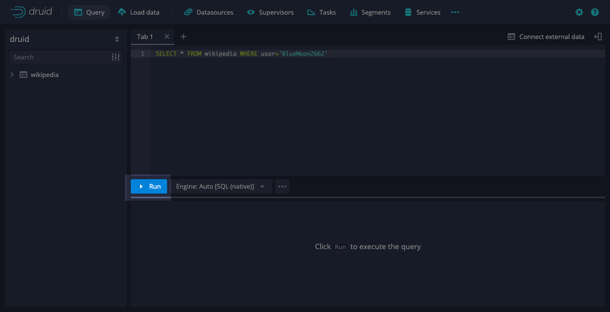

<!--
  ~ Licensed to the Apache Software Foundation (ASF) under one
  ~ or more contributor license agreements.  See the NOTICE file
  ~ distributed with this work for additional information
  ~ regarding copyright ownership.  The ASF licenses this file
  ~ to you under the Apache License, Version 2.0 (the
  ~ "License"); you may not use this file except in compliance
  ~ with the License.  You may obtain a copy of the License at
  ~
  ~   http://www.apache.org/licenses/LICENSE-2.0
  ~
  ~ Unless required by applicable law or agreed to in writing,
  ~ software distributed under the License is distributed on an
  ~ "AS IS" BASIS, WITHOUT WARRANTIES OR CONDITIONS OF ANY
  ~ KIND, either express or implied.  See the License for the
  ~ specific language governing permissions and limitations
  ~ under the License.
  -->
  

The query context gives you fine-grained control over how Apache Druid executes your individual queries. While the default settings in Druid work well for most queries, you can set the query context to handle specific requirements and optimize performance.

Common use cases for the query context include:
- Override default timeouts for long-running queries or complex aggregations.
- Debug query performance by disabling caching during testing.
- Configure SQL-specific behaviors like time zones for accurate time-based analysis.
- Set priorities to ensure critical queries get computational resources first.
- Adjust memory limits for queries that process large datasets.

The way you set the query context depends on how you submit the query to Druid, whether using the web console or API.
It also depends on whether your query is Druid SQL or a JSON-based native query.
This guide shows you how to set the query context for each application.

Before you begin, identify which context parameters you need to configure in order to establish your query context as query context carriers. For available parameters and their descriptions, see [Query context reference](query-context-reference.md).

## Web console

You can configure query context parameters for both Druid SQL and native queries in the [web console](../operations/web-console.md).

The following steps show you how to set the query context using the web console:

1. In the web console, select **Query** from the top-level navigation.

   

2. Enter the query you want to run. If you ingested the Wikipedia dataset from the [quickstart](../tutorials/index.md), you can use the following query: 

    ```sql
    SELECT * FROM wikipedia WHERE user='BlueMoon2662'
    ```

   

3. In the menu for the engine selector, click **Edit query context**.

   

4. In the **Edit query context** dialog, add your context parameters as JSON key-value pairs.

   For example, you can set the `sqlTimeZone` parameter to ensure that the query results reflect the specified time zone. This may differ from your local time zone when viewing the data.

   ```json
   {
     "sqlTimeZone" : "America/Los_Angeles"
   }
   ```

5. The web console validates the JSON object containing the query context parameters and highlights any syntax errors.
   Click **Save**.

   

6. Click **Run** to execute your query with the specified context parameters.

   

   Compare the results of the example query with and without the query context.
   * Without the query context, the query returns the `__time` value of `2015-09-12T00:47:53.259Z`.
   * When you set the `sqlTimeZone` parameter, the query returns `2015-09-11T17:47:53.259-07:00`.


## Druid SQL

When using Druid SQL programmatically—such as in applications, automated scripts, or database tools—you can set the query context through various methods depending on how you submit your queries.

### HTTP API

When using the HTTP API, you include query context parameters in the `context` object of your JSON request. For more information on how to format Druid SQL API requests and handle responses, see [Druid SQL API](../api-reference/sql-api.md).

The following example sets the `sqlTimeZone` parameter:

```json
{
  "query": "SELECT * FROM wikipedia WHERE user = 'BlueMoon2662'",
  "context": {
    "sqlTimeZone": "America/Los_Angeles"
  }
}
```

You can set multiple context parameters in a single request:

```json
{
  "query": "SELECT * FROM wikipedia WHERE user = 'BlueMoon2662'",
  "context": {
    "sqlTimeZone": "America/Los_Angeles",
    "sqlQueryId": "request01"
  }
}
```


### JDBC driver API

You can connect to Druid over JDBC and issue Druid SQL queries using the [Druid SQL JDBC driver API](../api-reference/sql-jdbc.md).
This approach is useful when integrating Druid with BI tools or Java applications.
When connecting to Druid through JDBC, you set query context parameters in a JDBC connection properties object.
You supply the object when establishing the connection to Druid.

The following code excerpt shows how you can configure the connection properties:

```java
String url = "jdbc:avatica:remote:url=http://localhost:8888/druid/v2/sql/avatica/";

// Set the time zone to America/Los_Angeles
Properties connectionProperties = new Properties();
connectionProperties.setProperty("sqlTimeZone", "America/Los_Angeles");

try (Connection connection = DriverManager.getConnection(url, connectionProperties)) {
  // create and execute statements, process result sets, etc
}
```

<details>
<summary>View full JDBC example</summary>

```java
import java.sql.*;
import java.util.Properties;

public class JdbcDruid {

    public static void main(String args[]) {

        // Connect to /druid/v2/sql/avatica/ on your Broker.
        String url = "jdbc:avatica:remote:url=http://localhost:8888/druid/v2/sql/avatica/;transparent_reconnection=true";

        // The query you want to run.
        String query = "SELECT * FROM wikipedia WHERE user = 'BlueMoon2662'";

        // Set any connection context parameters you need here.
        Properties connectionProperties = new Properties();
        connectionProperties.setProperty("sqlTimeZone", "America/Los_Angeles");

        try (Connection connection = DriverManager.getConnection(url, connectionProperties)) {
            try (
                final Statement statement = connection.createStatement();
                final ResultSet rs = statement.executeQuery(query)
            ) {
                while (rs.next()) {
                    // process result set
                    Timestamp timeStamp = rs.getTimestamp("__time");
                    System.out.println(timeStamp);
                }
            }
        } catch (Exception e) {
            System.out.println(e.toString());
        }
    }
}
```

</details>

### SET statements

You can use the SET command to specify SQL query context parameters that modify the behavior of a Druid SQL query. Druid accepts one or more SET statements before the main SQL query. The SET command works in the both web console and the Druid SQL HTTP API.

In the web console, you can write your SET statements followed by your query directly. For example:

```sql
SET sqlTimeZone = 'America/Los_Angeles';
SELECT * FROM wikipedia WHERE user = 'BlueMoon2662';
```

You can also include your SET statements as part of the query string in your HTTP API call. For example:

```bash
curl -X POST 'http://localhost:8888/druid/v2/sql' \
  -H 'Content-Type: application/json' \
  -d '{
    "query": "SET sqlTimeZone='\''America/Los_Angeles'\''; SELECT * FROM wikipedia WHERE user='\''BlueMoon2662'\''"
}'
```

You can also combine SET statements with the `context` field. If you include both, the parameter value in SET takes precedence:

```bash
curl -X POST 'http://localhost:8888/druid/v2/sql' \
  -H 'Content-Type: application/json' \
  -d '{
    "query": "SET sqlTimeZone='\''America/Los_Angeles'\''; SELECT * FROM wikipedia WHERE user='\''BlueMoon2662'\''",
    "context": {
      "sqlTimeZone": "UTC"
    }
}'
```

For more details on how to use the SET command in your SQL query, see [SET](sql.md#set).

:::info
You cannot use SET statements in JDBC connections.
:::


## Native queries

For native queries, you can include query context parameters in a JSON object named `context` within your query or through the [web console](#web-console).

The following example shows a native query that sets the `sqlTimeZone` to `America/Los_Angeles` and `queryId` to `only_query_id_test`:

```json
{
  "queryType": "timeseries",
  "dataSource": "wikipedia",
  "granularity": "day",
  "descending": true,
  "filter": {
    "type": "and",
    "fields": [
      { "type": "selector", "dimension": "countryName", "value": "Australia" },
      { "type": "selector", "dimension": "isAnonymous", "value": "true" }
    ]
  },
  "aggregations": [
    { "type": "count", "name": "row_count" }
  ],
  "intervals": ["2015-09-12T00:00:00.000/2015-09-13T00:00:00.000"],
  "context": {
    "sqlTimeZone": "America/Los_Angeles",
    "queryId": "only_query_id_test",
  }
}
```


## Runtime properties

You can configure query context parameters globally by adding a runtime property to your configuration file.
The property takes the following format:

```properties
druid.query.default.context.{PARAMETER}={VALUE}
```

Replace `PARAMETER` with the query context parameter and `VALUE` with its value.
For example:

```properties
druid.query.default.context.debug=true
```

For more information, see [Configuration reference](../configuration/index.md#overriding-default-query-context-values).


## Query context precedence

For a given context query, Druid determines the final query context value to use based on the following order of precedence, from lowest to highest:

1. **Built-in defaults**: Druid uses the documented default values if you don’t specify anything.

2. **Runtime properties**: If you configure parameters as `druid.query.default.context.{PARAMETER}` in the configuration files, these override the built-in defaults and act as your system-wide defaults.

3. **Context object in HTTP request**: Parameters passed within the JSON `context` object override both built-in defaults and runtime properties.

4. **SET statements**: Parameters set in Druid SQL using `SET key=value;` take the highest precedence and override all other settings.


## Learn more

For more information, see the following topics:

- [Query context reference](query-context-reference.md) for available query context parameters.
- [SQL query context](sql-query-context.md) for SQL-specific context parameters.
- [Multi-stage query context](../multi-stage-query/reference.md#context-parameters) for context parameters specific to SQL-based ingestion.
- [Native queries](querying.md) for details on constructing native queries with context.
- [SET](sql.md#set) for complete syntax and usage of SET statements.
