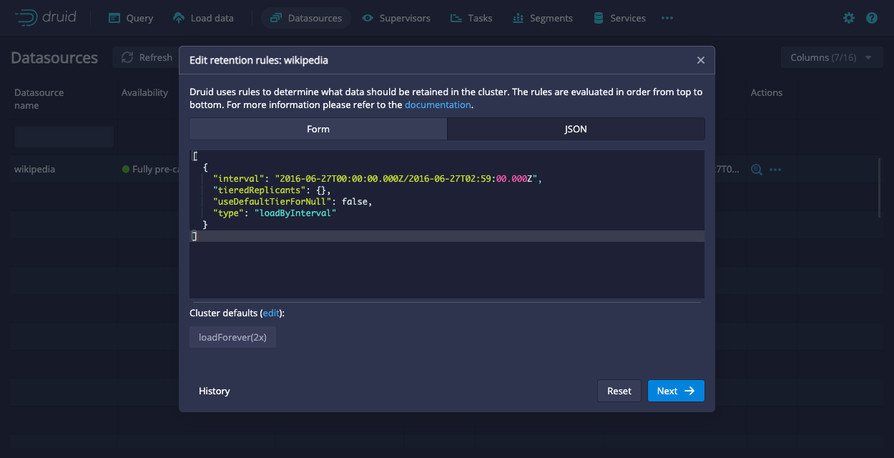

<!--
  ~ Licensed to the Apache Software Foundation (ASF) under one
  ~ or more contributor license agreements.  See the NOTICE file
  ~ distributed with this work for additional information
  ~ regarding copyright ownership.  The ASF licenses this file
  ~ to you under the Apache License, Version 2.0 (the
  ~ "License"); you may not use this file except in compliance
  ~ with the License.  You may obtain a copy of the License at
  ~
  ~   http://www.apache.org/licenses/LICENSE-2.0
  ~
  ~ Unless required by applicable law or agreed to in writing,
  ~ software distributed under the License is distributed on an
  ~ "AS IS" BASIS, WITHOUT WARRANTIES OR CONDITIONS OF ANY
  ~ KIND, either express or implied.  See the License for the
  ~ specific language governing permissions and limitations
  ~ under the License.
  -->

Druid can query segments that are only stored in deep storage. Running a query from deep storage is slower than running queries from segments that are loaded on Historical processes, but it's a great tool for data that you either access infrequently or where the low latency results that typical Druid queries provide is not necessary. Queries from deep storage can increase the surface area of data available to query without requiring you to scale your Historical processes to accommodate more segments.

## Prerequisites

Query from deep storage requires the Multi-stage query (MSQ) task engine. Load the extension for it if you don't already have it enabled before you begin. See [enable MSQ](../multi-stage-query/index.md#load-the-extension) for more information.

## Keep segments in deep storage only

Any data you ingest into Druid is already stored in deep storage, so you don't need to perform any additional configuration from that perspective. However, to take advantage of the cost savings that querying from deep storage provides, make sure not all your segments get loaded onto Historical processes.

To do this, configure [load rules](../operations/rule-configuration.md#load-rules) to manage the which segments are only in deep storage and which get loaded onto Historical processes.

The easiest way to do this is to explicitly configure the segments that don't get loaded onto Historical processes. Set `tieredReplicants` to an empty array and `useDefaultTierForNull` to `false`. For example, if you configure the following rule for a datasource:

```json
[
  {
    "interval": "2016-06-27T00:00:00.000Z/2016-06-27T02:59:00.000Z",
    "tieredReplicants": {},
    "useDefaultTierForNull": false,
    "type": "loadByInterval"
  }
]
```

Any segment that falls within the specified interval exists only in deep storage. For segments that aren't in this interval, they'll use the default cluster load rules or any other load rules you configure.

To configure the load rules through the Druid console, go to **Datasources > ... in the Actions column > Edit retention rules**. Then, paste the provided JSON into the JSON tab:




You can verify that a segment is not loaded on any Historical tiers by querying the Druid metadata table:

```sql
SELECT "segment_id", "replication_factor" FROM sys."segments" WHERE "replication_factor" = 0 AND "datasource" = YOUR_DATASOURCE
```

Segments with a `replication_factor` of `0` are not assigned to any Historical tiers. Queries against these segments are run directly against the segment in deep storage. 

You can also confirm this through the Druid console. On the **Segments** page, see the **Replication factor** column.

Keep the following in mind when working with load rules to control what exists only in deep storage:

- At least one of the segments in a datasource must be loaded onto a Historical process so that Druid can plan the query. The segment on the Historical process can be any segment from the datasource. It does not need to be a specific segment. One way to verify that a datasource has at least one segment on a Historical process is if it's visible in the Druid console.
- The actual number of replicas may differ from the replication factor temporarily as Druid processes your load rules.

## Run a query from deep storage

### Submit a query

You can query data from deep storage by submitting a query to the API using `POST /sql/statements`  or the Druid console. Druid uses the multi-stage query (MSQ) task engine to perform the query.

To run a query from deep storage, send your query to the Router using the POST method:

```
POST https://ROUTER:8888/druid/v2/sql/statements
```

Submitting a query from deep storage uses the same syntax as any other Druid SQL query where the query is contained in the "query" field in the JSON object within the request payload. For example:

```json
{"query" : "SELECT COUNT(*) FROM data_source WHERE foo = 'bar'"}
```  

Generally, the request body fields are the same between the `sql` and `sql/statements` endpoints.

Apart from the context parameters mentioned [here](../multi-stage-query/reference.md#context-parameters) there are additional context parameters for `sql/statements`: 

   - `executionMode`  (required) determines how query results are fetched. Set this to `ASYNC`. 
   - `selectDestination` (optional) set to `durableStorage` instructs Druid to write the results of SELECT queries to durable storage. For result sets with more than 3000 rows, it is highly recommended to use `durableStorage`. Note that this requires you to have [durable storage for MSQ enabled](../operations/durable-storage.md).

The following sample query includes the two additional context parameters that querying from deep storage supports:

```
curl --location 'http://localhost:8888/druid/v2/sql/statements' \
--header 'Content-Type: application/json' \
--data '{
    "query":"SELECT * FROM \"YOUR_DATASOURCE\" where \"__time\" >TIMESTAMP'\''2017-09-01'\'' and \"__time\" <= TIMESTAMP'\''2017-09-02'\''",
    "context":{
        "executionMode":"ASYNC",
        "selectDestination": "durableStorage"

    }  
}'
```

The response for submitting a query includes the query ID along with basic information, such as when you submitted the query and the schema of the results:

```json
{
  "queryId": "query-ALPHANUMBERIC-STRING",
  "state": "ACCEPTED",
  "createdAt": CREATION_TIMESTAMP,
"schema": [
  {
    "name": COLUMN_NAME,
    "type": COLUMN_TYPE,
    "nativeType": COLUMN_TYPE
  },
  ...
],
"durationMs": DURATION_IN_MS,
}
```


### Get query status

You can check the status of a query with the following API call:

```
GET https://ROUTER:8888/druid/v2/sql/statements/QUERYID
```

The query returns the status of the query, such as `ACCEPTED` or `RUNNING`. Before you attempt to get results, make sure the state is `SUCCESS`. 

When you check the status on a successful query,  it includes useful information about your query results including a sample record and information about how the results are organized by `pages`. The information for each page includes the following:

- `numRows`: the number of rows in that page of results
- `sizeInBytes`: the size of the page
- `id`: the indexed page number that you can use to reference a specific page when you get query results

You can use `page` as a parameter to refine the results you retrieve. 

The following snippet shows the structure of the `result` object:

```json
{
  ...
  "result": {
    "numTotalRows": INTEGER,
    "totalSizeInBytes": INTEGER,
    "dataSource": "__query_select",
    "sampleRecords": [
      [
        RECORD_1,
        RECORD_2,
        ...
      ]
    ],
    "pages": [
      {
        "numRows": INTEGER,
        "sizeInBytes": INTEGER,
        "id": INTEGER_PAGE_NUMBER
      }
      ...
    ]
}
}
```

### Get query results

Only the user who submitted a query can retrieve the results for the query.

Use the following endpoint to retrieve results:

```
GET https://ROUTER:8888/druid/v2/sql/statements/QUERYID/results?page=PAGENUMBER&resultFormat=FORMAT
```

Results are returned in JSON format.

You can use the optional `page` parameter to refine your results, and `resultFormat` parameter to define the format in which the results will be presented. 
* You can retrieve the `page` information for your results by fetching the status of the completed query.
* For `resultFormat` the following options are supported `arrayLines`,`objectLines`,`array`,`object`, and `csv`. Default value is `object`. More documentation present [here](../api-reference/sql-api.md#request-body). 

When you try to get results for a query from deep storage, you may receive an error that states the query is still running. Wait until the query completes before you try again.

## Further reading

* [Query from deep storage tutorial](../tutorials/tutorial-query-deep-storage.md)
* [Query from deep storage API reference](../api-reference/sql-api.md#query-from-deep-storage)
