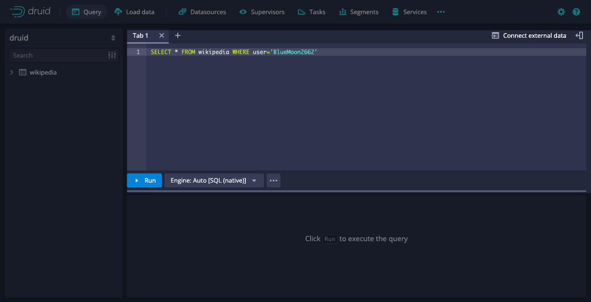
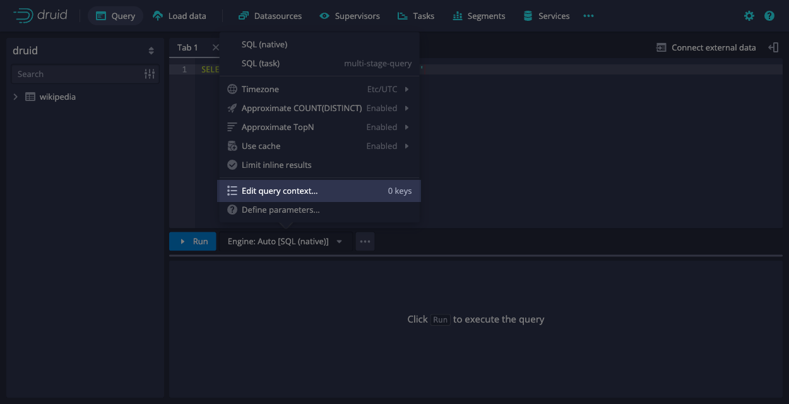

<!--
  ~ Licensed to the Apache Software Foundation (ASF) under one
  ~ or more contributor license agreements.  See the NOTICE file
  ~ distributed with this work for additional information
  ~ regarding copyright ownership.  The ASF licenses this file
  ~ to you under the Apache License, Version 2.0 (the
  ~ "License"); you may not use this file except in compliance
  ~ with the License.  You may obtain a copy of the License at
  ~
  ~   http://www.apache.org/licenses/LICENSE-2.0
  ~
  ~ Unless required by applicable law or agreed to in writing,
  ~ software distributed under the License is distributed on an
  ~ "AS IS" BASIS, WITHOUT WARRANTIES OR CONDITIONS OF ANY
  ~ KIND, either express or implied.  See the License for the
  ~ specific language governing permissions and limitations
  ~ under the License.
  -->
  

The query context gives you fine-grained control over how Apache Druid executes your individual queries. While the default settings in Druid work well for most queries, you can set the query context to handle specific requirements and optimize performance.

Common use cases for the query context include:
- Override default timeouts for long-running queries or complex aggregations.
- Debug query performance by disabling caching during testing.
- Configure SQL-specific behaviors like time zones for accurate time-based analysis.
- Set priorities to ensure critical queries get computational resources first.
- Adjust memory limits for queries that process large datasets.

The way you set the query context depends on how you submit the query to Druid, whether using the web console or API.
It also depends on whether your query is Druid SQL or a JSON-based native query.
This guide shows you how to set the query context for each application.

Before you begin, identify which context parameters you need to configure in order to establish your query context as query context carriers. For available parameters and their descriptions, see [Query context reference](query-context-reference.md).

## Web console

You can configure query context parameters is via the [Web console](../operations/web-console.md). In the web console, you can set up context parameters for both Druid SQL and native queries.

The following steps show you how to set the query context using the web console:

1. In the web console, select **Query** from the top-level navigation.

   

1. **Click** the **Engine** selector next to the **Run** button to choose the appropriate query type. Unless otherwise instructed, you can leave the engine as `Auto` to let Druid choose the best engine for you.

   

2. Enter the query you want to run.

   

3. Select **Edit query context** button in the **Select language and engine** menu.

   

4. In the **Edit query context** dialog, add your context parameters as JSON key-value pairs and then click **Save**. For example,you can insert the following context parameters:

   ```json
   {
     "timeout": 300000,
     "useCache": false
   }
   ```

   The web console validates the JSON object containing the query context parameters and highlights any syntax errors before you click **Run** the query.

   

6. Click **Run** to execute your query with the specified context parameters.

   


For more information about using the web console Query view, see [Query view](../operations/web-console.md#query).

## Druid SQL
When using Druid SQL programmatically—such as in applications, automated scripts, or database tools—you can set query context through various methods depending on how your queries are executed. 

### HTTP API

When using the HTTP API, you include query context parameters in the `context` object of your JSON request. For more information on how to format Druid SQL API requests and handle responses, see [Druid SQL API](../api-reference/sql-api.md).

The following example sets the `sqlTimeZone` parameter:

   ```json
   {
     "query" : "SELECT COUNT(*) FROM data_source WHERE foo = 'bar' AND __time > TIMESTAMP '2000-01-01 00:00:00'",
     "context" : {
       "sqlTimeZone" : "America/Los_Angeles"
     }
   }
   ```

Druid executes your query using the specified context parameters and return the results.

You can set multiple context parameters in a single request:

```json
{
  "query" : "SELECT COUNT(*) FROM data_source WHERE foo = 'bar'",
  "context" : {
    "timeout" : 30000,
    "useCache" : false,
    "sqlTimeZone" : "America/Los_Angeles"
  }
}
```


### JDBC driver API

You can connect to Druid over JDBC and issue Druid SQL queries using this [Druid SQL JDBC driver API](../api-reference/sql-jdbc.md). When connecting to Druid through JDBC, you set query context parameters a JDBC connection properties object. This approach is useful when integrating Druid with BI tools or Java applications.

For example, you can set query context parameters when creating your JDBC connection:

```java
String url = "jdbc:avatica:remote:url=http://localhost:8082/druid/v2/sql/avatica/";

// Set any query context parameters you need here.
Properties connectionProperties = new Properties();
connectionProperties.setProperty("sqlTimeZone", "America/Los_Angeles");
connectionProperties.setProperty("useCache", "false");

try (Connection connection = DriverManager.getConnection(url, connectionProperties)) {
  // create and execute statements, process result sets, etc
}
```


### SET statements

You can use the SET command to specify SQL query context parameters that modify the behavior of a Druid SQL query. Druid accepts one or more SET statements before the main SQL query. The SET command works in the both web console and the Druid SQL HTTP API.

In the web console, you can write your SET statements followed by your query directly. For example, 

```sql
SET useApproximateTopN = false;
SET sqlTimeZone = 'America/Los_Angeles';
SET timeout = 90000;
SELECT some_column, COUNT(*) 
FROM druid.foo 
WHERE other_column = 'foo' 
GROUP BY 1 
ORDER BY 2 DESC
```

You can also include your SET statements as part of the query string in your HTTP API call. For example,

```bash
curl -X POST 'http://localhost:8888/druid/v2/sql' \
  -H 'Content-Type: application/json' \
  -d '{
    "query": "SET useApproximateTopN = false; SET sqlTimeZone = '\''America/Los_Angeles'\''; SET timeout = 90000; SELECT some_column, COUNT(*) FROM druid.foo WHERE other_column = '\''foo'\'' GROUP BY 1 ORDER BY 2 DESC"
  }'
```

You can also combine SET statements with the `context` field. If you include both, the parameter value in SET takes precedence:

```json
{
  "query": "SET timeout = 90000; SELECT COUNT(*) FROM data_source",
  "context": {
    "timeout": 30000,  // This will be overridden by SET
    "priority": 100    // This will still apply
  }
}
```

For more details on how to use the SET command in your SQL query, see [SET](sql.md#set).

:::info
You cannot use SET statements in JDBC connections.
:::


## Native queries

For native queries, you can include query context parameters in a JSON object named `context` within your query structure or through [web console](./set-query-context.md#web-console).

The following example shows a native query that sets the given query id through context parameters from dataset `wikipedia`:

```json
{
  "queryType": "timeseries",
  "dataSource": "wikipedia",
  "granularity": "day",
  "descending": true,
  "filter": {
    "type": "and",
    "fields": [
      { "type": "selector", "dimension": "countryName", "value": "Australia" },
      { "type": "selector", "dimension": "isAnonymous", "value": "true" }
    ]
  },
  "aggregations": [
    { "type": "count", "name": "row_count" }
  ],
  "intervals": ["2015-09-12T00:00:00.000/2015-09-13T00:00:00.000"],
  "context": {
    "queryId": "only_query_id_test"
  }
}
```

For more information about native queries, see [Native queries](querying.md).


## Query Context Precedence

When you set query context parameters in Druid, Druid determines which values to use based on the following order of precedence, from lowest to highest:

1. **Built-in defaults**: these are the system’s default values used if you don’t specify anything else.
2. **Runtime properties**: if you configure parameters as `druid.query.default.context.{property_key}` in Druid’s configuration files, these override the built-in defaults and act as your system-wide defaults.  For more information, see [Overriding default query context values](../configuration/index.md#overriding-default-query-context-values).

3. **Context parameters you set in your query** : whether in the JSON `context` object or included directly in your queries, these override both the built-in defaults and the runtime properties.
4. **SET statements** : when using SET, any parameters you set with `SET key = value;` commands take the highest precedence and override all other settings.

This also means that higher precedence values overwrite lower ones. For example, if you set a parameter both in the runtime properties and in your query, Druid will use the value you set in the query.

So if you don’t set a parameter anywhere, Druid uses the built-in default. If you set it as a runtime property, that overrides the built-in default. But if you explicitly set the parameter in your query or with a SET statement, that value overrides all others.


## Learn more
- [Query context reference](query-context-reference.md) for available query context parameters.
- [SQL query context](sql-query-context.md) for SQL-specific context parameters.
- [Multi-stage query context](../multi-stage-query/reference.md#context-parameters) for context parameters specific to SQL-based ingestion.
- [Native queries](querying.md) for details on constructing native queries with context.
- [SET](sql.md#set) for complete syntax and usage of SET statements.
