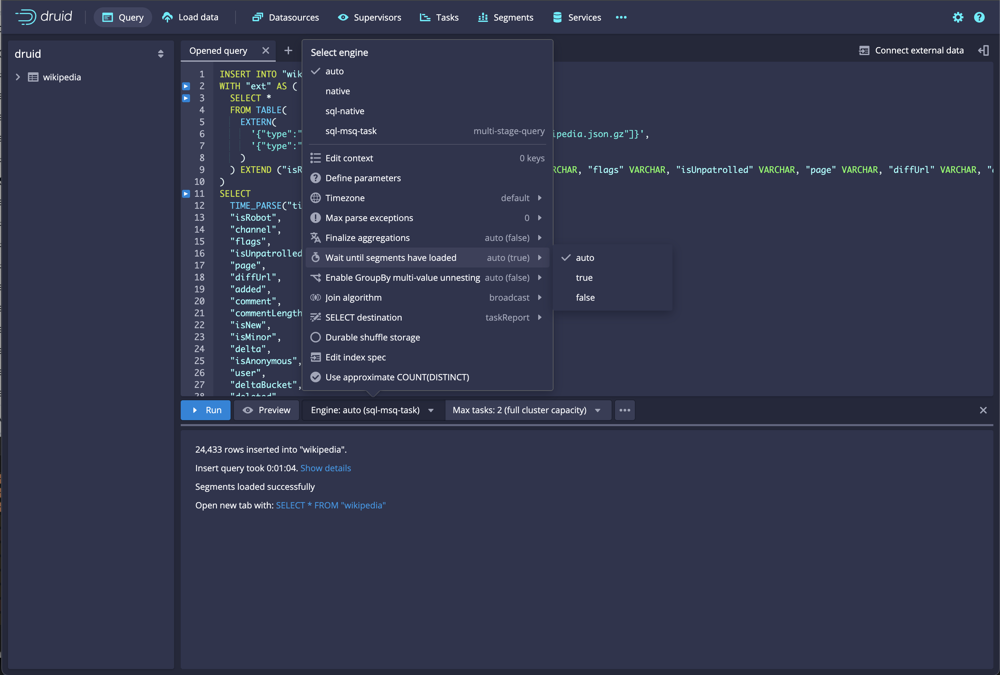
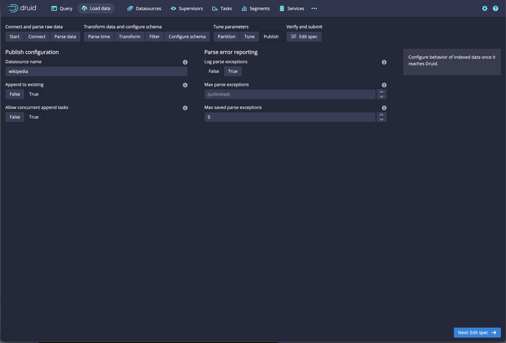
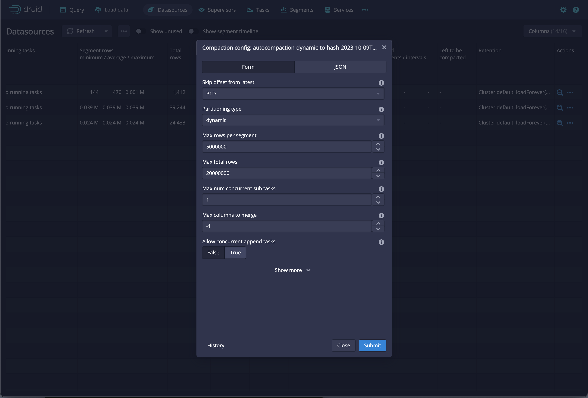
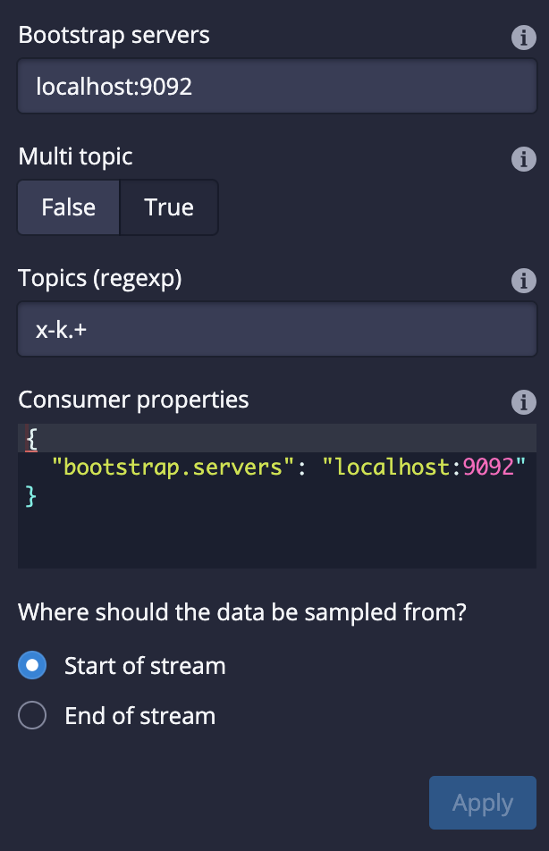

<!--
  ~ Licensed to the Apache Software Foundation (ASF) under one
  ~ or more contributor license agreements.  See the NOTICE file
  ~ distributed with this work for additional information
  ~ regarding copyright ownership.  The ASF licenses this file
  ~ to you under the Apache License, Version 2.0 (the
  ~ "License"); you may not use this file except in compliance
  ~ with the License.  You may obtain a copy of the License at
  ~
  ~   http://www.apache.org/licenses/LICENSE-2.0
  ~
  ~ Unless required by applicable law or agreed to in writing,
  ~ software distributed under the License is distributed on an
  ~ "AS IS" BASIS, WITHOUT WARRANTIES OR CONDITIONS OF ANY
  ~ KIND, either express or implied.  See the License for the
  ~ specific language governing permissions and limitations
  ~ under the License.
  -->

## Druid 28.0.1

Apache Druid 28.0.1 is a patch release that fixes some issues in the Druid 28.0.0 release.

### Bug fixes

* Fixed a query caching issue for groupBy queries with multiple post-aggregation metrics [#15402](https://github.com/apache/druid/pull/15402)
* Fixed an issue with compaction and reindex tasks failing during an upgrade due to the addition of the new task action `RetrieveSegmentsToReplaceAction`, which would not be available on the Overlord during the upgrade [#15430](https://github.com/apache/druid/pull/15430)
* Fixed an issue with the `NullFilter` filter returning a domain regardless of the input column [#15500](https://github.com/apache/druid/pull/15500)
* Improved the `start-druid` starter script [#15405](https://github.com/apache/druid/pull/15405)

## Druid 28.0.0

Apache Druid 28.0.0 contains over 420 new features, bug fixes, performance enhancements, documentation improvements, and additional test coverage from 57 contributors.

See the [complete set of changes](https://github.com/apache/druid/issues?q=is%3Aclosed+milestone%3A28.0+sort%3Aupdated-desc+) for additional details, including bug fixes.

Review the [upgrade notes](#upgrade-notes) and [incompatible changes](#incompatible-changes) before you upgrade to Druid 28.0.0.

## Important features, changes, and deprecations

In Druid 28.0.0, we have made substantial improvements to querying to make the system more ANSI SQL compatible. This includes changes in handling NULL and boolean values as well as boolean logic. At the same time, the Apache Calcite library has been upgraded to the latest version. While we have documented known query behavior changes, please read the [upgrade notes](#upgrade-notes) section carefully. Test your application before rolling out to broad production scenarios while closely monitoring the query status.

### SQL compatibility

Druid continues to make SQL query execution more consistent with how standard SQL behaves. However, there are feature flags available to restore the old behavior if needed.

#### Three-valued logic

Druid native filters now observe SQL [three-valued logic](https://en.wikipedia.org/wiki/Three-valued_logic#SQL) (`true`, `false`, or `unknown`) instead of Druid's classic two-state logic by default, when the following default settings apply:

* `druid.generic.useThreeValueLogicForNativeFilters = true`
* `druid.expressions.useStrictBooleans = true`
* `druid.generic.useDefaultValueForNull = false`

[#15058](https://github.com/apache/druid/pull/15058)

#### Strict booleans

`druid.expressions.useStrictBooleans` is now enabled by default.
Druid now handles booleans strictly using `1` (true) or `0` (false).
Previously, true and false could be represented either as `true` and `false` as well as `1` and `0`, respectively.
In addition, Druid now returns a null value for Boolean comparisons like `True && NULL`.

If you don't explicitly configure this property in `runtime.properties`, clusters now use LONG types for any ingested boolean values and in the output of boolean functions for transformations and query time operations.
For more information, see [SQL compatibility in the upgrade notes](#sql-compatibility-1).

[#14734](https://github.com/apache/druid/pull/14734)

#### NULL handling

`druid.generic.useDefaultValueForNull` is now disabled by default.
Druid now differentiates between empty records and null records.
Previously, Druid might treat empty records as empty or null.
For more information, see [SQL compatibility in the upgrade notes](#sql-compatibility-1).

[#14792](https://github.com/apache/druid/pull/14792)

### SQL planner improvements

Druid uses Apache Calcite for SQL planning and optimization. Starting in Druid 28.0.0, the Calcite version has been upgraded from 1.21 to 1.35. This upgrade brings in many bug fixes in SQL planning from Calcite.

#### Dynamic parameters

As part of the Calcite upgrade, the behavior of type inference for dynamic parameters has changed. To avoid any type interference issues, explicitly `CAST` all dynamic parameters as a specific data type in SQL queries. For example, use:

```sql
SELECT (1 * CAST (? as DOUBLE))/2 as tmp
```

Do not use:

```sql
SELECT (1 * ?)/2 as tmp
```

### Async query and query from deep storage

[Query from deep storage](https://druid.apache.org/docs/latest/querying/query-deep-storage/) is no longer an experimental feature. When you query from deep storage, more data is available for queries without having to scale your Historical services to accommodate more data. To benefit from the space saving that query from deep storage offers, configure your load rules to unload data from your Historical services.

#### Support for multiple result formats

Query from deep storage now supports multiple result formats.
Previously, the `/druid/v2/sql/statements/` endpoint only supported results in the `object` format. Now, results can be written in any format specified in the `resultFormat` parameter.
For more information on result parameters supported by the Druid SQL API, see [Responses](https://druid.apache.org/docs/latest/api-reference/sql-api#responses).

[#14571](https://github.com/apache/druid/pull/14571)

#### Broadened access for queries from deep storage

Users with the `STATE` permission can interact with status APIs for queries from deep storage. Previously, only the user who submitted the query could use those APIs. This enables the web console to monitor the running status of the queries. Users with the `STATE` permission can access the query results.

[#14944](https://github.com/apache/druid/pull/14944)

### MSQ queries for realtime tasks

The MSQ task engine can now include real time segments in query results. To do this, use the `includeSegmentSource` context parameter and set it to `REALTIME`.

[#15024](https://github.com/apache/druid/pull/15024)

### MSQ support for UNION ALL queries

You can now use the MSQ task engine to run UNION ALL queries with `UnionDataSource`.

[#14981](https://github.com/apache/druid/pull/14981)

### Ingest from multiple Kafka topics to a single datasource

You can now ingest streaming data from multiple Kafka topics to a datasource using a single supervisor.
You configure the topics for the supervisor spec using a regex pattern as the value for `topicPattern` in the IO config. If you add new topics to Kafka that match the regex, Druid automatically starts ingesting from those new topics.

If you enable multi-topic ingestion for a datasource, downgrading will cause the Supervisor to fail.
For more information, see [Stop supervisors that ingest from multiple Kafka topics before downgrading](#stop-supervisors-that-ingest-from-multiple-kafka-topics-before-downgrading).

[#14424](https://github.com/apache/druid/pull/14424)
[#14865](https://github.com/apache/druid/pull/14865)

### SQL UNNEST and ingestion flattening

The UNNEST function is no longer experimental.
Druid now supports UNNEST in SQL-based batch ingestion and query from deep storage, so you can flatten arrays easily. For more information, see [UNNEST](https://druid.apache.org/docs/latest/querying/sql/#unnest) and [Unnest arrays within a column](https://druid.apache.org/docs/latest/tutorials/tutorial-unnest-arrays/).

You no longer need to include the context parameter `enableUnnest: true` to use UNNEST.

[#14886](https://github.com/apache/druid/pull/14886)

#### Recommended syntax for SQL UNNEST

The recommended syntax for SQL UNNEST has changed. We recommend using CROSS JOIN instead of commas for most queries to prevent issues with precedence. For example, use:

```sql
SELECT column_alias_name1 FROM datasource CROSS JOIN UNNEST(source_expression1) AS table_alias_name1(column_alias_name1) CROSS JOIN UNNEST(source_expression2) AS table_alias_name2(column_alias_name2), ...
```

Do not use:

```sql
SELECT column_alias_name FROM datasource, UNNEST(source_expression1) AS table_alias_name1(column_alias_name1), UNNEST(source_expression2) AS table_alias_name2(column_alias_name2), ...
```

### Window functions (experimental)

You can use [window functions](https://druid.apache.org/docs/latest/querying/sql-window-functions) in Apache Druid to produce values based upon the relationship of one row within a window of rows to the other rows within the same window. A window is a group of related rows within a result set. For example, rows with the same value for a specific dimension.

Enable window functions in your query with the `enableWindowing: true` context parameter.

[#15184](https://github.com/apache/druid/pull/15184)

### Concurrent append and replace (experimental)

Druid 28.0.0 adds experimental support for concurrent append and replace.
This feature allows you to safely replace the existing data in an interval of a datasource while new data is being appended to that interval. One of the most common applications of this is appending new data to an interval while compaction of that interval is already in progress.
For more information, see [Concurrent append and replace](https://druid.apache.org/docs/latest/data-management/automatic-compaction#concurrent-append-and-replace).

Segment locking will be deprecated and removed in favor of concurrent append and replace that is much simpler in design. With concurrent append and replace, Druid doesn't lock compaction jobs out because of active realtime ingestion.

#### Task locks for append and replace batch ingestion jobs

Append batch ingestion jobs can now share locks. This allows you to run multiple append batch ingestion jobs against the same time interval. Replace batch ingestion jobs still require an exclusive lock. This means you can run multiple append batch ingestion jobs and one replace batch ingestion job for a given interval.

[#14407](https://github.com/apache/druid/pull/14407)

#### Streaming ingestion with concurrent replace

Streaming jobs reading from Kafka and Kinesis with `APPEND` locks can now ingest concurrently with compaction running with `REPLACE` locks. The segment granularity of the streaming job must be equal to or finer than that of the concurrent replace job.

[#15039](https://github.com/apache/druid/pull/15039)

## Functional area and related changes

This section contains detailed release notes separated by areas.

### Web console

#### Added UI support for segment loading query context parameter

The web console supports the `waitUntilSegmentsLoad` query context parameter.



[#15110](https://github.com/apache/druid/pull/15110)

#### Added concurrent append and replace switches

The web console includes concurrent append and replace switches.

The following screenshot shows the concurrent append and replace switches in the classic batch ingestion wizard:


The following screenshot shows the concurrent append and replace switches in the compaction configuration UI:


[#15114](https://github.com/apache/druid/pull/15114)

#### Added UI support for ingesting from multiple Kafka topics to a single datasource

The web console supports ingesting streaming data from multiple Kafka topics to a datasource using a single supervisor.



[#14833](https://github.com/apache/druid/pull/14833)

#### Other web console improvements

* You can now copy query results from the web console directly to the clipboard [#14889](https://github.com/apache/druid/pull/14889)
* The web console now shows the execution dialog for `query_controller` tasks in the task view instead of the generic raw task details dialog. You can still access the raw task details from the ellipsis (...) menu [#14930)](https://github.com/apache/druid/pull/14930)
* You can now select a horizontal range in the web console time chart to modify the current WHERE clause [#14929](https://github.com/apache/druid/pull/14929)
* You can now set dynamic query parameters in the web console [#14921](https://github.com/apache/druid/pull/14921)
* You can now edit the Coordinator dynamic configuration in the web console [#14791](https://github.com/apache/druid/pull/14791)
* You can now prettify SQL queries and use flatten with a Kafka input format [#14906](https://github.com/apache/druid/pull/14906)
* A warning now appears when a CSV or TSV sample contains newlines that Druid does not accept [#14783](https://github.com/apache/druid/pull/14783)
* You can now select a format when downloading data [#14794](https://github.com/apache/druid/pull/14794)
* Improved the clarity of cluster default rules in the retention dialog [#14793](https://github.com/apache/druid/pull/14793)
* The web console now detects inline queries in the query text and lets you run them individually [#14810](https://github.com/apache/druid/pull/14801)
* You can now reset specific partition offsets for a supervisor [#14863](https://github.com/apache/druid/pull/14863)

### Ingestion

#### JSON and auto column indexer

The `json` column type is now equivalent to using `auto` in JSON-based batch ingestion dimension specs. Upgrade your ingestion specs to `json` to take advantage of the features and functionality of `auto`, including the following:

- Type specializations including ARRAY typed columns
- Better support for nested arrays of strings, longs, and doubles
- Smarter index utilization

`json` type columns created with Druid 28.0.0 are not backwards compatible with Druid versions older than 26.0.0.
If you upgrade from one of these versions, you can continue to write nested columns in a backwards compatible format (version 4).

For more information, see [Nested column format in the upgrade notes](#nested-column-format).

[#14955](https://github.com/apache/druid/pull/14955)
[#14456](https://github.com/apache/druid/pull/14456)

#### Ingestion status

Ingestion reports now include a `segmentLoadStatus` object that provides information related to the ingestion, such as duration and total segments.

[#14322](https://github.com/apache/druid/pull/14322)

#### SQL-based ingestion

##### Ability to ingest ARRAY types

SQL-based ingestion now supports storing ARRAY typed values in [ARRAY typed columns](https://druid.apache.org/docs/latest/querying/arrays) as well as storing both VARCHAR and numeric typed arrays.
Previously, the MSQ task engine stored ARRAY typed values as [multi-value dimensions](https://druid.apache.org/docs/latest/querying/multi-value-dimensions) instead of ARRAY typed columns.

The MSQ task engine now includes the `arrayIngestMode` query context parameter, which controls how
`ARRAY` types are stored in Druid segments.
Set the `arrayIngestMode` query context parameter to `array` to ingest ARRAY types.

In Druid 28.0.0, the default mode for `arrayIngestMode` is `mvd` for backwards compatibility, which only supports VARCHAR typed arrays and stores them as multi-value dimensions. This default is subject to change in future releases.

For information on how to migrate to the new behavior, see the [Ingestion options for ARRAY typed columns in the upgrade notes](#ingestion-options-for-array-typed-columns).
For information on inserting, filtering, and grouping behavior for `ARRAY` typed columns, see [Array columns](https://druid.apache.org/docs/latest/querying/arrays).

[#15093](https://github.com/apache/druid/pull/15093)

##### Numeric array type support

Row-based frames and, by extension, the MSQ task engine now support numeric array types. This means that all queries consuming or producing arrays work with the MSQ task engine. Numeric arrays can also be ingested using SQL-based ingestion with MSQ. For example, queries like `SELECT [1, 2]` are valid now since they consume a numeric array instead of failing with an unsupported column type exception.

[#14900](https://github.com/apache/druid/pull/14900)

##### Azure Blob Storage support

Added support for Microsoft Azure Blob Storage.
You can now use fault tolerance and durable storage with Microsoft Azure Blob Storage.
For more information, see [Durable storage](https://druid.apache.org/docs/latest/multi-stage-query/reference#durable-storage).

[#14660](https://github.com/apache/druid/pull/14660)

##### Other SQL-based ingestion improvements

* Added a new `rowsPerPage` context parameter for the MSQ task engine.
Use `rowsPerPage` to limit the number of rows per page. For more information on context parameters for the MSQ task engine, see [Context parameters](https://druid.apache.org/docs/latest/multi-stage-query/reference#context-parameters) [#14994](https://github.com/apache/druid/pull/14994)
* Druid now ignores `ServiceClosedException` on `postCounters` while the controller is offline [#14707](https://github.com/apache/druid/pull/14707)
* Improved error messages related to OVERWRITE keyword [#14870](https://github.com/apache/druid/pull/14870)

#### Streaming ingestion

##### Ability to reset offsets for a supervisor

Added a new API endpoint `/druid/indexer/v1/supervisor/:supervisorId/resetOffsets` to reset specific partition offsets for a supervisor without resetting the entire set.
This endpoint clears only the specified offsets in Kafka or sequence numbers in Kinesis, prompting the supervisor to resume data reading.

[#14772](https://github.com/apache/druid/pull/14772)

##### Other streaming ingestion improvements

* Added `PropertyNamingStrategies` from Jackson to fix Hadoop ingestion and make it compatible with newer Jackson [#14671](https://github.com/apache/druid/pull/14671)
* Added pod name to the `TaskLocation` object for Kubernetes task scheduling to make debugging easier [#14758](https://github.com/apache/druid/pull/14758)
* Added lifecycle hooks to `KubernetesTaskRunner` [#14790](https://github.com/apache/druid/pull/14790)
* Added new method for `SqlStatementResource` and `SqlTaskResource` to set request attribute [#14878](https://github.com/apache/druid/pull/14878)
* Added a sampling factor for `DeterminePartitionsJob` [#13840](https://github.com/apache/druid/pull/13840)
* Added `usedClusterCapacity` to the `GET` `/totalWorkerCapacity` response. Use this API to get the total ingestion capacity on the overlord [#14888](https://github.com/apache/druid/pull/14888)
* Improved Kubernetes task runner performance [#14649](https://github.com/apache/druid/pull/14649)
* Improved handling of long data source names. Previously, the Kubernetes task runner would throw an error if the name of a data source was too long [#14620](https://github.com/apache/druid/pull/14620)
* Improved the streaming ingestion completion timeout error message [#14636](https://github.com/apache/druid/pull/14636)
* Druid now retries fetching S3 task logs on transient S3 errors [#14714](https://github.com/apache/druid/pull/14714)
* Druid now reports `task/pending/time` metrics for Kubernetes-based ingestion [#14698](https://github.com/apache/druid/pull/14698)
* Druid now reports `k8s/peon/startup/time` metrics for Kubernetes-based ingestion [#14771](https://github.com/apache/druid/pull/14771)
* `handoffConditionTimeout` now defaults to 15 minutes&mdash;the default change won't affect existing supervisors [#14539](https://github.com/apache/druid/pull/14539)
* Fixed an NPE with checkpoint parsing for streaming ingestion [#14353](https://github.com/apache/druid/pull/14353)
* Fixed an issue with Hadoop ingestion writing arrays as `objects.toString` as a result of transform expressions [#15127](https://github.com/apache/druid/pull/15127)
* The `PodTemplateTaskAdapter` now accounts for queryable tasks [#14789](https://github.com/apache/druid/pull/14789)
* The rolling supervisor now restarts at `taskDuration` [#14396](https://github.com/apache/druid/pull/14396)
* S3 `deleteObjects` requests are now retried if the failure state allows retry [#14776](https://github.com/apache/druid/pull/14776)
* You can now ingest the name of a Kafka topic to a datasource [#14857](https://github.com/apache/druid/pull/14857)

### Querying

#### Improved LOOKUP function

The LOOKUP function now accepts an optional constant string as a third argument. This string is used to replace missing values in results. For example, the query `LOOKUP(store, 'store_to_country', 'NA')`, returns `NA` if the `store_to_country` value is missing for a given `store`.

[#14956](https://github.com/apache/druid/pull/14956)

#### AVG function

The AVG aggregation function now returns a `double` instead of a `long`.

[#15089](https://github.com/apache/druid/pull/15089)

#### Improvements to EARLIEST and LATEST operators

Improved EARLIEST and LATEST operators as follows:

* EARLIEST and LATEST operators now rewrite to EARLIEST_BY and LATEST_BY during query processing to make the `__time` column reference explicit to Calcite. [#15095](https://github.com/apache/druid/pull/15095)
* You can now use EARLIEST/EARLIEST_BY and LATEST/LATEST_BY for STRING columns without specifying the `maxBytesPerValue` parameter.
If you omit the `maxBytesPerValue` parameter, the aggregations default to 1024 bytes for the buffer. [#14848](https://github.com/apache/druid/pull/14848)

#### Functions for evaluating distinctness

New SQL and native query functions allow you to evaluate whether two expressions are distinct or not distinct.
Expressions are distinct if they have different values or if one of them is NULL.
Expressions are not distinct if their values are the same or if both of them are NULL.

Because the functions treat NULLs as known values  when used as a comparison operator, they always return true or false even if one or both expressions are NULL.

The following table shows the difference in behavior between the equals sign (=) and IS [NOT] DISTINCT FROM:

| A | B | A=B | A IS NOT DISTINCT FROM B|
|---|---|-----|-------------------------|
| 0 | 0 | true | true |
| 0 | 1 | false | false |
| 0 | null | unknown | false |
| null | null | unknown | true |

[#14976](https://github.com/apache/druid/pull/14976)

#### Functions for evaluating equalities

New SQL and native query functions allow you to evaluate whether a condition is true or false. These functions are different from `x == true` and `x != true` in that they never return null even when the variable is null.

| SQL function | Native function |
|--------------|-----------------|
| `IS_TRUE`    | `istrue()`|
| `IS_FALSE`   | `isfalse()`|
| `IS_NOT_TRUE`| `nottrue()`|
| `IS_NOT_FALSE`|`notfalse()`|

[#14977](https://github.com/apache/druid/pull/14977)

#### Function to decode Base64-encoded strings

The new SQL and native query function, `decode_base64_utf8` decodes a Base64-encoded string and returns the UTF-8-encoded string. For example, `decode_base64_utf8('aGVsbG8=')`.

[#14943](https://github.com/apache/druid/pull/14943)

#### Improved subquery guardrail

You can now set the `maxSubqueryBytes` guardrail to one of the following:

* `disabled`: Default setting. Druid doesn't apply the guardrail around the number of bytes a subquery can generate.
* `auto`: Druid calculates the amount of memory to use for the materialization of results as a portion of the fixed memory of the heap.  
  In the query context, Druid uses the following formula to determine the upper limit on the number of bytes a subquery can generate:

  ```text
  ((total JVM space - memory occupied by lookups) * 0.5) / maximum queries that the system can handle concurrently
  ```

* INTEGER: The number of bytes to use for materializing subquery results. Set a specific value if you understand the query patterns and want to optimize memory usage.  
  For example, set the `maxSubqueryBytes` parameter to 300000000 (`300 * 1000 * 1000`) for a 300 MB limit.
  Set the `maxSubqueryBytes` parameter to 314572800 (`300 * 1024 * 1024`) for a 300 MiB limit.

[#14808](https://github.com/apache/druid/pull/14808)

#### Other query improvements

* Added filters to the set of filters that work with UNNEST filter rewrite and pushdown [#14777](https://github.com/apache/druid/pull/14777)
* Enabled [whole-query caching](https://druid.apache.org/docs/latest/querying/caching#whole-query-caching) on the Broker for [groupBy v2](https://druid.apache.org/docs/latest/querying/groupbyquery.html) queries [#11595](https://github.com/apache/druid/pull/11595)
* Improved performance of EARLIEST aggregator with vectorization [#14408](https://github.com/apache/druid/pull/14408)

### Cluster management

#### Unused segments

Druid now stops loading and moving segments as soon as they are marked as unused. This prevents Historical processes from spending time on superfluous loads of segments that will be unloaded later. You can mark segments as unused by a drop rule, overshadowing, or by calling [the Data management API](https://druid.apache.org/docs/latest/api-reference/data-management-api).

[#14644](https://github.com/apache/druid/pull/14644)

#### Encrypt data in transit

The `net.spy.memcached` client has been replaced with the AWS ElastiCache client. This change allows Druid to encrypt data in transit using TLS.

Configure it with the following properties:

|Property|Description|Default|
|--------|-----------|-------|
| `druid.cache.enableTls` | Enable TLS based connection for Memcached client. Boolean | false |
| `druid.cache.clientMode`  | Client Mode. Static mode requires the user to specify individual cluster nodes. Dynamic mode uses [AutoDiscovery](https://docs.aws.amazon.com/AmazonElastiCache/latest/mem-ug/AutoDiscovery.HowAutoDiscoveryWorks.html) feature of AWS Memcached. String. ["static"](https://docs.aws.amazon.com/AmazonElastiCache/latest/mem-ug/AutoDiscovery.Manual.html) or ["dynamic"](https://docs.aws.amazon.com/AmazonElastiCache/latest/mem-ug/AutoDiscovery.Using.ModifyApp.Java.html) | static            |
| `druid.cache.skipTlsHostnameVerification` | Skip TLS Hostname Verification. Boolean. | true |

[#14827](https://github.com/apache/druid/pull/14827/)

#### New metadata in the Druid segments table

The Druid segments table now has a column called `used_flag_last_updated` (VARCHAR (255)). This column is a UTC date string corresponding to the last time that the used column was modified.

Note that this is an incompatible change to the table. For upgrade information, see [Upgrade Druid segments table](#upgrade-druid-segments-table).

[#12599](https://github.com/apache/druid/pull/12599)

#### Other cluster management improvements

* You can now use multiple console appenders in Peon logging [#14521](https://github.com/apache/druid/pull/14521)
* Thread names of the processing pool for Indexer, Peon, and Historical processes now include the query ID [#15059](https://github.com/apache/druid/pull/15059)
* The value for `replicationThrottleLimit` used for smart segment loading has been increased from 2% to 5% of total number of used segments. The total number of replicas in the load queue at the start of a run plus the replicas assigned in a run is kept less than or equal to the throttle limit [#14913](https://github.com/apache/druid/pull/14913)
* The value default  value for `balancerComputeThreads` is now calculated based on the number of CPUs divided by 2. Previously, the value was `1`. Smart segment loading uses this computed value [#14902](https://github.com/apache/druid/pull/14902)
* Improved `InvalidNullByteFault` errors. They now include the output column name instead of the query column name for ease of use [#14780](https://github.com/apache/druid/pull/14780)
* Improved the exception message when `DruidLeaderClient` doesn't find leader node [#14775](https://github.com/apache/druid/pull/14775)
* Reduced Coordinator logging under normal operation [#14926](https://github.com/apache/druid/pull/14926)
* Heap usage is now more predictable at very minor performance cost when using nested values [#14919](https://github.com/apache/druid/pull/14919)
* __Middle Manager-less ingestion__: 
   * The `sys.tasks` metadata table and web console now show the Kubernetes pod name rather than the peon location when using Middle Manager-less ingestion [#14959](https://github.com/apache/druid/pull/14959)
   * Added support for Middle Manager-less ingestion to migrate with zero downtime to and from `WorkerTaskRunners` that use Middle Managers [#14918](https://github.com/apache/druid/pull/14918)
* Druid extensions cannot bind custom Coordinator duties to the duty groups `IndexingServiceDuties` and `MetadataStoreManagementDuties` anymore. These are meant to be core coordinator built-in flows and should not be affected by custom duties. Users can still define a `CustomCoordinatorDuty` with a custom duty group and period [#14891](https://github.com/apache/druid/pull/14891)
* Druid now adjusts `balancerComputeThreads` and `maxSegmentsToMove` automatically based on usage skew between the Historical processes in a tier [#14584](https://github.com/apache/druid/pull/14584)
* Removed the configurable property `druid.coordinator.compaction.skipLockedIntervals` because it should always be `true` [#14807](https://github.com/apache/druid/pull/14807)
* Updated mm-less task runner lifecycle logic to better match the logic in the HTTP and ZooKeeper worker task runners [#14895](https://github.com/apache/druid/pull/14895)

### Data management

#### Alert message for segment assignments

Improved alert message for segment assignments when an invalid tier is specified in a load rule or when no rule applies on a segment.

[#14696](https://github.com/apache/druid/pull/14696)

#### Coordinator API for unused segments

Added `includeUnused` as an optional parameter to the Coordinator API.
You can send a `GET` request to `/druid/coordinator/v1/metadata/datasources/{dataSourceName}/segments/{segmentId}?includeUnused=true` to retrieve the metadata for a specific segment as stored in the metadata store.

The API also returns unused segments if the `includeUnused` parameter is set.

[#14846](https://github.com/apache/druid/pull/14846/)

#### Kill task improvements

* Added `killTaskSlotRatio` and `maxKillTaskSlots` dynamic configuration properties to allow control of task resource usage spawned by the `KillUnusedSegments` coordinator task [#14769](https://github.com/apache/druid/pull/14769)
* The value for `druid.coordinator.kill.period` can now be greater than or equal to `druid.coordinator.period.indexingPeriod`. Previously, it had to be greater than `druid.coordinator.period.indexingPeriod`. Additionally, the leader Coordinator now keeps track of the last submitted `kill` task for a datasource to avoid submitting duplicate `kill` tasks [#14831](https://github.com/apache/druid/pull/14831)
* Added a new config `druid.coordinator.kill.bufferPeriod` for a buffer period. This config defines the amount of time that a segment is unused before `KillUnusedSegment` can kill it. Using the default `PT24H`, if you mark a segment as unused at `2022-06-01T00:05:00.000Z`, then the segment cannot be killed until at or after `2022-06-02T00:05:00.000Z` [#12599](https://github.com/apache/druid/pull/12599)
* You can now specify the following parameters for a `kill` task:
  * `batchSize`: The maximum number of segments to delete in one `kill` batch [#14642](https://github.com/apache/druid/pull/14642)
  * `limit`: The maximum number of segments for a `kill` task to delete [#14662](https://github.com/apache/druid/pull/14662)
* You can now speed up `kill` tasks by batch deleting multiple segments stored in S3 [#14131](https://github.com/apache/druid/pull/14131)
* Kill tasks that delete unused segments now publish a task report containing kill stats such as `numSegmentsKilled`, `numBatchesProcessed`, and `numSegmentsMarkedAsUnused` [#15023](https://github.com/apache/druid/pull/15023)
* `IndexerSQLMetadataStorageCoordinator` now uses the JDBI `PreparedBatch` instead of issuing single update statements inside a transaction to mitigate scaling challenges [#14639](https://github.com/apache/druid/pull/14639)

### Metrics and monitoring

#### New ingestion metrics

|Metric|Description|Dimensions|Normal value|
|------|-----------|----------|------------|
|`ingest/input/bytes`|Number of bytes read from input sources, after decompression but prior to parsing. This covers all data read, including data that does not end up being fully processed and ingested. For example, this includes data that ends up being rejected for being unparseable or filtered out.|`dataSource`, `taskId`, `taskType`, `groupId`, `tags`|Depends on the amount of data read.|

[#14582](https://github.com/apache/druid/pull/14582)

#### New query metrics

|Metric|Description|Dimensions|Normal value|
|------|-----------|----------|------------|
|`mergeBuffer/pendingRequests`|Number of requests waiting to acquire a batch of buffers from the merge buffer pool.|This metric is exposed through the `QueryCountStatsMonitor` module for the Broker.| |

[#15025](https://github.com/apache/druid/pull/15025)

#### New ZooKeeper metrics

|Metric|Description|Dimensions|Normal value|
|------|-----------|----------|------------|
|`zk/connected`|Indicator of connection status. `1` for connected, `0` for disconnected. Emitted once per monitor period.|None|1|
|`zk/reconnect/time`|Amount of time, in milliseconds, that a server was disconnected from ZooKeeper before reconnecting. Emitted on reconnection. Not emitted if connection to ZooKeeper is permanently lost, because in this case, there is no reconnection.|None|Not present|

[#14333](https://github.com/apache/druid/pull/14333)

#### New subquery metrics for the Broker

The new  `SubqueryCountStatsMonitor` emits metrics corresponding to the subqueries and their execution.

|Metric|Description|Dimensions|Normal value|
|------|-----------|----------|------------|
|`subquery/rowLimit/count`|Number of subqueries whose results are materialized as rows (Java objects on heap).|This metric is only available if the `SubqueryCountStatsMonitor` module is included.| |
|`subquery/byteLimit/count`|Number of subqueries whose results are materialized as frames (Druid's internal byte representation of rows).|This metric is only available if the `SubqueryCountStatsMonitor` module is included.| |
|`subquery/fallback/count`|Number of subqueries which cannot be materialized as frames|This metric is only available if the `SubqueryCountStatsMonitor` module is included.| |
|`subquery/fallback/insufficientType/count`|Number of subqueries which cannot be materialized as frames due to insufficient type information in the row signature.|This metric is only available if the `SubqueryCountStatsMonitor` module is included.| |
|`subquery/fallback/unknownReason/count`|Number of subqueries which cannot be materialized as frames due other reasons.|This metric is only available if the `SubqueryCountStatsMonitor` module is included.| |
|`query/rowLimit/exceeded/count`|Number of queries whose inlined subquery results exceeded the given row limit|This metric is only available if the `SubqueryCountStatsMonitor` module is included.| |
|`query/byteLimit/exceeded/count`|Number of queries whose inlined subquery results exceeded the given byte limit|This metric is only available if the `SubqueryCountStatsMonitor` module is included.| |

[#14808](https://github.com/apache/druid/pull/14808)

#### New Coordinator metrics

|Metric|Description|Dimensions|Normal value|
|------|-----------|----------|------------|
|`killTask/availableSlot/count`| Number of available task slots that can be used for auto kill tasks in the auto kill run. This is the max number of task slots minus any currently running auto kill tasks.| |Varies|
|`killTask/maxSlot/count`| Maximum number of task slots available for auto kill tasks in the auto kill run.| |Varies|
|`kill/task/count`| Number of tasks issued in the auto kill run.| |Varies|
|`kill/pendingSegments/count`|Number of stale pending segments deleted from the metadata store.|`dataSource`|Varies|

[#14782](https://github.com/apache/druid/pull/14782)
[#14951](https://github.com/apache/druid/pull/14951)

#### New compaction metrics

|Metric|Description|Dimensions|Normal value|
|------|-----------|----------|------------|
|`compact/segmentAnalyzer/fetchAndProcessMillis`|Time taken to fetch and process segments to infer the schema for the compaction task to run.|`dataSource`, `taskId`, `taskType`, `groupId`,`tags`| Varies. A high value indicates compaction tasks will speed up from explicitly setting the data schema. |

[#14752](https://github.com/apache/druid/pull/14752)

#### Segment scan metrics

Added a new metric to figure out the usage of `druid.processing.numThreads` on the Historicals/Indexers/Peons.

|Metric|Description|Dimensions|Normal value|
|------|-----------|----------|------------|
|`segment/scan/active`|Number of segments currently scanned. This metric also indicates how many threads from `druid.processing.numThreads` are currently being used.||Close to `druid.processing.numThreads`|

#### New Kafka consumer metrics

Added the following Kafka consumer metrics:

* `kafka/consumer/bytesConsumed`: Equivalent to the Kafka consumer metric `bytes-consumed-total`. Only emitted for Kafka tasks.
* `kafka/consumer/recordsConsumed`: Equivalent to the Kafka consumer metric `records-consumed-total`. Only emitted for Kafka tasks.

[#14582](https://github.com/apache/druid/pull/14582)

#### service/heartbeat metrics

* Exposed `service/heartbeat` metric to `statsd-reporter` [#14564](https://github.com/apache/druid/pull/14564)
* Modified the `service/heartbeat` metric to expose the `leader` dimension [#14593](https://github.com/apache/druid/pull/14593)

#### Tombstone and segment counts

Added `ingest/tombstones/count` and `ingest/segments/count` metrics in MSQ to report the number of tombstones and segments after Druid finishes publishing segments.

[#14980](https://github.com/apache/druid/pull/14980)

### Extensions

#### Ingestion task payloads for Kubernetes

You can now provide compressed task payloads larger than 128 KB when you run MiddleManager-less ingestion jobs.

[#14887](https://github.com/apache/druid/pull/14887)

#### Prometheus emitter

The Prometheus emitter now supports a new optional configuration parameter, `druid.emitter.prometheus.extraLabels`.
This addition offers the flexibility to add arbitrary extra labels to Prometheus metrics, providing more granular control in managing and identifying data across multiple Druid clusters or other dimensions.
For more information, see [Prometheus emitter extension](https://druid.apache.org/docs/latest/development/extensions-contrib/prometheus).

[#14728](https://github.com/apache/druid/pull/14728)

### Documentation improvements

We've moved Jupyter notebooks that guide you through query, ingestion, and data management with Apache Druid to the new [Learn Druid](https://github.com/implydata/learn-druid) repository.
The repository also contains a Docker Compose file to get you up and running with a learning lab.

[#15136](https://github.com/apache/druid/pull/15136)

## Upgrade notes and incompatible changes

### Upgrade notes

#### Upgrade Druid segments table

Druid 28.0.0 adds a new column to the Druid metadata table that requires an update to the table.

If `druid.metadata.storage.connector.createTables` is set to `true` and the metadata store user has DDL privileges, the segments table gets automatically updated at startup to include the new `used_flag_last_updated` column. No additional work is needed for the upgrade.

If either of those requirements are not met, pre-upgrade steps are required. You must make these updates before you upgrade to Druid 28.0.0, or the Coordinator and Overlord processes fail.

Although you can manually alter your table to add the new `used_flag_last_updated` column, Druid also provides a CLI tool to do it.

[#12599](https://github.com/apache/druid/pull/12599)

:::warning

If your metadata store doesn’t support instant ADD COLUMN semantics, like versions of MySQL prior to 8.0, and you have a very large segments table, adding a column to segments table can take a long time, block other metadata operations, and use large amounts of disk.

:::

In the example commands below:

- `lib` is the Druid lib directory
- `extensions` is the Druid extensions directory
- `base` corresponds to the value of `druid.metadata.storage.tables.base` in the configuration, `druid` by default.
- The `--connectURI` parameter corresponds to the value of `druid.metadata.storage.connector.connectURI`.
- The `--user` parameter corresponds to the value of `druid.metadata.storage.connector.user`.
- The `--password` parameter corresponds to the value of `druid.metadata.storage.connector.password`.
- The `--action` parameter corresponds to the update action you are executing. In this case, it is `add-last-used-to-segments`

##### Upgrade step for MySQL

```bash
cd ${DRUID_ROOT}
java -classpath "lib/*" -Dlog4j.configurationFile=conf/druid/cluster/_common/log4j2.xml -Ddruid.extensions.directory="extensions" -Ddruid.extensions.loadList=[\"mysql-metadata-storage\"] -Ddruid.metadata.storage.type=mysql org.apache.druid.cli.Main tools metadata-update --connectURI="<mysql-uri>" --user USER --password PASSWORD --base druid --action add-used-flag-last-updated-to-segments
```

##### Upgrade step for PostgreSQL

```bash
cd ${DRUID_ROOT}
java -classpath "lib/*" -Dlog4j.configurationFile=conf/druid/cluster/_common/log4j2.xml -Ddruid.extensions.directory="extensions" -Ddruid.extensions.loadList=[\"postgresql-metadata-storage\"] -Ddruid.metadata.storage.type=postgresql org.apache.druid.cli.Main tools metadata-update --connectURI="<postgresql-uri>" --user  USER --password PASSWORD --base druid --action add-used-flag-last-updated-to-segments
```

##### Manual upgrade step

```SQL
ALTER TABLE druid_segments
ADD used_flag_last_updated varchar(255);
```

#### Recommended syntax for SQL UNNEST

The recommended syntax for SQL UNNEST has changed. We recommend using CROSS JOIN instead of commas for most queries to prevent issues with precedence. For example, use:

```sql
SELECT column_alias_name1 FROM datasource CROSS JOIN UNNEST(source_expression1) AS table_alias_name1(column_alias_name1) CROSS JOIN UNNEST(source_expression2) AS table_alias_name2(column_alias_name2), ...
```

Do not use:

```sql
SELECT column_alias_name FROM datasource, UNNEST(source_expression1) AS table_alias_name1(column_alias_name1), UNNEST(source_expression2) AS table_alias_name2(column_alias_name2), ...
```

#### Dynamic parameters

The Apache Calcite version has been upgraded from 1.21 to 1.35. As part of the Calcite upgrade, the behavior of type inference for dynamic parameters has changed. To avoid any type interference issues, explicitly `CAST` all dynamic parameters as a specific data type in SQL queries. For example, use:

```sql
SELECT (1 * CAST (? as DOUBLE))/2 as tmp
```

Do not use:

```sql
SELECT (1 * ?)/2 as tmp
```

#### Nested column format

`json` type columns created with Druid 28.0.0 are not backwards compatible with Druid versions older than 26.0.0.
If you are upgrading from a version prior to Druid 26.0.0 and you use `json` columns, upgrade to Druid 26.0.0 before you upgrade to Druid 28.0.0.
Additionally, to downgrade to a version older than Druid 26.0.0, any new segments created in Druid 28.0.0 should be re-ingested using Druid 26.0.0 or 27.0.0 prior to further downgrading.

When upgrading from a previous version, you can continue to write nested columns in a backwards compatible format (version 4).

In a classic batch ingestion job, include `formatVersion` in the `dimensions` list of the `dimensionsSpec` property. For example:

```json
      "dimensionsSpec": {
        "dimensions": [
          "product",
          "department",
          {
            "type": "json",
            "name": "shipTo",
            "formatVersion": 4
          }
        ]
      },
```

To set the default nested column version, set the desired format version in the common runtime properties. For example:

```java
druid.indexing.formats.nestedColumnFormatVersion=4
```

#### SQL compatibility

Starting with Druid 28.0.0, the default way Druid treats nulls and booleans has changed.

For nulls, Druid now differentiates between an empty string and a record with no data as well as between an empty numerical record and `0`.  
You can revert to the previous behavior by setting `druid.generic.useDefaultValueForNull` to `true`.

This property affects both storage and querying, and must be set on all Druid service types to be available at both ingestion time and query time. Reverting this setting to the old value restores the previous behavior without reingestion.

For booleans, Druid now strictly uses `1` (true) or `0` (false). Previously, true and false could be represented either as `true` and `false` as well as `1` and `0`, respectively. In addition, Druid now returns a null value for boolean comparisons like `True && NULL`.

You can revert to the previous behavior by setting `druid.expressions.useStrictBooleans` to `false`.
This property affects both storage and querying, and must be set on all Druid service types to be available at both ingestion time and query time. Reverting this setting to the old value restores the previous behavior without reingestion.

The following table illustrates some example scenarios and the impact of the changes.

<details><summary>Show the table</summary>

| Query| Druid 27.0.0 and earlier| Druid 28.0.0 and later|
|------|------------------------|----------------------|
| Query empty string| Empty string (`''`) or null| Empty string (`''`)|
| Query null string| Null or empty| Null|
| COUNT(*)| All rows, including nulls| All rows, including nulls|
| COUNT(column)| All rows excluding empty strings| All rows including empty strings but excluding nulls|
| Expression 100 && 11| 11| 1|
| Expression 100 &#124;&#124; 11| 100| 1|
| Null FLOAT/DOUBLE column| 0.0| Null|
| Null LONG column| 0| Null|
| Null `__time` column| 0, meaning 1970-01-01 00:00:00 UTC| 1970-01-01 00:00:00 UTC|
| Null MVD column| `''`| Null|
| ARRAY| Null| Null|
| COMPLEX| none| Null|
</details>

Before upgrading to Druid 28.0.0, update your queries to account for the changed behavior as described in the following sections.

##### NULL filters

If your queries use NULL in the filter condition to match both nulls and empty strings, you should add an explicit filter clause for empty strings. For example, update `s IS NULL` to `s IS NULL OR s = ''`.

##### COUNT functions

`COUNT(column)` now counts empty strings. If you want to continue excluding empty strings from the count, replace `COUNT(column)` with `COUNT(column) FILTER(WHERE column <> '')`.

##### GroupBy queries

GroupBy queries on columns containing null values can now have additional entries as nulls can co-exist with empty strings.

#### Stop Supervisors that ingest from multiple Kafka topics before downgrading

If you have added supervisors that ingest from multiple Kafka topics in Druid 28.0.0 or later, stop those supervisors before downgrading to a version prior to Druid 28.0.0 because the supervisors will fail in versions prior to Druid 28.0.0.

#### `lenientAggregatorMerge` deprecated

`lenientAggregatorMerge` property in segment metadata queries has been deprecated. It will be removed in future releases.
Use `aggregatorMergeStrategy` instead. `aggregatorMergeStrategy` also supports the `latest` and `earliest` strategies in addition to `strict` and `lenient` strategies from `lenientAggregatorMerge`.

[#14560](https://github.com/apache/druid/pull/14560)
[#14598](https://github.com/apache/druid/pull/14598)

#### Broker parallel merge config options

The paths for `druid.processing.merge.pool.*` and `druid.processing.merge.task.*` have been flattened to use `druid.processing.merge.*` instead. The legacy paths for the configs are now deprecated and will be removed in a future release. Migrate your settings to use the new paths because the old paths will be ignored in the future.

[#14695](https://github.com/apache/druid/pull/14695)

#### Ingestion options for ARRAY typed columns

Starting with Druid 28.0.0, the MSQ task engine can detect and ingest arrays as ARRAY typed columns when you set the query context parameter `arrayIngestMode` to `array`.
The `arrayIngestMode` context parameter controls how ARRAY type values are stored in Druid segments.

When you set `arrayIngestMode` to `array` (recommended for SQL compliance), the MSQ task engine stores all ARRAY typed values in [ARRAY typed columns](https://druid.apache.org/docs/latest/querying/arrays) and supports storing both VARCHAR and numeric typed arrays.

For backwards compatibility, `arrayIngestMode` defaults to `mvd`. When `"arrayIngestMode":"mvd"`, Druid only supports VARCHAR typed arrays and stores them as [multi-value string columns](https://druid.apache.org/docs/latest/querying/multi-value-dimensions).

When you set `arrayIngestMode` to `none`, Druid throws an exception when trying to store any type of arrays.

For more information on how to ingest `ARRAY` typed columns with SQL-based ingestion, see [SQL data types](https://druid.apache.org/docs/latest/querying/sql-data-types#arrays) and [Array columns](https://druid.apache.org/docs/latest/querying/arrays).

### Incompatible changes

#### Removed Hadoop 2

Support for Hadoop 2 has been removed.
Migrate to SQL-based ingestion or JSON-based batch ingestion if you are using Hadoop 2.x for ingestion today.
If migrating to Druid's built-in ingestion is not possible, you must upgrade your Hadoop infrastructure to 3.x+ before upgrading to Druid 28.0.0.

[#14763](https://github.com/apache/druid/pull/14763)

#### Removed GroupBy v1 

The GroupBy v1 engine has been removed. Use the GroupBy v2 engine instead, which has been the default GroupBy engine for several releases.
There should be no impact on your queries.

Additionally, `AggregatorFactory.getRequiredColumns` has been deprecated and will be removed in a future release. If you have an extension that implements `AggregatorFactory`, then this method should be removed from your implementation.

[#14866](https://github.com/apache/druid/pull/14866)

#### Removed Coordinator dynamic configs

The `decommissioningMaxPercentOfMaxSegmentsToMove` config has been removed.
The use case for this config is handled by smart segment loading now, which is enabled by default.

[#14923](https://github.com/apache/druid/pull/14923)

#### Removed `cachingCost` strategy

The `cachingCost` strategy for segment loading has been removed.
Use `cost` instead, which has the same benefits as `cachingCost`.

If you have `cachingCost` set, the system ignores this setting and automatically uses `cost`.

[#14798](https://github.com/apache/druid/pull/14798)

#### Removed `InsertCannotOrderByDescending`

The deprecated MSQ fault `InsertCannotOrderByDescending` has been removed.

[#14588](https://github.com/apache/druid/pull/14588)

#### Removed the backward compatibility code for the Handoff API

The backward compatibility code for the Handoff API in `CoordinatorBasedSegmentHandoffNotifier` has been removed.
If you are upgrading from a Druid version older than 0.14.0, upgrade to a newer version of Druid before upgrading to Druid 28.0.0.

[#14652](https://github.com/apache/druid/pull/14652)

### Developer notes

#### Dependency updates

The following dependencies have had their versions bumped:

* Guava to `31.1-jre`. If you use an extension that has a transitive Guava dependency from Druid, it may be impacted [#14767](https://github.com/apache/druid/pull/14767)
* Google Client APIs have been upgraded from 1.26.0 to 2.0.0 [#14414](https://github.com/apache/druid/pull/14414)
* Apache Kafka has been upgraded to 3.5.1 [#14721](https://github.com/apache/druid/pull/14721)
* Calcite has been upgraded to 1.35 [#14510](https://github.com/apache/druid/pull/14510)
* `RoaringBitmap` has been upgraded from 0.9.0 to 0.9.49 [#15006](https://github.com/apache/druid/pull/15006)
* `snappy-java` has been upgraded to 1.1.10.3 [#14641](https://github.com/apache/druid/pull/14641)
* `decode-uri-component` has been upgraded to 0.2.2 [#13481](https://github.com/apache/druid/pull/13481)
* `word-wrap` has been upgraded to 1.2.4 [#14613](https://github.com/apache/druid/pull/14613)
* `tough-cookie` has been upgraded to 4.1.3 [#14557](https://github.com/apache/druid/pull/14557)
* `qs` has been upgraded to 6.5.3 [#13510](https://github.com/apache/druid/pull/13510)
* `api-util` has been upgraded to 2.1.3 [#14852](https://github.com/apache/druid/pull/14852)
* `commons-cli` has been upgraded from 1.3.1 to 1.5.0 [#14837](https://github.com/apache/druid/pull/14837)
* `tukaani:xz` has been upgraded from 1.8 to 1.9 [#14839](https://github.com/apache/druid/pull/14839)
* `commons-compress` has been upgraded from 1.21 to 1.23.0 [#14820](https://github.com/apache/druid/pull/14820)
* `protobuf.version` has been upgraded from 3.21.7 to 3.24.0 [#14823](https://github.com/apache/druid/pull/14823)
* `dropwizard.metrics.version` has been upgraded from 4.0.0 to 4.2.19 [#14824](https://github.com/apache/druid/pull/14824)
* `assertj-core` has been upgraded from 3.19.0 to 3.24.2 [#14815](https://github.com/apache/druid/pull/14815)
* `maven-source-plugin` has been upgraded from 2.2.1 to 3.3.0 [#14812](https://github.com/apache/druid/pull/14812)
* `scala-library` has been upgraded from 2.13.9 to 2.13.11 [#14826](https://github.com/apache/druid/pull/14826)
* `oshi-core` has been upgraded from 6.4.2 to 6.4.4 [#14814](https://github.com/apache/druid/pull/14814)
* `maven-surefire-plugin` has been upgraded from 3.0.0-M7 to 3.1.2 [#14813](https://github.com/apache/druid/pull/14813)
* `apache-rat-plugin` has been upgraded from 0.12 to 0.15 [#14817](https://github.com/apache/druid/pull/14817)
* `jclouds.version` has been upgraded from 1.9.1 to 2.0.3 [#14746](https://github.com/apache/druid/pull/14746)
* `dropwizard.metrics:metrics-graphite` has been upgraded from 3.1.2 to 4.2.19 [#14842](https://github.com/apache/druid/pull/14842)
* `postgresql` has been upgraded from 42.4.1 to 42.6.0 [#13959](https://github.com/apache/druid/pull/13959)
* `org.mozilla:rhino` has been upgraded [#14765](https://github.com/apache/druid/pull/14765)
* `apache.curator.version` has been upgraded from 5.4.0 to 5.5.0 [#14843](https://github.com/apache/druid/pull/14843)
* `jackson-databind` has been upgraded to 2.12.7 [#14770](https://github.com/apache/druid/pull/14770)
* `icu4j` from 55.1 to 73.2 has been upgraded from 55.1 to 73.2 [#14853](https://github.com/apache/druid/pull/14853)
* `joda-time` has been upgraded from 2.12.4 to 2.12.5 [#14855](https://github.com/apache/druid/pull/14855)
* `tough-cookie` has been upgraded from 4.0.0 to 4.1.3 [#14557](https://github.com/apache/druid/pull/14557)
* `word-wrap` has been upgraded from 1.2.3 to 1.2.4 [#14613](https://github.com/apache/druid/pull/14613)
* `decode-uri-component` has been upgraded from 0.2.0 to 0.2.2 [#13481](https://github.com/apache/druid/pull/13481)
* `snappy-java` has been upgraded from 1.1.10.1 to 1.1.10.3 [#14641](https://github.com/apache/druid/pull/14641)
* Hibernate validator version has been upgraded [#14757](https://github.com/apache/druid/pull/14757)
* The Dependabot PR limit for Java dependencies has been increased [#14804](https://github.com/apache/druid/pull/14804)
* `jetty` has been upgraded from 9.4.51.v20230217 to 9.4.53.v20231009 [#15129](https://github.com/apache/druid/pull/15129)
* `netty4` has been upgraded from 4.1.94.Final to 4.1.100.Final [#15129](https://github.com/apache/druid/pull/15129)

## Credits

Thanks to everyone who contributed to this release!