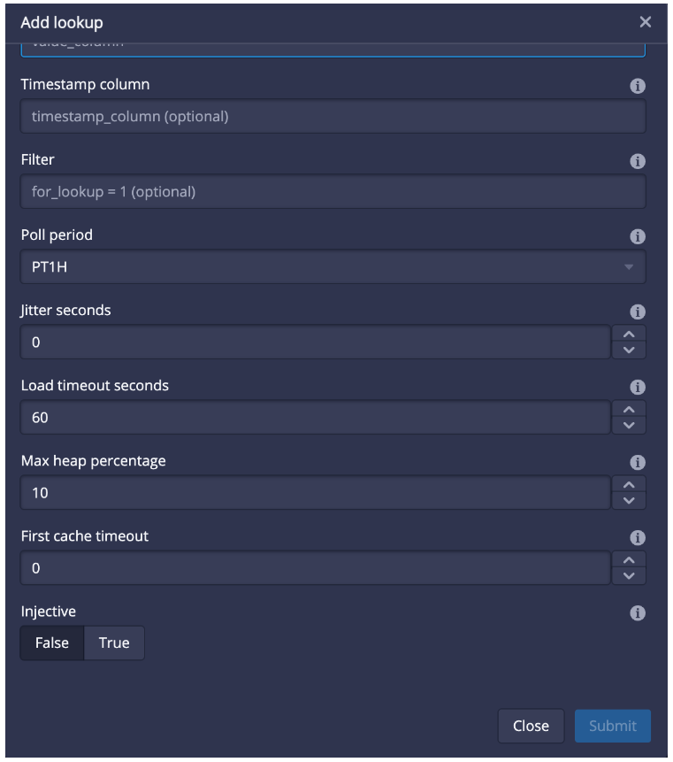
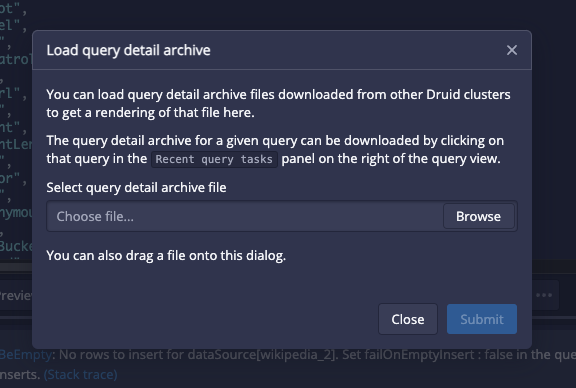

<!--
  ~ Licensed to the Apache Software Foundation (ASF) under one
  ~ or more contributor license agreements.  See the NOTICE file
  ~ distributed with this work for additional information
  ~ regarding copyright ownership.  The ASF licenses this file
  ~ to you under the Apache License, Version 2.0 (the
  ~ "License"); you may not use this file except in compliance
  ~ with the License.  You may obtain a copy of the License at
  ~
  ~   http://www.apache.org/licenses/LICENSE-2.0
  ~
  ~ Unless required by applicable law or agreed to in writing,
  ~ software distributed under the License is distributed on an
  ~ "AS IS" BASIS, WITHOUT WARRANTIES OR CONDITIONS OF ANY
  ~ KIND, either express or implied.  See the License for the
  ~ specific language governing permissions and limitations
  ~ under the License.
  -->

<!--Replace {{DRUIDVERSION}} with the correct Druid version.-->

Apache Druid 29.0.0 contains over $NUMBER_FEATURES new features, bug fixes, performance enhancements, documentation improvements, and additional test coverage from $NUMBER_OF_CONTRIBUTORS contributors.

<!--
Replace {{MILESTONE}} with the correct milestone number. For example: https://github.com/apache/druid/issues?q=is%3Aclosed+milestone%3A28.0+sort%3Aupdated-desc+
-->

See the [complete set of changes](https://github.com/apache/druid/issues?q=is%3Aclosed+milestone%3A29.0.0+sort%3Aupdated-desc+) for additional details, including bug fixes.

Review the [upgrade notes](#upgrade-notes) and [incompatible changes](#incompatible-changes) before you upgrade to Druid 29.0.0.
If you are upgrading across multiple versions, see the [Upgrade notes](upgrade-notes.md) page, which lists upgrade notes for the most recent Druid versions.

<!-- 
This file is a collaborative work in process. Adding a release note to this file doesn't guarantee its presence in the next release until the release branch is cut and the release notes are finalized.

This file contains the following sections:
- Important features, changes, and deprecations
- Functional area and related changes
- Upgrade notes and incompatible changes

Please add your release note to the appropriate section and include the following:
- Detailed title
- Summary of the changes (a couple of sentences) aimed at Druid users
- Link to the associated PR

If your release note contains images, put the images in the release-info/assets folder.

For tips about how to write a good release note, see [Release notes](https://github.com/apache/druid/blob/master/CONTRIBUTING.md#release-notes).
-->

## Important features, changes, and deprecations

This section contains important information about new and existing features.

### SQL PIVOT and UNPIVOT (experimental)

Druid 29.0.0 adds experimental support for the SQL PIVOT and UNPIVOT operators.

The PIVOT operator carries out an aggregation and transforms rows into columns in the output. The following is the general syntax for the PIVOT operator:

```sql
PIVOT (aggregation_function(column_to_aggregate)
  FOR column_with_values_to_pivot
  IN (pivoted_column1 [, pivoted_column2 ...])
)
```

The UNPIVOT operator transforms existing column values into rows. The following is the general syntax for the UNPIVOT operator:

```sql
UNPIVOT (values_column 
  FOR names_column
  IN (unpivoted_column1 [, unpivoted_column2 ... ])
)
```

### MSQ export statements (experimental)

Druid 29.0.0 adds experimental support for export statements to the MSQ task engine. This allows query tasks to write data to an external destination through the [`EXTERN` function](https://druid.apache.org/docs/latest/multi-stage-query/reference#extern-function).

[#15689](https://github.com/apache/druid/pull/15689)

### Range support in window functions

Window functions now support ranges where both endpoints are unbounded or are the current row. Ranges work in strict mode, which means that Druid will fail queries that aren't supported. You can turn off strict mode for ranges by setting the context parameter `windowingStrictValidation` to `false`.

The following example shows a window expression with RANGE frame specifications:

```sql
(ORDER BY c)
(ORDER BY c RANGE BETWEEN UNBOUNDED PRECEDING AND CURRENT ROW)
(ORDER BY c RANGE BETWEEN CURRENT ROW AND UNBOUNDED PRECEDING)
```

[#15703](https://github.com/apache/druid/pull/15703) [#15746](https://github.com/apache/druid/pull/15746)

### Improved INNER joins

Druid now supports arbitrary join conditions for INNER join. Any sub-conditions that can't be evaluated as part of the join are converted to a post-join filter. Improved join capabilities allow Druid to more effectively support applications like Tableau.

[#15302](https://github.com/apache/druid/pull/15302)

### Improved concurrent append and replace

You no longer have to manually determine the task lock type for concurrent append and replace with the `taskLockType` task context. Instead, Druid can now determine it automatically for you. You can use the context parameter `"useConcurrentLocks": true` for individual tasks and datasources or enable concurrent append and replace at a cluster level using `druid.indexer.task.default.context`.

[#15684](https://github.com/apache/druid/pull/15684)

### First and last aggregators for double, float, and long data types

Druid now supports for first and last aggregators for the double, float, and long types in an ingestion spec and MSQ queries. Previously, they were only supported for native queries. For more information, see [First and last aggregators](https://druid.apache.org/docs/latest/querying/aggregations/).

[#14462](https://github.com/apache/druid/pull/14462)

### Support for logging audit events

Added support for logging audit events and improved coverage of audited REST API endpoints. To log audit events, set config `druid.audit.manager.type` to `log`.

[#15480](https://github.com/apache/druid/pull/15480) [#15653](https://github.com/apache/druid/pull/15653)

### Enabled empty ingest queries

The MSQ task engine now allows empty ingest queries by default. Previously, ingest queries that produced no data would fail with the `InsertCannotBeEmpty` MSQ fault.
For more information, see [Empty ingest queries in the upgrade notes](#enabled-empty-ingest-queries).

[#15674](https://github.com/apache/druid/pull/15674) [#15495](https://github.com/apache/druid/pull/15495)

### Support for Google Cloud Storage

Added support for Google Cloud Storage (GCS). You can now use durable storage with GCS. See [Durable storage configurations](https://druid.apache.org/docs/latest/multi-stage-query/reference#durable-storage-configurations) for more information.

[#15398](https://github.com/apache/druid/pull/15398)

### Experimental extensions

Druid 29.0.0 adds the following extensions.

#### DDSketch

A new DDSketch extension is available as a community contribution. The DDSketch extension (`druid-ddsketch`) provides support for approximate quantile queries using the [DDSketch](https://github.com/datadog/sketches-java) library.

[#15049](https://github.com/apache/druid/pull/15049)

#### Spectator histogram

A new histogram extension is available as a community contribution. The Spectator-based histogram extension (`druid-spectator-histogram`) provides approximate histogram aggregators and percentile post-aggregators based on [Spectator](https://netflix.github.io/atlas-docs/spectator/) fixed-bucket histograms.

[#15340](https://github.com/apache/druid/pull/15340)

#### Delta Lake

A new Delta Lake extension is available as a community contribution. The Delta Lake extension (`druid-deltalake-extensions`) lets you use the [Delta Lake input source](https://druid.apache.org/docs/latest/development/extensions-contrib/delta-lake) to ingest data stored in a Delta Lake table into Apache Druid.

[#15755](https://github.com/apache/druid/pull/15755)

### Removed the `auto` search strategy

Removed the `auto` search strategy from the native search query. Setting `searchStrategy` to `auto` is now equivalent to `useIndexes`. Improvements to how and when indexes are computed have allowed the `useIndexes` strategy to be more adaptive, skipping computing expensive indexes when possible.

[#15550](https://github.com/apache/druid/pull/15550)

## Functional area and related changes

This section contains detailed release notes separated by areas.

### Web console

#### Improved lookup dialog

The lookup dialog in the web console now includes following optional fields:

* Jitter seconds
* Load timeout seconds
* Max heap percentage



[#15472](https://github.com/apache/druid/pull/15472/)

#### File inputs for query detail archive

The **Load query detail archive** now supports loading queries by selecting a JSON file directly or dragging the file into the dialog.



[#15632](https://github.com/apache/druid/pull/15632)

#### Improved time chart brush and added auto-granularity

* Added the notion of timezone in the explore view.
* Time chart is now able to automatically pick a granularity if "auto" is selected (which is the default) based on the current time filter extent.
* Brush is now automatically enabled in the time chart.
* Brush interval snaps to the selected time granularity.
* Added a highlight bubble to all visualizations (except table because it has its own).

[#14990](https://github.com/apache/druid/pull/14990)

#### Toggle to fail on empty inserts

Added a new toggle that controls whether an ingestion fails if the ingestion query produces no data.

[#15627](https://github.com/apache/druid/pull/15627)

#### Other web console improvements

* Added the ability to detect multiple `EXPLAIN PLAN` queries in the workbench and run them individually [#15570](https://github.com/apache/druid/pull/15570)
* Added the ability to sort a segment table on start and end when grouping by interval [#15720](https://github.com/apache/druid/pull/15720)
* Improved the time shift for compare logic in the web console to include literals [#15433](https://github.com/apache/druid/pull/15433)
* Improved robustness of time shifting in tables in Explore view [#15359](https://github.com/apache/druid/pull/15359)
* Improved ingesting data using the web console [#15339](https://github.com/apache/druid/pull/15339)
* Fixed rendering on a disabled worker [#15712](https://github.com/apache/druid/pull/15712)
* Enabled table driven query modification actions to work with slices [#15779](https://github.com/apache/druid/pull/15779)

### General ingestion

#### Added system fields to input sources

Added the option to return system fields when defining an input source. This allows for ingestion of metadata, such as an S3 object's URI.

[#15276](https://github.com/apache/druid/pull/15276)

#### Changed how Druid allocates weekly segments

When the requested granularity is a month or larger but a segment can't be allocated, Druid resorts to day partitioning.
Unless explicitly specified, Druid skips week-granularity segments for data partitioning because these segments don't align with the end of the month or more coarse-grained intervals.

[#15589](https://github.com/apache/druid/pull/15589)

#### Changed how empty or null array columns are stored

Columns ingested with the auto column indexer that contain only empty or null containing arrays are now stored as `ARRAY<LONG\>` instead of `COMPLEX<json\>`.

[#15505](https://github.com/apache/druid/pull/15505)

#### Enabled skipping compaction for datasources with partial-eternity segments

Druid now skips compaction for datasources with segments that have an interval start or end which coincides with Eternity interval end-points.

[#15542](https://github.com/apache/druid/pull/15542)

#### Segment allocation improvements

Improved segment allocation as follows:

* Enhanced polling in segment allocation queue [#15590](https://github.com/apache/druid/pull/15590)
* Fixed an issue in segment allocation that could cause loss of appended data when running interleaved append and replace tasks [#15459](https://github.com/apache/druid/pull/15459)

#### Other ingestion improvements

* Added a default implementation for the `evalDimension` method in the RowFunction interface [#15452](https://github.com/apache/druid/pull/15452)
* Added a configurable delay to the Peon service that determines how long a Peon should wait before dropping a segment [#15373](https://github.com/apache/druid/pull/15373)
* Improved metadata store updates by attempting to retry updates rather than failing [#15141](https://github.com/apache/druid/pull/15141)
* Fixed an issue where `systemField` values weren't properly decorated in the sampling response [#15536](https://github.com/apache/druid/pull/15536)
* Fixed an issue with columnar frames always writing multi-valued columns where the input column had `hasMultipleValues = UNKNOWN` [#15300](https://github.com/apache/druid/pull/15300)
* Fixed a race condition where there were multiple attempts to publish segments for the same sequence [#14995](https://github.com/apache/druid/pull/14995)
* Fixed a race condition that can occur at high streaming concurrency [#15174](https://github.com/apache/druid/pull/15174)
* Fixed an issue where complex types that are also numbers were assumed to also be double [#15272](https://github.com/apache/druid/pull/15272)
* Fixed an issue with unnecessary retries triggered when exceptions like IOException obfuscated S3 exceptions [#15238](https://github.com/apache/druid/pull/15238)
* Fixed segment retrieval when the input interval does not lie within the years `[1000, 9999]` [#15608](https://github.com/apache/druid/pull/15608)
* Fixed empty strings being incorrectly converted to null values [#15525](https://github.com/apache/druid/pull/15525)
* Simplified `IncrementalIndex` and `OnHeapIncrementalIndex` by removing some parameters [#15448](https://github.com/apache/druid/pull/15448)
* Updated active task payloads being accessed from memory before reverting to the metadata store [#15377](https://github.com/apache/druid/pull/15377)

### SQL-based ingestion

#### Added `castToType` parameter

Added optional `castToType` parameter to `auto` column schema.

[#15417](https://github.com/apache/druid/pull/15417)

#### Improved the EXTEND operator

You can now use types like `VARCHAR ARRAY` and `BIGINT ARRAY` with the EXTEND operator.

For example:

```sql
EXTEND (a VARCHAR ARRAY, b BIGINT ARRAY, c VARCHAR)
```

specifies an extern input with native druid input types `ARRAY<STRING>`, `ARRAY<LONG>` and `STRING`.

[#15458](https://github.com/apache/druid/pull/15458)

#### Improved tombstone generation to honor granularity specified in a `REPLACE` query

MSQ `REPLACE` queries now generate tombstone segments honoring the segment granularity specified in the query rather than generating irregular tombstones. If a query generates more than 5000 tombstones, Druid returns an MSQ `TooManyBucketsFault` error, similar to the behavior with data segments.

[#15243](https://github.com/apache/druid/pull/15243)

#### Improved hash joins using filters

Improved consistency of JOIN behavior for queries using either the native or MSQ task engine to prune based on base (left-hand side) columns only.

[#15299](https://github.com/apache/druid/pull/15299)

#### Configurable page size limit

You can now limit the pages size for results of SELECT queries run using the MSQ task engine. See `rowsPerPage` in the [SQL-based ingestion reference](https://druid.apache.org/docs/latest/multi-stage-query/reference).

### Streaming ingestion

#### Improved Amazon Kinesis automatic reset

Changed Amazon Kinesis automatic reset behavior to only reset the checkpoints for partitions where sequence numbers are unavailable.

[#15338](https://github.com/apache/druid/pull/15338)

### Querying

#### Added IPv6_MATCH SQL function

Added IPv6_MATCH SQL function for matching IPv6 addresses in a subnet:

```sql
IPV6_MATCH(address, subnet)
```

[#15212](https://github.com/apache/druid/pull/15212/)

#### Added JSON_QUERY_ARRAY function

Added JSON_QUERY_ARRAY which is similar to JSON_QUERY except the return type is always `ARRAY<COMPLEX<json>>` instead of `COMPLEX<json>`. Essentially, this function allows extracting arrays of objects from nested data and performing operations such as UNNEST, ARRAY_LENGTH, ARRAY_SLICE, or any other available ARRAY operations.

[#15521](https://github.com/apache/druid/pull/15521)

#### Added support for numeric support for EARLIEST and LATEST functions

In addition to string support, the following functions can now return numeric values:

* EARLIEST and EARLIEST_BY
* LATEST and LATEST_BY

You can also use these functions as aggregations at ingestion time.

[#15607](https://github.com/apache/druid/pull/15607)

#### Added support for `aggregateMultipleValues`

Improved the `ANY_VALUE(expr)` function to support the boolean option `aggregateMultipleValues`. The `aggregateMultipleValues` option is enabled by default. When you run ANY_VALUE on an MVD, the function returns the stringified array. If `aggregateMultipleValues` is set to `false`, ANY_VALUE returns the first value instead.

[#15434](https://github.com/apache/druid/pull/15434)

#### Added native `array contains element` filter

Added native `array contains element` filter to improve performance when using ARRAY_CONTAINS on array columns.

[#15366](https://github.com/apache/druid/pull/15366) [#15455](https://github.com/apache/druid/pull/15455)

#### Changed `equals` filter for native queries

The [equality filter](https://druid.apache.org/docs/latest/querying/filters#equality-filter) on mixed type `auto` columns that contain arrays must now be filtered as their presenting type. This means that if any rows are arrays (for example, the segment metadata and `information_schema` reports the type as some array type), then the native queries must also filter as if they are some array type.
 
This change impacts mixed type `auto` columns that contain both scalars and arrays. It doesn't impact SQL, which already has this limitation due to how the type presents itself.

[#15503](https://github.com/apache/druid/pull/15503)

#### Improved `timestamp_extract` function

The `timestamp_extract(expr, unit, [timezone])` Druid native query function now supports dynamic values.

[#15586](https://github.com/apache/druid/pull/15586)

#### Improved JSON_VALUE and JSON_QUERY

Added support for using expressions to compute the JSON path argument for JSON_VALUE and JSON_QUERY functions.

[#15320](https://github.com/apache/druid/pull/15320)

#### Improved `ExpressionPostAggregator` array handling

Improved the use of `ExpressionPostAggregator` to handle ARRAY types output by the grouping engine. The native expression system now recognizes `ComparableStringArray` and `ComparableList` array wrapper types and treats them as ARRAY types.

Updated `FunctionalExpr` to streamline the handling of class cast exceptions as user errors, so that users are provided with clear exception messages.

[#15543](https://github.com/apache/druid/pull/15543)

#### Improved lookups

Enhanced lookups as follows:

* Improved loading and dropping of containers for lookups to reduce inconsistencies during updates [#14806](https://github.com/apache/druid/pull/14806)
* Changed behavior for initialization of lookups to load the first lookup as is, regardless of cache status [#15598](https://github.com/apache/druid/pull/15598)

#### Enabled query request queuing by default when total laning is turned on

When query scheduler threads are less than server HTTP threads, total laning turns on.
This reserves some HTTP threads for non-query requests such as health checks.
The total laning previously would reject any query request that exceeds the lane capacity.
Now, excess requests will instead be queued with a timeout equal to `MIN(Integer.MAX_VALUE, druid.server.http.maxQueryTimeout)`.

[#15440](https://github.com/apache/druid/pull/15440)

#### Updated ARRAY_OVERLAP

Updated ARRAY_OVERLAP to use the `ArrayContainsElement` filter when filtering ARRAY typed columns, so that it can also use indexes like ARRAY_CONTAINS.

[#15451](https://github.com/apache/druid/pull/15451)

#### Updated subquery guardrails

Increased memory available for subqueries when the query scheduler is configured to limit queries below the number of server threads.

[#15295](https://github.com/apache/druid/pull/15295)

#### Other querying improvements

* Added a supplier that can return `NullValueIndex` to be used by `NullFilter`. This improvement should speed up `is null` and `is not null` filters on JSON columns [#15687](https://github.com/apache/druid/pull/15687)
* Added an option to compare results with relative error tolerance [#15429](https://github.com/apache/druid/pull/15429)
* Added capability for the Broker to access datasource schemas defined in the catalog when processing SQL queries [#15469](https://github.com/apache/druid/pull/15469)
* Enabled ARRAY_TO_MV to support expression inputs [#15528](https://github.com/apache/druid/pull/15528)
* Improved the error message you get when there's an error in the specified interval [#15454](https://github.com/apache/druid/pull/15454)
* Improved how three-valued logic is handled [#15629](https://github.com/apache/druid/pull/15629)
* Improved error reporting for math functions [#14987](https://github.com/apache/druid/pull/14987)
* Improved handling of COALESCE, SEARCH, and filter optimization [#15609](https://github.com/apache/druid/pull/15609)
* Optimized SQL planner for filter expressions by introducing column indexes for expression virtual columns [#15585](https://github.com/apache/druid/pull/15585)
* Optimized queries involving large NOT IN operations [#15625](https://github.com/apache/druid/pull/15625)
* Fixed an issue with nested empty array fields [#15532](https://github.com/apache/druid/pull/15532)
* Fixed NPE with virtual expression with unnest [#15513](https://github.com/apache/druid/pull/15513)
* Fixed an issue with AND and OR operators and numeric `nvl` not clearing out stale null vectors for vector expression processing [#15587](https://github.com/apache/druid/pull/15587)
* Fixed Druid behavior when using multi-value dimensions as arrays [#15644](https://github.com/apache/druid/pull/15644)
* Fixed an issue with filtering columns when using partial paths such as in `JSON_QUERY` [#15643](https://github.com/apache/druid/pull/15643)
* Fixed queries that raise an exception when sketches are stored in cache [#15654](https://github.com/apache/druid/pull/15654)
* Fixed queries involving JSON functions that failed when using negative indexes [#15650](https://github.com/apache/druid/pull/15650)
* Fixed an issue where queries involving filters on TIME_FLOOR could encounter `ClassCastException` when comparing `RangeValue` in `CombineAndSimplifyBounds` [#15778](https://github.com/apache/druid/pull/15778)

### Data management

#### Changed `numCorePartitions` to 0 for tombstones

Tombstone segments now have 0 core partitions. This means they can be dropped or removed independently without affecting availability of other appended segments in the same co-partition space. Prior to this change, removing tombstones with 1 core partition that contained appended segments in the partition space could make the appended segments unavailable.

[#15379](https://github.com/apache/druid/pull/15379)

#### Clean up duty for non-overlapping eternity tombstones

Added `MarkEternityTombstonesAsUnused` to clean up non-overlapping eternity tombstones&mdash;tombstone segments that either start at `-INF` or end at `INF` and don't overlap with any overshadowed used segments in the datasource.

Also added a new metric `segment/unneededEternityTombstone/count` to count the number of dropped non-overshadowed eternity tombstones per datasource.

[#15281](https://github.com/apache/druid/pull/15281)

#### Allowed compaction to work with spatial dimensions

Updated auto-compaction to preserve spatial dimensions rather than rewrite them into regular string dimensions.

[#15321](https://github.com/apache/druid/pull/15321)

#### Enabled skipping compaction for datasources with partial-eternity segments

Druid now skips compaction for datasources with segments that have their interval start or end coinciding with Eternity interval end-points.

[#15542](https://github.com/apache/druid/pull/15542)

#### Enhanced the JSON parser unexpected token logging

The JSON parser unexpected token error now includes the context of the expected VALUE_STRING token. This makes it easier to track mesh/proxy network error messages and to avoid unnecessary research into Druid server rest endpoint responses.

[#15176](https://github.com/apache/druid/pull/15176)

#### Other data management improvements

*  Fixed an issue where the Broker would return an HTTP `400` status code instead of `503` when a Coordinator was temporarily unavailable, such as during a rolling upgrade [#15756](https://github.com/apache/druid/pull/15756)
* Added user identity to Router query request logs [#15126](https://github.com/apache/druid/pull/15126)
* Improved process to retrieve segments from metadata store by retrieving segments in batches [#15305](https://github.com/apache/druid/pull/15305)
* Improved logging messages when skipping auto-compaction for a data source [#15460](https://github.com/apache/druid/pull/15460)
* Improved compaction by modifying the segment iterator to skip intervals without data [#15676](https://github.com/apache/druid/pull/15676)
* Optimized the process to mark segments as unused [#15352](https://github.com/apache/druid/pull/15352)
* Renamed the `virtualColumns.getColumnCapabilities` method to `getColumnCapabilitiesWithoutFallback` to emphasize that it doesn't return capabilities for regular columns [#15614](https://github.com/apache/druid/pull/15614)

### Metrics and monitoring

<!-- #### Other metrics and monitoring improvements -->

* Added worker status and duration metrics in live and task reports [#15180](https://github.com/apache/druid/pull/15180)
* Updated `serviceName` for `segment/count` metric to match the configured metric name within the StatsD emitter [#15347](https://github.com/apache/druid/pull/15347)

### Extensions

#### Basic security improvements

The computed hash values of passwords are now cached for the `druid-basic-security` extension to boost authentication validator performance.

[#15648](https://github.com/apache/druid/pull/15648)

#### DataSketches improvements

* Improved performance of HLL sketch merge aggregators [#15162](https://github.com/apache/druid/pull/15162)
* Updated histogram post-aggregators for Quantiles and KLL sketches for when all values in the sketch are equal. Previously these queries fail but now return `[N, 0, 0, ...]`, where N is the number of values in the sketch, and the length of the list is equal to the value assigned to `numBins` [#15381](https://github.com/apache/druid/pull/15381)

#### Microsoft Azure improvements

* Added support for Azure Storage Accounts authentication options [#15287](https://github.com/apache/druid/pull/15287)
* Added support for Azure Government when using Microsoft Azure Storage for deep storage [#15523](https://github.com/apache/druid/pull/15523)

#### Kubernetes improvements

* Added cleanup lifecycle management for MiddleManager-less task scheduling [#15133](https://github.com/apache/druid/pull/15133)
* Fixed an issue where the Overlord does not start when a cluster does not use a MiddleManager or ZooKeeper [#15445](https://github.com/apache/druid/pull/15445)
* Improved logs and status messages for MiddleManager-less ingestion [#15527](https://github.com/apache/druid/pull/15527)

#### Kafka emitter improvements

* Added a config option to the Kafka emitter that lets you mask sensitive values for the Kafka producer. This feature is optional and will not affect prior configs for the emitter [#15485](https://github.com/apache/druid/pull/15485)
* Resolved `InterruptedException` logging in ingestion task logs [#15519](https://github.com/apache/druid/pull/15519)

#### Prometheus emitter improvements

You can configure the `pushgateway` strategy to delete metrics from Prometheus push gateway on task shutdown using the following Prometheus emitter configurations:

* `druid.emitter.prometheus.deletePushGatewayMetricsOnShutdown`: When set to true, peon tasks delete metrics from the Prometheus push gateway on task shutdown. Default value is false.
* `druid.emitter.prometheus.waitForShutdownDelay`: Time in milliseconds to wait for peon tasks to delete metrics from `pushgateway` on shutdown. Applicable only when `druid.emitter.prometheus.deletePushGatewayMetricsOnShutdown` is set to true. Default value is none, meaning that there is no delay between peon task shutdown and metrics deletion from the push gateway.

[#14935](https://github.com/apache/druid/pull/14935)

#### Iceberg improvements

Added a parameter `snapshotTime` to the iceberg input source spec that allows the user to ingest data files associated with the most recent snapshot. This helps the user ingest data based on older snapshots by specifying the associated snapshot time.

[#15348](https://github.com/apache/druid/pull/15348)

## Upgrade notes and incompatible changes

### Upgrade notes

#### Improved concurrent append and replace

You no longer have to manually determine the task lock type for concurrent append and replace with the `taskLockType` task context. Instead, Druid can now determine it automatically for you. You can use the context parameter `"useConcurrentLocks": true` for individual tasks and datasources or enable concurrent append and replace at a cluster level using `druid.indexer.task.default.context`.

[#15684](https://github.com/apache/druid/pull/15684)

#### Enabled empty ingest queries

The MSQ task engine now allows empty ingest queries by default. For queries that don't generate any output rows, the MSQ task engine reports zero values for `numTotalRows` and `totalSizeInBytes` instead of null. Previously, ingest queries that produced no data would fail with the `InsertCannotBeEmpty` MSQ fault.

To revert to the original behavior, set the MSQ query parameter `failOnEmptyInsert` to `true`.

[#15495](https://github.com/apache/druid/pull/15495) [#15674](https://github.com/apache/druid/pull/15674)

#### Enabled query request queuing by default when total laning is turned on

When query scheduler threads are less than server HTTP threads, total laning turns on.
This reserves some HTTP threads for non-query requests such as health checks.
The total laning previously would reject any query request that exceeds the lane capacity.
Now, excess requests will instead be queued with a timeout equal to `MIN(Integer.MAX_VALUE, druid.server.http.maxQueryTimeout)`.

[#15440](https://github.com/apache/druid/pull/15440)

#### Changed `equals` filter for native queries

Native query equals filter on mixed type `auto` columns which contain arrays must now be filtered as their presenting type, so if any rows are arrays (for example, the segment metadata and `information_schema` reports the type as some array type), then the native queries must also filter as if they are some array type.

[#15503](https://github.com/apache/druid/pull/15503)

#### Changed how empty or null array columns are stored

Columns ingested with the auto column indexer that contain only empty or null arrays are now stored as `ARRAY<LONG\>` instead of `COMPLEX<json\>`.

[#15505](https://github.com/apache/druid/pull/15505)

#### Changed how Druid allocates weekly segments

When the requested granularity is a month or larger but a segment can't be allocated, Druid resorts to day partitioning.
Unless explicitly specified, Druid skips week-granularity segments for data partitioning because these segments don't align with the end of the month or more coarse-grained intervals.

[#15589](https://github.com/apache/druid/pull/15589)

### Incompatible changes

### Removed the `auto` search strategy

Removed the `auto` search strategy from the native search query. Setting `searchStrategy` to `auto` is now equivalent to `useIndexes`. Improvements to how and when indexes are computed have allowed the `useIndexes` strategy to be more adaptive, skipping computing expensive indexes when possible.

[#15550](https://github.com/apache/druid/pull/15550)

### Developer notes

#### Improved InDimFilter reverse-lookup optimization

This improvement includes the following changes:

* Added the `mayIncludeUnknown` parameter to `DimFilter#optimize`.
* Enabled `InDimFilter#optimizeLookup` to handle `mayIncludeUnknown` and perform reverse lookups in a wider range of cases.
* Made `unapply` method in `LookupExtractor` protected and relocated callers to `unapplyAll`.

If your extensions provide a DimFilter, you may need to rebuild them to ensure compatibility with this release.

[#15611](https://github.com/apache/druid/pull/15611)

#### Web console logging

The web console now logs request errors in end-to-end tests to help with debugging.

[#15483](https://github.com/apache/druid/pull/15483)

#### Dependency updates

The following dependencies have been updated:

* Added `chronoshift` as a dependency [#14990](https://github.com/apache/druid/pull/14990)
* Added `gson` to `pom.xml` [#15488](https://github.com/apache/druid/pull/15488/)
* Updated Confluent's dependencies to 6.2.12 [#15441](https://github.com/apache/druid/pull/15441)
* Excluded `jackson-jaxrs` from `ranger-plugin-common`, which isn't required, to address CVEs [#15481](https://github.com/apache/druid/pull/15481)
* Updated Avro to 1.11.3 [#15419](https://github.com/apache/druid/pull/15419)
* Updated Ranger libraries to the newest available version [#15363](https://github.com/apache/druid/pull/15363)
* Updated the iceberg core version to 1.4.1 [#15348](https://github.com/apache/druid/pull/15348)
* Reduced dependency footprint for the iceberg extension [#15280](https://github.com/apache/druid/pull/15280)
* Updated `com.github.eirslett` version to 1.15.0 [#15556](https://github.com/apache/druid/pull/15556)
* Updated multiple webpack dependencies:
  * `webpack` to 5.89.0
  * `webpack-bundle-analyzer` to 4.10.1
  * `webpack-cli` to 5.1.4
  * `webpack-dev-server` to 4.15.1
  
  [#15555](https://github.com/apache/druid/pull/15555)
* Updated `pac4j-oidc` java security library version to 4.5.7 [#15522](https://github.com/apache/druid/pull/15522)
* Updated `io.kubernetes.client-java` version to 19.0.0 and `docker-java-bom` to 3.3.4 [#15449](https://github.com/apache/druid/pull/15449)
* Updated core Apache Kafka dependencies to 3.6.1 [#15539](https://github.com/apache/druid/pull/15539)
* Updated and pruned multiple dependencies for the web console, including dropping Babel. As a result, Internet Explorer 11 is no longer supported with the web console [#15487](https://github.com/apache/druid/pull/15487)
* Updated Apache Zookeeper to 3.8.3 from 3.5.10 [#15477](https://github.com/apache/druid/pull/15477)
* Updated Gauva to 32.0.1 from 31.1 [#15482](https://github.com/apache/druid/pull/15482)
* Updated multiple dependencies to address CVEs:
  * `dropwizard-metrics` to 4.2.22 to address GHSA-mm8h-8587-p46h in `com.rabbitmq:amqp-client`
  * `ant` to 1.10.14 to resolve GHSA-f62v-xpxf-3v68, GHSA-4p6w-m9wc-c9c9, GHSA-q5r4-cfpx-h6fh, and GHSA-5v34-g2px-j4fw
  *  `comomons-compress` to 1.24.0 to resolve GHSA-cgwf-w82q-5jrr
  * `jose4j` to 0.9.3 to resolve GHSA-7g24-qg88-p43q and GHSA-jgvc-jfgh-rjvv
  * `kotlin-stdlib` to 1.6.0 to resolve GHSA-cqj8-47ch-rvvq and CVE-2022-24329
  
  [#15464](https://github.com/apache/druid/pull/15464)
* Updated Jackson to version 2.12.7.1 to address CVE-2022-42003 and CVE-2022-42004 which affects `jackson-databind` [#15461](https://github.com/apache/druid/pull/15461)
* Updated `com.google.code.gson:gson` from 2.2.4 to 2.10.1 since 2.2.4 is affected by CVE-2022-25647 [#15461](https://github.com/apache/druid/pull/15461)
* Updated Jedis to version 5.0.2 [#15344](https://github.com/apache/druid/pull/15344)
* Updated `commons-codec:commons-codec` from 1.13 to 1.16.0 [#14819](https://github.com/apache/druid/pull/14819)