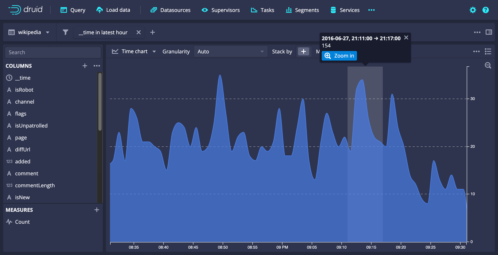
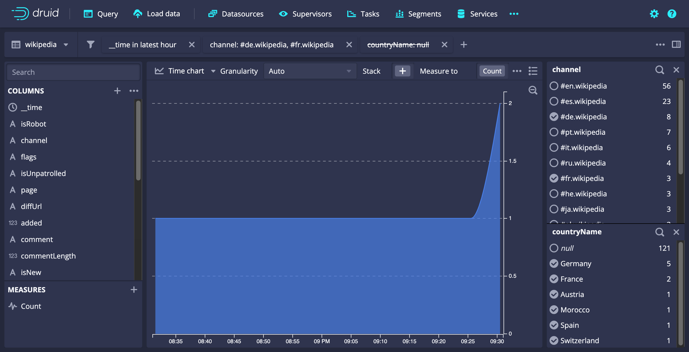
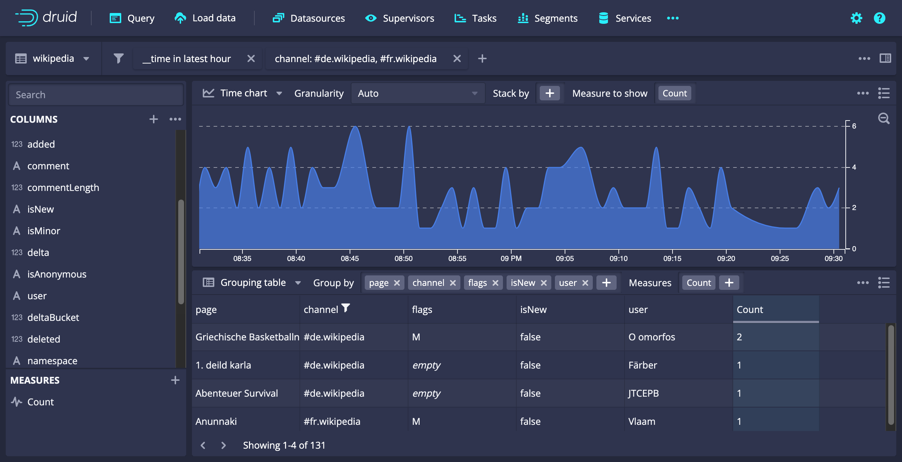
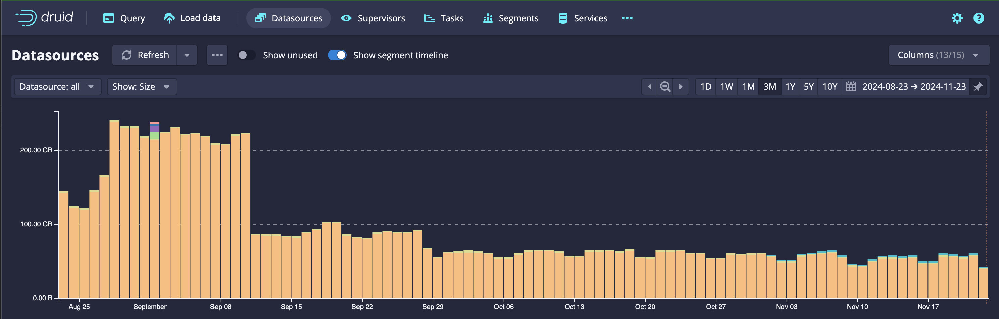
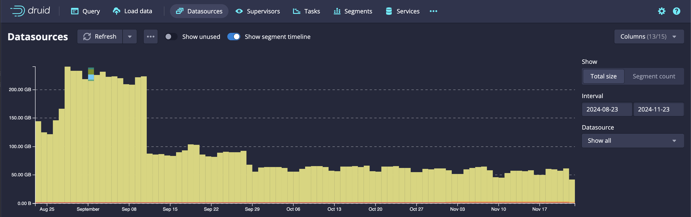

<!--
  ~ Licensed to the Apache Software Foundation (ASF) under one
  ~ or more contributor license agreements.  See the NOTICE file
  ~ distributed with this work for additional information
  ~ regarding copyright ownership.  The ASF licenses this file
  ~ to you under the Apache License, Version 2.0 (the
  ~ "License"); you may not use this file except in compliance
  ~ with the License.  You may obtain a copy of the License at
  ~
  ~   http://www.apache.org/licenses/LICENSE-2.0
  ~
  ~ Unless required by applicable law or agreed to in writing,
  ~ software distributed under the License is distributed on an
  ~ "AS IS" BASIS, WITHOUT WARRANTIES OR CONDITIONS OF ANY
  ~ KIND, either express or implied.  See the License for the
  ~ specific language governing permissions and limitations
  ~ under the License.
  -->

<!--Replace {{DRUIDVERSION}} with the correct Druid version.-->

Apache Druid 32.0.0 contains over $NUMBER_FEATURES new features, bug fixes, performance enhancements, documentation improvements, and additional test coverage from $NUMBER_OF_CONTRIBUTORS contributors.

<!--
Replace {{MILESTONE}} with the correct milestone number. For example: https://github.com/apache/druid/issues?q=is%3Aclosed+milestone%3A28.0+sort%3Aupdated-desc+
-->

See the [complete set of changes](https://github.com/apache/druid/issues?q=is%3Aclosed+milestone%3A{{MILESTONE}}+sort%3Aupdated-desc+) for additional details, including bug fixes.

Review the [upgrade notes](#upgrade-notes) and [incompatible changes](#incompatible-changes) before you upgrade to Druid {{DRUIDVERSION}}.
If you are upgrading across multiple versions, see the [Upgrade notes](upgrade-notes.md) page, which lists upgrade notes for the most recent Druid versions.

<!-- 
This file is a collaborative work in process. Adding a release note to this file doesn't guarantee its presence in the next release until the release branch is cut and the release notes are finalized.

This file contains the following sections:
- Important features, changes, and deprecations
- Functional area and related changes
- Upgrade notes and incompatible changes

Please add your release note to the appropriate section and include the following:
- Detailed title
- Summary of the changes (a couple of sentences) aimed at Druid users
- Link to the associated PR

If your release note contains images, put the images in the release-info/assets folder.

For tips about how to write a good release note, see [Release notes](https://github.com/apache/druid/blob/master/CONTRIBUTING.md#release-notes).
-->

## Important features, changes, and deprecations

This section contains important information about new and existing features.

### ANSI-SQL compatibility and query results

Support for the configs that let you maintain older behavior that wasn't ANSI-SQL compliant have been removed:

- `druid.generic.useDefaultValueForNull` 
- `druid.generic.useThreeValueLogicForNativeFilters`
- `druid.expressions.useStrictBooleans` 

If these settings are detected, a warning message gets logged. They no longer affect your query results. Only SQL-compliant non-legacy behavior is supported now. 

If you still depended on these configs for your queries, you must update your queries or your results will be incorrect after you upgrade.

For more information about how to update your queries, see the [migration guide](https://druid.apache.org/docs/latest/release-info/migr-ansi-sql-null).

[#17568](https://github.com/apache/druid/pull/17568) [#17609](https://github.com/apache/druid/pull/17609)

### Java 8

Support for Java 8 has been removed starting in Druid 32.0.0. Druid now supports only Java 11 or 17.

[#17466](https://github.com/apache/druid/pull/17466)

### New Overlord APIs

APIs for marking segments as used or unused have been moved from the Coordinator to the Overlord service:

- Mark all segments of a datasource as unused:
`POST /druid/indexer/v1/datasources/{dataSourceName}`

- Mark all (non-overshadowed) segments of a datasource as used:
`DELETE /druid/indexer/v1/datasources/{dataSourceName}`

- Mark multiple segments as used
`POST /druid/indexer/v1/datasources/{dataSourceName}/markUsed`
- Mark multiple (non-overshadowed) segments as unused
`POST /druid/indexer/v1/datasources/{dataSourceName}/markUnused`

- Mark a single segment as used:
`POST /druid/indexer/v1/datasources/{dataSourceName}/segments/{segmentId}`

- Mark a single segment as unused:
`DELETE /druid/indexer/v1/datasources/{dataSourceName}/segments/{segmentId}`

[#17545](https://github.com/apache/druid/pull/17545)

### 17386

https://github.com/apache/druid/pull/17386

## Functional area and related changes

This section contains detailed release notes separated by areas.

### Web console

#### Explore view (experimental)

Several improvements have been made to the Explore view in the web console:

The time chart visualization now supports zooming, dragging, and is smarter about granularity detection:

Filters been improved with helper tables and additional context:

Tiles can now be shown side-by-side:

[#17627](https://github.com/apache/druid/pull/17627)

#### Segment timeline view

The segment timeline is now more interactive and no longer forces day granularity.

**New view**

**Old view:**

[#17521](https://github.com/apache/druid/pull/17521)

#### Other web console improvements

- The timezoner picker now always shows your timezone [#17521](https://github.com/apache/druid/pull/17521)
- UNNEST is now supported for autocomplete suggestions [#17521](https://github.com/apache/druid/pull/17521)
- Tables now support less than and greater than filters [#17521](https://github.com/apache/druid/pull/17521)
- You can now resize the side panels in the Query view [#17387](https://github.com/apache/druid/pull/17387)
- Added the `expectedLoadTimeMillis` segment loading metric to the web console [#17359](https://github.com/apache/druid/pull/17359)

### Ingestion

#### Numbers for CSV and TSV input formats

Use the new optional config `tryParseNumbers` for CSV and TSV input formats to control how numbers are treated. If enabled, any numbers present in the input will be parsed in the following manner:

- long data type for integer types and 
- double for floating-point numbers
 
By default, this configuration is set to false, so numeric strings will be treated as strings.

[#17082](https://github.com/apache/druid/pull/17082)

#### Other ingestion improvements

- Reduce the direct memory requirement on non-query processing tasks by not reserving query buffers for them [#16887](https://github.com/apache/druid/pull/16887)
- JSON-based and SQL-based ingestion now support request headers when using an HTTP input source [#16974](https://github.com/apache/druid/pull/16974)
 
#### SQL-based ingestion

##### Other SQL-based ingestion improvements

- SQL-based ingestion now supports dynamic parameters for queries besides SELECT queries, such as REPLACE [#17126](https://github.com/apache/druid/pull/17126)
- Improved thread names to include the stage ID and worker number to help with troubleshooting [#17324](https://github.com/apache/druid/pull/17324)

#### Streaming ingestion

##### Control how many segments get merged for publishing

You can now use the `maxColumsnToMerge` property in your supervisor spec to specify the number of segments to merge in a single phase when merging segments for publishing. This limit affects the total number of columns present in a set of segments to merge. If the limit is exceeded, segment merging occurs in multiple phases. Druid merges at least 2 segments each phase, regardless of this setting.

[#17030](https://github.com/apache/druid/pull/17030)

##### Other streaming ingestion improvements

- Druid now properly supports early/late rejection periods when `stopTasksCount` is configured and streaming tasks run longer than the configured task duration [#17442](https://github.com/apache/druid/pull/17442)
- Improved segment publishing when resubmitting supervisors or when task publishing takes a long time [#17509](https://github.com/apache/druid/pull/17509)

### Querying

#### Window queries

The following fields are deprecated for window queries that use the MSQ task engine: `maxRowsMaterializedInWindow` and `partitionColumnNames`. They will be removed in a future release.

[#17433](https://github.com/apache/druid/pull/17433)

#### Join hints

SQL JOIN queries now include hints. This allows queries to hint the JOIN type that should be used at a per join level. Join hints recursively affect sub queries.

[#17541](https://github.com/apache/druid/pull/17541)

#### Other querying improvements

- Added automatic query prioritization based on the period of the segments scanned in a query. You can set the duration threshold in ISO format using `druid.query.scheduler.prioritization.segmentRangeThreshold` [#17009](https://github.com/apache/druid/pull/17009)
- Improved error handling for incomplete queries. A trailer header to indicate an error is returned now [#16672](https://github.com/apache/druid/pull/16672)
- Improved scan queries to account for column types in more situations [#17463](https://github.com/apache/druid/pull/17463)
- Improved lookups so that they can now iterate over fetched data [#17212](https://github.com/apache/druid/pull/17212)
- Improved projections so that theycan contain only aggregators and no grouping columns [#17484](https://github.com/apache/druid/pull/17484)
- Removed microseconds as a supported unit for EXTRACT [#17247](https://github.com/apache/druid/pull/17247)

### Cluster management

#### Other cluster management improvements

- Druid can now run non-G1 Garbage Collectors with `JAVA_OPTS` [#17078](https://github.com/apache/druid/pull/17078)
- You no longer have to configure a temporary storage directory on the Middle Manager for durable storage or exports. If it isn't configured, Druid uses the task directory [#17015](https://github.com/apache/druid/pull/17015) [#17335](https://github.com/apache/druid/pull/17335)
- Improved autoscaling on supervisors so that tasks don't get published needlessly [#17335](https://github.com/apache/druid/pull/17335)
- Improved recovery time for Overlord leadership after ZooKeeper are bounced [#17535](https://github.com/apache/druid/pull/17535)
- Improved Druid to be more resilient of Druid service leadership changes due to ZooKeeper outages [#17546](https://github.com/apache/druid/pull/17546)
- Removed the following unused Coordinator dynamic configs: `mergeBytesLimit` and `mergeSegmentsLimit` [#17384](https://github.com/apache/druid/pull/17384)

### Data management

#### Sorting columns for compaction with the MSQ task engine

Compaction that uses the MSQ task engine now supports sorting segments with non-time columns.  If `forceSegmentSortByTime` is set in the compaction config or the inferred schema, the following happens:

- Skip adding `__time` explicitly as the first column to the dimension schema since it already comes as part of the schema
- Ensure column mappings propagate `__time` in the order specified by the schema
- Set `forceSegmentSortByTime` in the MSQ query context.

#### Other data management improvements

- Improved centeralized datasource schemas so that different permutations of the same column order do not result in distinct schemas [#17044](https://github.com/apache/druid/pull/17044)
- Changed compaction tasks to always handle multivalue dimensions as arrays if the column schema is not explicitly specified [#17110](https://github.com/apache/druid/pull/17110)

### Metrics and monitoring

#### New metrics for GroupByStatsMonitor:

Druid now emits the folowing metrics for GroupBy queries:

`mergeBuffer/used`: Number of merge buffers used
`mergeBuffer/acquisitionTimeNs`: Total time required to acquire merge buffer
`mergeBuffer/acquisition`: Number of queries that acquired a batch of merge buffers
`groupBy/spilledQueries`: Number of queries that spilled onto the disk
`groupBy/spilledBytes`-> Spilled bytes on the disk
`groupBy/mergeDictionarySize`: Size of the merging dictionary

[#17360](https://github.com/apache/druid/pull/17360)

#### CgroupV2 monitors (experimental)

The following monitors for `cgroupv2` are now available: 

- CPU: `org.apache.druid.java.util.metrics.CgroupV2CpuMonitor`
- disk usage `org.apache.druid.java.util.metrics.CgroupV2DiskMonitor`
- memory `org.apache.druid.java.util.metrics.CgroupV2MemoryMonitor`

[#16905](https://github.com/apache/druid/pull/16905)

#### Other metrics and monitoring improvements

- Added `ingest/notices/queueSize`, `ingest/notices/time`,  and `ingest/pause/time` metrics to the statsd emitter [#17487](https://github.com/apache/druid/pull/17487) [#17468](https://github.com/apache/druid/pull/17468)
- Added duty group as a dimension for the `coordinator.global.time` metric for the statsd-emitter [#17320](https://github.com/apache/druid/pull/17320)
-The `service/heartbeat` metric now reports the status on the Peon [#17488](https://github.com/apache/druid/pull/17488)
- Changed real-time segment metrics so that they are for each Sink instead of for each FireHydrant. This is a return to  emission behavior prior to improvements to real-time query performance made in [30.0.0](https://github.com/apache/druid/pull/15757)  [#17170](https://github.com/apache/druid/pull/17170)
- Changed query stats to be first before intervals in `getNativeQueryLine` logging so that the stats are retained if the query object gets truncated [#17326](https://github.com/apache/druid/pull/17326)

### Extensions

#### Delta Lake

- The Delta Lake input source now supports decimal data types and is handled as a double.  If the value cannot fit within a double, ingest it as a string [#17376](https://github.com/apache/druid/pull/17376)
- You can now filter by snap shot version even if if the version is 0 [#17367](https://github.com/apache/druid/pull/17367)

#### gRPC queries

A new contributor extension enabled a gRPC API for SQL and native queries, which means that gRPC-based clients can use the extension to issue SQL queries. Use this extension for simple queries.

For more information, see [gRPC query extension for Druid](https://github.com/apache/druid/tree/master/extensions-contrib/grpc-query).

[#15982](https://github.com/apache/druid/pull/15982)

#### Kubernetes

- Middle Manger-less ingestion using Kubernetes is now more resilient to Overlord restarts [#17446](https://github.com/apache/druid/pull/17446)
- You can now pass empty arrays to type and dataSource keys in selector based pod template selection strategy [#17400](https://github.com/apache/druid/pull/17400)
- Improved the TaskRunner to expose the `getMaximumCapacity` field [#17107](https://github.com/apache/druid/pull/17107)

#### Iceberg

The Iceberg extension now supports the AWS Glue Iceberg catalog. 

[#17392](https://github.com/apache/druid/pull/17392)

### Documentation improvements

## Upgrade notes and incompatible changes

### Upgrade notes

#### Front-coded dictionaries

<!--Carry this forward until 32. Then move it to incompatible changes -->

In Druid 32.0.0, the front coded dictionaries feature will be turned on by default. Front-coded dictionaries reduce storage and improve performance by optimizing for strings where the front part looks similar.

Once this feature is on, you cannot easily downgrade to an earlier version that does not support the feature. 

For more information, see [Migration guide: front-coded dictionaries](./migr-front-coded-dict.md).

If you're already using this feature, you don't need to take any action. 

### Incompatible changes

### Developer notes

- Improved dependency support between extensions. When an extension has a dependency on another extension, it now tries to use the dependency's class loader to find classes required classes [#16973](https://github.com/apache/druid/pull/16973)

#### Dependency updates

The following dependencies have had their versions bumped:

* `javax.xml.bind` is no longer used. Druid now uses `jakarta.xml.bind` [#17370](https://github.com/apache/druid/pull/17370)
* Several dependencies for the web console have had their dependencies updated. For a full list, see [#17381](https://github.com/apache/druid/pull/17381), [#17365](https://github.com/apache/druid/pull/17365), [#17363](https://github.com/apache/druid/pull/17363)
* Removed `file-loader` dependency for the web console [#17346](https://github.com/apache/druid/pull/17346)
* Guice from 4.2.2 to 5.1.0
* `git-commit-id-maven-plugin` from 4.9.10 to 9.0.1 [#17571](https://github.com/apache/druid/pull/17571)
* Netty from version `4.1.108.Final` to `4.1.116.Final`