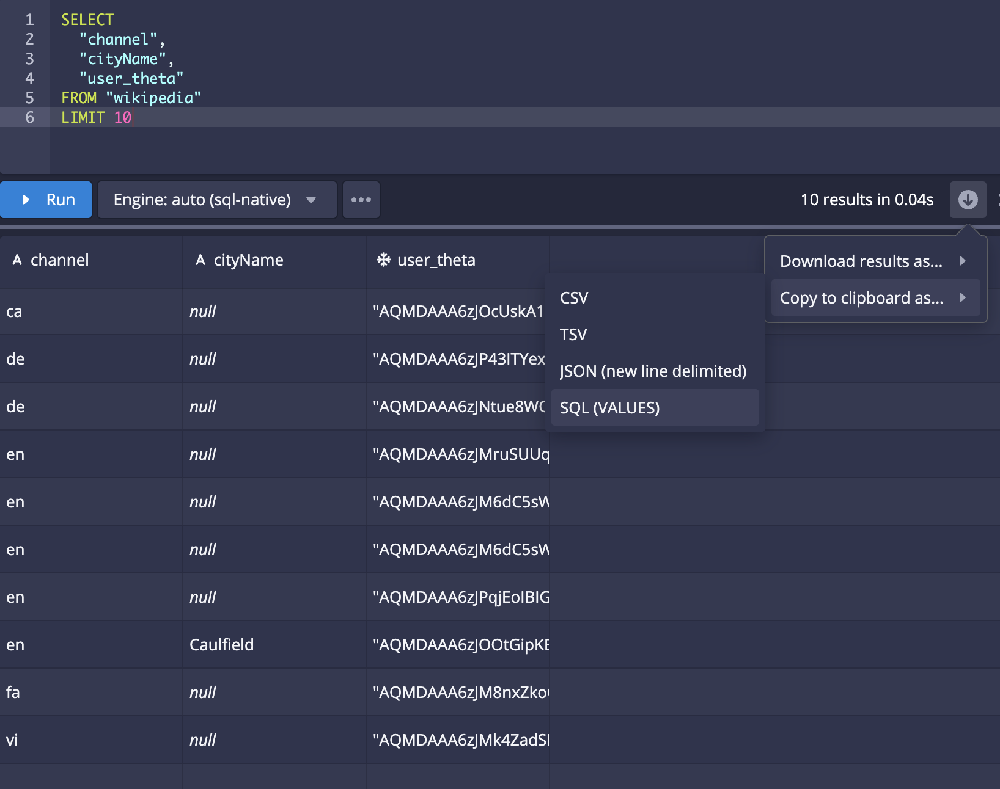

<!--
  ~ Licensed to the Apache Software Foundation (ASF) under one
  ~ or more contributor license agreements.  See the NOTICE file
  ~ distributed with this work for additional information
  ~ regarding copyright ownership.  The ASF licenses this file
  ~ to you under the Apache License, Version 2.0 (the
  ~ "License"); you may not use this file except in compliance
  ~ with the License.  You may obtain a copy of the License at
  ~
  ~   http://www.apache.org/licenses/LICENSE-2.0
  ~
  ~ Unless required by applicable law or agreed to in writing,
  ~ software distributed under the License is distributed on an
  ~ "AS IS" BASIS, WITHOUT WARRANTIES OR CONDITIONS OF ANY
  ~ KIND, either express or implied.  See the License for the
  ~ specific language governing permissions and limitations
  ~ under the License.
  -->

<!--Replace {{DRUIDVERSION}} with the correct Druid version.-->

Apache Druid 31.0.0 contains over $NUMBER_FEATURES new features, bug fixes, performance enhancements, documentation improvements, and additional test coverage from $NUMBER_OF_CONTRIBUTORS contributors.

<!--
Replace {{MILESTONE}} with the correct milestone number. For example: https://github.com/apache/druid/issues?q=is%3Aclosed+milestone%3A28.0+sort%3Aupdated-desc+
-->

See the [complete set of changes](https://github.com/apache/druid/issues?q=is%3Aclosed+milestone%3A31.0.0+sort%3Aupdated-desc+) for additional details, including bug fixes.

Review the [upgrade notes](#upgrade-notes) and [incompatible changes](#incompatible-changes) before you upgrade to Druid 31.0.0.
If you are upgrading across multiple versions, see the [Upgrade notes](upgrade-notes.md) page, which lists upgrade notes for the most recent Druid versions.

<!-- 
This file is a collaborative work in process. Adding a release note to this file doesn't guarantee its presence in the next release until the release branch is cut and the release notes are finalized.

This file contains the following sections:
- Important features, changes, and deprecations
- Functional area and related changes
- Upgrade notes and incompatible changes

Please add your release note to the appropriate section and include the following:
- Detailed title
- Summary of the changes (a couple of sentences) aimed at Druid users
- Link to the associated PR

If your release note contains images, put the images in the release-info/assets folder.

For tips about how to write a good release note, see [Release notes](https://github.com/apache/druid/blob/master/CONTRIBUTING.md#release-notes).
-->

## Important features, changes, and deprecations

This section contains important information about new and existing features.

### Compaction features

Druid now supports the following features:

- Compaction scheduler with greater flexibility and control over when and what to compact.
- MSQ task engine-based compaction for more performant compaction jobs.

See [Automatic compaction](../data-management/automatic-compaction.md) for details.

Compaction tasks that take advantage of concurrent append and replace is now generally available.

[#16291](https://github.com/apache/druid/pull/16291)

### Window functions are GA

[Window functions](../querying/sql-window-functions.md) are now generally available in Druid's native engine and in the MSQ task engine.

- You no longer need to use the query context `enableWindowing` to use window functions. [#17087](https://github.com/apache/druid/pull/17087)

### Projections (TBC)

### High complexity queries (TBC)

Distributed Asynchronous Runtime Topology (DART) supports high complexity queries, such as large joins, high cardinality group by, subqueries, and CTEs, commonly found in ad-hoc data warehouse workloads. DART uses multi-threaded workers, in-memory shuffles, and locally cached data to run these high complexity queries with low latency.

DART is fully compatible with current Druid query shapes and Druid's storage format. 

[#17140](https://github.com/apache/druid/pull/17140)

### Upgrade-related changes

See the [Upgrade notes](#upgrade-notes) for more information about the following upgrade-related changes:
- [Array ingest mode now defaults to array](#array-ingest-mode-now-defaults-to-array)
- [Disabled ZK-based segment loading](#zk-based-segment-loading)
- [Removed task action audit logging](#removed-task-action-audit-logging)
- [Removed Firehose and FirehoseFactory](#removed-firehose-and-firehosefactory)
- [Removed the scan query legacy mode](#removed-the-scan-query-legacy-mode)

### Deprecations

- Java 8 support is being deprecated and will be removed in 32.0.0.
- Deprecated API `/lockedIntervals` is now removed [#16799](https://github.com/apache/druid/pull/16799)
- [Cluster-level compaction API](#api-for-cluster-level-compaction-configuration) deprecates taskslots compaction API [#16803](https://github.com/apache/druid/pull/16803)

## Functional areas and related changes

This section contains detailed release notes separated by areas.

### Web console

#### Copy query results as SQL

You can now copy the results of a query as a Druid SQL statement: 



When you copy the results of the pictured query, you get the following query:

```sql
SELECT
  CAST("c1" AS VARCHAR) AS "channel",
  CAST("c2" AS VARCHAR) AS "cityName",
  DECODE_BASE64_COMPLEX('thetaSketch', "c3") AS "user_theta"
FROM (
  VALUES
  ('ca', NULL, 'AQMDAAA6zJOcUskA1pEMGA=='),
  ('de', NULL, 'AQMDAAA6zJP43ITYexvoEw=='),
  ('de', NULL, 'AQMDAAA6zJNtue8WOvrJdA=='),
  ('en', NULL, 'AQMDAAA6zJMruSUUqmzufg=='),
  ('en', NULL, 'AQMDAAA6zJM6dC5sW2sTEg=='),
  ('en', NULL, 'AQMDAAA6zJM6dC5sW2sTEg=='),
  ('en', NULL, 'AQMDAAA6zJPqjEoIBIGtDw=='),
  ('en', 'Caulfield', 'AQMDAAA6zJOOtGipKE6KIA=='),
  ('fa', NULL, 'AQMDAAA6zJM8nxZkoGPlLw=='),
  ('vi', NULL, 'AQMDAAA6zJMk4ZadSFqHJw==')
) AS "t" ("c1", "c2", "c3")
```

[#16458](https://github.com/apache/druid/pull/16458)

#### Explore view improvements

You can now configure the Explore view on top of a source query instead of only existing tables.
You can also point and click to edit the source query, store measures in the source query,
and return to the state of your view using stateful URLs.

[#17180](https://github.com/apache/druid/pull/17180)

Other changes to the Explore view include the following:

- Added the ability to hide all null columns in the record table
- Added the ability to declare certain parameter values as sticky
- Added the ability to expand a nested column into is constituent paths
- Fixed dragging of a VARCHAR column to a measure control
- Fixed filtering on a predefined measure
- Fixed drag over indicator not clearing
- Fixed applying WHERE filter in the grouping table
- Fixed AS "t" was not always added in the grouping table query
- Fixed AGGREGATE function not being evaluated if it was in an ORDER BY

[#17213](https://github.com/apache/druid/pull/17213) [#17225](https://github.com/apache/druid/pull/17225) [#17234](https://github.com/apache/druid/pull/17234)

#### Support Kinesis input format

The web console now supports the Kinesis input format.

[#16850](https://github.com/apache/druid/pull/16850)

#### Other web console improvements

- You can now search for datasources in the **Datasource** view - previously you had to find them manually [#16371](https://github.com/apache/druid/pull/16371)
- You can now display both raw and formatted JSON in tables, making the data easier to read and troubleshoot [#16632](https://github.com/apache/druid/pull/16632)
* You can now configure the maximum number of tasks through a menu [#16991](https://github.com/apache/druid/pull/16991)
* You can now specify the Delta snapshot version in the web console [#17023](https://github.com/apache/druid/pull/17023)
- Added hooks to customize the workbench view [#16749](https://github.com/apache/druid/pull/16749)
- Added the ability to hide workbench view toolbar in the **Query** view [#16785](https://github.com/apache/druid/pull/16785)
- Added the ability to submit a suspended supervisor using the SQL data loader [#16696](https://github.com/apache/druid/pull/16696)
- Added the ability to configure `serverQueryContext` to set the query context [#16868](https://github.com/apache/druid/pull/16868)
- Added column mapping information to the explain plan [#16598](https://github.com/apache/druid/pull/16598)
- Added the ability to initiate handoff for a supervisor [#16586](https://github.com/apache/druid/pull/16586)
- Added an option to `Use concurrent locks` and moved all insert and replace options to a separate submenu [#16899](https://github.com/apache/druid/pull/16899)
- Added Delta snapshot version [#17023](https://github.com/apache/druid/pull/17023)
- Improved how the web console detects durable storage [#16493](https://github.com/apache/druid/pull/16493)
- Made the following web console improvements:
  - Added titles to action menus
  - Improved the query-based ingestion counter calculation
  - Removed the filter clause on `__time`
  - Fixed scrolling in the `loadRules` editor [#16735](https://github.com/apache/druid/pull/16735)
- Restored the default WHERE filter to auto-generated SQL queries [#16608](https://github.com/apache/druid/pull/16608)
- Fixed NPE due to null values in numeric columns [#16760](https://github.com/apache/druid/pull/16760)

### Ingestion

####  Optimized the loading of broadcast data sources 

Previously all services and tasks downloaded all broadcast data sources.
To save task storage space and reduce task statup time, this modification prevents kill tasks and MSQ controller tasks from downloading unneeded broadcast data sources. All other tasks still load all broadcast data sources.

The `CLIPeon` command line option `--loadBroadcastSegments` is deprecated in favor of `--loadBroadcastDatasourceMode`.

[#17027](https://github.com/apache/druid/pull/17027)


#### General ingestion improvements

- The default value for `druid.indexer.tasklock.batchAllocationWaitTime` is now 0 [#16578](https://github.com/apache/druid/pull/16578)
- Hadoop-based ingestion now works on Kubernetes deployments [#16726](https://github.com/apache/druid/pull/16726)
- Hadoop-based ingestion now has a Boolean config `useMaxMemoryEstimates` parameter, which controls how memory footprint gets estimated. The default is false, so that the behavior matches native JSON-based batch ingestion [#16280](https://github.com/apache/druid/pull/16280)
- Added `druid-parquet-extensions` to all example quickstart configurations [#16664](https://github.com/apache/druid/pull/16664)
- Added support for ingesting CSV format data into Kafka records when Kafka ingestion is enabled with `ioConfig.type = kafka` [#16630](https://github.com/apache/druid/pull/16630)
- Added logging for sketches on workers [#16697](https://github.com/apache/druid/pull/16697)
- Removed obsolete tasks `index_realtime` and `index_realtime_appenderator` tasks&mdash;you can no longer use these tasks to ingest data [#16602](https://github.com/apache/druid/pull/16602)
- Renamed `TaskStorageQueryAdapter` to `TaskQueryTool` and removed the `isAudited` method [#16750](https://github.com/apache/druid/pull/16750)
- Improved Overlord performance by reducing redundant calls in SQL statements [#16839](https://github.com/apache/druid/pull/16839)
- Improved `CustomExceptionMapper` so that it returns a correct failure message [#17016](https://github.com/apache/druid/pull/17016)
- Fixed NPE in `CompactSegments` [#16713](https://github.com/apache/druid/pull/16713)
- Fixed Parquet reader to ensure that Druid reads the required columns for a filter from the Parquet data files [#16874](https://github.com/apache/druid/pull/16874)
- Fixed native ingestion task failures during rolling upgrades from a version before Druid 30 [#17219](https://github.com/apache/druid/pull/17219)

### SQL-based ingestion

#### Optimized S3 storage writing for MSQ durable storage

For queries that use the MSQ task engine and write their output to S3 as durable storage, uploading chunks of data is now faster.

[#16481](https://github.com/apache/druid/pull/16481)

#### Improved lookup performance

Improved lookup performance for queries that use the MSQ task engine by only loading required lookups. This applies to both ingestion and querying.

[#16358](https://github.com/apache/druid/pull/16358)

#### Other SQL-based ingestion improvements

* Improved worker cancellation for the MSQ task engine to prevent race conditions [#17046](https://github.com/apache/druid/pull/17046)
* Improved memory management to better support multi-threaded workers [#17057](https://github.com/apache/druid/pull/17057)
- Reduced memory usage when transferring sketches between the MSQ task engine controller and worker [#16269](https://github.com/apache/druid/pull/16269)
- Improved error handling when retrieving Avro schemas from registry [#16684](https://github.com/apache/druid/pull/16684)
- Fixed issues related to partitioning boundaries in the MSQ task engine's window functions [#16729](https://github.com/apache/druid/pull/16729)
- Fixed handling of null bytes that led to a runtime exception for "Invalid value start byte" [#17232](https://github.com/apache/druid/pull/17232)
- Updated logic to fix incorrect query results for comparisons involving arrays [#16780](https://github.com/apache/druid/pull/16780)
- You can now pass a custom `DimensionSchema` map to MSQ query destination of type `DataSourceMSQDestination` instead of using the default values [#16864](https://github.com/apache/druid/pull/16864)
-  Fixed the calculation of suggested memory in `WorkerMemoryParameters` to account for `maxConcurrentStages` which improves the accuracy of error messages [#17108](https://github.com/apache/druid/pull/17108)
- Optimized the row-based frame writer to reduce failures when writing larger single rows to frames [#17094](https://github.com/apache/druid/pull/17094)

### Streaming ingestion

#### New Kinesis input format

Added a Kinesis input format and reader for timestamp and payload parsing.
The reader relies on a `ByteEntity` type of `KinesisRecordEntity` which includes the underlying Kinesis record.

[#16813](https://github.com/apache/druid/pull/16813)

#### Streaming ingestion improvements

- Added a check for handing off upgraded real-time segments. This prevents data from being temporarily unavailable for queries during segment handoff [#16162](https://github.com/apache/druid/pull/16162)
- Improved the user experience for autoscaling Kinesis. Switching to autoscaling based on max lag per shard from total lag for shard is now controlled by the `lagAggregate` config, defaulting to sum [#16334](https://github.com/apache/druid/pull/16334)
- Improved the Supervisor so that it doesn't change to a running state from idle if the Overlord restarts [#16844](https://github.com/apache/druid/pull/16844)

### Querying

#### Enabled querying cold datasources

You can now query entirely cold datasources after you enable the `CentralizedDatasourceSchema` feature. For information about how to use a centralized datasource schema, see [Centralized datasource schema](https://druid.apache.org/docs/latest/configuration/#centralized-datasource-schema).

[#16676](https://github.com/apache/druid/pull/16676)

#### SQL DIV function

You can now use the SQL DIV function.

[#16464](https://github.com/apache/druid/pull/16464)

#### Modified equality and typed in filter behavior

Modified the behavior of using `EqualityFilter` and `TypedInFilter` to match numeric values (particularly DOUBLE) against string columns by casting strings for numerical comparison. This ensures more consistent Druid behavior when the `sqlUseBoundAndSelectors` context flag is set.

[#16593](https://github.com/apache/druid/pull/16593)

#### Window query guardrails

Druid blocks window queries that involve aggregation functions inside the window clause when the window is included in SELECT.
The error message provides details on updating your query syntax.

[#16801](https://github.com/apache/druid/pull/16801)

#### Updated query from deep storage API response

Added the following fields from the query-based ingestion task report to the response for API request `GET` `/v2/sql/statements/query-id?detail=true`:
- `stages`: Query stages
- `counters`: Stage counters
- `warnings`: Warning reports

[#16808](https://github.com/apache/druid/pull/16808)

#### Other querying improvements

* Improved window queries so that window queries without group by using the native engine don't return an empty response [#16658](https://github.com/apache/druid/pull/16658)
* Window queries now support the guardrail `maxSubqueryBytes`  [#16800](https://github.com/apache/druid/pull/16800)
* Window functions that use the MSQ task engine now reject MVDs when they're used as the PARTITION BY column. Previously, an exception occurred [#17036](https://github.com/apache/druid/pull/17036)
- A query that references aggregators called with unsupported distinct values now fails [#16770](https://github.com/apache/druid/pull/16770)
- Druid now validates that a complex type aligns with the supported types when used with an aggregator [#16682](https://github.com/apache/druid/pull/16682)
- Druid prevents you from using DISTINCT or unsupported aggregations with window functions [#16738](https://github.com/apache/druid/pull/16738)
- Druid now deduces type from aggregators when materializing subquery results [#16703](https://github.com/apache/druid/pull/16703)
- Added the ability to define the segment granularity of a table in the catalog [#16680](https://github.com/apache/druid/pull/16680)
- Added a way for columns to provide `GroupByVectorColumnSelectors`, which controls how the groupBy engine operates on them [#16338](https://github.com/apache/druid/pull/16338)
- Added `sqlPlannerBloat` query context parameter to control whether two project operators get merged when inlining expressions [#16248](https://github.com/apache/druid/pull/16248)
- Improved window function offsets for `ArrayListRowsAndColumns` [#16718](https://github.com/apache/druid/pull/16718)
- Improved the fallback strategy when the Broker is unable to materialize the subquery's results as frames for estimating the bytes [#16679](https://github.com/apache/druid/pull/16679)
- Improved how Druid executes queries that contain a LIMIT clause [#16643](https://github.com/apache/druid/pull/16643)
- Improved the code style of `NestedDataOperatorConversions` to be consistent for each `SqlOperatorConversion` [#16695](https://github.com/apache/druid/pull/16695)
- Improved window functions so that they reject multi-value dimensions during processing instead of failing to process them [#17002](https://github.com/apache/druid/pull/17002)
- Improved async query by increasing its timeout to 5 seconds [#16656](https://github.com/apache/druid/pull/16656)
- Improved error message when the requested number of rows in a window exceeds the maximum [#16906](https://github.com/apache/druid/pull/16906)
- Improved numeric aggregations so that Druid now coerces complex types to number when possible, such as for `SpectatorHistogram` [#16564](https://github.com/apache/druid/pull/16564)
- Improved query filtering to correctly process cases where both an IN expression and an equality (`=`) filter are applied to the same string value [#16597](https://github.com/apache/druid/pull/16597)
- Improved the speed of SQL IN queries that use the SCALAR_IN_ARRAY function [#16388](https://github.com/apache/druid/pull/16388)
- Updated the deserialization of dimensions in GROUP BY queries to operate on all dimensions at once rather than deserializing individual dimensions [#16740](https://github.com/apache/druid/pull/16740)
- Fixed an issue that caused `maxSubqueryBytes` to fail when segments had missing columns [#16619](https://github.com/apache/druid/pull/16619)
- Fixed an issue with the array type selector that caused the array aggregation over window frame to fail [#16653](https://github.com/apache/druid/pull/16653)
- Fixed support for native window queries without a group by clause [#16753](https://github.com/apache/druid/pull/16753)
- Added a query context parameter to enable trasfers of RAC over wire [17150](https://github.com/apache/druid/pull/17150)
- Window functions now support `maxSubqueryBytes` [#16800](https://github.com/apache/druid/pull/16800)
- Fixed an issue with window functions and partitioning [#17141](https://github.com/apache/druid/pull/17141)
- Updated window functions to disallow multi-value dimensions for partitioning [#17036](https://github.com/apache/druid/pull/17036)
- Fixed an issue with casting objects to vector expressions [#17148](https://github.com/apache/druid/pull/17148)
- Added several fixes and improvements to vectorization fallback [#17098](https://github.com/apache/druid/pull/17098), [#17162](https://github.com/apache/druid/pull/17162)
- You can now configure encoding method for sketches at query time [#17050]([)https://github.com/apache/druid/pull/17050)
- Fixed an issue with joins failing to time out on Historicals [#17099](https://github.com/apache/druid/pull/17099)

### Cluster management

#### Added cluster configuration for multivalue handling

Added an optional cluster configuration property `druid.indexing.formats.stringMultiValueHandlingMode` which overrides the default mode `SORTED_SET` used for string dimensions. Possible values are `SORTED_SET` (default), `SORTED_ARRAY`, `ARRAY`.

Note that we recommend you use array types instead of MVDs where possible. For more information, see [Migration guide: MVD to arrays](./migr-mvd-array.md).

[#16822](https://github.com/apache/druid/pull/16822)

#### API for cluster-level compaction configuration

Druid now offers an API to update the cluster-level compaction dynamic configuration:

```
POST /druid/coordinator/v1/config/compaction/cluster
```

Example payload:

```json
{
     "compactionTaskSlotRatio": 0.5,
     "maxCompactionTaskSlots": 10,
     "engine": "msq"
}
```
This API deprecates the older API `/druid/coordinator/v1/config/compaction/taskslots`.

[#16803](https://github.com/apache/druid/pull/16803)

#### Guardrail for task payload size

The `druid.indexer.queue.maxTaskPayloadSize` config defines the maximum size in bytes of a task payload accepted by the Overlord service. The default is 60 MB.

[#16512](https://github.com/apache/druid/pull/16512)

#### Improved UX for Coordinator management

Improve the user experience around Coordinator management as follows:
- Added an API `GET /druid/coordinator/v1/duties` that returns a status list of all duty groups currently running on the Coordinator
- The Coordinator now emits the following metrics: `segment/poll/time`, `segment/pollWithSchema/time`, and `segment/buildSnapshot/time`
- Remove redundant logs that indicate normal operation of well-tested aspects of the Coordinator

[#16959](https://github.com/apache/druid/pull/16959)

#### Other cluster management improvements

- The startup script for Docker-based deployments now specifies the node type [#16282](https://github.com/apache/druid/pull/16282)
- The `druid.sh` script now uses the canonical hostname for `druid.host` by default. You can now set the following environment variable to use IP instead: `DRUID_SET_HOST_IP=1` [#16386](https://github.com/apache/druid/pull/16386)
- Fixed an issue with tombstone segments incorrectly appearing unavailable in the Web Console [#17025](https://github.com/apache/druid/pull/17025)

### Data management

#### Compaction

[TBC]


#### Optimized query for unused segments

Improved the performance of the metadata query to fetch unused segments for a datasource returns results, which could cause issues with Overlord stability. Test queries that used to take over 30 seconds now complete in less than a second.

[#16623](https://github.com/apache/druid/pull/16623)

#### Kill tasks

* The `KillUnusedSegments` coordinator duty now selects datasources in a round-robin manner during each run, ensuring varied selection instead of repeatedly choosing the same set of datasources [#16719](https://github.com/apache/druid/pull/16719)
* Kill tasks can now use different types of locks, such as APPEND or REPLACE. This change is experimental and not recommended for production use [#16362](https://github.com/apache/druid/pull/16362)

#### Other data management improvements

- Fixed an issue in task bootstrapping that prevented tasks from accepting any segment assignments, including broadcast segments [#16475](https://github.com/apache/druid/pull/16475)
* Improved the performance for writing segments [#16698](https://github.com/apache/druid/pull/16698)
* Improved the logic so that unused segments and tombstones in the metadata cache don't get needlessly refreshed [#16990](https://github.com/apache/druid/pull/16990) [17025](https://github.com/apache/druid/pull/17025)
* Improved how segments are fetched so that they can be reused [#17021](https://github.com/apache/druid/pull/17021)


### Storage  improvements

#### Compression for complex columns

Compression is now available for all complex metric columns which don't have specialized implementations. You can configure the `complexMetricCompression` IndexSpec option to any compression strategy (lz4, zstd, etc). The default is uncompressed. This works for most complex columns except `compressed-big-decimal` and columns stored by first/last aggregators.

Note that enabling compression is not backwards compatible with Druid versions older than 31. Only enable it after comprehensive testing, to ensure no need for rollback.

[#16863](https://github.com/apache/druid/pull/16863)

#### Improved segment sorting

Added the ability to sort segments by dimensions other than `__time` - this provides a significant storage benefit.

[#16849](https://github.com/apache/druid/pull/16849)
[#16958](https://github.com/apache/druid/pull/16958)

### APIs

#### New API for exiting streaming task groups early

This new API does a best effort attempt to triggerthe handoff for specified task groups of a supervisor early:

`POST` `/druid/indexer/v1/supervisor/{supervisorId}/taskGroups/handoff`

[#16310](https://github.com/apache/druid/pull/16310)

#### API to fetch conflicting task locks

You can use the new `/activeLocks` API to view task locks for the following attributes:
- Datasource
- Priority
- Interval list

Use this API for debugging, to view lock contention, and to observe any concurrent locks.

### Metrics and monitoring

#### Cgroup usage

The following Cgroup metrics are now available:

|Metric|Description|Dimensions|Normal value|
|------|-----------|----------|------------|
|`cgroup/cpu/usage/total/percentage`|Total cpu percentage used by cgroup of process that is running||0-100|
|`cgroup/cpu/usage/user/percentage`|User cpu percentage used by cgroup of process that is running||0-100|
|`cgroup/cpu/usage/sys/percentage`|Sys cpu percentage used by cgroup of process that is running||0-100|
|`cgroup/disk/read/size`|Reports the number of bytes transferred to specific devices by a cgroup of process that is running.|`diskName`|Varies|
|`cgroup/disk/write/size`|Reports the number of bytes transferred from specific devices by a cgroup of process that is running.|`diskName`|Varies|
|`cgroup/disk/read/count`|Reports the number of read operations performed on specific devices by a cgroup of process that is running.|`diskName`|Varies|
|`cgroup/disk/write/count`|Reports the number of write operations performed on specific devices by a cgroup of process that is running.|`diskName`|Varies|

[#16472](https://github.com/apache/druid/pull/16472)

#### Default Prometheus metrics

The default Prometheus metrics have been expanded to cover more of the available metrics for Druid.

[#16340](https://github.com/apache/druid/pull/16340)

#### Configurable connection timeouts

Added HTTP client property `clientConnectTimeout` to enable configuration of connection timeouts for Druid HTTP client requests.

[#16831](https://github.com/apache/druid/pull/16831)

#### Added indexer metrics

Added `indexer/task/failed/count` and `indexer/task/failed/count` metrics.

[#16829](https://github.com/apache/druid/pull/16829)

#### Added subquery metrics

Added `subquery/rows` and `subquery/bytes` metrics, which indicate the size of the results materialized on the heap.

[#16835](https://github.com/apache/druid/pull/16835)

#### Added segment loading rate metrics

Made the following changes to segment loading rate metrics:

- Added `LoadingRateTracker` which computes a moving average load rate based on
the last few GBs of successful segment loads.
- Added `expectedLoadTimeMillis` to `/druid/coordinator/v1/loadQueue?simple` API response.
- Updated the Coordinator to emit `segment/loading/rateKbps`.

[#16691](https://github.com/apache/druid/pull/16691)

### Extensions

#### Kubernetes improvements

When the fabric client is unable to communicate with the Kubernetes server, the shutdown logic now proceeds without populating the task status location, ensuring all data structures are cleaned up.

[#16711](https://github.com/apache/druid/pull/16711)

#### `pac4j` OIDC context

The `pac4j` extension now returns the OIDC context for `AuthenticationResult`.

[#16109](https://github.com/apache/druid/pull/16109)

#### Middle Manager-less Druid improvements

The Dynamic Pod Template Selection feature enhances the K8s extension by enabling more flexible and dynamic selection of pod templates based on task properties, which can optimize resource utilization and task execution efficiency.

[#16510](https://github.com/apache/druid/pull/16510)

In MiddleManager-less ingestion, Druid adds the pod template name as an annotation to the created job or pod.

[#16772](https://github.com/apache/druid/pull/16772)

#### Improved Iceberg input source support

* You can now optionally use the `caseSensitive` Boolean config to configure how Druid reads column names from Iceberg. Iceberg table scans are case sensitive by default [#16496](https://github.com/apache/druid/pull/16496)
* Added support to the `iceberg` input source to read from Iceberg REST catalogs [#17124](https://github.com/apache/druid/pull/17124)

#### Improved Delta Lake input source support
* Added support for delta structs, arrays, and maps to the `delta` input source [#16884](https://github.com/apache/druid/pull/16884)
* Added the ability to optionally specify a `snapshotVersion` in the delta input source payload to ingest versioned snapshots from a Delta Lake table. When not specified, Druid ingests the latest snapshot from the table [#17004](https://github.com/apache/druid/pull/17004)

#### Other extensions improvements

- Added an informational entry to the streaming supervisor log when task count is greater than the number of partitions [#16948](https://github.com/apache/druid/pull/16948)
- Reduced logging in S3 output stream extension [#16853](https://github.com/apache/druid/pull/16853)
- Reduced logging in basic security extension [#16767](https://github.com/apache/druid/pull/16767)

### Documentation improvements

## Upgrade notes and incompatible changes

### Upgrade notes

#### Array ingest mode now defaults to array

MSQ ingestion context flag `arrayIngestMode` now defaults to `array` instead of `mvd`. This means that SQL `VARCHAR ARRAY` types is no longer implicitly translated and stored in `VARCHAR` columns, but is instead stored as `VARCHAR ARRAY`. This change permits other array types such as `BIGINT ARRAY` and `DOUBLE ARRAY` to be inserted with MSQ into their respective array column types instead of failing as they do in `mvd` mode.

To continue to store multi-value strings, modify any insert/replace queries to wrap the array types with the `ARRAY_TO_MV` operator.

Validation is in place to prevent mixing `VARCHAR` and `VARCHAR ARRAY` columns in the same table, so any ingestions affected by this change will fail and provide a descriptive error message instead of exhibiting unexpected behavior.

The `arrayIngestMode` option of `none` has been removed. It was introduced prior to the table validation logic as a means for cluster operators to force query writers to explicitly set `array` or `mvd` on their query contexts, but provides little utility in Druid 31.

See the following topics for more information:
* [Ingest multi-value dimensions](../querying/multi-value-dimensions.md#sql-based-ingestion) for how to ingest multi-value strings.
* [Ingest arrays](../querying/arrays.md#sql-based-ingestion) for ingesting arrays.

[#16789](https://github.com/apache/druid/pull/16789)

#### Removed task action audit logging

The deprecated task action audit logging has been removed. This change includes the following updates:

- The endpoint `/indexer/v1/task/{taskId}/segments` is no longer supported.
- Druid doesn't write to or read from the metadata table `druid_taskLog`.
- Druid ignores the property `druid.indexer.auditlog.enabled`.
- Druid doesn't emit the metric `task/action/log/time`.

These changes are backward compatible with all existing metadata storage extensions.

[#16309](https://github.com/apache/druid/pull/16309)

#### Removed Firehose and FirehoseFactory

Removed Firehose and FirehoseFactory and remaining implementations.
Apache deprecated support for Druid firehoses in version 0.17. Support for firehose ingestion was removed in version 26.0.

[#16758](https://github.com/apache/druid/pull/16758)

#### Front-coded dictionaries

<!--Carry this forward until 32. Then move it to incompatible changes -->

In Druid 32.0.0, the front coded dictionaries feature will be turned on by default. Front-coded dictionaries reduce storage and improve performance by optimizing for strings where the front part looks similar.

Once this feature is on, you cannot easily downgrade to an earlier version that does not support the feature. 

For more information, see [Migration guide: front-coded dictionaries](./migr-front-coded-dict.md).

If you're already using this feature, you don't need to take any action. 

### Incompatible changes

#### Removed the scan query legacy mode

The native scan query legacy mode has been removed. It was introduced in Druid 0.11 to maintain compatibility during an upgrade from older versions of Druid where the scan query was part of a `contrib` extension.

[#16659](https://github.com/apache/druid/pull/16659)

Hard-coded `"legacy":false` following removal of the legacy mode to prevent error during rolling upgrades or downgrades.

[#16793](https://github.com/apache/druid/pull/16793)

#### ZK-based segment loading

ZK-based segment loading is now disabled. ZK `servedSegmentsPath` was deprecated in Druid 0.7.1. This legacy path has been replaced by `liveSegmentsPath`.

Segment-serving processes such as Peons, Historicals and Indexers no longer create ZK `loadQueuePath` entries. The `druid.zk.paths.loadQueuePath` and `druid.zk.paths.servedSegmentsPath` properties are no longer used.

**Move to HTTP-based segment loading first and then perform the version upgrade.**

### Developer notes

- Fixed the `hibernate-validator` warning displayed during maven build [#16746](https://github.com/apache/druid/pull/16746)
- Replaced the `StorageAdapter` interface with the `CursorHolder` interface [#17024](https://github.com/apache/druid/pull/17024)

### `StorageAdapter` changes

If you write custom extensions, specifically query engines or anything else involving the `StorageAdapter` interface, 31.0.0 includes changes to low-level APIs that may impact you. All methods on `StorageAdapter` now throw a Druid exception.

Prepare for these changes before upgrading to 31.0.0 or later. For more information, see the following pull requests:

* [#16985](https://github.com/apache/druid/pull/16985)
* [#16849](https://github.com/apache/druid/pull/16849)
* [#16533](https://github.com/apache/druid/pull/16533)


#### Dependency updates

Bumped the versions of the following dependencies:

- Apache Avro to 1.11.4 [#17230](https://github.com/apache/druid/pull/17230)
- Apache Calcite to 1.37.0 [#16621](https://github.com/apache/druid/pull/16621)
- Delta Kernel from 3.1.0 to 3.2.1 [#16513](https://github.com/apache/druid/pull/16513) [#17179](https://github.com/apache/druid/pull/17179)
- MySQL Java connector to 8.2.0 [#16024](https://github.com/apache/druid/pull/16024)
- OpenRewrite maven plugin from 5.27.0 to 5.31.0  [#16477](https://github.com/apache/druid/pull/16477)
- Scala library from 2.13.11 to 2.13.14 [#16364](https://github.com/apache/druid/pull/16364)
- Apache Curator reverted to 5.3.0 from 5.5.0 [#16688](https://github.com/apache/druid/pull/16688)
- Updated Blueprint dependencies from v4 to v5 in web console [#16756](https://github.com/apache/druid/pull/16756)
- `io.grpc:grpc-netty-shaded` from 1.57.2 to 1.65.1 [#16731](https://github.com/apache/druid/pull/16731)
- `jclouds.version` from 2.5.0 to 2.6.0 [#16796](https://github.com/apache/druid/pull/16796)
- Axios to 1.7.4 [#16898](https://github.com/apache/druid/pull/16898)


