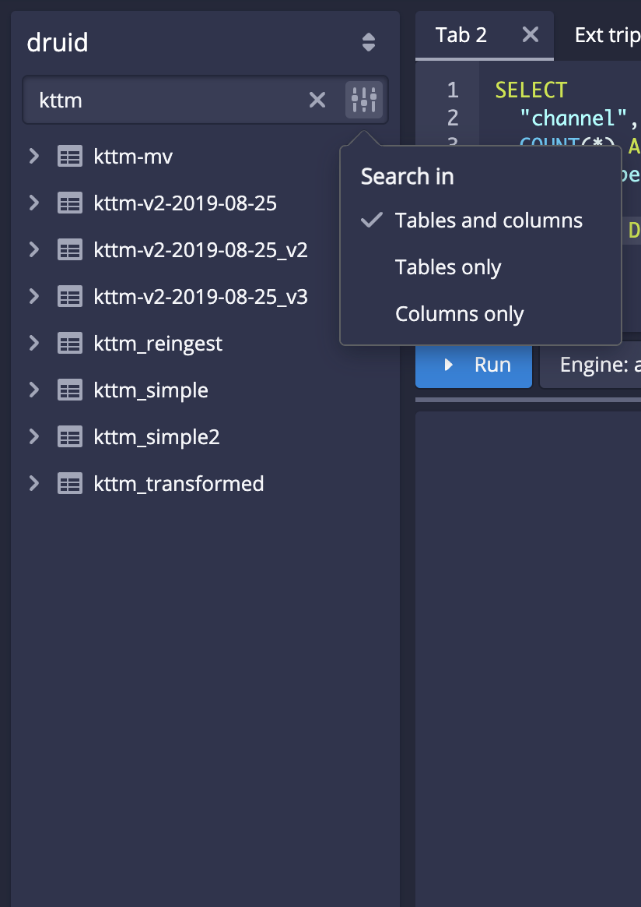

<!--
  ~ Licensed to the Apache Software Foundation (ASF) under one
  ~ or more contributor license agreements.  See the NOTICE file
  ~ distributed with this work for additional information
  ~ regarding copyright ownership.  The ASF licenses this file
  ~ to you under the Apache License, Version 2.0 (the
  ~ "License"); you may not use this file except in compliance
  ~ with the License.  You may obtain a copy of the License at
  ~
  ~   http://www.apache.org/licenses/LICENSE-2.0
  ~
  ~ Unless required by applicable law or agreed to in writing,
  ~ software distributed under the License is distributed on an
  ~ "AS IS" BASIS, WITHOUT WARRANTIES OR CONDITIONS OF ANY
  ~ KIND, either express or implied.  See the License for the
  ~ specific language governing permissions and limitations
  ~ under the License.
  -->

<!--Replace {{DRUIDVERSION}} with the correct Druid version.-->

Apache Druid 30.0.0 contains over 407 new features, bug fixes, performance enhancements, documentation improvements, and additional test coverage from 50 contributors.

<!--
Replace {{MILESTONE}} with the correct milestone number. For example: https://github.com/apache/druid/issues?q=is%3Aclosed+milestone%3A28.0+sort%3Aupdated-desc+
-->

See the [complete set of changes](https://github.com/apache/druid/issues?q=is%3Aclosed+milestone%3A30.0.0+sort%3Aupdated-desc+) for additional details, including bug fixes.

Review the [upgrade notes](#upgrade-notes) and [incompatible changes](#incompatible-changes) before you upgrade to Druid 30.0.0.
If you are upgrading across multiple versions, see the [Upgrade notes](upgrade-notes.md) page, which lists upgrade notes for the most recent Druid versions.

<!-- 
This file is a collaborative work in process. Adding a release note to this file doesn't guarantee its presence in the next release until the release branch is cut and the release notes are finalized.

This file contains the following sections:
- Important features, changes, and deprecations
- Functional area and related changes
- Upgrade notes and incompatible changes

Please add your release note to the appropriate section and include the following:
- Detailed title
- Summary of the changes (a couple of sentences) aimed at Druid users
- Link to the associated PR

If your release note contains images, put the images in the release-info/assets folder.

For tips about how to write a good release note, see [Release notes](https://github.com/apache/druid/blob/master/CONTRIBUTING.md#release-notes).
-->

## Upcoming removals

As part of the continued improvements to Druid, we are deprecating certain features and behaviors in favor of newer iterations that offer more robust features and are more aligned with standard ANSI SQL. Many of these new features have been the default for new deployments for several releases.

The following features are deprecated, and we currently plan to remove support in Druid 32.0.0:

* **Non-SQL compliant null handling**: By default, Druid now differentiates between an empty string and a record with no data as well as between an empty numerical record and `0`. For more information, see [NULL values](../querying/sql-data-types.md#null-values). For a tutorial on the SQL-compliant logic, see the [Null handling tutorial](../tutorials/tutorial-sql-null.md).
* **Non-strict Boolean handling**: Druid now strictly uses `1` (true) or `0` (false). Previously, true and false could be represented either as `true` and `false` or as `1` and `0`, respectively. In addition, Druid now returns a null value for Boolean comparisons like `True && NULL`. For more information, see [Boolean logic](../querying/sql-data-types.md#boolean-logic). For examples of filters that use the SQL-compliant logic, see [Query filters](../querying/filters.md).
* **Two-value logic**: By default, Druid now uses three-valued logic for both ingestion and querying. This primarily affects filters using logical NOT operations on columns with NULL values. For more information, see [Boolean logic](../querying/sql-data-types.md#boolean-logic). For examples of filters that use the SQL-compliant logic, see [Query filters](../querying/filters.md).


## Important features, changes, and deprecations

This section contains important information about new and existing features.

### Concurrent append and replace improvements

Streaming ingestion supervisors now support concurrent append, that is streaming tasks can run concurrently with a replace task (compaction or re-indexing) if it also happens to be using concurrent locks. Set the context parameter `useConcurrentLocks` to true to enable concurrent append.

Once you update the supervisor to have `"useConcurrentLocks": true`, the transition to concurrent append happens seamlessly without causing any ingestion lag or task failures.

[#16369](https://github.com/apache/druid/pull/16369)

Druid now performs active cleanup of stale pending segments by tracking the set of tasks using such pending segments.
This allows concurrent append and replace to upgrade only a minimal set of pending segments and thus improve performance and eliminate errors.
Additionally, it helps in reducing load on the metadata store.

[#16144](https://github.com/apache/druid/pull/16144)

### Grouping on complex columns

Druid now supports grouping on complex columns and nested arrays.
This means that both native queries and the MSQ task engine can group on complex columns and nested arrays while returning results.

Additionally, the MSQ task engine can roll up and sort on the supported complex columns, such as JSON columns, during ingestion.

[#16068](https://github.com/apache/druid/pull/16068)
[#16322](https://github.com/apache/druid/pull/16322)

#### Removed ZooKeeper-based segment loading

ZooKeeper-based segment loading is being removed due to known issues.
It has been deprecated for several releases.
Recent improvements to the Druid Coordinator have significantly enhanced performance with HTTP-based segment loading.

[#15705](https://github.com/apache/druid/pull/15705)

### Improved groupBy queries

Before Druid pushes realtime segments to deep storage, the segments consist of spill files.
Segment metrics such as `query/segment/time` now report on each spill file for a realtime segment, rather than for the entire segment.
This change eliminates the need to materialize results on the heap, which improves the performance of groupBy queries.

[#15757](https://github.com/apache/druid/pull/15757)

### Improved AND filter performance

Druid query processing now adaptively determines when children of AND filters should compute indexes and when to simply match rows during the scan based on selectivity of other filters.
Known as filter partitioning, it can result in dramatic performance increases, depending on the order of filters in the query.

For example, take a query like `SELECT SUM(longColumn) FROM druid.table WHERE stringColumn1 = '1000' AND stringColumn2 LIKE '%1%'`. Previously, Druid used indexes when processing filters if they are available.
That's not always ideal; imagine if `stringColumn1 = '1000'` matches 100 rows. With indexes, we have to find every value of `stringColumn2 LIKE '%1%'` that is true to compute the indexes for the filter. If `stringColumn2` has more than 100 values, it ends up being worse than simply checking for a match in those 100 remaining rows.

With the new logic, Druid now checks the selectivity of indexes as it processes each clause of the AND filter.
If it determines it would take more work to compute the index than to match the remaining rows, Druid skips computing the index.

The order you write filters in a WHERE clause of a query can improve the performance of your query.
More improvements are coming, but you can try out the existing improvements by reordering a query.
Put indexes that are less intensive to compute such as `IS NULL`, `=`, and comparisons (`>`, `>=,` `<`, and `<=`) near the start of AND filters so that Druid more efficiently processes your queries.
Not ordering your filters in this way won’t degrade performance from previous releases since the fallback behavior is what Druid did previously.

[#15838](https://github.com/apache/druid/pull/15838)

### Centralized datasource schema (alpha)

You can now configure Druid to manage datasource schema centrally on the Coordinator.
Previously, Brokers needed to query data nodes and tasks for segment schemas.
Centralizing datasource schemas can improve startup time for Brokers and the efficiency of your deployment.

To enable this feature, set the following configs:

- In your common runtime properties, set `druid.centralizedDatasourceSchema.enabled` to true.
- If you are using MiddleManagers, you also need to set `druid.indexer.fork.property.druid.centralizedDatasourceSchema.enabled` to true in your MiddleManager runtime properties.

[#15817](https://github.com/apache/druid/pull/15817)

### MSQ support for window functions

You can now run window functions in the MSQ task engine using the context flag `enableWindowing:true`.

In the native engine, you must use a group by clause to enable window functions. This requirement is removed in the MSQ task engine.

[#15470](https://github.com/apache/druid/pull/15470)
[#16229](https://github.com/apache/druid/pull/16229)

### MSQ support for Google Cloud Storage

You can now export MSQ results to a Google Cloud Storage (GCS) path by passing the function `google()` as an argument to the `EXTERN` function.

[#16051](https://github.com/apache/druid/pull/16051)

### RabbitMQ extension

A new RabbitMQ extension is available as a community contribution.
The RabbitMQ extension (`druid-rabbit-indexing-service`) lets you manage the creation and lifetime of rabbit indexing tasks. These indexing tasks read events from [RabbitMQ](https://www.rabbitmq.com) through [super streams](https://www.rabbitmq.com/docs/streams#super-streams).

As super streams allow exactly once delivery with full support for partitioning, they are compatible with Druid's modern ingestion algorithm, without the downsides of the prior RabbitMQ firehose.

Note that this uses the RabbitMQ streams feature and not a conventional exchange. You need to make sure that your messages are in a super stream before consumption. For more information, see [RabbitMQ documentation](https://www.rabbitmq.com/docs).

[#14137](https://github.com/apache/druid/pull/14137)

## Functional area and related changes

This section contains detailed release notes separated by areas.

### Web console

#### Improved the Supervisors view

You can now use the **Supervisors** view to dynamically query supervisors and display additional information on newly added columns.


[#16318](https://github.com/apache/druid/pull/16318)

#### Search in tables and columns

You can now use the **Query** view to search in tables and columns.



[#15990](https://github.com/apache/druid/pull/15990)

#### Kafka input format

Improved how the web console determines the input format for a Kafka source.
Instead of defaulting to the Kafka input format for a Kafka source, the web console now only picks the Kafka input format if it detects any of the following in the Kafka sample: a key, headers, or more than one topic.

[#16180](https://github.com/apache/druid/pull/16180)

#### Improved handling of lookups during sampling

Rather than sending a transform expression containing lookups to the sampler, Druid now substitutes the transform expression with a placeholder.
This prevents the expression from blocking the flow.


[#16234](https://github.com/apache/druid/pull/16234)

#### Other web console improvements

* Added the fields **Avro bytes decoder** and **Proto bytes decoder** for their input formats [#15950](https://github.com/apache/druid/pull/15950)
* Fixed an issue with the [Tasks](https://druid.apache.org/docs/latest/operations/web-console#tasks) view returning incorrect values for **Created time** and **Duration** fields after the Overlord restarts [#16228](https://github.com/apache/druid/pull/16228)
* Fixed the Azure icon not rendering in the web console [#16173](https://github.com/apache/druid/pull/16173)
* Fixed the supervisor offset reset dialog in the web console [#16298](https://github.com/apache/druid/pull/16298)
* Improved the user experience when the web console is operating in manual capabilities mode [#16191](https://github.com/apache/druid/pull/16191)
* Improved the query timer as follows:
  * Timer isn't shown if an error happens
  * Timer resets if changing tabs while query is running
  * Error state is lost if tab is switched twice

  [#16235](https://github.com/apache/druid/pull/16235)
* The web console now suggests the `azureStorage` input type instead of the `azure` storage type [#15820](https://github.com/apache/druid/pull/15820)
* The download query detail archive option is now more resilient when the detail archive is incomplete [#16071](https://github.com/apache/druid/pull/16071)
* You can now set `maxCompactionTaskSlots` to zero to stop compaction tasks [#15877](https://github.com/apache/druid/pull/15877)

### General ingestion

#### Improved Azure input source

You can now ingest data from multiple storage accounts using the new `azureStorage` input source schema. For example:

```json
...
    "ioConfig": {
      "type": "index_parallel",
      "inputSource": {
        "type": "azureStorage",
        "objectGlob": "**.json",
        "uris": ["azureStorage://storageAccount/container/prefix1/file.json", "azureStorage://storageAccount/container/prefix2/file2.json"]
      },
      "inputFormat": {
        "type": "json"
      },
      ...
    },
...
```

[#15630](https://github.com/apache/druid/pull/15630)

#### Added a new config to `AzureAccountConfig`

The new config `storageAccountEndpointSuffix` lets you configure the endpoint suffix so that you can override the default and connect to other endpoints, such as Azure Government.

[#16016](https://github.com/apache/druid/pull/16016)

#### Data management API improvements

Improved the [Data management API](https://druid.apache.org/docs/latest/api-reference/data-management-api) as follows:

* Fixed a bug in the `markUsed` and `markUnused` APIs where an empty set of segment IDs would be inconsistently treated as null or non-null in different scenarios [#16145](https://github.com/apache/druid/pull/16145)
* Improved the `markUnused` API endpoint to handle an empty list of segment versions [#16198](https://github.com/apache/druid/pull/16198)
* The `segmentIds` filter in the Data management API payload is now parameterized in the database query [#16174](https://github.com/apache/druid/pull/16174)
* You can now mark segments as used or unused within the specified interval using an optional list of versions.
For example: `(interval, [versions])`. When `versions` is unspecified, all versions of segments in the `interval` are marked as used or unused, preserving the old behavior [#16141](https://github.com/apache/druid/pull/16141)

#### Nested columns performance improvement

Nested column serialization now releases nested field compression buffers as soon as the nested field serialization is complete, which requires significantly less direct memory during segment serialization when many nested fields are present.

[#16076](https://github.com/apache/druid/pull/16076)

#### Improved task context reporting

Added a new field `taskContext` in the task reports of non-MSQ tasks. The change is backward compatible. The payload of this field contains the entire context used by the task during its runtime.

Added a new experimental interface `TaskContextEnricher` to enrich context with use case specific logic.

[#16041](https://github.com/apache/druid/pull/16041)

#### Other ingestion improvements

* Added indexer level task metrics to provide more visibility in task distribution [#15991](https://github.com/apache/druid/pull/15991)
* Added more logging detail for S3 `RetryableS3OutputStream`&mdash;this can help to determine whether to adjust chunk size [#16117](https://github.com/apache/druid/pull/16117)
* Added error code to failure type `InternalServerError` [#16186](https://github.com/apache/druid/pull/16186)
* Added a new index for pending segments table for datasource and `task_allocator_id` columns [#16355](https://github.com/apache/druid/pull/16355)
* Fixed a bug in the `MarkOvershadowedSegmentsAsUnused` Coordinator duty to also consider segments that are overshadowed by a segment that requires zero replicas [#16181](https://github.com/apache/druid/pull/16181)
* Fixed a bug where `numSegmentsKilled` is reported incorrectly [#16103](https://github.com/apache/druid/pull/16103)
* Fixed a bug where completion task reports are not being generated on `index_parallel` tasks [#16042](https://github.com/apache/druid/pull/16042)
* Fixed an issue where concurrent replace skipped intervals locked by append locks during compaction [#16316](https://github.com/apache/druid/pull/16316)
* Improved error messages when supervisor's checkpoint state is invalid [#16208](https://github.com/apache/druid/pull/16208)
* Improved serialization of `TaskReportMap` [#16217](https://github.com/apache/druid/pull/16217)
* Improved compaction segment read and published fields to include sequential compaction tasks [#16171](https://github.com/apache/druid/pull/16171)
* Improved kill task so that it now accepts an optional list of unused segment versions to delete [#15994](https://github.com/apache/druid/pull/15994)
* Improved logging when ingestion tasks try to get lookups from the Coordinator at startup [#16287](https://github.com/apache/druid/pull/16287)
* Improved ingestion performance by parsing an input stream directly instead of converting it to a string and parsing the string as JSON [#15693](https://github.com/apache/druid/pull/15693)
* Improved the creation of input row filter predicate in various batch tasks [#16196](https://github.com/apache/druid/pull/16196)
* Improved how Druid fetches tasks from the Overlord to redact credentials [#16182](https://github.com/apache/druid/pull/16182)
* Optimized `isOvershadowed` when there is a unique minor version for an interval [#15952](https://github.com/apache/druid/pull/15952)
* Removed `EntryExistsException` thrown when trying to insert a duplicate task in the metadata store&mdash;Druid now throws a `DruidException` with error code `entryAlreadyExists` [#14448](https://github.com/apache/druid/pull/14448)
* The task status output for a failed task now includes the exception message [#16286](https://github.com/apache/druid/pull/16286)

### SQL-based ingestion

#### Manifest files for MSQ task engine exports

Export queries that use the MSQ task engine now also create a manifest file at the destination, which lists the files created by the query.

During a rolling update, older versions of workers don't return a list of exported files, and older Controllers don't create a manifest file.
Therefore, export queries ran during this time might have incomplete manifests.

[#15953](https://github.com/apache/druid/pull/15953)

#### `SortMerge` join support

Druid now supports `SortMerge` join for `IS NOT DISTINCT FROM` operations.

[#16003](https://github.com/apache/druid/pull/16003)

#### State of compaction context parameter

Added a new context parameter `storeCompactionState`.
When set to `true`, Druid records the state of compaction for each segment in the `lastCompactionState` segment field.

[#15965](https://github.com/apache/druid/pull/15965)

#### Selective loading of lookups

We have built the foundation of selective lookup loading. As part of this improvement, `KillUnusedSegmentsTask` no longer loads lookups.

[#16328](https://github.com/apache/druid/pull/16328)

#### MSQ task report improvements

Improved the task report for the MSQ task engine as follows:

* A new field in the MSQ task report captures the milliseconds elapsed between when the worker task was first requested and when it fully started running. Actual work time can be calculated using `actualWorkTimeMS = durationMs - pendingMs` [#15966](https://github.com/apache/druid/pull/15966)
* A new field `segmentReport` logs the type of the segment created and the reason behind the selection [#16175](https://github.com/apache/druid/pull/16175)

#### Other SQL-based ingestion improvements

* Changed the controller checker for the MSQ task engine to check for closed only [#16161](https://github.com/apache/druid/pull/16161)
* Fixed an incorrect check while generating MSQ task engine error report [#16273](https://github.com/apache/druid/pull/16273)
* Improved the message you get when the MSQ task engine falls back to a broadcast join from a sort-merge [#16002](https://github.com/apache/druid/pull/16002)
* Improved the speed of worker cancellation by bypassing unnecessary communication with the controller [#16158](https://github.com/apache/druid/pull/16158)
* Improved the error message you get when there's an issue with your PARTITIONED BY clause [#15961](https://github.com/apache/druid/pull/15961)
* Runtime exceptions generated while writing frames now include the name of the column where they occurred [#16130](https://github.com/apache/druid/pull/16130)

### Streaming ingestion

#### Streaming completion reports

Streaming task completion reports now have an extra field `recordsProcessed`, which lists all the partitions processed by that task and a count of records for each partition.
Use this field to see the actual throughput of tasks and make decision as to whether you should vertically or horizontally scale your workers.

[#15930](https://github.com/apache/druid/pull/15930)

#### Improved memory management for Kinesis 

Kinesis ingestion memory tuning config is now simpler:

* You no longer need to set the configs `recordsPerFetch` and `deaggregate`.
* `fetchThreads` can no longer exceed the budgeted amount of heap (100 MB or 5%).
* Use `recordBufferSizeBytes` to set a byte-based limit rather than records-based limit for the Kinesis fetch threads and main ingestion threads. We recommend setting this to 100 MB or 10% of heap, whichever is smaller.
* Use `maxBytesPerPoll` to set a byte-based limit for how much data Druid polls from shared buffer at a time. Default is 1,000,000 bytes.

As part of this change, the following properties have been deprecated:

* `recordBufferSize`,  use `recordBufferSizeBytes` instead
* `maxRecordsPerPoll`, use `maxBytesPerPoll` instead

[#15360](https://github.com/apache/druid/pull/15360)

#### Improved autoscaling for Kinesis streams

The Kinesis autoscaler now considers max lag in minutes instead of total lag.
To maintain backwards compatibility, this change is opt-in for existing Kinesis connections.
To opt in, set `lagBased.lagAggregate` in your supervisor spec to `MAX`.
New connections use max lag by default.

[#16284](https://github.com/apache/druid/pull/16284)
[#16314](https://github.com/apache/druid/pull/16314)

#### Parallelized incremental segment creation

You can now configure the number of threads used to create and persist incremental segments on the disk using the `numPersistThreads` property.
Use additional threads to parallelize the segment creation to prevent ingestion from stalling or pausing frequently as long as there are sufficient CPU resources available.

[#13982](https://github.com/apache/druid/pull/13982/files)

#### Kafka steaming supervisor topic improvement

Druid now properly handles previously found partition offsets.
Prior to this change, updating a Kafka streaming supervisor topic from single to multi-topic (pattern), or vice versa, could cause old offsets to be ignored spuriously.

[#16190](https://github.com/apache/druid/pull/16190)

### Querying

#### Dynamic table append

You can now use the `TABLE(APPEND(...))` function to implicitly create unions based on table schemas.

For example, the following queries are equivalent:

```sql
SELECT * FROM TABLE(APPEND('table1','table2','table3'))
```

and

```sql
SELECT column1,NULL AS column2,NULL AS column3 FROM table1
UNION ALL
SELECT NULL AS column1,column2,NULL AS column3 FROM table2
UNION ALL
SELECT column1,column2,column3 FROM table3
```

Note that if the same columns are defined with different input types, Druid uses the least restrictive column type.

[#15897](https://github.com/apache/druid/pull/15897)

#### Added SCALAR_IN_ARRAY function

Added `SCALAR_IN_ARRAY` function for checking if a scalar expression appears in an array:

`SCALAR_IN_ARRAY(expr, arr)`

[#16306](https://github.com/apache/druid/pull/16306)

#### Improved PARTITIONED BY

If you use the MSQ task engine to run queries, you can now use the following strings in addition to the supported ISO 8601 periods:

- `HOUR` - Same as `'PT1H'`
- `DAY` - Same as `'P1D'`
- `MONTH` - Same as `'P1M'`
- `YEAR` - Same as `'P1Y'`
- `ALL TIME`
- `ALL` - Alias for `ALL TIME`

[#15836](https://github.com/apache/druid/pull/15836/)

#### Improved catalog tables

You can validate complex target column types against source input expressions during DML INSERT/REPLACE operations.

[#16223](https://github.com/apache/druid/pull/16223)

You can now define catalog tables without explicit segment granularities. 
DML queries on such tables need to have the PARTITIONED BY clause specified.
Alternatively, you can update the table to include a defined segment granularity for DML queries to be validated properly.

[#16278](https://github.com/apache/druid/pull/16278)

#### Double and null values in SQL type ARRAY

You can now pass double and null values in SQL type ARRAY through dynamic parameters.

For example:

```json
"parameters": [
  {
    "type": "ARRAY",
    "value": [d1, d2, null]
  }
]
```

[#16274](https://github.com/apache/druid/pull/16274)

#### `TypedInFilter` filter

Added a new `TypedInFilter` filter to replace `InDimFilter`&mdash;to improve performance when matching numeric columns.

[#16039](https://github.com/apache/druid/pull/16039)

`TypedInFilter` can run in replace-with-default mode.

[#16233](https://github.com/apache/druid/pull/16233)

#### Heap dictionaries clear out

Improved object handling to reduce the chances of running out of memory with Group By queries on high cardinality data.

[#16114](https://github.com/apache/druid/pull/16114)

#### Other querying improvements

* Added support for numeric arrays to window functions and subquery materializations [#15917](https://github.com/apache/druid/pull/15917)
* Added support for single value aggregated groupBy queries for scalars [#15700](https://github.com/apache/druid/pull/15700)
* Added support for column reordering with scan and sort style queries [#15815](https://github.com/apache/druid/pull/15815)
* Added support for using MV_FILTER_ONLY and MV_FILTER_NONE functions with a non-literal argument [#16113](https://github.com/apache/druid/pull/16113)
* Added the `radiusUnit` element to the `radius` bound [#16029](https://github.com/apache/druid/pull/16029)
* Fixed the return type for the IPV4_PARSE function. The function now correctly returns null if the string literal can't be represented as an IPv4 address [#15916](https://github.com/apache/druid/pull/15916)
* Fixed an issue where several aggregators returned UNKNOWN or OTHER as their SQL type inference [#16216](https://github.com/apache/druid/pull/16216)
* Fixed an issue where triggering a math expression processor on a segment that lacks a specific column results in an `Unable to vectorize expression` exception [#16128](https://github.com/apache/druid/pull/16128)
* Fixed error while loading lookups from an empty JDBC source [#16307](https://github.com/apache/druid/pull/16307)
* Fixed `ColumnType` to `RelDataType` conversion for nested arrays [#16138](https://github.com/apache/druid/pull/16138)
* Fixed `WindowingscanAndSort` query issues on top of Joins [#15996](https://github.com/apache/druid/pull/15996)
* Fixed `REGEXP_LIKE`, `CONTAINS_STRING`, and `ICONTAINS_STRING` so that they correctly return null for null value inputs in ANSI SQL compatible null handling mode (the default configuration). Previously, they returned false [#15963](https://github.com/apache/druid/pull/15963)
* Fixed issues with `ARRAY_CONTAINS` and `ARRAY_OVERLAP` with null left side arguments as well as `MV_CONTAINS` and `MV_OVERLAP` [#15974](https://github.com/apache/druid/pull/15974)
* Fixed an issue which can occur when using schema auto-discovery on columns with a mix of array and scalar values and querying with scan queries [#16105](https://github.com/apache/druid/pull/16105)
* Fixed windowed aggregates so that they update the aggregation value based on the final compute [#16244](https://github.com/apache/druid/pull/16244)
* Fixed issues with the first/last vector aggregators [#16230](https://github.com/apache/druid/pull/16230)
* Fixed an issue where groupBy queries that have `bit_xor() is null` return the wrong result [#16237](https://github.com/apache/druid/pull/16237)
* Fixed an issue where Broker merge buffers get into a deadlock when multiple simultaneous queries use them [#15420](https://github.com/apache/druid/pull/15420)
* Fixed a mapping issue in window functions where two nodes get the same reference [#16301](https://github.com/apache/druid/pull/16301)
* Improved processing of index backed OR expressions [#16300](https://github.com/apache/druid/pull/16300)
* Improved performance for real-time queries using the MSQ task engine. Segments served by the same server are now grouped together, resulting in more efficient query handling [#15399](https://github.com/apache/druid/pull/15399)
* Improved strict NON NULL return type checks [#16279](https://github.com/apache/druid/pull/16279)
* Improved array handling for Booleans to account for queries such as `select array[true, false] from datasource` [#16093](https://github.com/apache/druid/pull/16093)
* Improved how scalars work in arrays [#16311](https://github.com/apache/druid/pull/16311)
* Improved LIKE filtering performance with multiple wildcards by not using `java.util.regex.Pattern` to match `%` [#16153](https://github.com/apache/druid/pull/16153)
* Modified the `IndexedTable` to reject building the index on the complex types to prevent joining on complex types [#16349](https://github.com/apache/druid/pull/16349)
* Restored `enableWindowing` context parameter for window functions [#16229](https://github.com/apache/druid/pull/16229)

### Cluster management

#### Improved retrieving active task status

Improved performance of the Overlord API `/indexer/v1/taskStatus` by serving status of active tasks from memory rather than querying the metadata.

[#15724](https://github.com/apache/druid/pull/15724)

#### Other cluster management improvements

* Adjusted salt size for `Pac4jSessionStore` to 128 bits, which is FIPS compliant [#15758](https://github.com/apache/druid/pull/15758)
* Improved Connection Count server select strategy to account for slow connection requests [#15975](https://github.com/apache/druid/pull/15975)

### Data management

#### Changes to Coordinator default values

Changed to the default values for the Coordinator service as follows:

* The default value of `druid.coordinator.kill.period` has been changed from `P1D` to the runtime value of `druid.coordinator.period.indexingPeriod`. This default value can be overridden by explicitly specifying `druid.coordinator.kill.period` in the Coordinator runtime properties.
* The default value for the dynamic configuration property `killTaskSlotRatio` has been updated from `1.0` to `0.1`. This ensures that kill tasks take up at least one task slot and at most 10% of all available task slots by default.

[#16247](https://github.com/apache/druid/pull/16247)

#### Compaction completion reports

Parallel compaction task completion reports now have `segmentsRead` and `segmentsPublished` fields to show how effective a compaction task is.

[#15947](https://github.com/apache/druid/pull/15947)

#### `GoogleTaskLogs` upload buffer size

Changed the upload buffer size in `GoogleTaskLogs` to 1 MB instead of 15 MB to allow more uploads in parallel and prevent the MiddleManager service from running out of memory.

[#16236](https://github.com/apache/druid/pull/16236)

#### Other data management improvements

* Improved compaction task reports. They can now contain multiple sets of segment output reports instead of overwriting previous reports [#15981](https://github.com/apache/druid/pull/15981/)
* Improved segment killing in Azure to be faster [#15770](https://github.com/apache/druid/pull/15770)
* Improved the retry behavior for deep storage connections [#15938](https://github.com/apache/druid/pull/15938)
* Improved segment creation so that all segments created in a batch have the same `created_date` entry, which can help in troubleshooting ingestion issues [#15977](https://github.com/apache/druid/pull/15977)
* Improved how Druid parses JSON by using `charsetFix` [#16212](https://github.com/apache/druid/pull/16212)

### Metrics and monitoring

#### New unused segment metric

You can now use the `kill/eligibleUnusedSegments/count` metric to find the number of unused segments of a datasource that are identified as eligible for deletion from the metadata store by the Coordinator.

[#15941](https://github.com/apache/druid/pull/15941) [#15977](https://github.com/apache/druid/pull/15977)

#### Kafka emitter improvements

You can now set custom dimensions for events emitted by the Kafka emitter as a JSON map for the `druid.emitter.kafka.extra.dimensions` property.
For example, `druid.emitter.kafka.extra.dimensions={"region":"us-east-1","environment":"preProd"}`.

[#15845](https://github.com/apache/druid/pull/15845)

#### Prometheus emitter improvements

The Prometheus emitter extension now emits `service/heartbeat` and `zk-connected` metrics.

[#16209](https://github.com/apache/druid/pull/16209)

Also added the following missing metrics to the default Prometheus emitter mapping: `query/timeout/count`, `mergeBuffer/pendingRequests`, `ingest/events/processedWithError`, `ingest/notices/queueSize` and `segment/count`.

[#16329](https://github.com/apache/druid/pull/16329)

#### StatsD emitter improvements

You can now configure `queueSize`,`poolSize`,`processorWorkers`, and `senderWorkers` parameters for the StatsD emitter.
Use these parameters to increase the capacity of the StatsD client when its queue size is full.

[#16283](https://github.com/apache/druid/pull/16283)

#### Improved `segment/unavailable/count` metric

The `segment/unavailable/count` metric now accounts for segments that can be queried from deep storage (`replicaCount=0`).

[#16020](https://github.com/apache/druid/pull/16020)

Added a new metric `segment/deepStorage/count` to support the query from deep storage feature.

[#16072](https://github.com/apache/druid/pull/16072)

#### Other metrics and monitoring improvements

* Added a new `task/autoScaler/requiredCount` metric that provides a count of required tasks based on the calculations of the `lagBased` autoscaler. Compare that value to `task/running/count` to discover the difference between the current and desired task counts [#16199](https://github.com/apache/druid/pull/16199)
* Added `jvmVersion` dimension to the `JvmMonitor` module [#16262](https://github.com/apache/druid/pull/16262)
* Exposed Kinesis lag metrics for use in alerts [#16172](https://github.com/apache/druid/pull/16172)
* Fixed an issue with metric emission in the segment generation phase [#16146](https://github.com/apache/druid/pull/16146)

### Extensions

#### Microsoft Azure improvements

You can now use ingestion payloads larger than 1 MB for Azure.

[#15695](https://github.com/apache/druid/pull/15695)

#### Kubernetes improvements

You can now configure the CPU cores for Peons (Kubernetes jobs) using the Overlord property `druid.indexer.runner.cpuCoreInMicro`.
  
[#16008](https://github.com/apache/druid/pull/16008)

#### Delta Lake improvements

You can use these filters to filter out data files from a snapshot, reducing the number of files Druid has to ingest from a Delta table.

For more information, see [Delta filter object](../ingestion/input-sources.md#delta-filter-object).

[#16288](https://github.com/apache/druid/pull/16288)

Also added a text box for the Delta Lake filter to the web console.
The text box accepts an optional JSON object that is passed down as the `filter` to the delta input source.

[#16379](https://github.com/apache/druid/pull/16379)

#### Improve performance of LDAP credentials validator

Improved performance of LDAP credentials validator by keeping password hashes in an in-memory cache. This helps avoid re-computation of password hashes, thus speeding up the process of LDAP-based Druid authentication.

[#15993](https://github.com/apache/druid/pull/15993)

## Upgrade notes and incompatible changes

### Upgrade notes

#### Front-coded dictionaries

In Druid 32.0.0, the front coded dictionaries feature will be turned on by default. Front-coded dictionaries reduce storage and improve performance by optimizing for strings where the front part looks similar.

Once this feature is on, you cannot easily downgrade to an earlier version that does not support the feature. 

For more information, see [Migration guide: front-coded dictionaries](./migr-front-coded-dict.md).

If you're already using this feature, you don't need to take any action. 

#### Append JsonPath function

The `append` function for JsonPath for ORC format now fails with an exception. Previously, it would run but not append anything.

[#15772](https://github.com/apache/druid/pull/15772)

#### Kinesis ingestion tuning

The following properties have been deprecated as part of simplifying the memory tuning for Kinesis ingestion:

- `recordBufferSize`,  use `recordBufferSizeBytes` instead
- `maxRecordsPerPoll`, use `maxBytesPerPoll` instead

[#15360](https://github.com/apache/druid/pull/15360)

#### Improved Supervisor rolling restarts

The `stopTaskCount` config now prioritizes stopping older tasks first. As part of this change, you must also explicitly set a value for `stopTaskCount`. It no longer defaults to the same value as `taskCount`.

[#15859](https://github.com/apache/druid/pull/15859)

#### Changes to Coordinator default values

Changed the following default values for the Coordinator service:

* The default value for `druid.coordinator.kill.period` (if unspecified) has changed from `P1D` to the value of `druid.coordinator.period.indexingPeriod`. Operators can choose to override `druid.coordinator.kill.period` and that takes precedence over the default behavior.
* The default value for the dynamic configuration property `killTaskSlotRatio` has been updated from `1.0` to `0.1`. This ensures that kill tasks take up only one task slot by default instead of consuming all available task slots.

[#16247](https://github.com/apache/druid/pull/16247)

#### `GoogleTaskLogs` upload buffer size

Changed the upload buffer size in `GoogleTaskLogs` to 1 MB instead of 15 MB to allow more uploads in parallel and prevent the MiddleManager service from running out of memory.

[#16236](https://github.com/apache/druid/pull/16236)

### Incompatible changes

#### Changes to `targetDataSource` in EXPLAIN queries

Druid 29.0.1 included a breaking change that restores the behavior for `targetDataSource` to its 28.0.0 and earlier state, different from Druid 29.0.0 and only 29.0.0. In 29.0.0, `targetDataSource` returns a JSON object that includes the datasource name. In all other versions, `targetDataSource` returns a string containing the name of the datasource.

If you're upgrading from any version other than 29.0.0, there is no change in behavior.

If you are upgrading from 29.0.0, this is an incompatible change.

[#16004](https://github.com/apache/druid/pull/16004)

#### Removed ZooKeeper-based segment loading

ZooKeeper-based segment loading is being removed due to known issues.
It has been deprecated for several releases.
Recent improvements to the Druid Coordinator have significantly enhanced performance with HTTP-based segment loading.

[#15705](https://github.com/apache/druid/pull/15705)

#### Removed Coordinator configs

Removed the following Coordinator configs:

* `druid.coordinator.load.timeout`: Not needed as the default value of this parameter (15 minutes) is known to work well for all clusters.
* `druid.coordinator.loadqueuepeon.type`: Not needed as this value is always `http`.
* `druid.coordinator.curator.loadqueuepeon.numCallbackThreads`: Not needed as ZooKeeper(curator)-based segment loading isn't an option anymore.

Auto-cleanup of compaction configs of inactive datasources is now enabled by default.

[#15705](https://github.com/apache/druid/pull/15705)

#### Changed `useMaxMemoryEstimates` for Hadoop jobs

The default value of the `useMaxMemoryEstimates` parameter for Hadoop jobs is now `false`.

[#16280](https://github.com/apache/druid/pull/16280)

### Developer notes

#### Dependency updates

The following dependencies have had their versions bumped:

- Updated Azure POM from 1.2.19 to 1.2.23 to update transitive dependency `nimbus-jose-jwt` to address `CVE-2023-52428` [#16374](https://github.com/apache/druid/pull/16374)
- Updated `commons-configuration2` from 2.8.0 to 2.10.1 to address `CVE-2024-29131` and `CVE-2024-29133` [#16374](https://github.com/apache/druid/pull/16374)
- Updated `bcpkix-jdk18on` from 1.76 to 1.78.1 to address `CVE-2024-30172`, `CVE-2024-30171`, and `CVE-2024-29857` [#16374](https://github.com/apache/druid/pull/16374)
- Updated `nimbus-jose-jwt` from 8.22.1 to 9.37.2 [#16320](https://github.com/apache/druid/pull/16320)
- Updated `rewrite-maven-plugin` from 5.23.1 to 5.27.0 [#16238](https://github.com/apache/druid/pull/16238)
- Updated `rewrite-testing-frameworks` from 2.4.1 to 2.6.0 [#16238](https://github.com/apache/druid/pull/16238)
- Updated `json-path` from 2.3.0 to 2.9.0
- Updated Apache Delta Lake from 3.0.0 to 3.1.0
- Updated Netty to `4.1.108.Final` to address `CVE-2024-29025` [#16267](https://github.com/apache/druid/pull/16267)
- Updated Apache ZooKeeper to 3.8.4 to address `CVE-2024-23944` [#16267](https://github.com/apache/druid/pull/16267)
- Updated `log4j.version` from 2.18.0 to 2.22.1 [#15934](https://github.com/apache/druid/pull/15934)
- Updated `org.apache.commons.commons-compress` from 1.24.0 to 1.26.0 [#16009](https://github.com/apache/druid/pull/16009)
- Updated `org.apache.commons.commons-codec` from 1.16.0 to 1.16.1 [#16009](https://github.com/apache/druid/pull/16009)
- Updated `org.bitbucket.b_c:jose4j` from 0.9.3 to 0.9.6 [#16078](https://github.com/apache/druid/pull/16078)
- Updated `redis.clients:jedis` from 5.0.2 to 5.1.2 [#16074](https://github.com/apache/druid/pull/16074)
- Updated Jetty from `9.4.53.v20231009` to `9.4.54.v20240208` [#16000](https://github.com/apache/druid/pull/16000)
- Updated `webpackdevmiddleware` from 5.3.3 to 5.3.4 in web console [#16195](https://github.com/apache/druid/pull/16195)
- Updated `express` from 4.18.2 to 4.19.2 in web console [#16204](https://github.com/apache/druid/pull/16204)
- Updated `druid-toolkit/query` from 0.21.9 to 0.22.11 in web console [#16213](https://github.com/apache/druid/pull/16213)
- Updated `follow-redirects` from 1.15.1 to 1.15.4 in web console [#16134](https://github.com/apache/druid/pull/16134)
- Updated Axios from 0.26.1 to 0.28.0 in web console [#16087](https://github.com/apache/druid/pull/16087)
- Removed the `aws-sdk` transitive dependency to reduce the size of the compiled Ranger extension [#16011](https://github.com/apache/druid/pull/16011)
- Removed end of life `log4j v1` dependencies [#15984](https://github.com/apache/druid/pull/15984)
- Suppressed errors for the following CVEs: `CVE-2023-52428(7.5)`, `CVE-2023-50291(7.5)`, `CVE-2023-50298(7.5)`, `CVE-2023-50386(8.8)`, and `CVE-2023-50292(7.5)` [#16147](https://github.com/apache/druid/pull/16147)