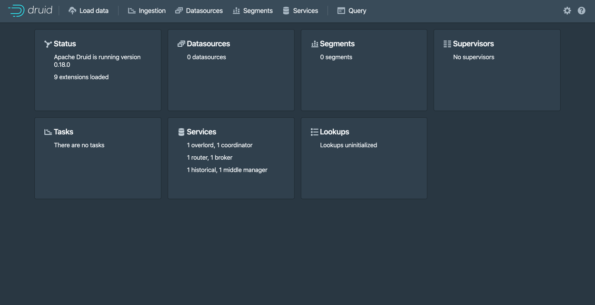

<!--
  ~ Licensed to the Apache Software Foundation (ASF) under one
  ~ or more contributor license agreements.  See the NOTICE file
  ~ distributed with this work for additional information
  ~ regarding copyright ownership.  The ASF licenses this file
  ~ to you under the Apache License, Version 2.0 (the
  ~ "License"); you may not use this file except in compliance
  ~ with the License.  You may obtain a copy of the License at
  ~
  ~   http://www.apache.org/licenses/LICENSE-2.0
  ~
  ~ Unless required by applicable law or agreed to in writing,
  ~ software distributed under the License is distributed on an
  ~ "AS IS" BASIS, WITHOUT WARRANTIES OR CONDITIONS OF ANY
  ~ KIND, either express or implied.  See the License for the
  ~ specific language governing permissions and limitations
  ~ under the License.
  -->
  
In this quickstart, we will download the Apache Druid image from [Docker Hub](https://hub.docker.com/r/apache/druid) and set it up on a single machine using [Docker](https://www.docker.com/get-started) and [Docker Compose](https://docs.docker.com/compose/). The cluster will be ready to load data after completing this initial setup.

Before beginning the quickstart, it is helpful to read the [general Druid overview](../design/index.md) and the [ingestion overview](../ingestion/index.md), as the tutorials will refer to concepts discussed on those pages. Additionally, familiarity with Docker is recommended.

## Prerequisites

* Docker

## Getting started

The Druid source code contains [an example `docker-compose.yml`](https://github.com/apache/druid/blob/master/distribution/docker/docker-compose.yml) which can pull an image from Docker Hub and is suited to be used as an example environment and to experiment with Docker based Druid configuration and deployments.

### Compose file

The example `docker-compose.yml` will create a container for each Druid service, as well as Zookeeper and a PostgreSQL container as the metadata store. Deep storage will be a local directory, by default configured as `./storage` relative to your `docker-compose.yml` file, and will be mounted as `/opt/data` and shared between Druid containers which require access to deep storage. The Druid containers are configured via an [environment file](https://github.com/apache/druid/blob/master/distribution/docker/environment).

### Configuration

Configuration of the Druid Docker container is done via environment variables, which may additionally specify paths to [the standard Druid configuration files](../configuration/index.md)

Special environment variables:

* `JAVA_OPTS` -- set java options
* `DRUID_LOG4J` -- set the entire `log4j.xml` verbatim
* `DRUID_LOG_LEVEL` -- override the default log level in default log4j
* `DRUID_XMX` -- set Java `Xmx`
* `DRUID_XMS` -- set Java `Xms`
* `DRUID_MAXNEWSIZE` -- set Java max new size
* `DRUID_NEWSIZE` -- set Java new size
* `DRUID_MAXDIRECTMEMORYSIZE` -- set Java max direct memory size
* `DRUID_CONFIG_COMMON` -- full path to a file for druid 'common' properties
* `DRUID_CONFIG_${service}` -- full path to a file for druid 'service' properties

In addition to the special environment variables, the script which launches Druid in the container will also attempt to use any environment variable starting with the `druid_` prefix as a command-line configuration. For example, an environment variable
 
```druid_metadata_storage_type=postgresql```
 
would be translated into 

```-Ddruid.metadata.storage.type=postgresql```
 
for the Druid process in the container.

The Druid `docker-compose.yml` example utilizes a single environment file to specify the complete Druid configuration; however, in production use cases we suggest using either `DRUID_COMMON_CONFIG` and `DRUID_CONFIG_${service}` or specially tailored, service-specific environment files.
## Launching the cluster

Run `docker-compose up` to launch the cluster with a shell attached, or `docker-compose up -d` to run the cluster in the background. If using the example files directly, this command should be run from `distribution/docker/` in your Druid installation directory.

Once the cluster has started, you can navigate to [http://localhost:8888](http://localhost:8888).
The [Druid router process](../design/router.md), which serves the [Druid console](../operations/druid-console.md), resides at this address.



It takes a few seconds for all the Druid processes to fully start up. If you open the console immediately after starting the services, you may see some errors that you can safely ignore.

From here you can follow along with the [Quickstart](./index.md#step-4-load-data), or elaborate on your `docker-compose.yml` to add any additional external service dependencies as necessary.

## Docker Memory Requirements
If you experience any processes crashing with a 137 error code you likely don't have enough memory allocated to Docker. 6 GB may be a good place to start. 
