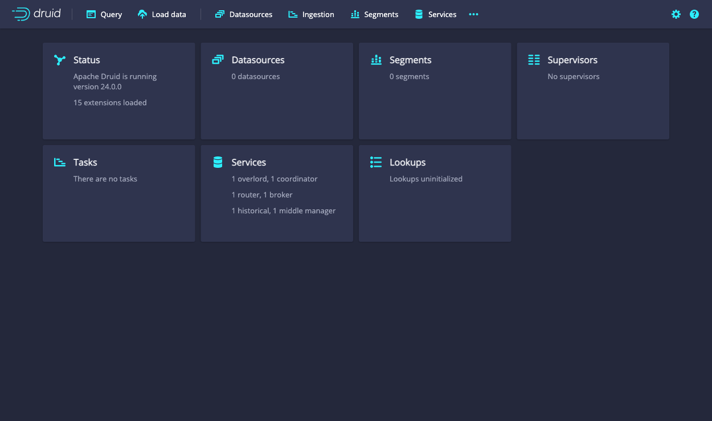

<!--
  ~ Licensed to the Apache Software Foundation (ASF) under one
  ~ or more contributor license agreements.  See the NOTICE file
  ~ distributed with this work for additional information
  ~ regarding copyright ownership.  The ASF licenses this file
  ~ to you under the Apache License, Version 2.0 (the
  ~ "License"); you may not use this file except in compliance
  ~ with the License.  You may obtain a copy of the License at
  ~
  ~   http://www.apache.org/licenses/LICENSE-2.0
  ~
  ~ Unless required by applicable law or agreed to in writing,
  ~ software distributed under the License is distributed on an
  ~ "AS IS" BASIS, WITHOUT WARRANTIES OR CONDITIONS OF ANY
  ~ KIND, either express or implied.  See the License for the
  ~ specific language governing permissions and limitations
  ~ under the License.
  -->


This quickstart gets you started with Apache Druid and introduces you to some of its basic features. 
Following these steps, you will install Druid and load sample 
data using its native batch ingestion feature. 

Before starting, you may want to read the [general Druid overview](../design/index.md) and
[ingestion overview](../ingestion/index.md), as the tutorials refer to concepts discussed on those pages.

## Requirements

You can follow these steps on a relatively small machine, such as a laptop with around 4 CPU and 16 GB of RAM. 

Druid comes with several startup configuration profiles for a range of machine sizes. 
The `micro-quickstart`configuration profile shown here is suitable for evaluating Druid. If you want to 
try out Druid's performance or scaling capabilities, you'll need a larger machine and configuration profile.

The configuration profiles included with Druid range from the even smaller _Nano-Quickstart_ configuration (1 CPU, 4GB RAM) 
to the _X-Large_ configuration (64 CPU, 512GB RAM). For more information, see 
[Single server deployment](../operations/single-server.md). Alternatively, see [Clustered deployment](./cluster.md) for 
information on deploying Druid services across clustered machines. 

The software requirements for the installation machine are:

* Linux, Mac OS X, or other Unix-like OS (Windows is not supported)
* Java 8, Update 92 or later (8u92+)

> Druid officially supports Java 8 only. Support for later major versions of Java is currently in experimental status.

> Druid relies on the environment variables `JAVA_HOME` or `DRUID_JAVA_HOME` to find Java on the machine. You can set 
`DRUID_JAVA_HOME` if there is more than one instance of Java. To verify Java requirements for your environment, run the 
`bin/verify-java` script.

Before installing a production Druid instance, be sure to consider the user account on the operating system under 
which Druid will run. This is important because any Druid console user will have, effectively, the same permissions as 
that user. So, for example, the file browser UI will show console users the files that the underlying user can 
access. In general, avoid running Druid as root user. Consider creating a dedicated user account for running Druid.   

## Step 1. Install Druid

After confirming the [requirements](#requirements), follow these steps: 

1. Download
the [{{DRUIDVERSION}} release](https://www.apache.org/dyn/closer.cgi?path=/druid/{{DRUIDVERSION}}/apache-druid-{{DRUIDVERSION}}-bin.tar.gz).
2. In your terminal, extract Druid and change directories to the distribution directory:

   ```bash
   tar -xzf apache-druid-{{DRUIDVERSION}}-bin.tar.gz
   cd apache-druid-{{DRUIDVERSION}}
   ```
In the directory, you'll find `LICENSE` and `NOTICE` files and subdirectories for executable files, configuration files, sample data and more.

## Step 2: Start up Druid services

Start up Druid services using the `micro-quickstart` single-machine configuration. 

From the apache-druid-{{DRUIDVERSION}} package root, run the following command:

```bash
./bin/start-micro-quickstart
```

This brings up instances of ZooKeeper and the Druid services:

```bash
$ ./bin/start-micro-quickstart
[Fri May  3 11:40:50 2019] Running command[zk], logging to[/apache-druid-{{DRUIDVERSION}}/var/sv/zk.log]: bin/run-zk conf
[Fri May  3 11:40:50 2019] Running command[coordinator-overlord], logging to[/apache-druid-{{DRUIDVERSION}}/var/sv/coordinator-overlord.log]: bin/run-druid coordinator-overlord conf/druid/single-server/micro-quickstart
[Fri May  3 11:40:50 2019] Running command[broker], logging to[/apache-druid-{{DRUIDVERSION}}/var/sv/broker.log]: bin/run-druid broker conf/druid/single-server/micro-quickstart
[Fri May  3 11:40:50 2019] Running command[router], logging to[/apache-druid-{{DRUIDVERSION}}/var/sv/router.log]: bin/run-druid router conf/druid/single-server/micro-quickstart
[Fri May  3 11:40:50 2019] Running command[historical], logging to[/apache-druid-{{DRUIDVERSION}}/var/sv/historical.log]: bin/run-druid historical conf/druid/single-server/micro-quickstart
[Fri May  3 11:40:50 2019] Running command[middleManager], logging to[/apache-druid-{{DRUIDVERSION}}/var/sv/middleManager.log]: bin/run-druid middleManager conf/druid/single-server/micro-quickstart
```

All persistent state, such as the cluster metadata store and segments for the services, are kept in the `var` directory under 
the Druid root directory, apache-druid-{{DRUIDVERSION}}. Each service writes to a log file under `var/sv`, as noted in the startup script output above.

At any time, you can revert Druid to its original, post-installation state by deleting the entire `var` directory. You may
want to do this, for example, between Druid tutorials or after experimentation, to start with a fresh instance. 

To stop Druid at any time, use CTRL-C in the terminal. This exits the `bin/start-micro-quickstart` script and 
terminates all Druid processes. 


## Step 3. Open the Druid console 

After the Druid services finish startup, open the [Druid console](../operations/druid-console.md) at [http://localhost:8888](http://localhost:8888). 



It may take a few seconds for all Druid services to finish starting, including the [Druid router](../design/router.md), which serves the console. If you attempt to open the Druid console before startup is complete, you may see errors in the browser. Wait a few moments and try again. 


## Step 4. Load data


Ingestion specs define the schema of the data Druid reads and stores. You can write ingestion specs by hand or using the _data loader_, 
as we'll do here to perform batch file loading with Druid's native batch ingestion.

The Druid distribution bundles sample data we can use. The sample data located in `quickstart/tutorial/wikiticker-2015-09-12-sampled.json.gz` 
in the Druid root directory represents Wikipedia page edits for a given day. 

1. Click **Load data** from the Druid console header ().

2. Select the **Local disk** tile and then click **Connect data**.

   

3. Enter the following values: 

   - **Base directory**: `quickstart/tutorial/`

   - **File filter**: `wikiticker-2015-09-12-sampled.json.gz` 

   

   Entering the base directory and [wildcard file filter](https://commons.apache.org/proper/commons-io/apidocs/org/apache/commons/io/filefilter/WildcardFileFilter.html) separately, as afforded by the UI, allows you to specify multiple files for ingestion at once.

4. Click **Apply**. 

   The data loader displays the raw data, giving you a chance to verify that the data 
   appears as expected. 

   

   Notice that your position in the sequence of steps to load data, **Connect** in our case, appears at the top of the console, as shown below. 
   You can click other steps to move forward or backward in the sequence at any time.
   
     
   

5. Click **Next: Parse data**. 

   The data loader tries to determine the parser appropriate for the data format automatically. In this case 
   it identifies the data format as `json`, as shown in the **Input format** field at the bottom right.

   

   Feel free to select other **Input format** options to get a sense of their configuration settings 
   and how Druid parses other types of data.  

6. With the JSON parser selected, click **Next: Parse time**. The **Parse time** settings are where you view and adjust the 
   primary timestamp column for the data.

   

   Druid requires data to have a primary timestamp column (internally stored in a column called `__time`).
   If you do not have a timestamp in your data, select `Constant value`. In our example, the data loader 
   determines that the `time` column is the only candidate that can be used as the primary time column.

7. Click **Next: Transform**, **Next: Filter**, and then **Next: Configure schema**, skipping a few steps.

   You do not need to adjust transformation or filtering settings, as applying ingestion time transforms and 
   filters are out of scope for this tutorial.

8. The Configure schema settings are where you configure what [dimensions](../ingestion/index.md#dimensions) 
   and [metrics](../ingestion/index.md#metrics) are ingested. The outcome of this configuration represents exactly how the 
   data will appear in Druid after ingestion. 

   Since our dataset is very small, you can turn off [rollup](../ingestion/index.md#rollup) 
   by unsetting the **Rollup** switch and confirming the change when prompted.

   


10. Click **Next: Partition** to configure how the data will be split into segments. In this case, choose `DAY` as 
    the **Segment granularity**. 

    

    Since this is a small dataset, we can have just a single segment, which is what selecting `DAY` as the 
    segment granularity gives us. 

11. Click **Next: Tune** and **Next: Publish**.

12. The Publish settings are where you specify the datasource name in Druid. Let's change the default name from 
`wikiticker-2015-09-12-sampled` to `wikipedia`. 

    


13. Click **Next: Edit spec** to review the ingestion spec we've constructed with the data loader. 

    

    Feel free to go back and change settings from previous steps to see how doing so updates the spec.
    Similarly, you can edit the spec directly and see it reflected in the previous steps. 

    > For other ways to load ingestion specs in Druid, see [Tutorial: Loading a file](./tutorial-batch.md). 

14. Once you are satisfied with the spec, click **Submit**.

    The new task for our wikipedia datasource now appears in the Ingestion view. 

    

    The task may take a minute or two to complete. When done, the task status should be "SUCCESS", with
    the duration of the task indicated. Note that the view is set to automatically 
    refresh, so you do not need to refresh the browser to see the status change.

    A successful task means that one or more segments have been built and are now picked up by our data servers.


## Step 5. Query the data 

You can now see the data as a datasource in the console and try out a query, as follows: 

1. Click **Datasources** from the console header. 
  
   If the wikipedia datasource doesn't appear, wait a few moments for the segment to finish loading. A datasource is 
   queryable once it is shown to be "Fully available" in the **Availability** column. 

2. When the datasource is available, open the Actions menu () for that 
   datasource and choose **Query with SQL**.

   

   > Notice the other actions you can perform for a datasource, including configuring retention rules, compaction, and more. 

3. Run the prepopulated query, `SELECT * FROM "wikipedia"` to see the results.

   

Congratulations! You've gone from downloading Druid to querying data in just one quickstart. See the following
section for what to do next. 


## Next steps

After finishing the quickstart, check out the [query tutorial](../tutorials/tutorial-query.md) to further explore 
Query features in the Druid console. 

Alternatively, learn about other ways to ingest data in one of these tutorials: 

- [Loading stream data from Apache Kafka](./tutorial-kafka.md) – How to load streaming data from a Kafka topic.
- [Loading a file using Apache Hadoop](./tutorial-batch-hadoop.md) – How to perform a batch file load, using a remote Hadoop cluster.
- [Writing your own ingestion spec](./tutorial-ingestion-spec.md) – How to write a new ingestion spec and use it to load data.


Remember that after stopping Druid services, you can start clean next time by deleting the `var` directory from the Druid root directory and 
running the `bin/start-micro-quickstart` script again. You will likely want to do this before taking other data ingestion tutorials, 
since in them you will create the same wikipedia datasource. 


