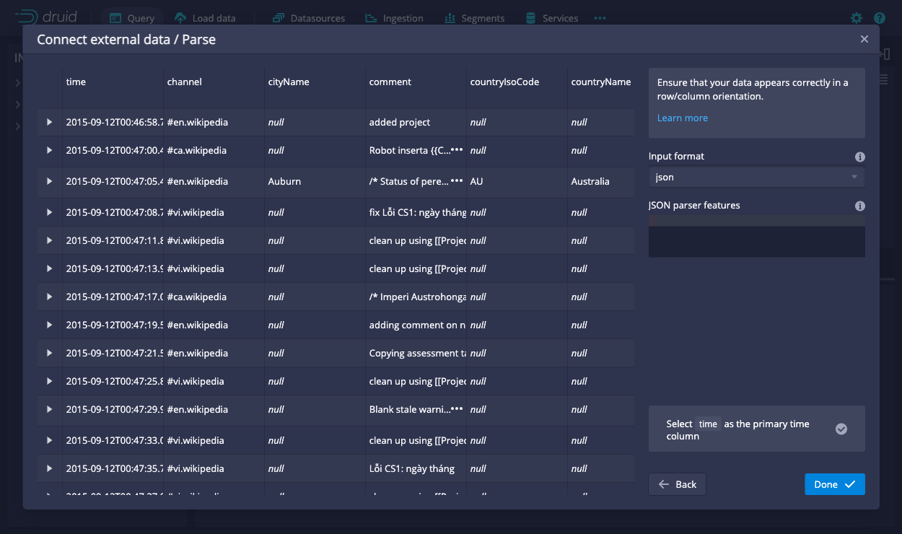
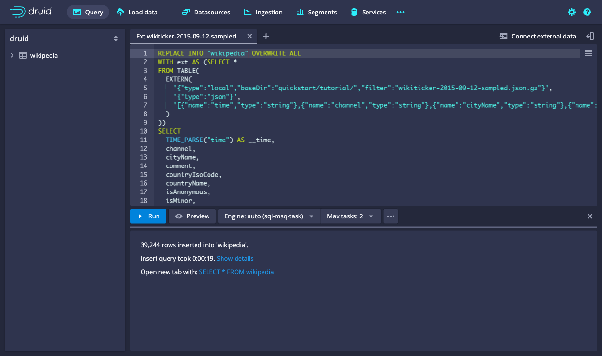
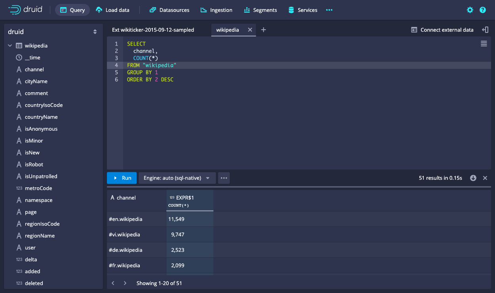

<!--
  ~ Licensed to the Apache Software Foundation (ASF) under one
  ~ or more contributor license agreements.  See the NOTICE file
  ~ distributed with this work for additional information
  ~ regarding copyright ownership.  The ASF licenses this file
  ~ to you under the Apache License, Version 2.0 (the
  ~ "License"); you may not use this file except in compliance
  ~ with the License.  You may obtain a copy of the License at
  ~
  ~   http://www.apache.org/licenses/LICENSE-2.0
  ~
  ~ Unless required by applicable law or agreed to in writing,
  ~ software distributed under the License is distributed on an
  ~ "AS IS" BASIS, WITHOUT WARRANTIES OR CONDITIONS OF ANY
  ~ KIND, either express or implied.  See the License for the
  ~ specific language governing permissions and limitations
  ~ under the License.
  -->


This quickstart gets you started with Apache Druid using the [`micro-quickstart`](../operations/single-server.md#micro-quickstart-4-cpu-16gib-ram) configuration, and introduces you to Druid ingestion and query features.

In this quickstart, you'll do the following:
- install Druid
- start up Druid services
- use SQL to ingest and query data

Druid supports a variety of ingestion options. Once you're done with this tutorial, refer to the
[Ingestion](../ingestion/index.md) page to determine which ingestion method is right for you.

## Requirements

You can follow these steps on a relatively modest machine, such as a workstation or virtual server with 16 GiB of RAM.

Druid comes equipped with several [startup configuration profiles](../operations/single-server.md) for a
range of machine sizes. These range from `nano` (1 CPU, 4GiB RAM) to `x-large` (64 CPU, 512GiB RAM). For more
information, see [Single server deployment](../operations/single-server.md). For information on deploying Druid services
across clustered machines, see [Clustered deployment](./cluster.md).

The software requirements for the installation machine are:

* Linux, Mac OS X, or other Unix-like OS. (Windows is not supported.)
* Java 8u92+ or Java 11.

> Druid relies on the environment variables `JAVA_HOME` or `DRUID_JAVA_HOME` to find Java on the machine. You can set
`DRUID_JAVA_HOME` if there is more than one instance of Java. To verify Java requirements for your environment, run the 
`bin/verify-java` script.

Before installing a production Druid instance, be sure to review the [security
overview](../operations/security-overview.md). In general, avoid running Druid as root user. Consider creating a
dedicated user account for running Druid.  

## Install Druid

Download the [{{DRUIDVERSION}} release](https://www.apache.org/dyn/closer.cgi?path=/druid/{{DRUIDVERSION}}/apache-druid-{{DRUIDVERSION}}-bin.tar.gz) from Apache Druid. 
For this quickstart, you need Druid version 24.0 or higher.
For versions earlier than 24.0 (0.23 and below), see [Load data with native batch ingestion](tutorial-batch-native.md).

In your terminal, extract the file and change directories to the distribution directory:

```bash
tar -xzf apache-druid-{{DRUIDVERSION}}-bin.tar.gz
cd apache-druid-{{DRUIDVERSION}}
```

The distribution directory contains `LICENSE` and `NOTICE` files and subdirectories for executable files, configuration files, sample data and more.

## Start up Druid services

Start up Druid services using the `micro-quickstart` single-machine configuration.
This configuration includes default settings that are appropriate for this tutorial, such as loading the `druid-multi-stage-query` extension by default so that you can use the MSQ task engine.

You can view that setting and others in the configuration files in the `conf/druid/single-server/micro-quickstart/`. 

From the apache-druid-{{DRUIDVERSION}} package root, run the following command:

```bash
./bin/start-micro-quickstart
```

This brings up instances of ZooKeeper and the Druid services:

```bash
$ ./bin/start-micro-quickstart
[Thu Sep  8 18:30:00 2022] Starting Apache Druid.
[Thu Sep  8 18:30:00 2022] Open http://localhost:8888/ in your browser to access the web console.
[Thu Sep  8 18:30:00 2022] Or, if you have enabled TLS, use https on port 9088.
[Thu Sep  8 18:30:00 2022] Running command[zk], logging to[/apache-druid-{{DRUIDVERSION}}/var/sv/zk.log]: bin/run-zk conf
[Thu Sep  8 18:30:00 2022] Running command[coordinator-overlord], logging to[/apache-druid-{{DRUIDVERSION}}/var/sv/coordinator-overlord.log]: bin/run-druid coordinator-overlord conf/druid/single-server/micro-quickstart
[Thu Sep  8 18:30:00 2022] Running command[broker], logging to[/apache-druid-{{DRUIDVERSION}}/var/sv/broker.log]: bin/run-druid broker conf/druid/single-server/micro-quickstart
[Thu Sep  8 18:30:00 2022] Running command[router], logging to[/apache-druid-{{DRUIDVERSION}}/var/sv/router.log]: bin/run-druid router conf/druid/single-server/micro-quickstart
[Thu Sep  8 18:30:00 2022] Running command[historical], logging to[/apache-druid-{{DRUIDVERSION}}/var/sv/historical.log]: bin/run-druid historical conf/druid/single-server/micro-quickstart
[Thu Sep  8 18:30:00 2022] Running command[middleManager], logging to[/apache-druid-{{DRUIDVERSION}}/var/sv/middleManager.log]: bin/run-druid middleManager conf/druid/single-server/micro-quickstart
```

All persistent state, such as the cluster metadata store and segments for the services, are kept in the `var` directory under 
the Druid root directory, apache-druid-{{DRUIDVERSION}}. Each service writes to a log file under `var/sv`.

At any time, you can revert Druid to its original, post-installation state by deleting the entire `var` directory. You may want to do this, for example, between Druid tutorials or after experimentation, to start with a fresh instance. 

To stop Druid at any time, use CTRL+C in the terminal. This exits the `bin/start-micro-quickstart` script and terminates all Druid processes.

## Open the web console 

After the Druid services finish startup, open the [web console](../operations/web-console.md) at [http://localhost:8888](http://localhost:8888). 


It may take a few seconds for all Druid services to finish starting, including the [Druid router](../design/router.md), which serves the console. If you attempt to open the web console before startup is complete, you may see errors in the browser. Wait a few moments and try again.

In this quickstart, you use the the web console to perform ingestion. The MSQ task engine specifically uses the **Query** view to edit and run SQL queries.
For a complete walkthrough of the **Query** view as it relates to the multi-stage query architecture and the MSQ task engine, see [UI walkthrough](../operations/web-console.md).

## Load data

The Druid distribution bundles the `wikiticker-2015-09-12-sampled.json.gz` sample dataset that you can use for testing. The sample dataset is located in the `quickstart/tutorial/` folder, accessible from the Druid root directory, and represents Wikipedia page edits for a given day. 

Follow these steps to load the sample Wikipedia dataset:

1. In the **Query** view, click **Connect external data**.
2. Select the **Local disk** tile and enter the following values:

   - **Base directory**: `quickstart/tutorial/`

   - **File filter**: `wikiticker-2015-09-12-sampled.json.gz` 

   

   Entering the base directory and [wildcard file filter](https://commons.apache.org/proper/commons-io/apidocs/org/apache/commons/io/filefilter/WildcardFileFilter.html) separately, as afforded by the UI, allows you to specify multiple files for ingestion at once.

3. Click **Connect data**. 
4. On the **Parse** page, you can examine the raw data and perform the following optional actions before loading data into Druid: 
   - Expand a row to see the corresponding source data.
   - Customize how the data is handled by selecting from the **Input format** options.
   - Adjust the primary timestamp column for the data.
   Druid requires data to have a primary timestamp column (internally stored in a column called `__time`).
   If your dataset doesn't have a timestamp, Druid uses the default value of `1970-01-01 00:00:00`.

   

5. Click **Done**. You're returned to the **Query** view that displays the newly generated query.
   The query inserts the sample data into the table named `wikiticker-2015-09-12-sampled`.

   <details><summary>Show the query</summary>

   ```sql
   REPLACE INTO "wikiticker-2015-09-12-sampled" OVERWRITE ALL
   WITH input_data AS (SELECT *
   FROM TABLE(
     EXTERN(
       '{"type":"local","baseDir":"quickstart/tutorial/","filter":"wikiticker-2015-09-12-sampled.json.gz"}',
       '{"type":"json"}',
       '[{"name":"time","type":"string"},{"name":"channel","type":"string"},{"name":"cityName","type":"string"},{"name":"comment","type":"string"},{"name":"countryIsoCode","type":"string"},{"name":"countryName","type":"string"},{"name":"isAnonymous","type":"string"},{"name":"isMinor","type":"string"},{"name":"isNew","type":"string"},{"name":"isRobot","type":"string"},{"name":"isUnpatrolled","type":"string"},{"name":"metroCode","type":"long"},{"name":"namespace","type":"string"},{"name":"page","type":"string"},{"name":"regionIsoCode","type":"string"},{"name":"regionName","type":"string"},{"name":"user","type":"string"},{"name":"delta","type":"long"},{"name":"added","type":"long"},{"name":"deleted","type":"long"}]'
        )
      ))
   SELECT
     TIME_PARSE("time") AS __time,
     channel,
     cityName,
     comment,
     countryIsoCode,
     countryName,
     isAnonymous,
     isMinor,
     isNew,
     isRobot,
     isUnpatrolled,
     metroCode,
     namespace,
     page,
     regionIsoCode,
     regionName,
     user,
     delta,
     added,
     deleted
   FROM input_data
   PARTITIONED BY DAY
   ```
   </details>

6. Optionally, click **Preview** to see the general shape of the data before you ingest it.
7. Edit the first line of the query and change the default destination datasource name from `wikiticker-2015-09-12-sampled` to `wikipedia`.
8. Click **Run** to execute the query. The task may take a minute or two to complete. When done, the task displays its duration and the number of rows inserted into the table. The view is set to automatically refresh, so you don't need to refresh the browser to see the status change.

    

   A successful task means that Druid data servers have picked up one or more segments.

## Query data

Once the ingestion job is complete, you can query the data. 

In the **Query** view, run the following query to produce a list of top channels:

```sql
SELECT
  channel,
  COUNT(*)
FROM "wikipedia"
GROUP BY channel
ORDER BY COUNT(*) DESC
```



Congratulations! You've gone from downloading Druid to querying data with the MSQ task engine in just one quickstart.

## Next steps

See the following topics for more information:

* [Druid SQL overview](../querying/sql.md) or the [Query tutorial](./tutorial-query.md) to learn about how to query the data you just ingested.
* [Ingestion overview](../ingestion/index.md) to explore options for ingesting more data.
* [Tutorial: Load files using SQL](./tutorial-msq-extern.md) to learn how to generate a SQL query that loads external data into a Druid datasource.
* [Tutorial: Load data with native batch ingestion](tutorial-batch-native.md) to load and query data with Druid's native batch ingestion feature.
* [Tutorial: Load stream data from Apache Kafka](./tutorial-kafka.md) to load streaming data from a Kafka topic.
* [Extensions](../development/extensions.md) for details on Druid extensions.

Remember that after stopping Druid services, you can start clean next time by deleting the `var` directory from the Druid root directory and running the `bin/start-micro-quickstart` script again. You may want to do this before using other data ingestion tutorials, since they use the same Wikipedia datasource.
