<!--
  ~ Licensed to the Apache Software Foundation (ASF) under one
  ~ or more contributor license agreements.  See the NOTICE file
  ~ distributed with this work for additional information
  ~ regarding copyright ownership.  The ASF licenses this file
  ~ to you under the Apache License, Version 2.0 (the
  ~ "License"); you may not use this file except in compliance
  ~ with the License.  You may obtain a copy of the License at
  ~
  ~   http://www.apache.org/licenses/LICENSE-2.0
  ~
  ~ Unless required by applicable law or agreed to in writing,
  ~ software distributed under the License is distributed on an
  ~ "AS IS" BASIS, WITHOUT WARRANTIES OR CONDITIONS OF ANY
  ~ KIND, either express or implied.  See the License for the
  ~ specific language governing permissions and limitations
  ~ under the License.
  -->


This tutorial demonstrates how to perform a batch file load, using Apache Druid (incubating)'s native batch ingestion.

For this tutorial, we'll assume you've already downloaded Druid as described in
the [quickstart](index.html) using the `micro-quickstart` single-machine configuration and have it
running on your local machine. You don't need to have loaded any data yet.

A data load is initiated by submitting an *ingestion task* spec to the Druid Overlord. For this tutorial, we'll be loading the sample Wikipedia page edits data.

An ingestion spec can be written by hand or by using the "Data loader" that is built into the Druid console.
The data loader can help you build an ingestion spec by sampling your data and and iteratively configuring various ingestion parameters.
The data loader currently only supports native batch ingestion (support for streaming, including data stored in Apache Kafka and AWS Kinesis, is coming in future releases).
Streaming ingestion is only available through a written ingestion spec today.

We've included a sample of Wikipedia edits from September 12, 2015 to get you started.


## Loading data with the data loader

Navigate to [localhost:8888](http://localhost:8888) and click `Load data` in the console header.

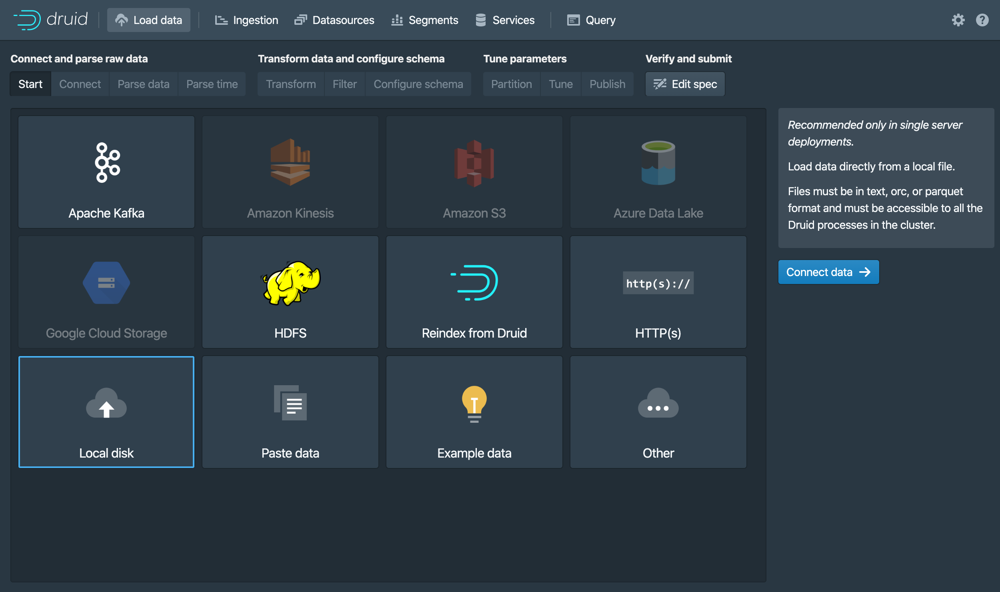

Select `Local disk` and click `Connect data`.

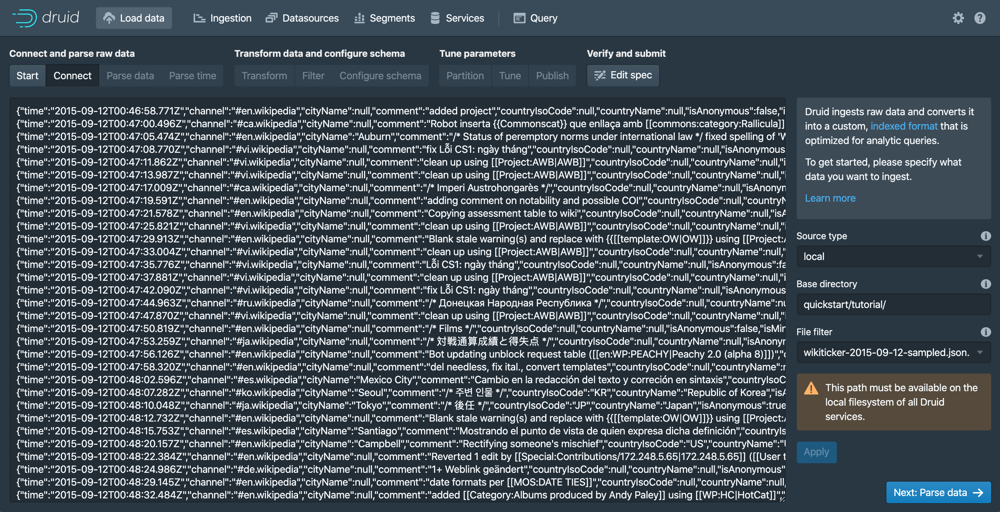

Enter `quickstart/tutorial/` as the base directory and `wikiticker-2015-09-12-sampled.json.gz` as a filter.
The separation of base directory and [wildcard file filter](https://commons.apache.org/proper/commons-io/apidocs/org/apache/commons/io/filefilter/WildcardFileFilter.html) is there if you need to ingest data from multiple files.

Click `Preview` and make sure that the data you are seeing is correct.

Once the data is located, you can click "Next: Parse data" to go to the next step.

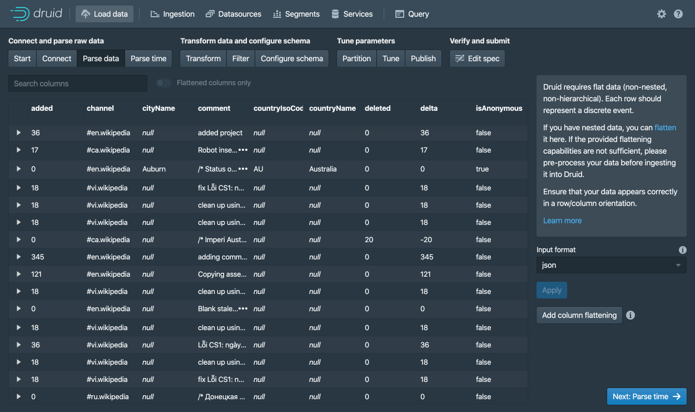

The data loader will try to automatically determine the correct parser for the data.
In this case it will successfully determine `json`.
Feel free to play around with different parser options to get a preview of how Druid will parse your data.

With the `json` parser selected, click `Next: Parse time` to get to the step centered around determining your primary timestamp column.

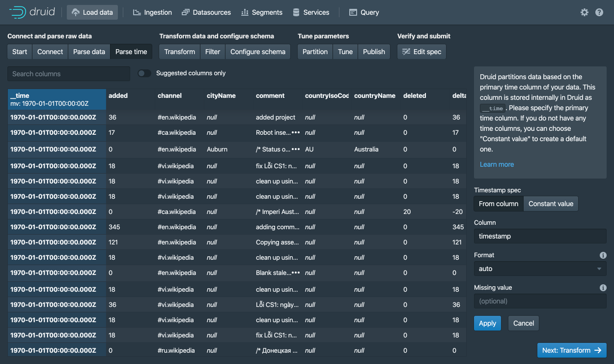

Druid's architecture requires a primary timestamp column (internally stored in a column called `__time`).
If you do not have a timestamp in your data, select `Constant value`.
In our example, the data loader will determine that the `time` column in our raw data is the only candidate that can be used as the primary time column.

Click `Next: ...` twice to go past the `Transform` and `Filter` steps.
You do not need to enter anything in these steps as applying ingestion time transforms and filters are out of scope for this tutorial.


In the `Configure schema` step, you can configure which [dimensions](../ingestion/index.md#dimensions) and [metrics](../ingestion/index.md#metrics) will be ingested into Druid.
This is exactly what the data will appear like in Druid once it is ingested.
Since our dataset is very small, go ahead and turn off [`Rollup`](../ingestion/index.md#rollup) by clicking on the switch and confirming the change.

Once you are satisfied with the schema, click `Next` to go to the `Partition` step where you can fine tune how the data will be partitioned into segments.

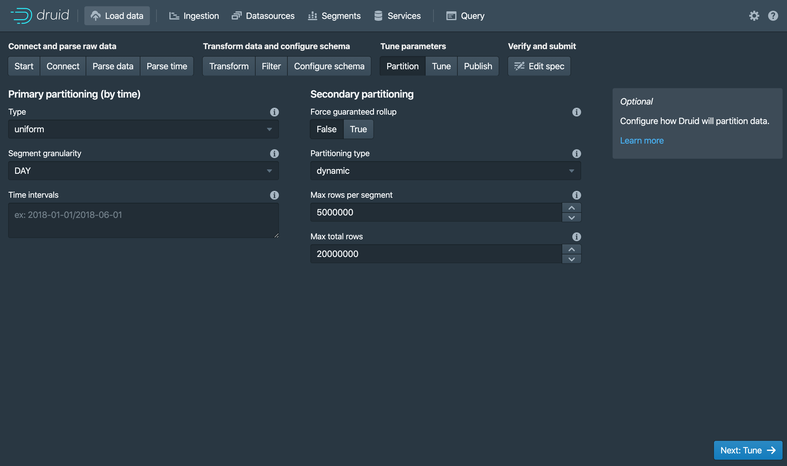

Here, you can adjust how the data will be split up into segments in Druid.
Since this is a small dataset, there are no adjustments that need to be made in this step.

Clicking past the `Tune` step, to get to the publish step.

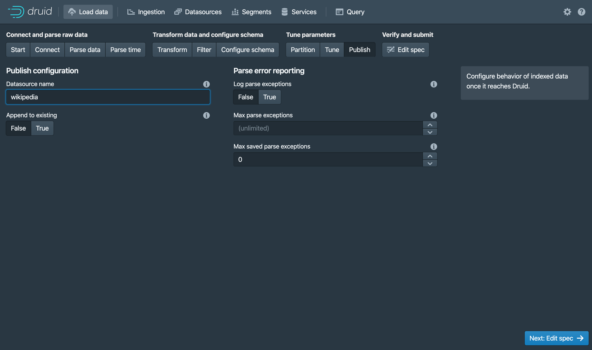

The `Publish` step is where we can specify what the datasource name in Druid.
Let's name this datasource `wikipedia`.
Finally, click `Next` to review your spec.

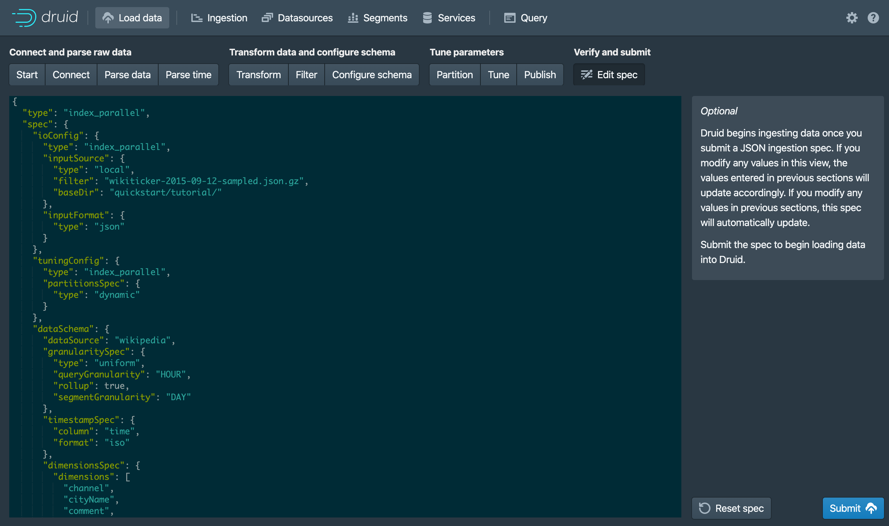

This is the spec you have constructed.
Feel free to go back and make changes in previous steps to see how changes will update the spec.
Similarly, you can also edit the spec directly and see it reflected in the previous steps.

Once you are satisfied with the spec, click `Submit` and an ingestion task will be created.

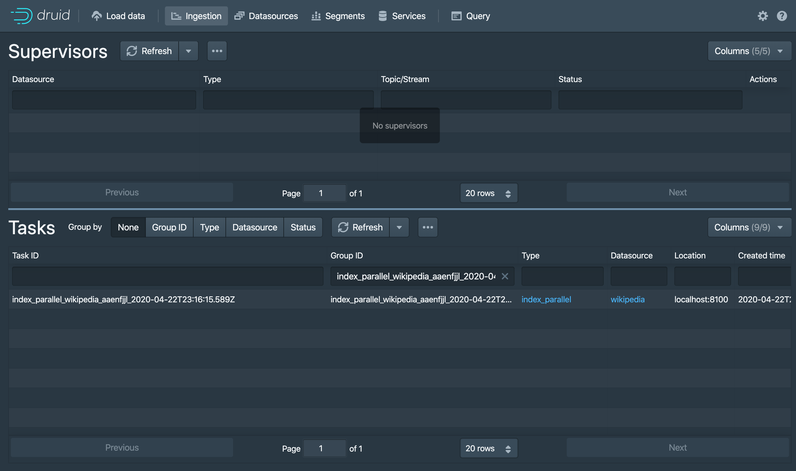

You will be taken to the task view with the focus on the newly created task.
The task view is set to auto refresh, wait until your task succeeds.

When a tasks succeeds it means that it built one or more segments that will now be picked up by the data servers.

Navigate to the `Datasources` view from the header.
 
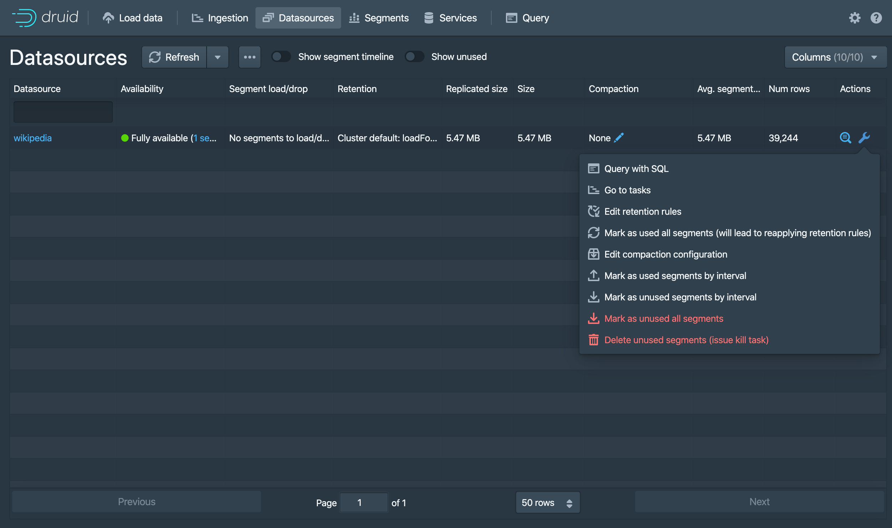
 
Wait until your datasource (`wikipedia`) appears.
This can take a few seconds as the segments are being loaded.

A datasource is queryable once you see a green (fully available) circle.
At this point, you can go to the `Query` view to run SQL queries against the datasource.

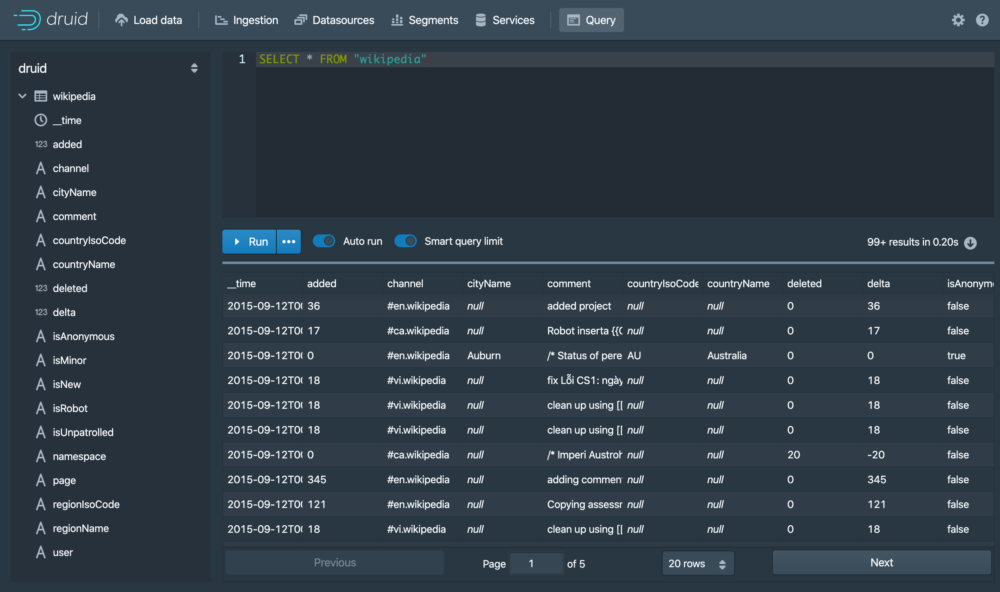

Run a `SELECT * FROM "wikipedia"` query to see your results.

Check out the [query tutorial](../tutorials/tutorial-query.md) to run some example queries on the newly loaded data.


## Loading data with a spec (via console)

The Druid package includes the following sample native batch ingestion task spec at `quickstart/tutorial/wikipedia-index.json`, shown here for convenience,
which has been configured to read the `quickstart/tutorial/wikiticker-2015-09-12-sampled.json.gz` input file:

```json
{
  "type" : "index",
  "spec" : {
    "dataSchema" : {
      "dataSource" : "wikipedia",
      "parser" : {
        "type" : "string",
        "parseSpec" : {
          "format" : "json",
          "dimensionsSpec" : {
            "dimensions" : [
              "channel",
              "cityName",
              "comment",
              "countryIsoCode",
              "countryName",
              "isAnonymous",
              "isMinor",
              "isNew",
              "isRobot",
              "isUnpatrolled",
              "metroCode",
              "namespace",
              "page",
              "regionIsoCode",
              "regionName",
              "user",
              { "name": "added", "type": "long" },
              { "name": "deleted", "type": "long" },
              { "name": "delta", "type": "long" }
            ]
          },
          "timestampSpec": {
            "column": "time",
            "format": "iso"
          }
        }
      },
      "metricsSpec" : [],
      "granularitySpec" : {
        "type" : "uniform",
        "segmentGranularity" : "day",
        "queryGranularity" : "none",
        "intervals" : ["2015-09-12/2015-09-13"],
        "rollup" : false
      }
    },
    "ioConfig" : {
      "type" : "index",
      "firehose" : {
        "type" : "local",
        "baseDir" : "quickstart/tutorial/",
        "filter" : "wikiticker-2015-09-12-sampled.json.gz"
      },
      "appendToExisting" : false
    },
    "tuningConfig" : {
      "type" : "index",
      "maxRowsPerSegment" : 5000000,
      "maxRowsInMemory" : 25000
    }
  }
}
```

This spec will create a datasource named "wikipedia".

From the task view, click on `Submit task` and select `Raw JSON task`.

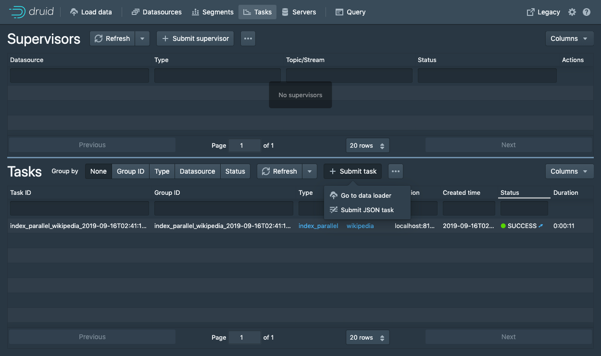

This will bring up the spec submission dialog where you can paste the spec above.

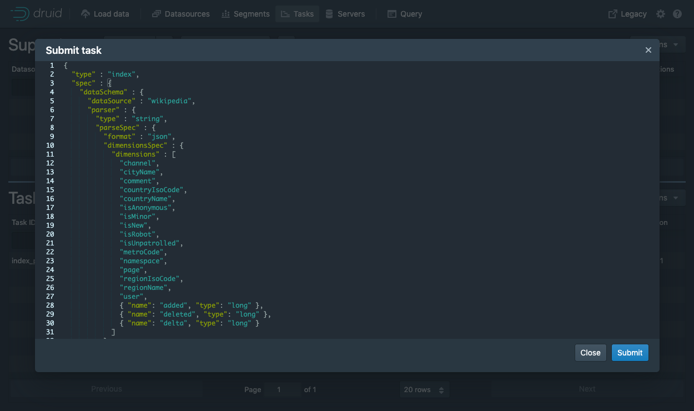

Once the spec is submitted, you can follow the same instructions as above to wait for the data to load and then query it.


## Loading data with a spec (via command line)

For convenience, the Druid package includes a batch ingestion helper script at `bin/post-index-task`.

This script will POST an ingestion task to the Druid Overlord and poll Druid until the data is available for querying.

Run the following command from Druid package root:

```bash
bin/post-index-task --file quickstart/tutorial/wikipedia-index.json --url http://localhost:8081
```

You should see output like the following:

```bash
Beginning indexing data for wikipedia
Task started: index_wikipedia_2018-07-27T06:37:44.323Z
Task log:     http://localhost:8081/druid/indexer/v1/task/index_wikipedia_2018-07-27T06:37:44.323Z/log
Task status:  http://localhost:8081/druid/indexer/v1/task/index_wikipedia_2018-07-27T06:37:44.323Z/status
Task index_wikipedia_2018-07-27T06:37:44.323Z still running...
Task index_wikipedia_2018-07-27T06:37:44.323Z still running...
Task finished with status: SUCCESS
Completed indexing data for wikipedia. Now loading indexed data onto the cluster...
wikipedia loading complete! You may now query your data
```

Once the spec is submitted, you can follow the same instructions as above to wait for the data to load and then query it.


## Loading data without the script

Let's briefly discuss how we would've submitted the ingestion task without using the script. You do not need to run these commands.

To submit the task, POST it to Druid in a new terminal window from the apache-druid-{{DRUIDVERSION}} directory:

```bash
curl -X 'POST' -H 'Content-Type:application/json' -d @quickstart/tutorial/wikipedia-index.json http://localhost:8081/druid/indexer/v1/task
```

Which will print the ID of the task if the submission was successful:

```bash
{"task":"index_wikipedia_2018-06-09T21:30:32.802Z"}
```

You can monitor the status of this task from the console as outlined above.


## Querying your data

Once the data is loaded, please follow the [query tutorial](../tutorials/tutorial-query.md) to run some example queries on the newly loaded data.


## Cleanup

If you wish to go through any of the other ingestion tutorials, you will need to shut down the cluster and reset the cluster state by removing the contents of the `var` directory under the druid package, as the other tutorials will write to the same "wikipedia" datasource.


## Further reading

For more information on loading batch data, please see [the native batch ingestion documentation](../ingestion/native-batch.md).
