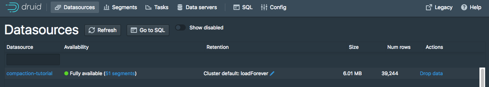
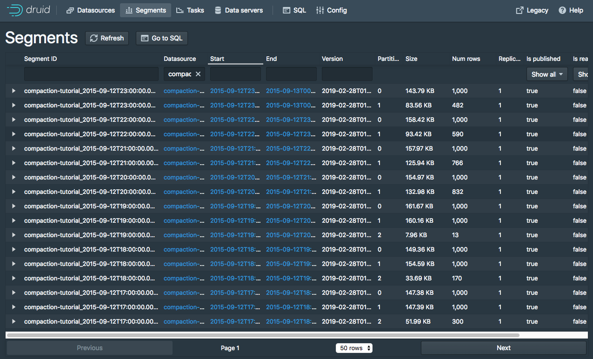
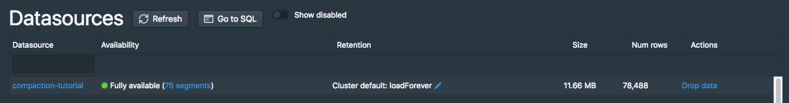
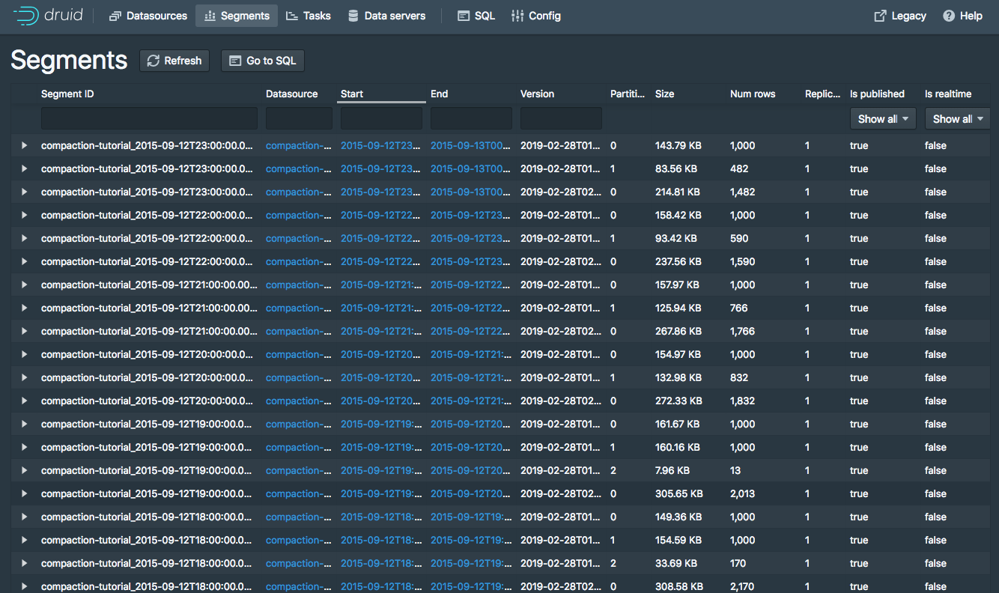
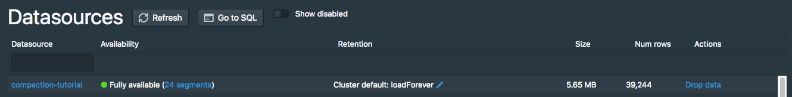
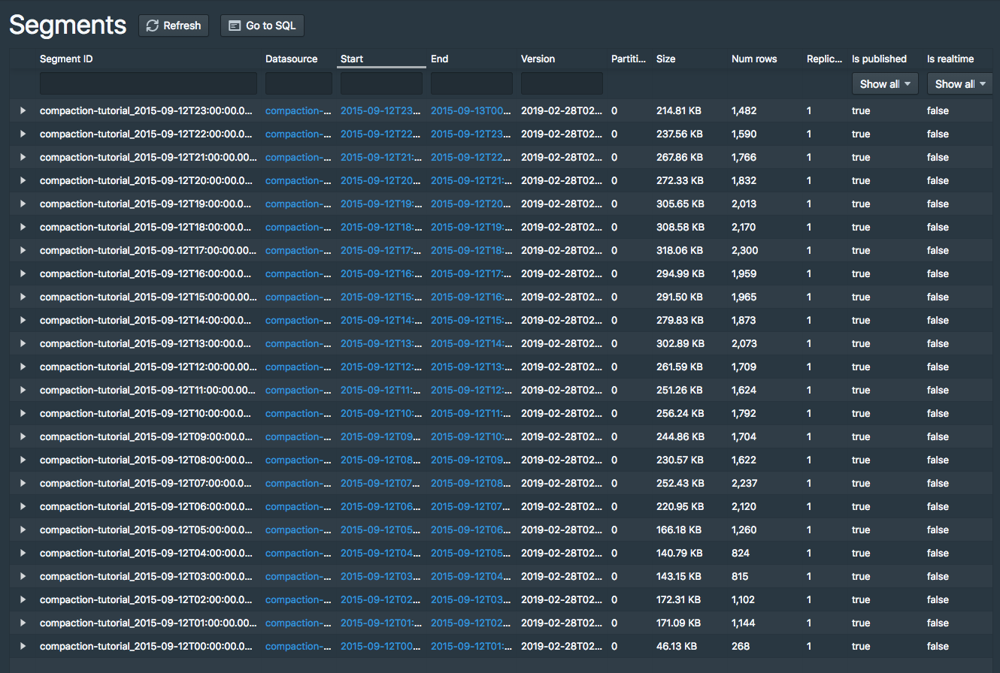
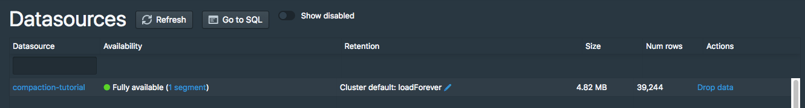
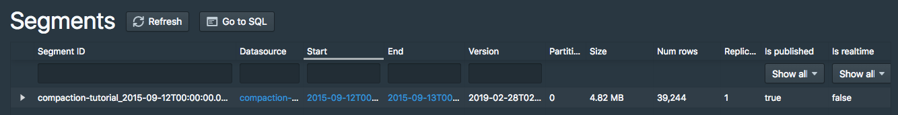

<!--
  ~ Licensed to the Apache Software Foundation (ASF) under one
  ~ or more contributor license agreements.  See the NOTICE file
  ~ distributed with this work for additional information
  ~ regarding copyright ownership.  The ASF licenses this file
  ~ to you under the Apache License, Version 2.0 (the
  ~ "License"); you may not use this file except in compliance
  ~ with the License.  You may obtain a copy of the License at
  ~
  ~   http://www.apache.org/licenses/LICENSE-2.0
  ~
  ~ Unless required by applicable law or agreed to in writing,
  ~ software distributed under the License is distributed on an
  ~ "AS IS" BASIS, WITHOUT WARRANTIES OR CONDITIONS OF ANY
  ~ KIND, either express or implied.  See the License for the
  ~ specific language governing permissions and limitations
  ~ under the License.
  -->


This tutorial demonstrates how to compact existing segments into fewer but larger segments in Apache Druid.

There is some per-segment memory and processing overhead during query processing
Therefore, it can be beneficial to reduce the total number of segments.
See [Segment size optimization](../operations/segment-optimization.md) for details.

## Prerequisites

This tutorial assumes you have already downloaded Apache Druid as described in
the [single-machine quickstart](index.md) and have it running on your local machine.

If you haven't already, you should finish the following tutorials first:
- [Tutorial: Loading a file](../tutorials/tutorial-batch.md)
- [Tutorial: Querying data](../tutorials/tutorial-query.md).

## Load the initial data

This tutorial uses the Wikipedia edits sample data with an ingestion task spec designed to create between one and three segments per hour from the input data.

You can review ingestion spec at `quickstart/tutorial/compaction-init-index.json`.
Submit the spec as follows to create a datasource called `compaction-tutorial`:

```bash
bin/post-index-task --file quickstart/tutorial/compaction-init-index.json --url http://localhost:8081
```

After the ingestion completes, navigate to [http://localhost:8888/unified-console.html#datasources](http://localhost:8888/unified-console.html#datasources) in a browser to see the new datasource in the Druid Console.



In the **Availability** column for the "compaction-tutorial" datasource, click the link for **51 segments** to view segments information for the datasource.

The datasource comprises 51 segments, between one and three segments per hour from the input data:



Run a COUNT query on the datasource to verify there are 39,244 rows:

```bash
dsql> select count(*) from "compaction-tutorial";
┌────────┐
│ EXPR$0 │
├────────┤
│  39244 │
└────────┘
Retrieved 1 row in 1.38s.
```

## Compact the data

Now you compact these 51 small segments.
The Druid distribution includes a compaction task spec for this tutorial datasource at `quickstart/tutorial/compaction-keep-granularity.json`:

```json
{
  "type": "compact",
  "dataSource": "compaction-tutorial",
  "interval": "2015-09-12/2015-09-13",
  "tuningConfig" : {
    "type" : "index_parallel",
    "partitionsSpec": {
        "type": "dynamic"
    },
    "maxRowsInMemory" : 25000
  }
}
```

This compacts all segments for the interval `2015-09-12/2015-09-13` in the `compaction-tutorial` datasource.

The parameters in the `tuningConfig` control the maximum number of rows present in each compacted segment and thus affect the number of segments in the compacted set.

In the data set, each hour only has 39244 rows. 39244 is below the default limit of 5000000 `maxRowsPerSegment` for dynamic partitioning. Therefore, Druid only creates one compacted segment per hour.

Submit the task now:

```bash
bin/post-index-task --file quickstart/tutorial/compaction-keep-granularity.json --url http://localhost:8081
```

After the task finishes, refresh the [segments view](http://localhost:8888/unified-console.html#segments).

Over time the Cooridinator marks the original 51 segments as "unused" and subsequently removes them to leave only the new compacted segments.

By default, the Druid Coordinator does not mark segments as unused until the Coordinator process has been up for at least 15 minutes.
During that time, you may see 75 total segments comprised of the old segment set and the new compacted set:





The new compacted segments have a more recent version than the original segments.
Even though the Druid Console dispalys both sets of segments, queries only read from the new compacted segments.

Running a COUNT query on `compaction-tutorial` again to verify the number of rows remains 39,244:

```bash
dsql> select count(*) from "compaction-tutorial";
┌────────┐
│ EXPR$0 │
├────────┤
│  39244 │
└────────┘
Retrieved 1 row in 1.30s.
```

After the Coordinator has been running for at least 15 minutes, the segments view only shows the new 24 segments, one for each hour:





## Compact the data with new segment granularity

You can also change the segment granularity in a compaction task to produce compacted segments with a different granularity from that of the input segments.

The Druid distribution includes a compaction task spec to create DAY granularity segments at `quickstart/tutorial/compaction-day-granularity.json`:

```json
{
  "type": "compact",
  "dataSource": "compaction-tutorial",
  "interval": "2015-09-12/2015-09-13",
  "tuningConfig" : {
    "type" : "index_parallel",
    "partitionsSpec": {
        "type": "dynamic"
    },
    "maxRowsInMemory" : 25000,
    "forceExtendableShardSpecs" : true
  },
  "granularitySpec" : {
    "segmentGranularity" : "DAY",
    "queryGranularity" : "none"
  }
}
```

Note that `segmentGranularity` is set to `DAY` in this compaction task spec.

Submit this task now:

```bash
bin/post-index-task --file quickstart/tutorial/compaction-day-granularity.json --url http://localhost:8081
```

It takes some time before the Coordinator marks the old input segments as unused, so you may see an intermediate state with 25 total segments. Eventually, there only one DAY granularity segment remains:





In this tutorial demonstrated how to use a compaction task spec to manually compact segments and how to optionally change the segment granularity for segments.

## Learn more

- For more detail, see [Compaction](../ingestion/compaction.md).
- To learn about the benefits of compaction, see [Segment optimization](../operations/segment-optimization.md).
