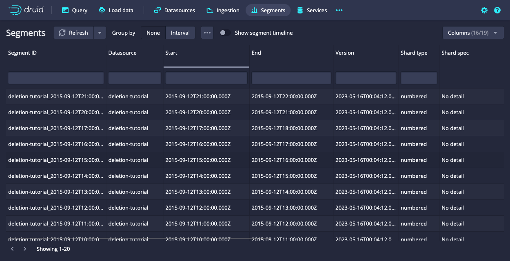

<!--
  ~ Licensed to the Apache Software Foundation (ASF) under one
  ~ or more contributor license agreements.  See the NOTICE file
  ~ distributed with this work for additional information
  ~ regarding copyright ownership.  The ASF licenses this file
  ~ to you under the Apache License, Version 2.0 (the
  ~ "License"); you may not use this file except in compliance
  ~ with the License.  You may obtain a copy of the License at
  ~
  ~   http://www.apache.org/licenses/LICENSE-2.0
  ~
  ~ Unless required by applicable law or agreed to in writing,
  ~ software distributed under the License is distributed on an
  ~ "AS IS" BASIS, WITHOUT WARRANTIES OR CONDITIONS OF ANY
  ~ KIND, either express or implied.  See the License for the
  ~ specific language governing permissions and limitations
  ~ under the License.
  -->


This tutorial demonstrates how to delete existing data.

This tutorial requires the following:
* A running Apache Druid instance. If you don't have Druid, see the [single-machine quickstart](index.md) to get started.
* The command-line JSON processor, [jq](https://stedolan.github.io/jq/download/).

## Load initial data

In this tutorial, we will use the Wikipedia edits data, with an indexing spec that creates hourly segments. This spec is located at `quickstart/tutorial/deletion-index.json`, and it creates a datasource called `deletion-tutorial`.

Let's load this initial data:

```bash
bin/post-index-task --file quickstart/tutorial/deletion-index.json --url http://localhost:8081
```

When the load finishes, open [http://localhost:8888/unified-console.md#datasources](http://localhost:8888/unified-console.html#datasources) in a browser.

## How to permanently delete data

Permanent deletion of a Druid segment has two steps:

1. The segment must first be marked as "unused". This occurs when a user manually disables a segment through the Coordinator API.
2. After segments have been marked as "unused", a Kill Task will delete any "unused" segments from Druid's metadata store as well as deep storage.

Let's drop some segments now, by using the coordinator API to drop data by interval and segmentIds.

## Disable segments by interval

Let's disable segments in a specified interval. This will mark all segments in the interval as "unused", but not remove them from deep storage.
Let's disable segments in interval `2015-09-12T18:00:00.000Z/2015-09-12T20:00:00.000Z` i.e. between hour 18 and 20.

```bash
curl -X 'POST' -H 'Content-Type:application/json' -d '{ "interval" : "2015-09-12T18:00:00.000Z/2015-09-12T20:00:00.000Z" }' http://localhost:8081/druid/coordinator/v1/datasources/deletion-tutorial/markUnused
```

When the request completes, the Segments view of the web console no longer displays the segments for hours 18 and 19.


Note that the hour 18 and 19 segments are still present in deep storage:

```bash
$ ls -l1 var/druid/segments/deletion-tutorial/
2015-09-12T00:00:00.000Z_2015-09-12T01:00:00.000Z
2015-09-12T01:00:00.000Z_2015-09-12T02:00:00.000Z
2015-09-12T02:00:00.000Z_2015-09-12T03:00:00.000Z
2015-09-12T03:00:00.000Z_2015-09-12T04:00:00.000Z
2015-09-12T04:00:00.000Z_2015-09-12T05:00:00.000Z
2015-09-12T05:00:00.000Z_2015-09-12T06:00:00.000Z
2015-09-12T06:00:00.000Z_2015-09-12T07:00:00.000Z
2015-09-12T07:00:00.000Z_2015-09-12T08:00:00.000Z
2015-09-12T08:00:00.000Z_2015-09-12T09:00:00.000Z
2015-09-12T09:00:00.000Z_2015-09-12T10:00:00.000Z
2015-09-12T10:00:00.000Z_2015-09-12T11:00:00.000Z
2015-09-12T11:00:00.000Z_2015-09-12T12:00:00.000Z
2015-09-12T12:00:00.000Z_2015-09-12T13:00:00.000Z
2015-09-12T13:00:00.000Z_2015-09-12T14:00:00.000Z
2015-09-12T14:00:00.000Z_2015-09-12T15:00:00.000Z
2015-09-12T15:00:00.000Z_2015-09-12T16:00:00.000Z
2015-09-12T16:00:00.000Z_2015-09-12T17:00:00.000Z
2015-09-12T17:00:00.000Z_2015-09-12T18:00:00.000Z
2015-09-12T18:00:00.000Z_2015-09-12T19:00:00.000Z
2015-09-12T19:00:00.000Z_2015-09-12T20:00:00.000Z
2015-09-12T20:00:00.000Z_2015-09-12T21:00:00.000Z
2015-09-12T21:00:00.000Z_2015-09-12T22:00:00.000Z
2015-09-12T22:00:00.000Z_2015-09-12T23:00:00.000Z
2015-09-12T23:00:00.000Z_2015-09-13T00:00:00.000Z
```

## Disable segments by segment IDs

Let's disable some segments by their segmentID. This will again mark the segments as "unused", but not remove them from deep storage. You can see the full segmentID for a segment using the web console.

In the [segments view](http://localhost:8888/unified-console.html#segments), click one of the segment rows to open the segment metadata dialog:


The `identifier` field in the metadata dialog shows the full segment ID. For example, the hour 23 segment has segment ID `deletion-tutorial_2015-09-12T23:00:00.000Z_2015-09-13T00:00:00.000Z_2023-05-16T00:04:12.091Z`.

Disable the last two segments, hour 22 and 23 segments, by sending a POST request to the Coordinator with the corresponding segment IDs.
The following command queries the Coordinator for segment IDs and uses `jq` to parse and extract the IDs of the last two segments.
The segment IDs are stored in an environment variable named `unusedSegmentIds`.
```bash
unusedSegmentIds=$(curl -X 'GET' -H 'Content-Type:application/json' http://localhost:8081/druid/coordinator/v1/datasources/deletion-tutorial/segments | jq '.[-2:]')
```

The following request marks the segments unused:
```bash
curl -X 'POST' -H 'Content-Type:application/json' -d "{\"segmentIds\": $unusedSegmentIds}" http://localhost:8081/druid/coordinator/v1/datasources/deletion-tutorial/markUnused
```

When the request completes, the Segments view of the web console no longer displays the segments for hours 22 and 23.



Note that the hour 22 and 23 segments are still in deep storage:

```bash
$ ls -l1 var/druid/segments/deletion-tutorial/
2015-09-12T00:00:00.000Z_2015-09-12T01:00:00.000Z
2015-09-12T01:00:00.000Z_2015-09-12T02:00:00.000Z
2015-09-12T02:00:00.000Z_2015-09-12T03:00:00.000Z
2015-09-12T03:00:00.000Z_2015-09-12T04:00:00.000Z
2015-09-12T04:00:00.000Z_2015-09-12T05:00:00.000Z
2015-09-12T05:00:00.000Z_2015-09-12T06:00:00.000Z
2015-09-12T06:00:00.000Z_2015-09-12T07:00:00.000Z
2015-09-12T07:00:00.000Z_2015-09-12T08:00:00.000Z
2015-09-12T08:00:00.000Z_2015-09-12T09:00:00.000Z
2015-09-12T09:00:00.000Z_2015-09-12T10:00:00.000Z
2015-09-12T10:00:00.000Z_2015-09-12T11:00:00.000Z
2015-09-12T11:00:00.000Z_2015-09-12T12:00:00.000Z
2015-09-12T12:00:00.000Z_2015-09-12T13:00:00.000Z
2015-09-12T13:00:00.000Z_2015-09-12T14:00:00.000Z
2015-09-12T14:00:00.000Z_2015-09-12T15:00:00.000Z
2015-09-12T15:00:00.000Z_2015-09-12T16:00:00.000Z
2015-09-12T16:00:00.000Z_2015-09-12T17:00:00.000Z
2015-09-12T17:00:00.000Z_2015-09-12T18:00:00.000Z
2015-09-12T18:00:00.000Z_2015-09-12T19:00:00.000Z
2015-09-12T19:00:00.000Z_2015-09-12T20:00:00.000Z
2015-09-12T20:00:00.000Z_2015-09-12T21:00:00.000Z
2015-09-12T21:00:00.000Z_2015-09-12T22:00:00.000Z
2015-09-12T22:00:00.000Z_2015-09-12T23:00:00.000Z
2015-09-12T23:00:00.000Z_2015-09-13T00:00:00.000Z
```

## Run a kill task

Now that we have disabled some segments, we can submit a Kill Task, which will delete the disabled segments from metadata and deep storage.

A Kill Task spec has been provided at `quickstart/tutorial/deletion-kill.json`. Submit this task to the Overlord with the following command:

```bash
curl -X 'POST' -H 'Content-Type:application/json' -d @quickstart/tutorial/deletion-kill.json http://localhost:8081/druid/indexer/v1/task
```

When the task finishes, note that Druid deleted the disabled segments from deep storage.


```bash
$ ls -l1 var/druid/segments/deletion-tutorial/
2015-09-12T00:00:00.000Z_2015-09-12T01:00:00.000Z
2015-09-12T01:00:00.000Z_2015-09-12T02:00:00.000Z
2015-09-12T02:00:00.000Z_2015-09-12T03:00:00.000Z
2015-09-12T03:00:00.000Z_2015-09-12T04:00:00.000Z
2015-09-12T04:00:00.000Z_2015-09-12T05:00:00.000Z
2015-09-12T05:00:00.000Z_2015-09-12T06:00:00.000Z
2015-09-12T06:00:00.000Z_2015-09-12T07:00:00.000Z
2015-09-12T07:00:00.000Z_2015-09-12T08:00:00.000Z
2015-09-12T08:00:00.000Z_2015-09-12T09:00:00.000Z
2015-09-12T09:00:00.000Z_2015-09-12T10:00:00.000Z
2015-09-12T10:00:00.000Z_2015-09-12T11:00:00.000Z
2015-09-12T11:00:00.000Z_2015-09-12T12:00:00.000Z
2015-09-12T12:00:00.000Z_2015-09-12T13:00:00.000Z
2015-09-12T13:00:00.000Z_2015-09-12T14:00:00.000Z
2015-09-12T14:00:00.000Z_2015-09-12T15:00:00.000Z
2015-09-12T15:00:00.000Z_2015-09-12T16:00:00.000Z
2015-09-12T16:00:00.000Z_2015-09-12T17:00:00.000Z
2015-09-12T17:00:00.000Z_2015-09-12T18:00:00.000Z
2015-09-12T20:00:00.000Z_2015-09-12T21:00:00.000Z
2015-09-12T21:00:00.000Z_2015-09-12T22:00:00.000Z
```
