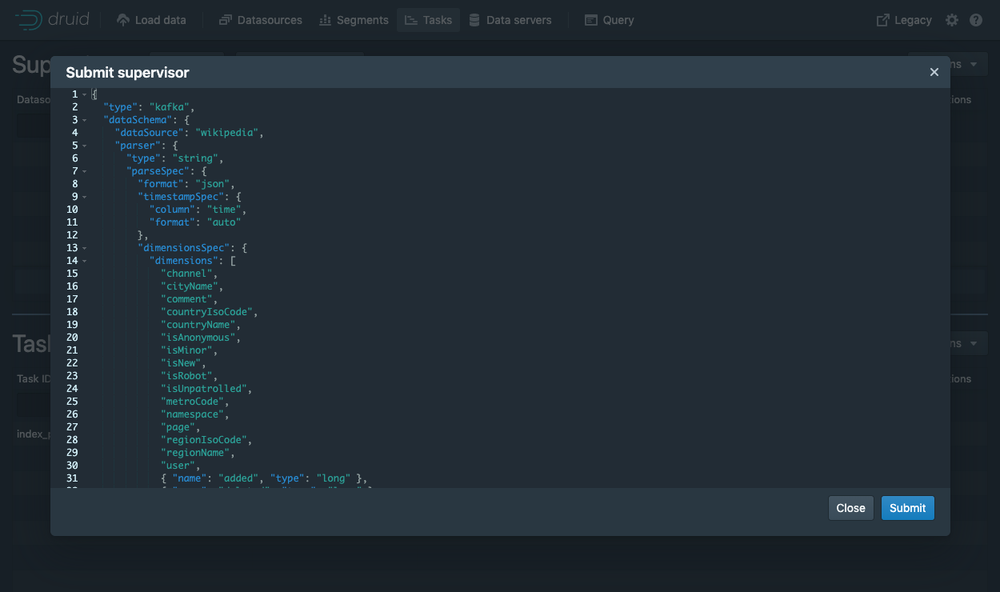
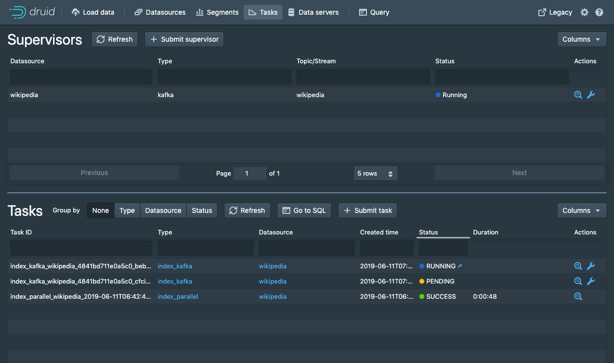

<!--
  ~ Licensed to the Apache Software Foundation (ASF) under one
  ~ or more contributor license agreements.  See the NOTICE file
  ~ distributed with this work for additional information
  ~ regarding copyright ownership.  The ASF licenses this file
  ~ to you under the Apache License, Version 2.0 (the
  ~ "License"); you may not use this file except in compliance
  ~ with the License.  You may obtain a copy of the License at
  ~
  ~   http://www.apache.org/licenses/LICENSE-2.0
  ~
  ~ Unless required by applicable law or agreed to in writing,
  ~ software distributed under the License is distributed on an
  ~ "AS IS" BASIS, WITHOUT WARRANTIES OR CONDITIONS OF ANY
  ~ KIND, either express or implied.  See the License for the
  ~ specific language governing permissions and limitations
  ~ under the License.
  -->


## Getting started

This tutorial demonstrates how to load data into Apache Druid (incubating) from a Kafka stream, using Druid's Kafka indexing service.

For this tutorial, we'll assume you've already downloaded Druid as described in
the [quickstart](index.html) using the `micro-quickstart` single-machine configuration and have it
running on your local machine. You don't need to have loaded any data yet.

## Download and start Kafka

[Apache Kafka](http://kafka.apache.org/) is a high throughput message bus that works well with
Druid.  For this tutorial, we will use Kafka 2.1.0. To download Kafka, issue the following
commands in your terminal:

```bash
curl -O https://archive.apache.org/dist/kafka/2.1.0/kafka_2.12-2.1.0.tgz
tar -xzf kafka_2.12-2.1.0.tgz
cd kafka_2.12-2.1.0
```

Start a Kafka broker by running the following command in a new terminal:

```bash
./bin/kafka-server-start.sh config/server.properties
```

Run this command to create a Kafka topic called *wikipedia*, to which we'll send data:

```bash
./bin/kafka-topics.sh --create --zookeeper localhost:2181 --replication-factor 1 --partitions 1 --topic wikipedia
```

## Start Druid Kafka ingestion

We will use Druid's Kafka indexing service to ingest messages from our newly created *wikipedia* topic.

### Submit a supervisor via the console

In the console, click `Submit supervisor` to open the submit supervisor dialog.



Paste in this spec and click `Submit`.

```json
{
  "type": "kafka",
  "dataSchema": {
    "dataSource": "wikipedia",
    "parser": {
      "type": "string",
      "parseSpec": {
        "format": "json",
        "timestampSpec": {
          "column": "time",
          "format": "auto"
        },
        "dimensionsSpec": {
          "dimensions": [
            "channel",
            "cityName",
            "comment",
            "countryIsoCode",
            "countryName",
            "isAnonymous",
            "isMinor",
            "isNew",
            "isRobot",
            "isUnpatrolled",
            "metroCode",
            "namespace",
            "page",
            "regionIsoCode",
            "regionName",
            "user",
            { "name": "added", "type": "long" },
            { "name": "deleted", "type": "long" },
            { "name": "delta", "type": "long" }
          ]
        }
      }
    },
    "metricsSpec" : [],
    "granularitySpec": {
      "type": "uniform",
      "segmentGranularity": "DAY",
      "queryGranularity": "NONE",
      "rollup": false
    }
  },
  "tuningConfig": {
    "type": "kafka",
    "reportParseExceptions": false
  },
  "ioConfig": {
    "topic": "wikipedia",
    "replicas": 2,
    "taskDuration": "PT10M",
    "completionTimeout": "PT20M",
    "consumerProperties": {
      "bootstrap.servers": "localhost:9092"
    }
  }
}
```

This will start the supervisor that will in turn spawn some tasks that will start listening for incoming data.



### Submit a supervisor directly

To start the service directly, we will need to submit a supervisor spec to the Druid overlord by running the following from the Druid package root:

```bash
curl -XPOST -H'Content-Type: application/json' -d @quickstart/tutorial/wikipedia-kafka-supervisor.json http://localhost:8081/druid/indexer/v1/supervisor
```


If the supervisor was successfully created, you will get a response containing the ID of the supervisor; in our case we should see `{"id":"wikipedia"}`.

For more details about what's going on here, check out the
[Druid Kafka indexing service documentation](../development/extensions-core/kafka-ingestion.md).

You can view the current supervisors and tasks in the Druid Console: [http://localhost:8888/unified-console.html#tasks](http://localhost:8888/unified-console.html#tasks).


## Load data

Let's launch a producer for our topic and send some data!

In your Druid directory, run the following command:

```bash
cd quickstart/tutorial
gunzip -c wikiticker-2015-09-12-sampled.json.gz > wikiticker-2015-09-12-sampled.json
```

In your Kafka directory, run the following command, where {PATH_TO_DRUID} is replaced by the path to the Druid directory:

```bash
export KAFKA_OPTS="-Dfile.encoding=UTF-8"
./bin/kafka-console-producer.sh --broker-list localhost:9092 --topic wikipedia < {PATH_TO_DRUID}/quickstart/tutorial/wikiticker-2015-09-12-sampled.json
```

The previous command posted sample events to the *wikipedia* Kafka topic which were then ingested into Druid by the Kafka indexing service. You're now ready to run some queries!

## Querying your data

After data is sent to the Kafka stream, it is immediately available for querying.

Please follow the [query tutorial](../tutorials/tutorial-query.md) to run some example queries on the newly loaded data.

## Cleanup

If you wish to go through any of the other ingestion tutorials, you will need to shut down the cluster and reset the cluster state by removing the contents of the `var` directory under the druid package, as the other tutorials will write to the same "wikipedia" datasource.

## Further reading

For more information on loading data from Kafka streams, please see the [Druid Kafka indexing service documentation](../development/extensions-core/kafka-ingestion.md).
