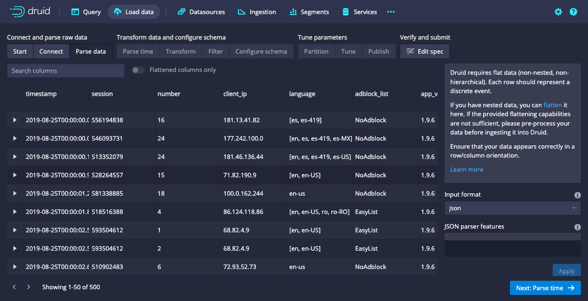
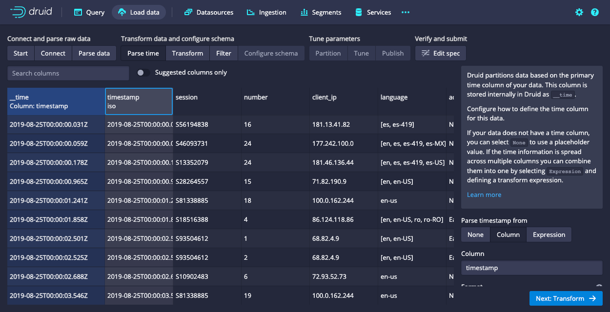
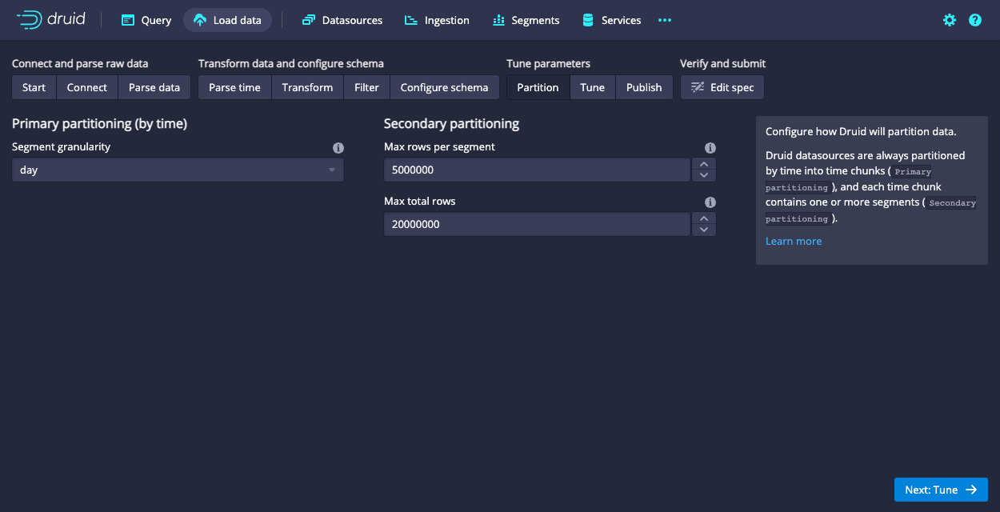
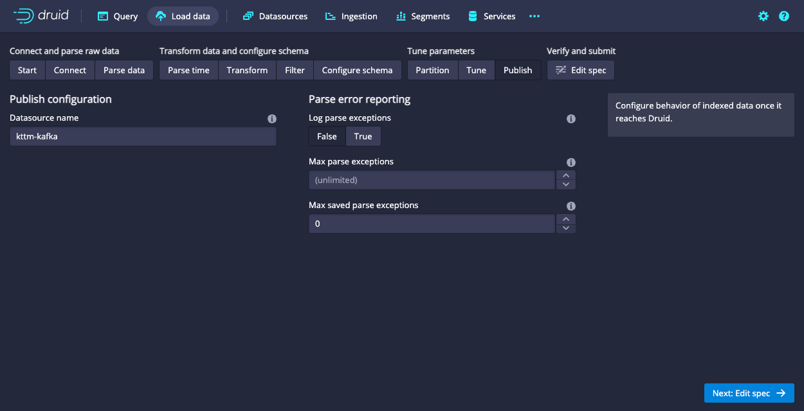
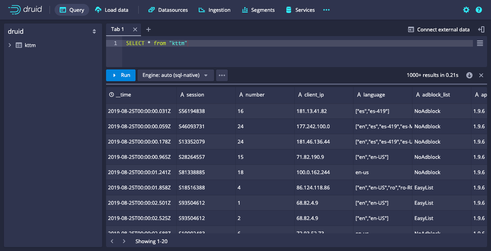

<!--
  ~ Licensed to the Apache Software Foundation (ASF) under one
  ~ or more contributor license agreements.  See the NOTICE file
  ~ distributed with this work for additional information
  ~ regarding copyright ownership.  The ASF licenses this file
  ~ to you under the Apache License, Version 2.0 (the
  ~ "License"); you may not use this file except in compliance
  ~ with the License.  You may obtain a copy of the License at
  ~
  ~   http://www.apache.org/licenses/LICENSE-2.0
  ~
  ~ Unless required by applicable law or agreed to in writing,
  ~ software distributed under the License is distributed on an
  ~ "AS IS" BASIS, WITHOUT WARRANTIES OR CONDITIONS OF ANY
  ~ KIND, either express or implied.  See the License for the
  ~ specific language governing permissions and limitations
  ~ under the License.
  -->


This tutorial shows you how to load data into Apache Druid from a Kafka stream, using Druid's Kafka indexing service. 

The tutorial guides you through the steps to load sample nested clickstream data from the [Koalas to the Max](https://www.koalastothemax.com/) game into a Kafka topic, then ingest the data into Druid.

## Prerequisites

Before you follow the steps in this tutorial, download Druid as described in the [quickstart](index.md) using the [automatic single-machine configuration](../operations/single-server.md) and have it running on your local machine. You don't need to have loaded any data.

## Download and start Kafka

[Apache Kafka](http://kafka.apache.org/) is a high-throughput message bus that works well with Druid. For this tutorial, use Kafka 2.7.0. 

1. To download Kafka, run the following commands in your terminal:

   ```bash
   curl -O https://archive.apache.org/dist/kafka/2.7.0/kafka_2.13-2.7.0.tgz
   tar -xzf kafka_2.13-2.7.0.tgz
   cd kafka_2.13-2.7.0
   ```
2. If you're already running Kafka on the machine you're using for this tutorial, delete or rename the `kafka-logs` directory in `/tmp`.
   
:::info
 Druid and Kafka both rely on [Apache ZooKeeper](https://zookeeper.apache.org/) to coordinate and manage services. Because Druid is already running, Kafka attaches to the Druid ZooKeeper instance when it starts up.<br />

 In a production environment where you're running Druid and Kafka on different machines, [start the Kafka ZooKeeper](https://kafka.apache.org/quickstart) before you start the Kafka broker.
:::

3. In the Kafka root directory, run this command to start a Kafka broker:

   ```bash
   ./bin/kafka-server-start.sh config/server.properties
   ```

4. In a new terminal window, navigate to the Kafka root directory and run the following command to create a Kafka topic called `kttm`:

   ```bash
   ./bin/kafka-topics.sh --create --topic kttm --bootstrap-server localhost:9092
   ```

   Kafka returns a message when it successfully adds the topic: `Created topic kttm`.

## Load data into Kafka

In this section, you download sample data to the tutorial's directory and send the data to your Kafka topic.

1. In your Kafka root directory, create a directory for the sample data:

   ```bash
   mkdir sample-data
   ```

2. Download the sample data to your new directory and extract it:

   ```bash
   (cd sample-data && curl -O https://static.imply.io/example-data/kttm-nested-v2/kttm-nested-v2-2019-08-25.json.gz)
   ```

3. In your Kafka root directory, run the following commands to post sample events to the `kttm` Kafka topic:

   ```bash
   export KAFKA_OPTS="-Dfile.encoding=UTF-8"
   gzcat ./sample-data/kttm-nested-v2-2019-08-25.json.gz | ./bin/kafka-console-producer.sh --broker-list localhost:9092 --topic kttm
   ```

## Load data into Druid

Now that you have data in your Kafka topic, you can use Druid's Kafka indexing service to ingest the data into Druid. 

To do this, you can use the Druid console data loader or you can submit a supervisor spec. Follow the steps below to try each method.

### Load data with the console data loader

The Druid console data loader presents you with several screens to configure each section of the supervisor spec, then creates an ingestion task to ingest the Kafka data. 

To use the console data loader:

1. Navigate to [localhost:8888](http://localhost:8888) and click **Load data > Streaming**.

   

2. Click **Apache Kafka** and then **Connect data**.

3. Enter `localhost:9092` as the bootstrap server and `kttm` as the topic, then click **Apply** and make sure you see data similar to the following:

   

4. Click **Next: Parse data**.

   

   The data loader automatically tries to determine the correct parser for the data. For the sample data, it selects input format `json`. You can play around with the different options to get a preview of how Druid parses your data.

5. With the `json` input format selected, click **Next: Parse time**. You may need to click **Apply** first.

   

   Druid's architecture requires that you specify a primary timestamp column. Druid stores the timestamp in the `__time` column in your Druid datasource.
   In a production environment, if you don't have a timestamp in your data, you can select **Parse timestamp from:** `None` to use a placeholder value. 

   For the sample data, the data loader selects the `timestamp` column in the raw data as the primary time column.

6. Click **Next: ...** three times to go past the **Transform** and **Filter** steps to **Configure schema**. You don't need to enter anything in these two steps because applying transforms and filters is out of scope for this tutorial.

   

7. In the **Configure schema** step, you can select data types for the columns and configure [dimensions](../ingestion/schema-model.md#dimensions) and [metrics](../ingestion/schema-model.md#metrics) to ingest into Druid. The console does most of this for you, but you need to create JSON-type dimensions for the three nested columns in the data. 

    Click **Add dimension** and enter the following information. You can only add one dimension at a time.
    - Name: `event`, Type: `json`
    - Name: `agent`, Type: `json`
    - Name: `geo_ip`, Type: `json`
  
    After you create the dimensions, you can scroll to the right in the preview window to see the nested columns:

    

8.  Click **Next: Partition** to configure how Druid partitions the data into segments.

    

9.  Select `day` as the **Segment granularity**. Since this is a small dataset, you don't need to make any further adjustments. Click **Next: Tune** to fine tune how Druid ingests data.
   
    

10. In **Input tuning**, set **Use earliest offset** to `True`&mdash;this is very  important because you want to consume the data from the start of the stream. There are no other changes to make here, so click **Next: Publish**.

    

11. Name the datasource `kttm-kafka` and click **Next: Edit spec** to review your spec.

    

    The console presents the spec you've constructed. You can click the buttons above the spec to make changes in previous steps and see how the changes update the spec. You can also edit the spec directly and see it reflected in the previous steps.
   
12. Click **Submit** to create an ingestion task.

    Druid displays the task view with the focus on the newly created supervisor.

    The task view auto-refreshes, so wait until the supervisor launches a task. The status changes from **Pending** to **Running** as Druid starts to ingest data.

    

13. Navigate to the **Datasources** view from the header.

    

    When the `kttm-kafka` datasource appears here, you can query it. See [Query your data](#query-your-data) for details.

:::info
 If the datasource doesn't appear after a minute you might not have set the supervisor to read data from the start of the stream&mdash;the `Use earliest offset` setting in the **Tune** step. Go to the **Ingestion** page and terminate the supervisor using the **Actions(...)** menu. [Load the sample data](#load-data-with-the-console-data-loader) again and apply the correct setting when you get to the **Tune** step.
:::

### Submit a supervisor spec

As an alternative to using the data loader, you can submit a supervisor spec to Druid. You can do this in the console or using the Druid API.

#### Use the console

To submit a supervisor spec using the Druid console:

1. Click **Ingestion** in the console, then click the ellipses next to the refresh button and select **Submit JSON supervisor**.

2. Paste this spec into the JSON window and click **Submit**.
   ```json
   {
     "type": "kafka",
     "spec": {
       "ioConfig": {
         "type": "kafka",
         "consumerProperties": {
           "bootstrap.servers": "localhost:9092"
         },
         "topic": "kttm",
         "inputFormat": {
           "type": "json"
         },
         "useEarliestOffset": true
       },
       "tuningConfig": {
         "type": "kafka"
       },
       "dataSchema": {
         "dataSource": "kttm-kafka-supervisor-console",
         "timestampSpec": {
           "column": "timestamp",
           "format": "iso"
         },
         "dimensionsSpec": {
           "dimensions": [
             "session",
             "number",
             "client_ip",
             "language",
             "adblock_list",
             "app_version",
             "path",
             "loaded_image",
             "referrer",
             "referrer_host",
             "server_ip",
             "screen",
             "window",
             {
               "type": "long",
               "name": "session_length"
             },
             "timezone",
             "timezone_offset",
             {
               "type": "json",
               "name": "event"
             },
             {
               "type": "json",
               "name": "agent"
             },
             {
               "type": "json",
               "name": "geo_ip"
             }
           ]
         },
         "granularitySpec": {
           "queryGranularity": "none",
           "rollup": false,
           "segmentGranularity": "day"
         }
       }
     }
   }
   ```


   This starts the supervisor&mdash;the supervisor spawns tasks that start listening for incoming data.

3. Click **Tasks** on the console home page to monitor the status of the job. This spec writes the data in the `kttm` topic to a datasource named `kttm-kafka-supervisor-console`.

#### Use the API

You can also use the Druid API to submit a supervisor spec.

1. Run the following command to download the sample spec:

   ```bash
   curl -o kttm-kafka-supervisor.json https://raw.githubusercontent.com/apache/druid/master/docs/assets/files/kttm-kafka-supervisor.json
   ```

2. Run the following command to submit the spec in the `kttm-kafka-supervisor.json` file:

    ```bash
    curl -X POST -H 'Content-Type: application/json' -d @kttm-kafka-supervisor.json http://localhost:8081/druid/indexer/v1/supervisor
    ```

    After Druid successfully creates the supervisor, you get a response containing the supervisor ID: `{"id":"kttm-kafka-supervisor-api"}`.

3. Click **Tasks** on the console home page to monitor the status of the job. This spec writes the data in the `kttm` topic to a datasource named `kttm-kafka-supervisor-api`.

## Query your data

After Druid sends data to the Kafka stream, it is immediately available for querying. Click **Query** in the Druid console to run SQL queries against the datasource.

Since this tutorial ingests a small dataset, you can run the query `SELECT * FROM "kttm-kafka"` to return all of the data in the dataset you created.



Check out the [Querying data tutorial](../tutorials/tutorial-query.md) to run some example queries on the newly loaded data.

## Further reading

For more information, see the following topics:

- [Apache Kafka ingestion](../ingestion/kafka-ingestion.md) for information on loading data from Kafka streams and maintaining Kafka supervisors for Druid.
