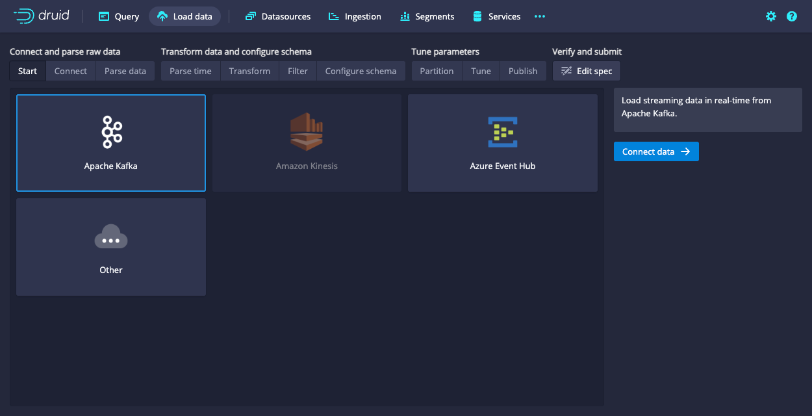
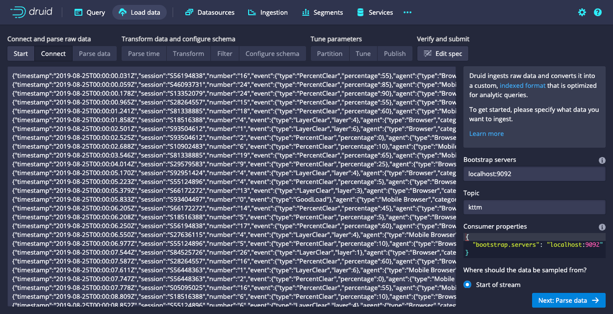
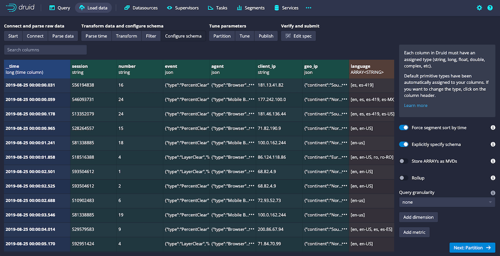
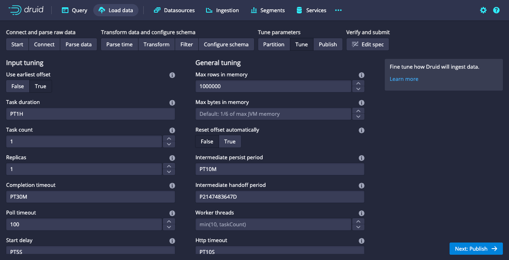
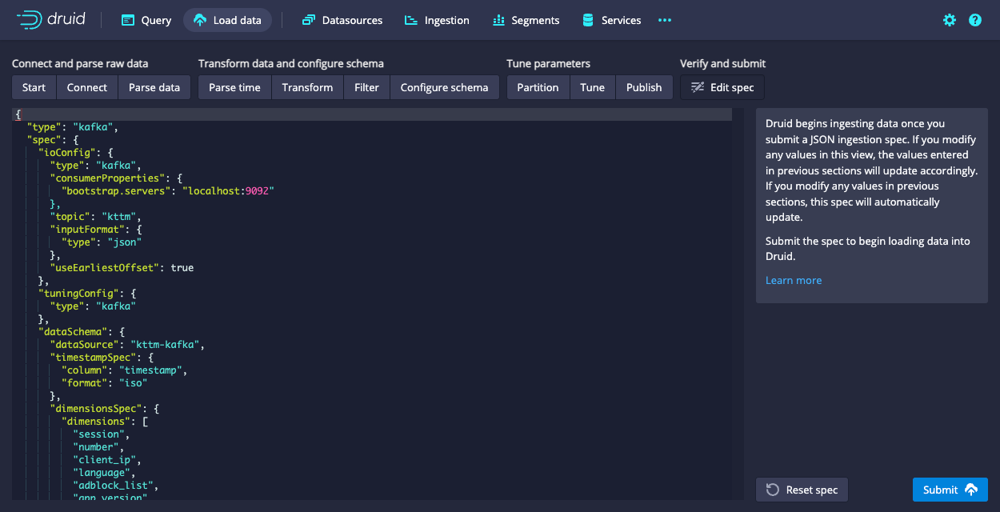
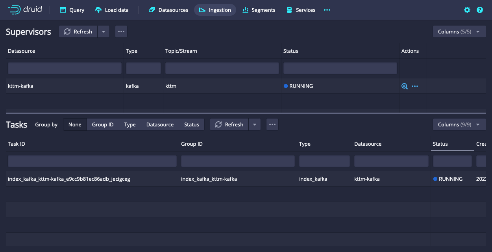
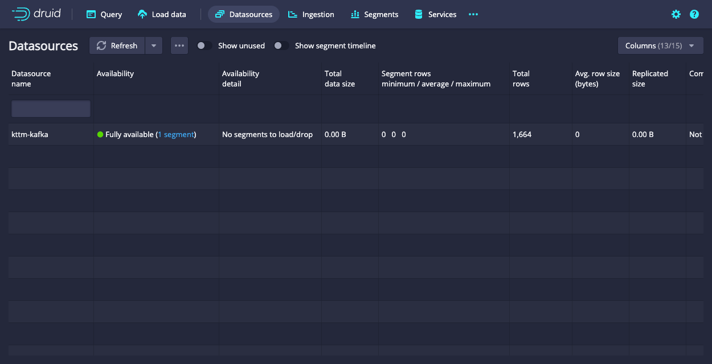
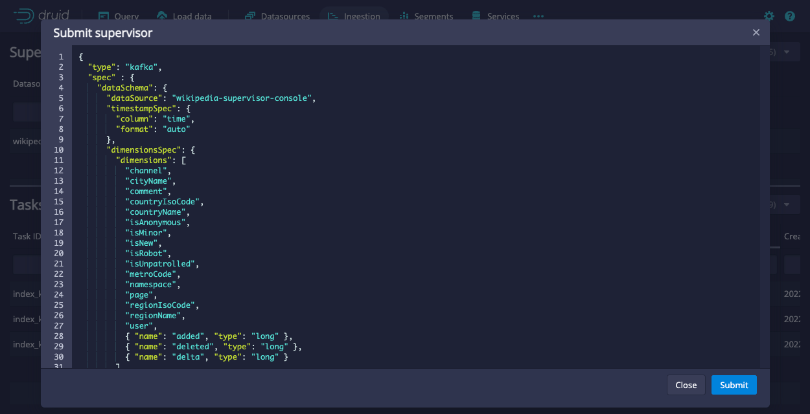

<!--
  ~ Licensed to the Apache Software Foundation (ASF) under one
  ~ or more contributor license agreements.  See the NOTICE file
  ~ distributed with this work for additional information
  ~ regarding copyright ownership.  The ASF licenses this file
  ~ to you under the Apache License, Version 2.0 (the
  ~ "License"); you may not use this file except in compliance
  ~ with the License.  You may obtain a copy of the License at
  ~
  ~   http://www.apache.org/licenses/LICENSE-2.0
  ~
  ~ Unless required by applicable law or agreed to in writing,
  ~ software distributed under the License is distributed on an
  ~ "AS IS" BASIS, WITHOUT WARRANTIES OR CONDITIONS OF ANY
  ~ KIND, either express or implied.  See the License for the
  ~ specific language governing permissions and limitations
  ~ under the License.
  -->


## Getting started

This tutorial demonstrates how to load data into Apache Druid from a Kafka stream, using Druid's Kafka indexing service.

For this tutorial, we'll assume you've already downloaded Druid as described in
the [quickstart](index.html) using the `micro-quickstart` single-machine configuration and have it
running on your local machine. You don't need to have loaded any data yet.

## Download and start Kafka

[Apache Kafka](http://kafka.apache.org/) is a high throughput message bus that works well with
Druid.  For this tutorial, we will use Kafka 2.1.0. To download Kafka, issue the following
commands in your terminal:

```bash
curl -O https://archive.apache.org/dist/kafka/2.1.0/kafka_2.12-2.1.0.tgz
tar -xzf kafka_2.12-2.1.0.tgz
cd kafka_2.12-2.1.0
```

Start a Kafka broker by running the following command in a new terminal:

```bash
./bin/kafka-server-start.sh config/server.properties
```

Run this command to create a Kafka topic called *wikipedia*, to which we'll send data:

```bash
./bin/kafka-topics.sh --create --zookeeper localhost:2181 --replication-factor 1 --partitions 1 --topic wikipedia
```     

## Load data into Kafka

Let's launch a producer for our topic and send some data!

In your Druid directory, run the following command:

```bash
cd quickstart/tutorial
gunzip -c wikiticker-2015-09-12-sampled.json.gz > wikiticker-2015-09-12-sampled.json
```

In your Kafka directory, run the following command, where {PATH_TO_DRUID} is replaced by the path to the Druid directory:

```bash
export KAFKA_OPTS="-Dfile.encoding=UTF-8"
./bin/kafka-console-producer.sh --broker-list localhost:9092 --topic wikipedia < {PATH_TO_DRUID}/quickstart/tutorial/wikiticker-2015-09-12-sampled.json
```

The previous command posted sample events to the *wikipedia* Kafka topic.
Now we will use Druid's Kafka indexing service to ingest messages from our newly created topic.

## Loading data with the data loader

Navigate to [localhost:8888](http://localhost:8888) and click `Load data` in the console header.



Select `Apache Kafka` and click `Connect data`.



Enter `localhost:9092` as the bootstrap server and `wikipedia` as the topic.

Click `Apply` and make sure that the data you are seeing is correct.

Once the data is located, you can click "Next: Parse data" to go to the next step.


The data loader will try to automatically determine the correct parser for the data.
In this case it will successfully determine `json`.
Feel free to play around with different parser options to get a preview of how Druid will parse your data.

With the `json` parser selected, click `Next: Parse time` to get to the step centered around determining your primary timestamp column.


Druid's architecture requires a primary timestamp column (internally stored in a column called `__time`).
If you do not have a timestamp in your data, select `Constant value`.
In our example, the data loader will determine that the `time` column in our raw data is the only candidate that can be used as the primary time column.

Click `Next: ...` twice to go past the `Transform` and `Filter` steps.
You do not need to enter anything in these steps as applying ingestion time transforms and filters are out of scope for this tutorial.



In the `Configure schema` step, you can configure which [dimensions](../ingestion/index.md#dimensions) and [metrics](../ingestion/index.md#metrics) will be ingested into Druid.
This is exactly what the data will appear like in Druid once it is ingested.
Since our dataset is very small, go ahead and turn off [`Rollup`](../ingestion/index.md#rollup) by clicking on the switch and confirming the change.

Once you are satisfied with the schema, click `Next` to go to the `Partition` step where you can fine tune how the data will be partitioned into segments.


Here, you can adjust how the data will be split up into segments in Druid.
Since this is a small dataset, there are no adjustments that need to be made in this step.

Click `Next: Tune` to go to the tuning step.



In the `Tune` step is it *very important* to set `Use earliest offset` to `True` since we want to consume the data from the start of the stream.
There are no other changes that need to be made hear, so click `Next: Publish` to go to the `Publish` step.


Let's name this datasource `wikipedia-kafka`.

Finally, click `Next` to review your spec.



This is the spec you have constructed.
Feel free to go back and make changes in previous steps to see how changes will update the spec.
Similarly, you can also edit the spec directly and see it reflected in the previous steps.

Once you are satisfied with the spec, click `Submit` and an ingestion task will be created.



You will be taken to the task view with the focus on the newly created supervisor.

The task view is set to auto refresh, wait until your supervisor launches a task.

When a tasks starts running, it will also start serving the data that it is ingesting.

Navigate to the `Datasources` view from the header.



When the `wikipedia-kafka` datasource appears here it can be queried. 

*Note:* if the datasource does not appear after a minute you might have not set the supervisor to read from the start of the stream (in the `Tune` step).

At this point, you can go to the `Query` view to run SQL queries against the datasource.

Since this is a small dataset, you can simply run a `SELECT * FROM "wikipedia-kafka"` query to see your results.


Check out the [query tutorial](../tutorials/tutorial-query.md) to run some example queries on the newly loaded data.


### Submit a supervisor via the console

In the console, click `Submit supervisor` to open the submit supervisor dialog.



Paste in this spec and click `Submit`.

```json
{
  "type": "kafka",
  "spec" : {
    "dataSchema": {
      "dataSource": "wikipedia",
      "timestampSpec": {
        "column": "time",
        "format": "auto"
      },
      "dimensionsSpec": {
        "dimensions": [
          "channel",
          "cityName",
          "comment",
          "countryIsoCode",
          "countryName",
          "isAnonymous",
          "isMinor",
          "isNew",
          "isRobot",
          "isUnpatrolled",
          "metroCode",
          "namespace",
          "page",
          "regionIsoCode",
          "regionName",
          "user",
          { "name": "added", "type": "long" },
          { "name": "deleted", "type": "long" },
          { "name": "delta", "type": "long" }
        ]
      },
      "metricsSpec" : [],
      "granularitySpec": {
        "type": "uniform",
        "segmentGranularity": "DAY",
        "queryGranularity": "NONE",
        "rollup": false
      }
    },
    "tuningConfig": {
      "type": "kafka",
      "reportParseExceptions": false
    },
    "ioConfig": {
      "topic": "wikipedia",
      "inputFormat": {
        "type": "json"
      },
      "replicas": 2,
      "taskDuration": "PT10M",
      "completionTimeout": "PT20M",
      "consumerProperties": {
        "bootstrap.servers": "localhost:9092"
      }
    }
  }
}
```

This will start the supervisor that will in turn spawn some tasks that will start listening for incoming data.

### Submit a supervisor directly

To start the service directly, we will need to submit a supervisor spec to the Druid overlord by running the following from the Druid package root:

```bash
curl -XPOST -H'Content-Type: application/json' -d @quickstart/tutorial/wikipedia-kafka-supervisor.json http://localhost:8081/druid/indexer/v1/supervisor
```


If the supervisor was successfully created, you will get a response containing the ID of the supervisor; in our case we should see `{"id":"wikipedia"}`.

For more details about what's going on here, check out the
[Druid Kafka indexing service documentation](../development/extensions-core/kafka-ingestion.md).

You can view the current supervisors and tasks in the Druid Console: [http://localhost:8888/unified-console.html#tasks](http://localhost:8888/unified-console.html#tasks).

## Querying your data

After data is sent to the Kafka stream, it is immediately available for querying.

Please follow the [query tutorial](../tutorials/tutorial-query.md) to run some example queries on the newly loaded data.

## Cleanup

To go through any of the other ingestion tutorials, you will need to shut down the cluster and reset the cluster state by removing the contents of the `var` directory in the Druid home, as the other tutorials will write to the same "wikipedia" datasource.

You should additionally clear out any Kafka state. Do so by shutting down the Kafka broker with CTRL-C before stopping ZooKeeper and the Druid services, and then deleting the Kafka log directory at `/tmp/kafka-logs`:

```bash
rm -rf /tmp/kafka-logs
```


## Further reading

For more information on loading data from Kafka streams, please see the [Druid Kafka indexing service documentation](../development/extensions-core/kafka-ingestion.md).
