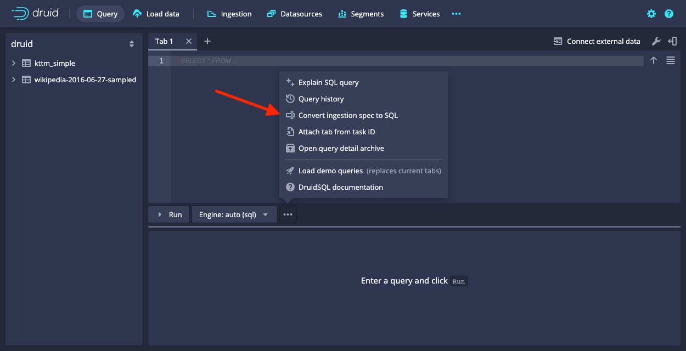

<!--
  ~ Licensed to the Apache Software Foundation (ASF) under one
  ~ or more contributor license agreements.  See the NOTICE file
  ~ distributed with this work for additional information
  ~ regarding copyright ownership.  The ASF licenses this file
  ~ to you under the Apache License, Version 2.0 (the
  ~ "License"); you may not use this file except in compliance
  ~ with the License.  You may obtain a copy of the License at
  ~
  ~   http://www.apache.org/licenses/LICENSE-2.0
  ~
  ~ Unless required by applicable law or agreed to in writing,
  ~ software distributed under the License is distributed on an
  ~ "AS IS" BASIS, WITHOUT WARRANTIES OR CONDITIONS OF ANY
  ~ KIND, either express or implied.  See the License for the
  ~ specific language governing permissions and limitations
  ~ under the License.
  -->

> This page describes SQL-based batch ingestion using the [`druid-multi-stage-query`](../multi-stage-query/index.md)
> extension, new in Druid 24.0. Refer to the [ingestion methods](../ingestion/index.md#batch) table to determine which
> ingestion method is right for you.

If you're already ingesting data with [native batch ingestion](../ingestion/native-batch.md), you can use the [web console](../operations/web-console.md) to convert the ingestion spec to a SQL query that the multi-stage query task engine can use to ingest data.

This tutorial demonstrates how to convert the ingestion spec to a query task in the web console.

To convert the ingestion spec to a query task, do the following:

1. In the **Query** view of the web console, navigate to the menu bar that includes **Run**.
2. Click the ellipsis icon and select **Convert ingestion spec to SQL**.
  
3. In the **Ingestion spec to covert** window, insert your ingestion spec. You can use your own spec or the sample ingestion spec provided in the tutorial. The sample spec uses data hosted at `https://druid.apache.org/data/wikipedia.json.gz` and loads it into a table named `wikipedia`:

   <details><summary>Show the spec</summary>

   ```json
   {
     "type": "index_parallel",
     "spec": {
       "ioConfig": {
         "type": "index_parallel",
         "inputSource": {
           "type": "http",
           "uris": [
             "https://druid.apache.org/data/wikipedia.json.gz"
           ]
         },
         "inputFormat": {
           "type": "json"
         }
       },
       "tuningConfig": {
         "type": "index_parallel",
         "partitionsSpec": {
           "type": "dynamic"
         }
       },
       "dataSchema": {
         "dataSource": "wikipedia",
         "timestampSpec": {
           "column": "timestamp",
           "format": "iso"
         },
         "dimensionsSpec": {
           "dimensions": [
             "isRobot",
             "channel",
             "flags",
             "isUnpatrolled",
             "page",
             "diffUrl",
             {
               "type": "long",
               "name": "added"
             },
             "comment",
             {
               "type": "long",
               "name": "commentLength"
             },
             "isNew",
             "isMinor",
             {
               "type": "long",
               "name": "delta"
             },
             "isAnonymous",
             "user",
             {
               "type": "long",
               "name": "deltaBucket"
             },
             {
               "type": "long",
               "name": "deleted"
             },
             "namespace",
             "cityName",
             "countryName",
             "regionIsoCode",
             "metroCode",
             "countryIsoCode",
             "regionName"
           ]
         },
         "granularitySpec": {
           "queryGranularity": "none",
           "rollup": false,
           "segmentGranularity": "day"
         }
       }
     }
   }
   ```

   </details>

4. Click **Submit** to submit the spec. The web console uses the JSON-based ingestion spec to generate a SQL query that you can use instead. This is what the query looks like for the sample ingestion spec:

   <details><summary>Show the query</summary>

   ```sql
   -- This SQL query was auto generated from an ingestion spec
   REPLACE INTO wikipedia OVERWRITE ALL
   WITH source AS (SELECT * FROM TABLE(
     EXTERN(
       '{"type":"http","uris":["https://druid.apache.org/data/wikipedia.json.gz"]}',
       '{"type":"json"}',
       '[{"name":"timestamp","type":"string"},{"name":"isRobot","type":"string"},{"name":"channel","type":"string"},{"name":"flags","type":"string"},{"name":"isUnpatrolled","type":"string"},{"name":"page","type":"string"},{"name":"diffUrl","type":"string"},{"name":"added","type":"long"},{"name":"comment","type":"string"},{"name":"commentLength","type":"long"},{"name":"isNew","type":"string"},{"name":"isMinor","type":"string"},{"name":"delta","type":"long"},{"name":"isAnonymous","type":"string"},{"name":"user","type":"string"},{"name":"deltaBucket","type":"long"},{"name":"deleted","type":"long"},{"name":"namespace","type":"string"},{"name":"cityName","type":"string"},{"name":"countryName","type":"string"},{"name":"regionIsoCode","type":"string"},{"name":"metroCode","type":"string"},{"name":"countryIsoCode","type":"string"},{"name":"regionName","type":"string"}]'
     )
   ))
   SELECT
     TIME_PARSE("timestamp") AS __time,
     "isRobot",
     "channel",
     "flags",
     "isUnpatrolled",
     "page",
     "diffUrl",
     "added",
     "comment",
     "commentLength",
     "isNew",
     "isMinor",
     "delta",
     "isAnonymous",
     "user",
     "deltaBucket",
     "deleted",
     "namespace",
     "cityName",
     "countryName",
     "regionIsoCode",
     "metroCode",
     "countryIsoCode",
     "regionName"
   FROM source
   PARTITIONED BY DAY
   ```

   </details>

4. Review the generated SQL query to make sure it matches your requirements and does what you expect.
5. Click **Run** to start the ingestion.
