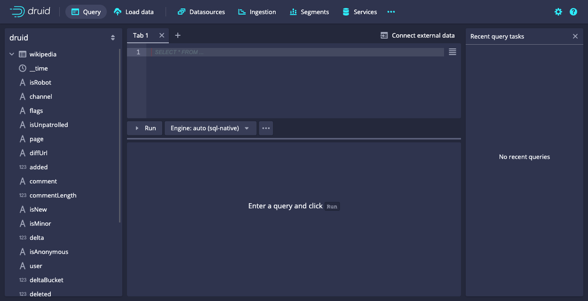
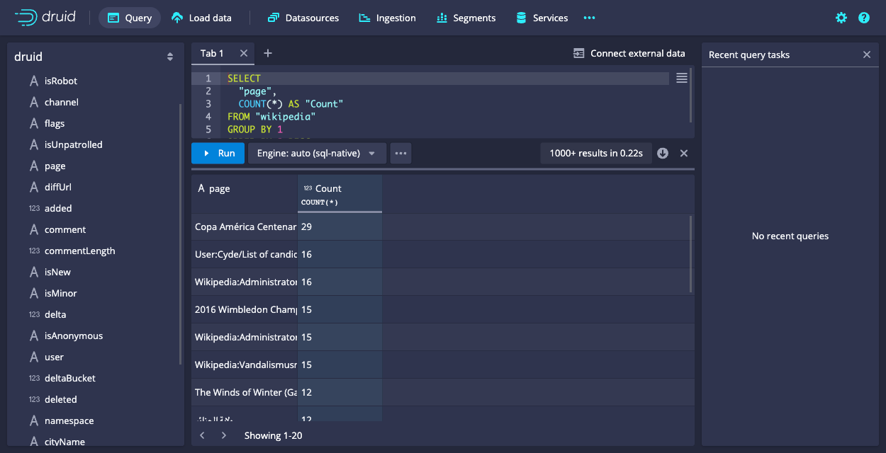
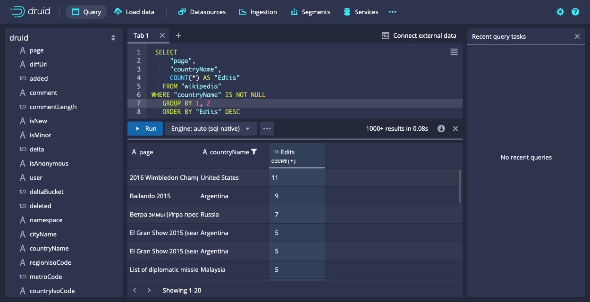
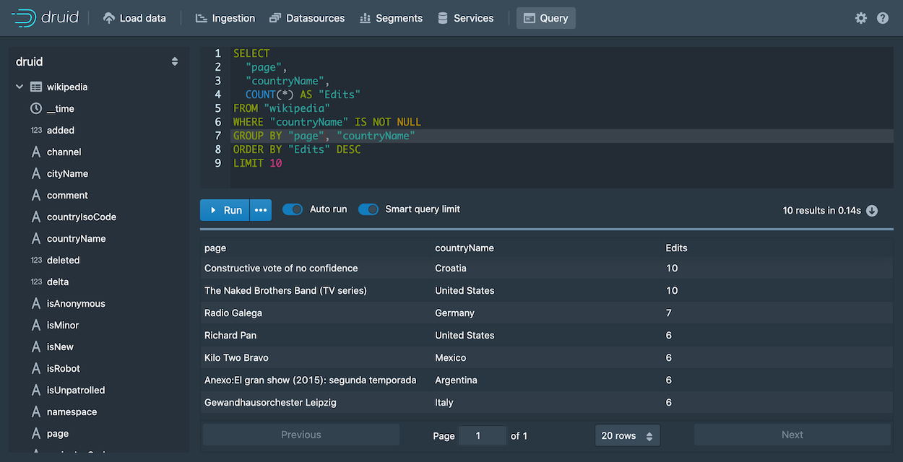
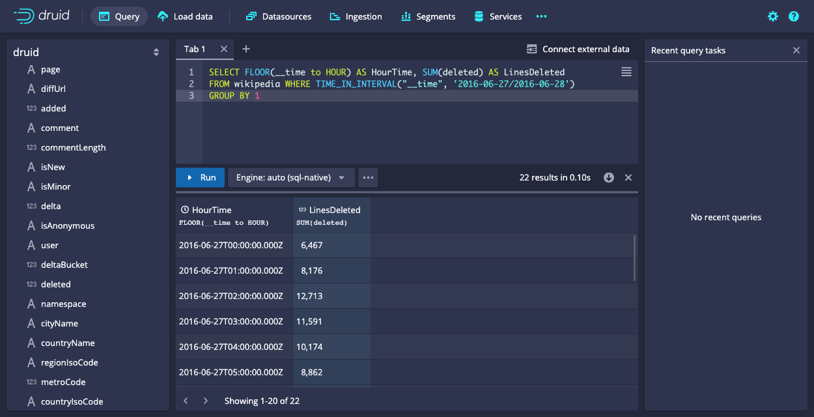
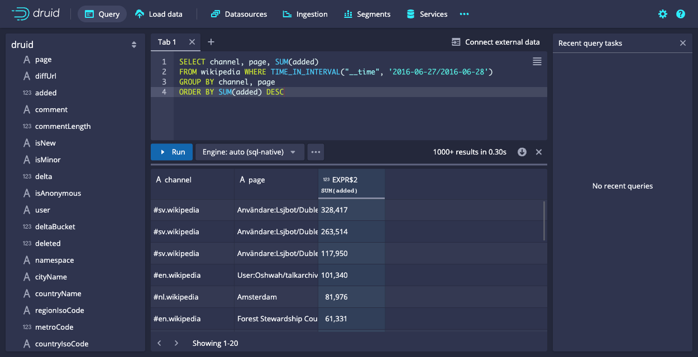
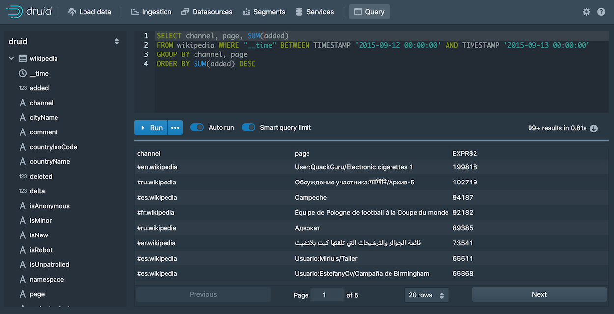

<!--
  ~ Licensed to the Apache Software Foundation (ASF) under one
  ~ or more contributor license agreements.  See the NOTICE file
  ~ distributed with this work for additional information
  ~ regarding copyright ownership.  The ASF licenses this file
  ~ to you under the Apache License, Version 2.0 (the
  ~ "License"); you may not use this file except in compliance
  ~ with the License.  You may obtain a copy of the License at
  ~
  ~   http://www.apache.org/licenses/LICENSE-2.0
  ~
  ~ Unless required by applicable law or agreed to in writing,
  ~ software distributed under the License is distributed on an
  ~ "AS IS" BASIS, WITHOUT WARRANTIES OR CONDITIONS OF ANY
  ~ KIND, either express or implied.  See the License for the
  ~ specific language governing permissions and limitations
  ~ under the License.
  -->


This tutorial demonstrates how to query data in Apache Druid using SQL.  

It assumes that you've completed the [Quickstart](../tutorials/index.md) 
or one of the following tutorials, since we'll query datasources that you would have created
by following one of them:

* [Tutorial: Loading a file](../tutorials/tutorial-batch.md)
* [Tutorial: Loading stream data from Kafka](../tutorials/tutorial-kafka.md)
* [Tutorial: Loading a file using Hadoop](../tutorials/tutorial-batch-hadoop.md)

There are various ways to run Druid SQL queries: from the Druid console, using a command line utility
and by posting the query by HTTP. We'll look at each of these. 


## Query SQL from the Druid console

The Druid console includes a view that makes it easier to build and test queries, and 
view their results. 

1. Start up the Druid cluster, if it's not already running, and open the Druid console in your web
browser. 

2. Click **Query** from the header to open the Query view:  

   

   You can always write queries directly in the edit pane, but the Query view also provides 
   facilities to help you construct SQL queries, which we will use to generate a starter query. 

3. Expand the wikipedia datasource tree in the left pane. We'll
create a query for the page dimension.  

4. Click `page` and then **Show:page** from the menu: 

   

   A SELECT query appears in the query edit pane and immediately runs. However, in this case, the query 
   returns no data, since by default the query filters for data from the last day, while our data is considerably
   older than that. Let's remove the filter.  

5. In the datasource tree, click `__time` and **Remove Filter**. 

   

6. Click **Run** to run the query.   

   You should now see two columns of data, a page name and the count:

   

   Notice that the results are limited in the console to about a hundred, by default, due to the **Smart query limit** 
   feature. This helps users avoid inadvertently running queries that return an excessive amount of data, possibly
   overwhelming their system. 

7. Let's edit the query directly and take a look at a few more query building features in the editor. 
   Click in the query edit pane and make the following changes: 

   1.  Add a line after the first column, `"page"` and Start typing the name of a new column, `"countryName"`. Notice that the autocomplete menu suggests column names, functions, keywords, and more. Choose "countryName" and 
add the new column to the GROUP BY clause as well, either by name or by reference to its position, `2`.  

   2. For readability, replace `Count` column name with `Edits`, since the `COUNT()` function actually
returns the number of edits for the page. Make the same column name change in the ORDER BY clause as well. 

      The `COUNT()` function is one of many functions available for use in Druid SQL queries. You can mouse over a function name
      in the autocomplete menu to see a brief description of a function. Also, you can find more information in the Druid 
      documentation; for example, the `COUNT()` function is documented in 
      [Aggregation functions](../querying/sql.md#aggregation-functions). 

   The query should now be:

   ```sql
   SELECT
     "page",
     "countryName",
     COUNT(*) AS "Edits"
   FROM "wikipedia"
   GROUP BY 1, 2
   ORDER BY "Edits" DESC
   ``` 

   When you run the query again, notice that we're getting the new dimension,`countryName`, but for most of the rows, its value 
   is null. Let's 
   show only rows with a `countryName` value.

8. Click the countryName dimension in the left pane and choose the first filtering option. It's not exactly what we want, but
we'll edit it by hand. The new WHERE clause should appear in your query. 

8. Modify the WHERE clause to exclude results that do not have a value for countryName: 

   ```sql
   WHERE "countryName" IS NOT NULL
   ``` 
   Run the query again. You should now see the top edits by country:  

   

9. Under the covers, every Druid SQL query is translated into a query in the JSON-based _Druid native query_ format before it runs
 on data nodes. You can view the native query for this query by clicking `...` and **Explain SQL Query**. 

   While you can use Druid SQL for most purposes, familiarity with native query is useful for composing complex queries and for troubleshooting 
performance issues. For more information, see [Native queries](../querying/querying.md). 

   

    > Another way to view the explain plan is by adding EXPLAIN PLAN FOR to the front of your query, as follows:
    >
    >```sql
    >EXPLAIN PLAN FOR
    >SELECT
    >  "page",
    >  "countryName",
    >  COUNT(*) AS "Edits"
    >FROM "wikipedia"
    >WHERE "countryName" IS NOT NULL
    >GROUP BY 1, 2
    >ORDER BY "Edits" DESC
    >```
    >This is particularly useful when running queries 
    from the command line or over HTTP.


9. Finally, click  `...`  and **Edit context** to see how you can add additional parameters controlling the execution of the query execution. In the field, enter query context options as JSON key-value pairs, as described in [Context flags](../querying/query-context.md).  

That's it! We've built a simple query using some of the query builder features built into the Druid Console. The following
sections provide a few more example queries you can try. Also, see [Other ways to invoke SQL queries](#other-ways-to-invoke-sql-queries) to learn how
to run Druid SQL from the command line or over HTTP. 

## More Druid SQL examples

Here is a collection of queries to try out:

### Query over time

```sql
SELECT FLOOR(__time to HOUR) AS HourTime, SUM(deleted) AS LinesDeleted
FROM wikipedia WHERE "__time" BETWEEN TIMESTAMP '2015-09-12 00:00:00' AND TIMESTAMP '2015-09-13 00:00:00'
GROUP BY 1
```



### General group by

```sql
SELECT channel, page, SUM(added)
FROM wikipedia WHERE "__time" BETWEEN TIMESTAMP '2015-09-12 00:00:00' AND TIMESTAMP '2015-09-13 00:00:00'
GROUP BY channel, page
ORDER BY SUM(added) DESC
```




## Other ways to invoke SQL queries

### Query SQL via dsql

For convenience, the Druid package includes a SQL command-line client, located at `bin/dsql` in the Druid package root.

Let's now run `bin/dsql`; you should see the following prompt:

```bash
Welcome to dsql, the command-line client for Druid SQL.
Type "\h" for help.
dsql>
```

To submit the query, paste it to the `dsql` prompt and press enter:

```bash
dsql> SELECT page, COUNT(*) AS Edits FROM wikipedia WHERE "__time" BETWEEN TIMESTAMP '2015-09-12 00:00:00' AND TIMESTAMP '2015-09-13 00:00:00' GROUP BY page ORDER BY Edits DESC LIMIT 10;
┌──────────────────────────────────────────────────────────┬───────┐
│ page                                                     │ Edits │
├──────────────────────────────────────────────────────────┼───────┤
│ Wikipedia:Vandalismusmeldung                             │    33 │
│ User:Cyde/List of candidates for speedy deletion/Subpage │    28 │
│ Jeremy Corbyn                                            │    27 │
│ Wikipedia:Administrators' noticeboard/Incidents          │    21 │
│ Flavia Pennetta                                          │    20 │
│ Total Drama Presents: The Ridonculous Race               │    18 │
│ User talk:Dudeperson176123                               │    18 │
│ Wikipédia:Le Bistro/12 septembre 2015                    │    18 │
│ Wikipedia:In the news/Candidates                         │    17 │
│ Wikipedia:Requests for page protection                   │    17 │
└──────────────────────────────────────────────────────────┴───────┘
Retrieved 10 rows in 0.06s.
```


### Query SQL over HTTP


You can submit queries directly to the Druid Broker over HTTP. 

The tutorial package includes an example file that contains the SQL query shown above at `quickstart/tutorial/wikipedia-top-pages-sql.json`. Let's submit that query to the Druid Broker:

```bash
curl -X 'POST' -H 'Content-Type:application/json' -d @quickstart/tutorial/wikipedia-top-pages-sql.json http://localhost:8888/druid/v2/sql
```

The following results should be returned:

```json
[
  {
    "page": "Wikipedia:Vandalismusmeldung",
    "Edits": 33
  },
  {
    "page": "User:Cyde/List of candidates for speedy deletion/Subpage",
    "Edits": 28
  },
  {
    "page": "Jeremy Corbyn",
    "Edits": 27
  },
  {
    "page": "Wikipedia:Administrators' noticeboard/Incidents",
    "Edits": 21
  },
  {
    "page": "Flavia Pennetta",
    "Edits": 20
  },
  {
    "page": "Total Drama Presents: The Ridonculous Race",
    "Edits": 18
  },
  {
    "page": "User talk:Dudeperson176123",
    "Edits": 18
  },
  {
    "page": "Wikipédia:Le Bistro/12 septembre 2015",
    "Edits": 18
  },
  {
    "page": "Wikipedia:In the news/Candidates",
    "Edits": 17
  },
  {
    "page": "Wikipedia:Requests for page protection",
    "Edits": 17
  }
]
```

## Further reading

See the [Druid SQL documentation](../querying/sql.md) for more information on using Druid SQL queries.

See the [Queries documentation](../querying/querying.md) for more information on Druid native queries.
