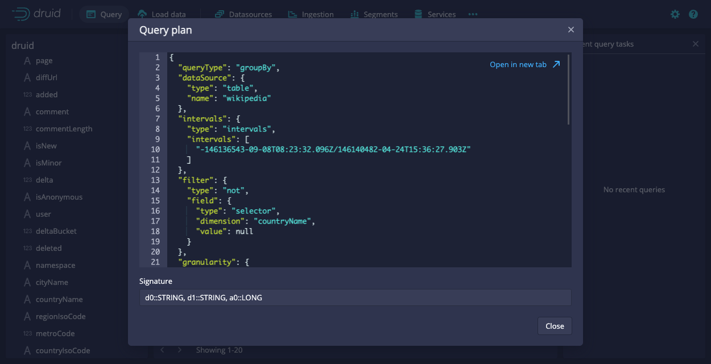

<!--
  ~ Licensed to the Apache Software Foundation (ASF) under one
  ~ or more contributor license agreements.  See the NOTICE file
  ~ distributed with this work for additional information
  ~ regarding copyright ownership.  The ASF licenses this file
  ~ to you under the Apache License, Version 2.0 (the
  ~ "License"); you may not use this file except in compliance
  ~ with the License.  You may obtain a copy of the License at
  ~
  ~   http://www.apache.org/licenses/LICENSE-2.0
  ~
  ~ Unless required by applicable law or agreed to in writing,
  ~ software distributed under the License is distributed on an
  ~ "AS IS" BASIS, WITHOUT WARRANTIES OR CONDITIONS OF ANY
  ~ KIND, either express or implied.  See the License for the
  ~ specific language governing permissions and limitations
  ~ under the License.
  -->


This tutorial will demonstrate how to query data in Apache Druid (incubating), with examples for Druid SQL and Druid's native query format.

The tutorial assumes that you've already completed one of the 4 ingestion tutorials, as we will be querying the sample Wikipedia edits data.

* [Tutorial: Loading a file](../tutorials/tutorial-batch.md)
* [Tutorial: Loading stream data from Kafka](../tutorials/tutorial-kafka.md)
* [Tutorial: Loading a file using Hadoop](../tutorials/tutorial-batch-hadoop.md)

Druid queries are sent over HTTP.
The Druid console includes a view to issue queries to Druid and nicely format the results.

## Druid SQL queries

Druid supports a dialect of SQL for querying.

This query retrieves the 10 Wikipedia pages with the most page edits on 2015-09-12.

```sql
SELECT page, COUNT(*) AS Edits
FROM wikipedia
WHERE TIMESTAMP '2015-09-12 00:00:00' <= "__time" AND "__time" < TIMESTAMP '2015-09-13 00:00:00'
GROUP BY page
ORDER BY Edits DESC
LIMIT 10
```

Let's look at the different ways to issue this query.

### Query SQL via the console

You can issue the above query from the console.


The console query view provides autocomplete functionality with inline documentation.


You can also configure extra [context flags](../querying/query-context.md) to be sent with the query from the `...` options menu.

Note that the console will (by default) wrap your SQL queries in a limit where appropriate so that queries such as `SELECT * FROM wikipedia` can complete.
You can turn off this behavior from the `Smart query limit` toggle.


The query view provides contextual actions that can write and modify the query for you. 

### Query SQL via dsql

For convenience, the Druid package includes a SQL command-line client, located at `bin/dsql` from the Druid package root.

Let's now run `bin/dsql`; you should see the following prompt:

```bash
Welcome to dsql, the command-line client for Druid SQL.
Type "\h" for help.
dsql>
```

To submit the query, paste it to the `dsql` prompt and press enter:

```bash
dsql> SELECT page, COUNT(*) AS Edits FROM wikipedia WHERE "__time" BETWEEN TIMESTAMP '2015-09-12 00:00:00' AND TIMESTAMP '2015-09-13 00:00:00' GROUP BY page ORDER BY Edits DESC LIMIT 10;
┌──────────────────────────────────────────────────────────┬───────┐
│ page                                                     │ Edits │
├──────────────────────────────────────────────────────────┼───────┤
│ Wikipedia:Vandalismusmeldung                             │    33 │
│ User:Cyde/List of candidates for speedy deletion/Subpage │    28 │
│ Jeremy Corbyn                                            │    27 │
│ Wikipedia:Administrators' noticeboard/Incidents          │    21 │
│ Flavia Pennetta                                          │    20 │
│ Total Drama Presents: The Ridonculous Race               │    18 │
│ User talk:Dudeperson176123                               │    18 │
│ Wikipédia:Le Bistro/12 septembre 2015                    │    18 │
│ Wikipedia:In the news/Candidates                         │    17 │
│ Wikipedia:Requests for page protection                   │    17 │
└──────────────────────────────────────────────────────────┴───────┘
Retrieved 10 rows in 0.06s.
```


### Query SQL over HTTP

The SQL queries are submitted as JSON over HTTP.

The tutorial package includes an example file that contains the SQL query shown above at `quickstart/tutorial/wikipedia-top-pages-sql.json`. Let's submit that query to the Druid Broker:

```bash
curl -X 'POST' -H 'Content-Type:application/json' -d @quickstart/tutorial/wikipedia-top-pages-sql.json http://localhost:8888/druid/v2/sql
```

The following results should be returned:

```json
[
  {
    "page": "Wikipedia:Vandalismusmeldung",
    "Edits": 33
  },
  {
    "page": "User:Cyde/List of candidates for speedy deletion/Subpage",
    "Edits": 28
  },
  {
    "page": "Jeremy Corbyn",
    "Edits": 27
  },
  {
    "page": "Wikipedia:Administrators' noticeboard/Incidents",
    "Edits": 21
  },
  {
    "page": "Flavia Pennetta",
    "Edits": 20
  },
  {
    "page": "Total Drama Presents: The Ridonculous Race",
    "Edits": 18
  },
  {
    "page": "User talk:Dudeperson176123",
    "Edits": 18
  },
  {
    "page": "Wikipédia:Le Bistro/12 septembre 2015",
    "Edits": 18
  },
  {
    "page": "Wikipedia:In the news/Candidates",
    "Edits": 17
  },
  {
    "page": "Wikipedia:Requests for page protection",
    "Edits": 17
  }
]
```

### More Druid SQL examples

Here is a collection of queries to try out:

#### Query over time

```sql
SELECT FLOOR(__time to HOUR) AS HourTime, SUM(deleted) AS LinesDeleted
FROM wikipedia WHERE "__time" BETWEEN TIMESTAMP '2015-09-12 00:00:00' AND TIMESTAMP '2015-09-13 00:00:00'
GROUP BY 1
```


#### General group by

```sql
SELECT channel, page, SUM(added)
FROM wikipedia WHERE "__time" BETWEEN TIMESTAMP '2015-09-12 00:00:00' AND TIMESTAMP '2015-09-13 00:00:00'
GROUP BY channel, page
ORDER BY SUM(added) DESC
```


#### Select raw data

```sql
SELECT user, page
FROM wikipedia WHERE "__time" BETWEEN TIMESTAMP '2015-09-12 02:00:00' AND TIMESTAMP '2015-09-12 03:00:00'
LIMIT 5
```



### Explain query plan

Druid SQL has the ability to explain the query plan for a given query.
In the console this functionality is accessible from the `...` button.


If you are querying in other ways you can get the plan by prepending `EXPLAIN PLAN FOR ` to a Druid SQL query.

Using a query from an example above:

`EXPLAIN PLAN FOR SELECT page, COUNT(*) AS Edits FROM wikipedia WHERE "__time" BETWEEN TIMESTAMP '2015-09-12 00:00:00' AND TIMESTAMP '2015-09-13 00:00:00' GROUP BY page ORDER BY Edits DESC LIMIT 10;`

```bash
dsql> EXPLAIN PLAN FOR SELECT page, COUNT(*) AS Edits FROM wikipedia WHERE "__time" BETWEEN TIMESTAMP '2015-09-12 00:00:00' AND TIMESTAMP '2015-09-13 00:00:00' GROUP BY page ORDER BY Edits DESC LIMIT 10;
┌─────────────────────────────────────────────────────────────────────────────────────────────────────────────────────────────────────────────────────────────────────────────────────────────────────────────────────────────────────────────────────────────────────────────────────────────────────────────────────────────────────────────────────────────────────────────────────────────────────────────────────────────────────────────────────────────────────────────────────────────────────────────────────────────────────────────────────────┐
│ PLAN                                                                                                                                                                                                                                                                                                                                                                                                                                                                                                                                                    │
├─────────────────────────────────────────────────────────────────────────────────────────────────────────────────────────────────────────────────────────────────────────────────────────────────────────────────────────────────────────────────────────────────────────────────────────────────────────────────────────────────────────────────────────────────────────────────────────────────────────────────────────────────────────────────────────────────────────────────────────────────────────────────────────────────────────────────────────┤
│ DruidQueryRel(query=[{"queryType":"topN","dataSource":{"type":"table","name":"wikipedia"},"virtualColumns":[],"dimension":{"type":"default","dimension":"page","outputName":"d0","outputType":"STRING"},"metric":{"type":"numeric","metric":"a0"},"threshold":10,"intervals":{"type":"intervals","intervals":["2015-09-12T00:00:00.000Z/2015-09-13T00:00:00.001Z"]},"filter":null,"granularity":{"type":"all"},"aggregations":[{"type":"count","name":"a0"}],"postAggregations":[],"context":{},"descending":false}], signature=[{d0:STRING, a0:LONG}]) │
└─────────────────────────────────────────────────────────────────────────────────────────────────────────────────────────────────────────────────────────────────────────────────────────────────────────────────────────────────────────────────────────────────────────────────────────────────────────────────────────────────────────────────────────────────────────────────────────────────────────────────────────────────────────────────────────────────────────────────────────────────────────────────────────────────────────────────────────┘
Retrieved 1 row in 0.03s.
```


## Native JSON queries

Druid's native query format is expressed in JSON.

### Native query via the console

You can issue native Druid queries from the console's Query view.

Here is a query that retrieves the 10 Wikipedia pages with the most page edits on 2015-09-12.

```json
{
  "queryType" : "topN",
  "dataSource" : "wikipedia",
  "intervals" : ["2015-09-12/2015-09-13"],
  "granularity" : "all",
  "dimension" : "page",
  "metric" : "count",
  "threshold" : 10,
  "aggregations" : [
    {
      "type" : "count",
      "name" : "count"
    }
  ]
}
```

Simply paste it into the console to switch the editor into JSON mode.


### Native queries over HTTP

We have included a sample native TopN query under `quickstart/tutorial/wikipedia-top-pages.json`:

Let's submit this query to Druid:

```bash
curl -X 'POST' -H 'Content-Type:application/json' -d @quickstart/tutorial/wikipedia-top-pages.json http://localhost:8888/druid/v2?pretty
```

You should see the following query results:

```json
[ {
  "timestamp" : "2015-09-12T00:46:58.771Z",
  "result" : [ {
    "count" : 33,
    "page" : "Wikipedia:Vandalismusmeldung"
  }, {
    "count" : 28,
    "page" : "User:Cyde/List of candidates for speedy deletion/Subpage"
  }, {
    "count" : 27,
    "page" : "Jeremy Corbyn"
  }, {
    "count" : 21,
    "page" : "Wikipedia:Administrators' noticeboard/Incidents"
  }, {
    "count" : 20,
    "page" : "Flavia Pennetta"
  }, {
    "count" : 18,
    "page" : "Total Drama Presents: The Ridonculous Race"
  }, {
    "count" : 18,
    "page" : "User talk:Dudeperson176123"
  }, {
    "count" : 18,
    "page" : "Wikipédia:Le Bistro/12 septembre 2015"
  }, {
    "count" : 17,
    "page" : "Wikipedia:In the news/Candidates"
  }, {
    "count" : 17,
    "page" : "Wikipedia:Requests for page protection"
  } ]
} ]
```


## Further reading

The [Queries documentation](../querying/querying.md) has more information on Druid's native JSON queries.

The [Druid SQL documentation](../querying/sql.md) has more information on using Druid SQL queries.
