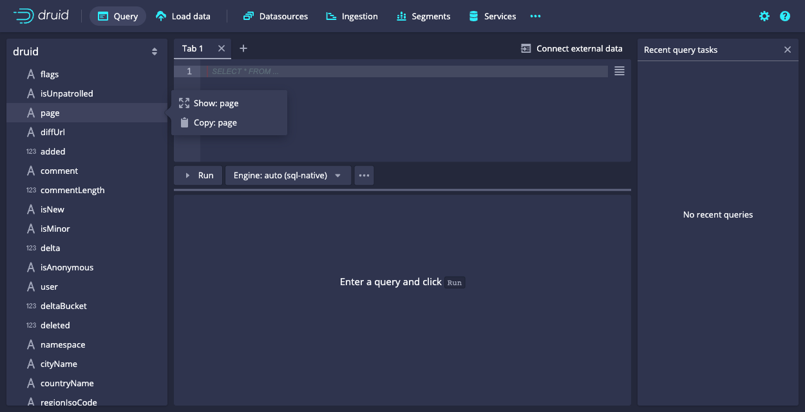

<!--
  ~ Licensed to the Apache Software Foundation (ASF) under one
  ~ or more contributor license agreements.  See the NOTICE file
  ~ distributed with this work for additional information
  ~ regarding copyright ownership.  The ASF licenses this file
  ~ to you under the Apache License, Version 2.0 (the
  ~ "License"); you may not use this file except in compliance
  ~ with the License.  You may obtain a copy of the License at
  ~
  ~   http://www.apache.org/licenses/LICENSE-2.0
  ~
  ~ Unless required by applicable law or agreed to in writing,
  ~ software distributed under the License is distributed on an
  ~ "AS IS" BASIS, WITHOUT WARRANTIES OR CONDITIONS OF ANY
  ~ KIND, either express or implied.  See the License for the
  ~ specific language governing permissions and limitations
  ~ under the License.
  -->


This tutorial demonstrates how to query data in Apache Druid using Druid SQL, a SQL-like language
for querying data in Druid.   

It assumes that you've completed the [Quickstart](../tutorials/index.md) 
or one of the following tutorials, since we will be querying datasources created
in the tutorials:

* [Tutorial: Loading a file](../tutorials/tutorial-batch.md)
* [Tutorial: Loading stream data from Kafka](../tutorials/tutorial-kafka.md)
* [Tutorial: Loading a file using Hadoop](../tutorials/tutorial-batch-hadoop.md)

There are various ways to issue Druid SQL queries, from the Druid console, using a command line utility
and by posting the query by HTTP. We'll look at each of these here. 


## Query SQL from the Druid console

The Druid console includes a view that makes it easier to buid and test queries, and 
view their results. 

1. Start up the Druid cluster, if not already running, and open the console in your web
browser. 

2. Click **Query** from the header to open the Query view:  

   

   You can write queries directly in the edit pane, but we'll generate a starter query 
   using query builder controls. 

3. Expand the wikipedia datasource tree in the left pane. We'll
create a query for the page dimension.  

4. Click `page` and then **Show:page** from the menu: 

   

   A SELECT query appears in the query edit pane and immediately runs, returning, in this case, no data. By default, 
   our query returns timestamped data from the last day.  

5. In the datasource tree, click `__time` and then **Remove Filter**, removing the filter clause from
the query. 

   

6. Click **Run** (or ctrl+return) to run the query again.   

   You should now see two columns of data, a page name and the count:

   

   Notice that the results are limited in the console to about a hundred results. The **Smart query limit** option helps 
   you avoid inadvertently running queries that return an excessive number of rows. 

7. Let's edit the query directly to try out a few more query building features. In the query edit pane, make the following changes: 

   1.  Add a line after the first column, `"page"` and Start typing the name of a new column, `"countryName"`. Notice  
the autocompletion feature of the editor. Choose `countryName` from the autocomplete menu when it appears. Also add the new second
column to the GROUP BY clause.  

   2. For readability, replace `Count` column name with `Edits`. In this case, the `COUNT()` function actually 
returns the number of edits for the page. Change it in the ORDER BY clause as well. 

      The `COUNT()` function is one of many aggregation functions supported by Druid. To see a brief description of the function, 
      move your mouse over the function in the autocomplete menu. Also see the Druid documentation, such 
      as [Aggregation functions](querying/sql.html#aggregation-functions). 

   The query should be:

   ```sql
   SELECT
     "page",
     "countryName",
     COUNT(*) AS "Count"
   FROM "wikipedia"
   GROUP BY 1, 2
   ORDER BY "Count" DESC
   ``` 

   When you run the query again, notice that we're getting the new dimension,`countryName`, but for most of the rows, its value is null. Let's 
   show only rows with a `countryName` value.

8. Click the countryName dimension in the left pane and choose the first filtering option. It's not exactly what we want, but
we'll edit it by hand. The new WHERE clause should appear in your query. 

8. Modify the WHERE clause to exclude results that do not have a value for countryName: 

   ```sql
   WHERE "countryName" IS NOT NULL
   ``` 
   Run the query again. You should now see the top edits by country:  

   


9. Underlying every Druid SQL query is a native query, a JSON-based query syntax. Native query is the form of the query that executes on data nodes. View 
the query plan for our query by clicking `...` and **Explain SQL Query**. 

   While you can use Druid SQL most of the time, familiarity with native query is useful for composing complex queries or troubleshooting 
performance issues. For more information, see [Native queries](../querying/querying/querying.md). 

   

    > Alternatively, you can see the explain plan by putting EXPLAIN PLAN FOR to your query. This lets you see explain plans
    while running queries from the command line or over HTTP.
    >
    >```sql
    >EXPLAIN PLAN FOR
    >SELECT
    >  "page",
    >  "countryName",
    >  COUNT(*) AS "Count"
    >FROM "wikipedia"
    >WHERE "countryName" IS NOT NULL
    >GROUP BY 1, 2
    >ORDER BY "Count" DESC
    >```


9. Finally, see other ways you can control how queries run by clicking  `...`  and **Edit context**. In the field, you can enter the
query context options, as JSON 
key-value pairs, described in [Context flags](../querying/query-context.md).   

That's it! We've built a simple query using some of the query builder features of the Druid Console. The following
sections provide a few more example queries you can try. Also, see [Other ways to invoke SQL queries](#other-ways-to-invoke-sql-queries), for how
to run Druid SQL from the command line or over HTTP. 

## More Druid SQL examples

Here is a collection of queries to try out:

### Query over time

```sql
SELECT FLOOR(__time to HOUR) AS HourTime, SUM(sum_deleted) AS LinesDeleted
FROM wikipedia WHERE "__time" BETWEEN TIMESTAMP '2015-09-12 00:00:00' AND TIMESTAMP '2015-09-13 00:00:00'
GROUP BY 1
```


### General group by

```sql
SELECT channel, page, SUM(sum_added)
FROM wikipedia WHERE "__time" BETWEEN TIMESTAMP '2015-09-12 00:00:00' AND TIMESTAMP '2015-09-13 00:00:00'
GROUP BY channel, page
ORDER BY SUM(added) DESC
```


## Other ways to invoke SQL queries

### Query SQL via dsql

For convenience, the Druid package includes a SQL command-line client, located at `bin/dsql` from the Druid package root.

Let's now run `bin/dsql`; you should see the following prompt:

```bash
Welcome to dsql, the command-line client for Druid SQL.
Type "\h" for help.
dsql>
```

To submit the query, paste it to the `dsql` prompt and press enter:

```bash
dsql> SELECT page, COUNT(*) AS Edits FROM wikipedia WHERE "__time" BETWEEN TIMESTAMP '2015-09-12 00:00:00' AND TIMESTAMP '2015-09-13 00:00:00' GROUP BY page ORDER BY Edits DESC LIMIT 10;
┌──────────────────────────────────────────────────────────┬───────┐
│ page                                                     │ Edits │
├──────────────────────────────────────────────────────────┼───────┤
│ Wikipedia:Vandalismusmeldung                             │    33 │
│ User:Cyde/List of candidates for speedy deletion/Subpage │    28 │
│ Jeremy Corbyn                                            │    27 │
│ Wikipedia:Administrators' noticeboard/Incidents          │    21 │
│ Flavia Pennetta                                          │    20 │
│ Total Drama Presents: The Ridonculous Race               │    18 │
│ User talk:Dudeperson176123                               │    18 │
│ Wikipédia:Le Bistro/12 septembre 2015                    │    18 │
│ Wikipedia:In the news/Candidates                         │    17 │
│ Wikipedia:Requests for page protection                   │    17 │
└──────────────────────────────────────────────────────────┴───────┘
Retrieved 10 rows in 0.06s.
```


### Query SQL over HTTP


The SQL queries are submitted as JSON over HTTP.

The tutorial package includes an example file that contains the SQL query shown above at `quickstart/tutorial/wikipedia-top-pages-sql.json`. Let's submit that query to the Druid Broker:

```bash
curl -X 'POST' -H 'Content-Type:application/json' -d @quickstart/tutorial/wikipedia-top-pages-sql.json http://localhost:8888/druid/v2/sql
```

The following results should be returned:

```json
[
  {
    "page": "Wikipedia:Vandalismusmeldung",
    "Edits": 33
  },
  {
    "page": "User:Cyde/List of candidates for speedy deletion/Subpage",
    "Edits": 28
  },
  {
    "page": "Jeremy Corbyn",
    "Edits": 27
  },
  {
    "page": "Wikipedia:Administrators' noticeboard/Incidents",
    "Edits": 21
  },
  {
    "page": "Flavia Pennetta",
    "Edits": 20
  },
  {
    "page": "Total Drama Presents: The Ridonculous Race",
    "Edits": 18
  },
  {
    "page": "User talk:Dudeperson176123",
    "Edits": 18
  },
  {
    "page": "Wikipédia:Le Bistro/12 septembre 2015",
    "Edits": 18
  },
  {
    "page": "Wikipedia:In the news/Candidates",
    "Edits": 17
  },
  {
    "page": "Wikipedia:Requests for page protection",
    "Edits": 17
  }
]
```

## Further reading

The [Queries documentation](../querying/querying.md) has more information on Druid native query.

The [Druid SQL documentation](../querying/sql.md) has more information on using Druid SQL queries.
