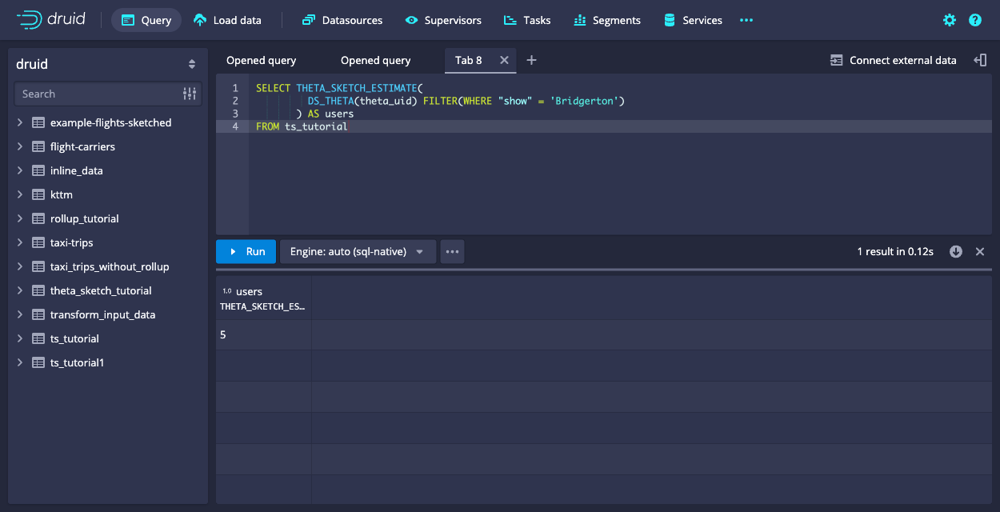
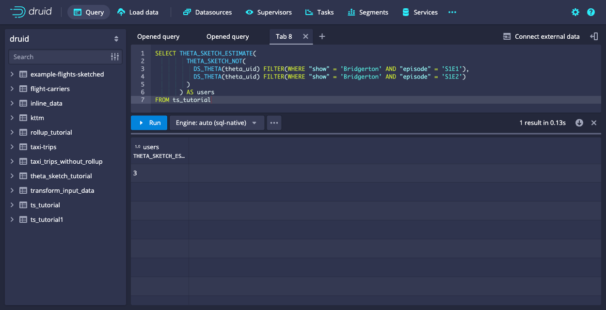

<!--
  ~ Licensed to the Apache Software Foundation (ASF) under one
  ~ or more contributor license agreements.  See the NOTICE file
  ~ distributed with this work for additional information
  ~ regarding copyright ownership.  The ASF licenses this file
  ~ to you under the Apache License, Version 2.0 (the
  ~ "License"); you may not use this file except in compliance
  ~ with the License.  You may obtain a copy of the License at
  ~
  ~   http://www.apache.org/licenses/LICENSE-2.0
  ~
  ~ Unless required by applicable law or agreed to in writing,
  ~ software distributed under the License is distributed on an
  ~ "AS IS" BASIS, WITHOUT WARRANTIES OR CONDITIONS OF ANY
  ~ KIND, either express or implied.  See the License for the
  ~ specific language governing permissions and limitations
  ~ under the License.
  -->

Apache Druid can power real-time collection, streaming, and interactive visualization of clickstreams.
A common problem in clickstream analytics is counting unique things, like visitors or sessions.
Generally this involves scanning through all detail data, because unique counts do not add up as you aggregate the numbers.

## The problem with counts and set operations on large data sets

Imagine you are interested in the number of visitors that watched episodes of a TV show. Let's say you found that at a given day, 1000 unique visitors watched the first episode, and 800 visitors watched the second episode. You may want to explore further trends, for example:
- How many visitors watched _both_ episodes?
- How many visitors are there that watched _at least one_ of the episodes?
- How many visitors watched episode 1 _but not_ episode 2?

There is no way to answer these questions by just looking at the aggregated numbers. You would have to go back to the detail data and scan every single row. If the data volume is high enough, this may take a very long time, meaning that an interactive data exploration is not possible.

An additional nuisance is that unique counts don't work well with rollups. For this example, it would be great if you could have just one row of data per 15 minute interval[^1], show, and episode. After all, you are not interested in the individual user IDs, just the unique counts.

[^1]: Why 15 minutes and not just 1 hour? Intervals of 15 minutes work better with international timezones because those are not always aligned by hour. India, for instance, is 30 minutes off, and Nepal is even 45 minutes off. With 15 minute aggregates, you can get hourly sums for any of those timezones, too!

Is there a way to avoid crunching the detail data every single time, and maybe even enable rollup?
Enter Theta sketches.

## Use Theta sketches for fast approximation with set operations

Use Theta sketches to obtain a fast approximate estimate for the distinct count of values used to build the sketches.
Theta sketches are a probabilistic data structure to enable approximate analysis of big data with known error distributions.
Druid's implementation relies on the [Apache DataSketches](https://datasketches.apache.org/) library.

The following properties describe Theta sketches:
* Similar to other sketches, Theta sketches are **mergeable**. This means you can work with rolled up data and merge the sketches over various time intervals. Thus, you can take advantage of Druid's rollup feature.
* Specific to sketches supported in Druid, Theta sketches support **set operations**. Given two Theta sketches over subsets of data, you can compute the union, intersection, or set difference of the two subsets. This enables you to answer questions like the number of visitors that watched a specific combination of episodes from the example.

In this tutorial, you will learn how to do the following:
* Create Theta sketches from your input data at ingestion time.
* Execute distinct count and set operation queries on the Theta sketches to explore the questions presented earlier.


## Prerequisites

For this tutorial, you should have already downloaded Druid as described in
the [single-machine quickstart](index.md) and have it running on your local machine.
It will also be helpful to have finished [Tutorial: Loading a file](../tutorials/tutorial-batch.md) and [Tutorial: Querying data](../tutorials/tutorial-query.md).

This tutorial works with the following data:
- **date**: a timestamp. In this case it's just dates but as mentioned earlier, a finer granularity makes sense in real life.
- **uid**: a user ID
- **show**: name of a TV show
- **episode**: episode identifier

```csv
date,uid,show,episode
2022-05-19,alice,Game of Thrones,S1E1
2022-05-19,alice,Game of Thrones,S1E2
2022-05-19,alice,Game of Thrones,S1E1
2022-05-19,bob,Bridgerton,S1E1
2022-05-20,alice,Game of Thrones,S1E1
2022-05-20,carol,Bridgerton,S1E2
2022-05-20,dan,Bridgerton,S1E1
2022-05-21,alice,Game of Thrones,S1E1
2022-05-21,carol,Bridgerton,S1E1
2022-05-21,erin,Game of Thrones,S1E1
2022-05-21,alice,Bridgerton,S1E1
2022-05-22,bob,Game of Thrones,S1E1
2022-05-22,bob,Bridgerton,S1E1
2022-05-22,carol,Bridgerton,S1E2
2022-05-22,bob,Bridgerton,S1E1
2022-05-22,erin,Game of Thrones,S1E1
2022-05-22,erin,Bridgerton,S1E2
2022-05-23,erin,Game of Thrones,S1E1
2022-05-23,alice,Game of Thrones,S1E1
```

## Ingest data using Theta sketches

1. Navigate to the **Load data** wizard in the web console.
2. Select `Paste data` as the data source and paste the given data:


3. Leave the source type as `inline` and click **Apply** and **Next: Parse data**.
4. Parse the data as CSV, with included headers:


5. Accept the default values in the **Parse time**, **Transform**, and **Filter** stages.
6. In the **Configure schema** stage, enable rollup and confirm your choice in the dialog. Then set the query granularity to `day`.


7. Add the Theta sketch during this stage. Select **Add metric**.
8. Define the new metric as a Theta sketch with the following details:
   * **Name**: `theta_uid`
   * **Type**: `thetaSketch`
   * **Field name**: `uid`
   * **Size**: Accept the default value, `16384`.
   * **Is input theta sketch**: Accept the default value, `False`.


9. Click **Apply** to add the new metric to the data model.


10. You are not interested in individual user ID's, only the unique counts. Right now, `uid` is still in the data model. To remove it, click on the `uid` column in the data model and delete it using the trashcan icon on the right:



11. For the remaining stages of the **Load data** wizard, set the following options:
    * **Partition**: Set **Segment granularity** to `day`.
    * **Tune**: Leave the default options.
    * **Publish**: Set the datasource name to `ts_tutorial`.

On the **Edit spec** page, your final input spec should match the following:

```json
{
  "type": "index_parallel",
  "spec": {
    "ioConfig": {
      "type": "index_parallel",
      "inputSource": {
        "type": "inline",
        "data": "date,uid,show,episode\n2022-05-19,alice,Game of Thrones,S1E1\n2022-05-19,alice,Game of Thrones,S1E2\n2022-05-19,alice,Game of Thrones,S1E1\n2022-05-19,bob,Bridgerton,S1E1\n2022-05-20,alice,Game of Thrones,S1E1\n2022-05-20,carol,Bridgerton,S1E2\n2022-05-20,dan,Bridgerton,S1E1\n2022-05-21,alice,Game of Thrones,S1E1\n2022-05-21,carol,Bridgerton,S1E1\n2022-05-21,erin,Game of Thrones,S1E1\n2022-05-21,alice,Bridgerton,S1E1\n2022-05-22,bob,Game of Thrones,S1E1\n2022-05-22,bob,Bridgerton,S1E1\n2022-05-22,carol,Bridgerton,S1E2\n2022-05-22,bob,Bridgerton,S1E1\n2022-05-22,erin,Game of Thrones,S1E1\n2022-05-22,erin,Bridgerton,S1E2\n2022-05-23,erin,Game of Thrones,S1E1\n2022-05-23,alice,Game of Thrones,S1E1"
      },
      "inputFormat": {
        "type": "csv",
        "findColumnsFromHeader": true
      }
    },
    "tuningConfig": {
      "type": "index_parallel",
      "partitionsSpec": {
        "type": "hashed"
      },
      "forceGuaranteedRollup": true
    },
    "dataSchema": {
      "dataSource": "ts_tutorial",
      "timestampSpec": {
        "column": "date",
        "format": "auto"
      },
      "dimensionsSpec": {
        "dimensions": [
          "show",
          "episode"
        ]
      },
      "granularitySpec": {
        "queryGranularity": "day",
        "rollup": true,
        "segmentGranularity": "day"
      },
      "metricsSpec": [
        {
          "name": "count",
          "type": "count"
        },
        {
          "type": "thetaSketch",
          "name": "theta_uid",
          "fieldName": "uid"
        }
      ]
    }
  }
}
```

Notice the `theta_uid` object in the `metricsSpec` list, that defines the `thetaSketch` aggregator on the `uid` column during ingestion.

Click **Submit** to start the ingestion.

## Query the Theta sketch column

Calculating a unique count estimate from a Theta sketch column involves the following steps:

1. Merge the Theta sketches in the column by means of the `DS_THETA` [aggregator function](../querying/sql-aggregations.md#theta-sketch-functions) in Druid SQL.
2. Retrieve the estimate from the merged sketch with the [`THETA_SKETCH_ESTIMATE`](../querying/sql-scalar.md#theta-sketch-functions) function.

Between steps 1 and 2, you can apply set functions as demonstrated later in [Set operations](#set-operations).

### Basic counting 

Let's first see what the data looks like in Druid. Run the following SQL statement in the query editor:
```sql
SELECT * FROM ts_tutorial
```


The Theta sketch column `theta_uid` appears as a Base64-encoded string; behind it is a bitmap.

The following query to compute the distinct counts of user IDs uses `APPROX_COUNT_DISTINCT_DS_THETA` and groups by the other dimensions:
```sql
SELECT __time,
       "show",
       "episode",
       APPROX_COUNT_DISTINCT_DS_THETA(theta_uid) AS users
FROM   ts_tutorial
GROUP  BY 1, 2, 3
```


In the preceding query, `APPROX_COUNT_DISTINCT_DS_THETA` is equivalent to calling `DS_THETA` and `THETA_SKETCH_ESIMATE` as follows:

```sql
SELECT __time,
       "show", 
       "episode",
       THETA_SKETCH_ESTIMATE(DS_THETA(theta_uid)) AS users
FROM   ts_tutorial
GROUP  BY 1, 2, 3
```

That is, `APPROX_COUNT_DISTINCT_DS_THETA` applies the following:
* `DS_THETA`: Creates a new Theta sketch from the column of Theta sketches
* `THETA_SKETCH_ESTIMATE`: Calculates the distinct count estimate from the output of `DS_THETA`

### Filtered metrics

Druid has the capability to use [filtered metrics](../querying/sql-aggregations.md). This means you can include a WHERE clause in the SELECT part of the query.
> In the case of Theta sketches, the filter clause has to be inserted between the aggregator and the estimator.

As an example, query the total unique users that watched _Bridgerton:_

```sql
SELECT THETA_SKETCH_ESTIMATE(
         DS_THETA(theta_uid) FILTER(WHERE "show" = 'Bridgerton')
       ) AS users
FROM ts_tutorial
```



### Set operations

You can use this capability of filtering in the aggregator, together with _set operations_, to finally answer the questions from the introduction.

How many users watched both episodes of _Bridgerton?_ Use `THETA_SKETCH_INTERSECT` to compute the unique count of the intersection of two (or more) segments:

```sql
SELECT THETA_SKETCH_ESTIMATE(
         THETA_SKETCH_INTERSECT(
           DS_THETA(theta_uid) FILTER(WHERE "show" = 'Bridgerton' AND "episode" = 'S1E1'),
           DS_THETA(theta_uid) FILTER(WHERE "show" = 'Bridgerton' AND "episode" = 'S1E2')
         )
       ) AS users
FROM ts_tutorial
```


Again, the set function is spliced in between the aggregator and the estimator.

Likewise, use `THETA_SKETCH_UNION` to find the number of visitors that watched _any_ of the episodes:

```sql
SELECT THETA_SKETCH_ESTIMATE(
         THETA_SKETCH_UNION(
           DS_THETA(theta_uid) FILTER(WHERE "show" = 'Bridgerton' AND "episode" = 'S1E1'),
           DS_THETA(theta_uid) FILTER(WHERE "show" = 'Bridgerton' AND "episode" = 'S1E2')
         )
       ) AS users
FROM ts_tutorial
```


And finally, there is `THETA_SKETCH_NOT` which computes the set difference of two or more segments.
The result describes how many visitors watched episode 1 of Bridgerton but not episode 2.


```sql
SELECT THETA_SKETCH_ESTIMATE(
         THETA_SKETCH_NOT(
           DS_THETA(theta_uid) FILTER(WHERE "show" = 'Bridgerton' AND "episode" = 'S1E1'),
           DS_THETA(theta_uid) FILTER(WHERE "show" = 'Bridgerton' AND "episode" = 'S1E2')
         )
       ) AS users
FROM ts_tutorial
```


## Conclusions

- Counting distinct things for large data sets can be done with Theta sketches in Apache Druid.
- This allows us to use rollup and discard the individual values, just retaining statistical approximations in the sketches.
- With Theta sketch set operations, affinity analysis is easier, for example, to answer questions such as which segments correlate or overlap by how much.

## Further reading

See the following topics for more information:
* [Theta sketch](../development/extensions-core/datasketches-theta.md) for reference on ingestion and native queries on Theta sketches in Druid.
* [Theta sketch scalar functions](../querying/sql-scalar.md#theta-sketch-functions) and [Theta sketch aggregation functions](../querying/sql-aggregations.md#theta-sketch-functions) for Theta sketch functions in Druid SQL queries.
* [Sketches for high cardinality columns](../ingestion/schema-design.md#sketches-for-high-cardinality-columns) for Druid schema design involving sketches.
* [DataSketches extension](../development/extensions-core/datasketches-extension.md) for more information about the DataSketches extension in Druid as well as other available sketches.
* The accuracy of queries using Theta sketches is governed by the size _k_ of the Theta sketch and by the operations you perform. See more details in the [Apache DataSketches documentation](https://datasketches.apache.org/docs/Theta/ThetaAccuracy.html).

## Acknowledgments

This tutorial is adapted from a [blog post](https://blog.hellmar-becker.de/2022/06/05/druid-data-cookbook-counting-unique-visitors-for-overlapping-segments/) by community member Hellmar Becker.

