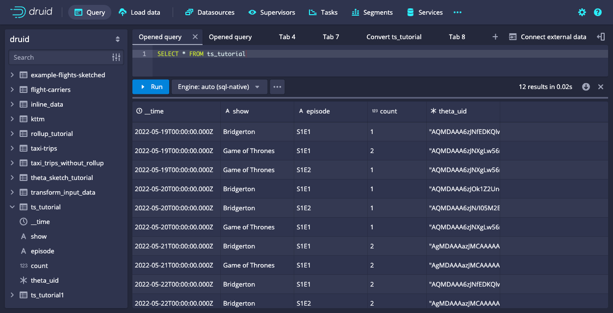
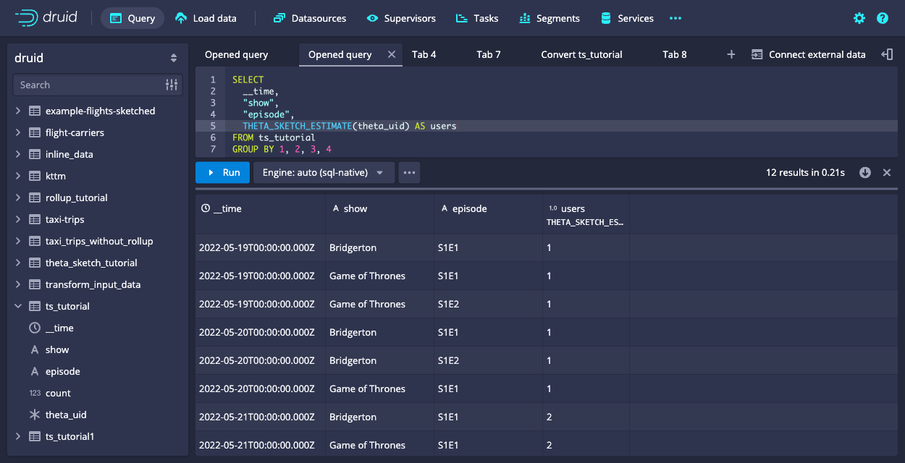

A common problem in clickstream analytics is counting unique things, like visitors or sessions. Generally this involves scanning through all detail data, because unique counts **do not add up** as you aggregate the numbers.

For instance, we might be interested in the number of visitors that watched episodes of a TV show. Let's say we found that at a given day, 1000 unique visitors watched the first episode, and 800 visitors watched the second episode. We may want to explore further trends, for example:
- How many visitors watched _both_ episodes?
- How many visitors are there that watched _at least one_ of the episodes?
- How many visitors watched episode 1 _but not_ episode 2?

There is no way to answer these questions by just looking at the aggregated numbers. We will have to go back to the detail data and scan every single row. If the data volume is high enough, this may take long, meaning that an interactive data exploration is not possible.

An additional nuisance is that unique counts don't work well with rollups. For the example above, it would be great if we could have just one row of data per 15 minute interval[^1], show, and episode. After all, we are not interested in the individual user IDs, just the unique counts.

[^1]: Why 15 minutes and not just 1 hour? Intervals of 15 minutes work better with international timezones because those are not always aligned by hour. India, for instance, is 30 minutes off, and Nepal is even 45 minutes off. With 15 minute aggregates, you can get hourly sums for any of those timezones, too!

Is there a way to avoid crunching the detail data every single time, and maybe even enable rollup?

## Fast approximation with set operations: Theta sketches

Theta sketches are a probabilistic data structure to enable fast approximate analysis of big data. Druid's implementation relies on the [Apache DataSketches](https://datasketches.apache.org/) library.

Theta sketches have a few nice properties:

- They give you a **fast approximate estimate** for the distinct count of items that you put into them.
- They are **mergeable**. This means we can work with rolled up data and merge the sketches over various time intervals. Thus, we can take advantage of Druid's rollup feature.
- Theta sketches support **set operations**. Given two Theta sketches over subsets of the data, we can compute the union, intersection, or set difference of these two. This gives us the ability to answer the questions above about the number of visitors that watched a specific combination of episodes.

There is a lot of advanced math behind Theta sketches[^2]. But with Druid, you do not need to bother about the complex algorithms - Theta sketches just work!

[^2]: Specifically, the accuracy of the result is governed by the size _k_ of the Theta sketch, and by the operations you perform. See more details in the [Apache DataSketches documentation](https://datasketches.apache.org/docs/Theta/ThetaAccuracy.html). There's also a version of the sketch estimator `THETA_SKETCH_ESTIMATE_WITH_ERROR_BOUNDS` which takes an additional integer parameter and returns the error boundaries for the result in a JSON object.

This tutorial shows you how to create Theta sketches from your input data at ingestion time and how to run distinct count and set operation queries on the Theta sketches.

For this tutorial, we'll assume you've already downloaded Druid as described in
the [single-machine quickstart](index.md) and have it running on your local machine.
It will also be helpful to have finished [Tutorial: Loading a file](../tutorials/tutorial-batch.md) and [Tutorial: Querying data](../tutorials/tutorial-query.md).

## Ingest data using Theta sketches

This tutorial works with data in the snippet below, which has just the bare basics that are needed:
- **date**: a timestamp. In this case it's just dates but as mentioned above a finer granularity makes sense in real life.
- **uid**: a user ID
- **show**: name of a TV show
- **episode**: episode identifier

```csv
date,uid,show,episode
2022-05-19,alice,Game of Thrones,S1E1
2022-05-19,alice,Game of Thrones,S1E2
2022-05-19,alice,Game of Thrones,S1E1
2022-05-19,bob,Bridgerton,S1E1
2022-05-20,alice,Game of Thrones,S1E1
2022-05-20,carol,Bridgerton,S1E2
2022-05-20,dan,Bridgerton,S1E1
2022-05-21,alice,Game of Thrones,S1E1
2022-05-21,carol,Bridgerton,S1E1
2022-05-21,erin,Game of Thrones,S1E1
2022-05-21,alice,Bridgerton,S1E1
2022-05-22,bob,Game of Thrones,S1E1
2022-05-22,bob,Bridgerton,S1E1
2022-05-22,carol,Bridgerton,S1E2
2022-05-22,bob,Bridgerton,S1E1
2022-05-22,erin,Game of Thrones,S1E1
2022-05-22,erin,Bridgerton,S1E2
2022-05-23,erin,Game of Thrones,S1E1
2022-05-23,alice,Game of Thrones,S1E1
```

Navigate to the **Load data** wizard in the Druid console.
Select `Paste data` as the data source and paste the sample from above:


Leave the source type as `inline` and click **Apply** and **Next: Parse data**.
Parse the data as CSV, with included headers:


Accept the default values in the **Parse time**, **Transform**, and **Filter** stages.

In the **Configure schema** stage, enable rollup and confirm your choice in the dialog. Then set the query granularity to `day`.



You also add the Theta sketch during this stage. Select **Add metric**.
Define the new metric as a Theta sketch with the following details:
* **Name**: `theta_uid`
* **Type**: `thetaSketch`
* **Field name**: `uid`
* **Size**: Leave at the default value, `16384`.
* **Is input theta sketch**: Leave at the default value, `False`.



Click **Apply** to add the new metric to the data model.


We have to perform one more step to complete the data model. We are not interested in individual user ID's, only the unique counts. Right now, `uid` is still in the data model. Let's get rid of that!

Click on the `uid` column in the data model and delete it using the trashcan icon on the right:


For the rest of the **Load data** wizard, set the following options:
* **Partition** stage: Set **Segment granularity** to `day`.
* **Tune**: Leave the default options.
* **Publish**: Set the datasource name to `ts_tutorial`.

On the **Edit spec** page, your final input spec should look like the following JSON: 

```json
{
  "type": "index_parallel",
  "spec": {
    "ioConfig": {
      "type": "index_parallel",
      "inputSource": {
        "type": "inline",
        "data": "date,uid,show,episode\n2022-05-19,alice,Game of Thrones,S1E1\n2022-05-19,alice,Game of Thrones,S1E2\n2022-05-19,alice,Game of Thrones,S1E1\n2022-05-19,bob,Bridgerton,S1E1\n2022-05-20,alice,Game of Thrones,S1E1\n2022-05-20,carol,Bridgerton,S1E2\n2022-05-20,dan,Bridgerton,S1E1\n2022-05-21,alice,Game of Thrones,S1E1\n2022-05-21,carol,Bridgerton,S1E1\n2022-05-21,erin,Game of Thrones,S1E1\n2022-05-21,alice,Bridgerton,S1E1\n2022-05-22,bob,Game of Thrones,S1E1\n2022-05-22,bob,Bridgerton,S1E1\n2022-05-22,carol,Bridgerton,S1E2\n2022-05-22,bob,Bridgerton,S1E1\n2022-05-22,erin,Game of Thrones,S1E1\n2022-05-22,erin,Bridgerton,S1E2\n2022-05-23,erin,Game of Thrones,S1E1\n2022-05-23,alice,Game of Thrones,S1E1"
      },
      "inputFormat": {
        "type": "csv",
        "findColumnsFromHeader": true
      }
    },
    "tuningConfig": {
      "type": "index_parallel",
      "partitionsSpec": {
        "type": "hashed"
      },
      "forceGuaranteedRollup": true
    },
    "dataSchema": {
      "dataSource": "inline_data",
      "timestampSpec": {
        "column": "date",
        "format": "auto"
      },
      "dimensionsSpec": {
        "dimensions": [
          "show",
          "episode"
        ]
      },
      "granularitySpec": {
        "queryGranularity": "day",
        "rollup": true,
        "segmentGranularity": "day"
      },
      "metricsSpec": [
        {
          "name": "count",
          "type": "count"
        },
        {
          "type": "thetaSketch",
          "name": "theta_uid",
          "fieldName": "uid"
        }
      ]
    }
  }
}
```

Notice the `theta_uid` object in the `metricsSpec` list, which directs Druid to apply the `thetaSketch` aggregator on the `uid` column during ingestion.

Click **Submit** to start the ingestion.

## Query the Theta sketch column

Getting a unique count estimate out of a Theta sketch column involves two steps:

1. merging the Theta sketches in the column by means of an [aggregator function](../querying/sql-aggregations.md#theta-sketch-functions), which in Druid SQL is called `DS_THETA`
2. getting the estimate out of the merged sketch using [`THETA_SKETCH_ESTIMATE`](../querying/sql-scalar.md#theta-sketch-functions).

Between steps 1 and 2, you can apply set functions. We will come to that in a moment.

### Basic counting 

Let's first see what the data looks like in Druid. Run the following SQL statement in the query editor:
```sql
SELECT * FROM ts_tutorial
```


The Theta sketch column `theta_uid` appears as a Base64-encoded string; behind it is a bitmap.

A simple query to compute distinct counts of user IDs uses `APPROX_COUNT_DISTINCT_DS_THETA` and groups by the other dimensions:
```sql
SELECT __time,
       "show",
       "episode",
       APPROX_COUNT_DISTINCT_DS_THETA(theta_uid) AS users
FROM   ts_tutorial
GROUP  BY 1, 2, 3
```


In the query above, `APPROX_COUNT_DISTINCT_DS_THETA` is equivalent to calling `DS_THETA` and `THETA_SKETCH_ESIMATE` as follows:

```sql
SELECT __time,
       "show", 
       "episode",
       THETA_SKETCH_ESTIMATE(DS_THETA(theta_uid)) AS users
FROM   ts_tutorial
GROUP  BY 1, 2, 3
```

That is, `APPROX_COUNT_DISTINCT_DS_THETA` applies the following:
* `DS_THETA`: Creates a new Theta sketch from the column of Theta sketches
* `THETA_SKETCH_ESTIMATE`: Calculates the distinct count estimate from the output of `DS_THETA`

### Filtered metrics

Druid has the capability to use [filtered metrics](../querying/sql-aggregations.md). This means we can include a WHERE clause in the SELECT part of the query.
> In the case of Theta sketches, the filter clause has to be inserted between the aggregator and the estimator.

As an example, query the total unique users that watched _Bridgerton:_

```sql
SELECT THETA_SKETCH_ESTIMATE(
         DS_THETA(theta_uid) FILTER(WHERE "show" = 'Bridgerton')
       ) AS users
FROM ts_tutorial
```


### Set operations

We can use this capability of filtering in the aggregator, together with _set operations_, to finally answer the questions from above.

How many users watched both episodes of _Bridgerton?_ Use `THETA_SKETCH_INTERSECT` to compute the unique count of the intersection of two (or more) segments:

```sql
SELECT THETA_SKETCH_ESTIMATE(
         THETA_SKETCH_INTERSECT(
           DS_THETA(theta_uid) FILTER(WHERE "show" = 'Bridgerton' AND "episode" = 'S1E1'),
           DS_THETA(theta_uid) FILTER(WHERE "show" = 'Bridgerton' AND "episode" = 'S1E2')
         )
       ) AS users
FROM ts_tutorial
```


Again, the set function is spliced in between the aggregator and the estimator.

Likewise, use `THETA_SKETCH_UNION` to find the number of visitors that watched _any_ of the episodes:

```sql
SELECT THETA_SKETCH_ESTIMATE(
         THETA_SKETCH_UNION(
           DS_THETA(theta_uid) FILTER(WHERE "show" = 'Bridgerton' AND "episode" = 'S1E1'),
           DS_THETA(theta_uid) FILTER(WHERE "show" = 'Bridgerton' AND "episode" = 'S1E2')
         )
       ) AS users
FROM ts_tutorial
```


And finally, there is `THETA_SKETCH_NOT` which computes the set difference of two or more segments:

```sql
SELECT THETA_SKETCH_ESTIMATE(
         THETA_SKETCH_NOT(
           DS_THETA(theta_uid) FILTER(WHERE "show" = 'Bridgerton' AND "episode" = 'S1E1'),
           DS_THETA(theta_uid) FILTER(WHERE "show" = 'Bridgerton' AND "episode" = 'S1E2')
         )
       ) AS users
FROM ts_tutorial
```


## Conclusions

- Counting distinct things for large data sets can be done with Theta sketches in Apache Druid.
- This allows us to use rollup and discard the individual values, just retaining statistical approximations in the sketches.
- With Theta sketch set operations, affinity analysis is easier, for example, to answer questions such as which segments correlate or overlap by how much.

## Further reading

See the following topics for more information:
* [Theta sketch](../development/extensions-core/datasketches-theta.md) for reference on ingestion and native queries on Theta sketches.
* [Theta sketch scalar functions](../querying/sql-aggregations.md#theta-sketch-functions) and [Theta sketch aggregation functions](../querying/sql-aggregations.md#theta-sketch-functions) for Theta sketch functions in Druid SQL queries.
* [Sketches for high cardinality columns](../ingestion/schema-design.md#sketches-for-high-cardinality-columns) for schema design involving sketches.
* [DataSketches extension](../development/extensions-core/datasketches-extension.md) for more information about the DataSketches extension in Druid as well as other available sketches.

## Acknowledgments

This tutorial is adapted from a blog post by Hellmar Becker. Visit the [original blog post](https://blog.hellmar-becker.de/2022/06/05/druid-data-cookbook-counting-unique-visitors-for-overlapping-segments/) on Hellmar Becker's blog.

