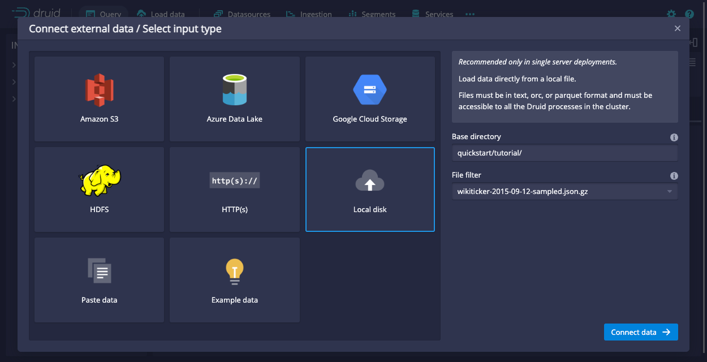
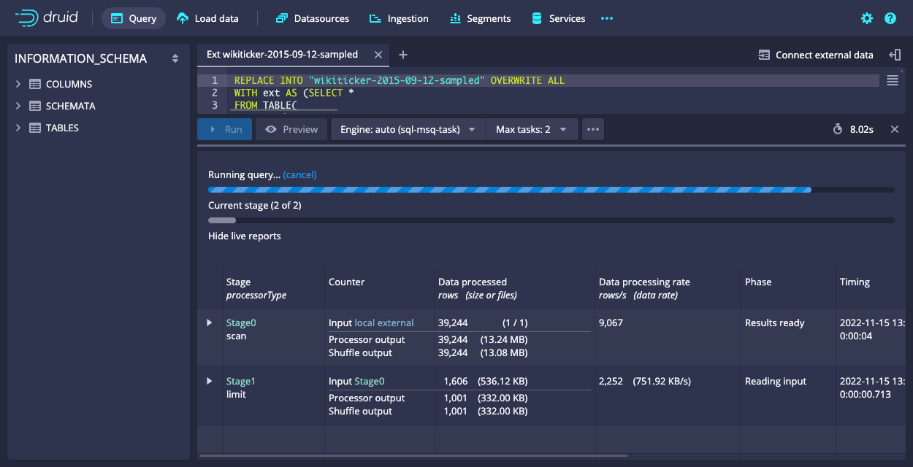
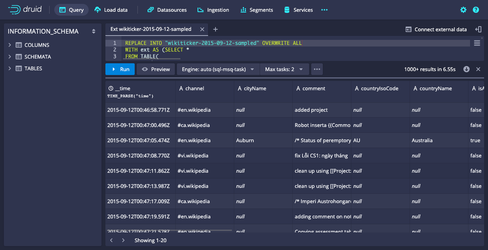
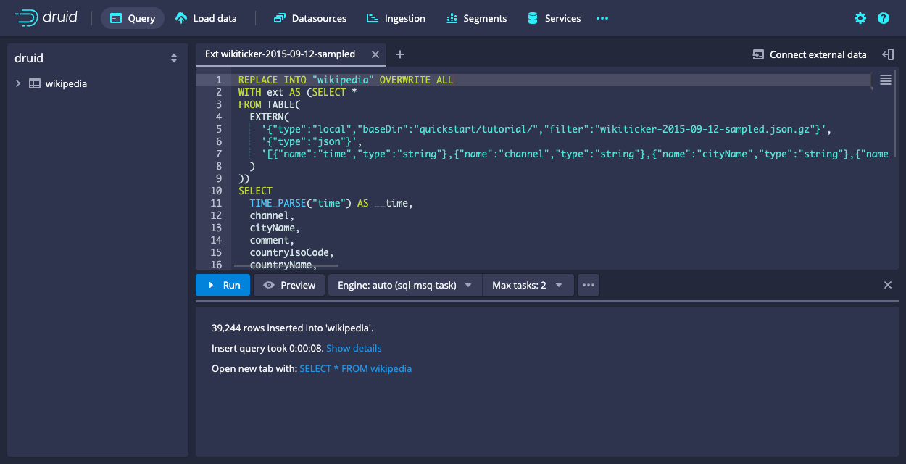

<!--
  ~ Licensed to the Apache Software Foundation (ASF) under one
  ~ or more contributor license agreements.  See the NOTICE file
  ~ distributed with this work for additional information
  ~ regarding copyright ownership.  The ASF licenses this file
  ~ to you under the Apache License, Version 2.0 (the
  ~ "License"); you may not use this file except in compliance
  ~ with the License.  You may obtain a copy of the License at
  ~
  ~   http://www.apache.org/licenses/LICENSE-2.0
  ~
  ~ Unless required by applicable law or agreed to in writing,
  ~ software distributed under the License is distributed on an
  ~ "AS IS" BASIS, WITHOUT WARRANTIES OR CONDITIONS OF ANY
  ~ KIND, either express or implied.  See the License for the
  ~ specific language governing permissions and limitations
  ~ under the License.
  -->

This tutorial demonstrates how to use the SQL Integrated Development Environment (IDE) in Apache Druid. 

You can use the SQL IDE to ingest, transform, and query data.

The tutorial guides you through the steps to use SQL-based ingestion to ingest sample data, then query that data. You then run some demo SQL queries that demonstrate the capabilities of Druid SQL.

## Prerequisites

Before you follow the steps in this tutorial, download Druid as described in the [quickstart](index.md) using the [micro-quickstart](../operations/single-server.md#micro-quickstart-4-cpu-16gib-ram) single-machine configuration and have it running on your local machine. You don't need to have loaded any data.

## Ingest sample data

In this section, you ingest sample data that's included with the Druid quickstart distribution.

1. Navigate to the Druid console at [localhost:8888](http://localhost:8888) and click **Query > Connect external data**.

   

2. Enter the following details:
    **Base directory**: `quickstart/tutorial/`
    **File filter**: `wikiticker-2015-09-12-sampled.json.gz`
    then click **Connect data**.

3. Druid samples the file and detects the schema and format&mdash;JSON in this case. Druid automatically selects `time` as the primary time column. Click **Done**.

4. Druid automatically generates a SQL query to ingest the file. You can modify this query if you want to&mdash;for example, to add transformations. Click **Preview** to preview the shape of the data, once ingested. 

   While the query is running, Druid displays a status screen showing the query stages, amount of data processed, processing rate, and timing details:

   

5. Druid displays the data preview when the query completes. You can see the correctly parsed timestamp column, and scroll to the right to preview the rest of the data.

   

6. In the query window, change the name of the data source to replace into, from `wikiticker-2015-09-12-sampled` to `wikipedia`. Line 1 of the query should now look like this:

   `REPLACE INTO "wikipedia" OVERWRITE ALL`

7. Click **Run** to run the query and ingest the data. While it's processing, Druid displays a status screen similar to the one you saw when loading the data preview. 
   
8. When Druid has completed ingesting the data, it displays a summary of the processing task and provides a link to query the data:

   

9. Click **SELECT * FROM wikipedia** to open a new query tab and run this query.

## Run demo queries

Druid contains several demo queries that you can run to experiment with Druid SQL features. 

In the Druid console, click **Query**. Click the ellipsis icon at the bottom of the query window and select **Load demo queries**. Note that this replaces all of your current query tabs.

Run the queries in each demo tab in numerical order, to demonstration Druid SQL features including:

- Simple and advanced query-based ingestion.
- Transforming data and performing data rollup.
- Using REPLACE to write to a datasource.
- Defining an external table.
- Enriching data with a JOIN operator.

The comments at the top of each tab explain the queries in detail.

## Learn more

The Druid quickstart distribution includes several sample data files that you can use to practice ingesting and querying data.

In the Druid console, click **Query > Connect external data > Example data**. Several example datasets display in the right panel. Select one and click **Use example** to ingest the sample data.

## Further reading

For more information on ingestion and querying data, see the following topics:

- [Quickstart](./index.md) for information on getting started with Druid using the micro-quickstart configuration.
- [Tutorial: Querying data](tutorial-query.md) for example queries to run on Druid data.
- [Ingestion](../ingestion/index.md) for an overview of ingestion and the ingestion methods available in Druid.
- [SQL-based ingestion](../multi-stage-query/index.md) for an overview of SQL-based ingestion.
- [SQL-based ingestion query examples](../multi-stage-query/examples.md) for examples of SQL-based ingestion for various use cases.